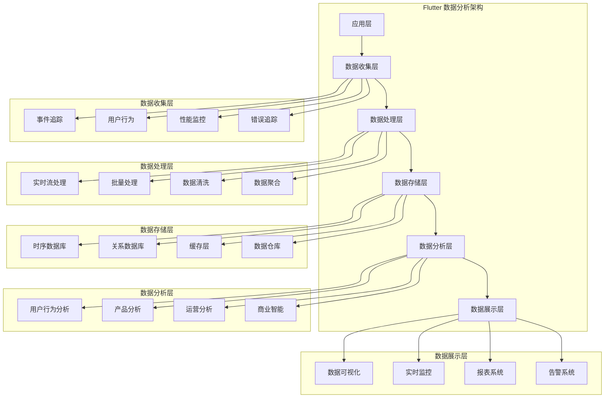
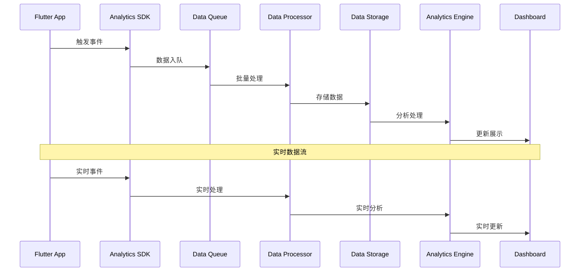
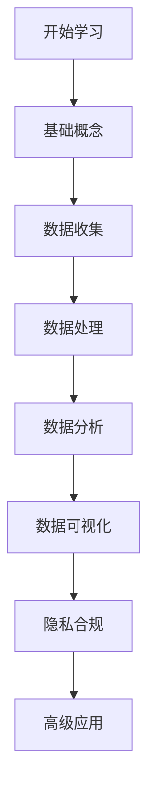

# 📊 Flutter 数据分析深度指南

> 全面的 Flutter 应用数据分析解决方案，涵盖无痕埋点、用户行为分析、数据可视化等核心功能，构建数据驱动的应用


## 📋 目录导航

<details>
<summary>🎯 快速导航</summary>

### 📊 数据收集

- [📊 事件追踪](event-tracking.md) - 事件追踪和埋点技术
- [👤 用户行为分析](user-behavior-analysis.md) - 用户行为分析和路径追踪
- [⚡ 性能数据分析](performance-analytics.md) - 性能指标收集和分析

### 🔄 数据处理

- [🔄 实时数据分析](real-time-analytics.md) - 实时数据流处理和展示
- [📈 数据可视化](data-visualization.md) - 图表展示和数据报表
- [🧪 A/B 测试框架](ab-testing.md) - 实验设计和效果分析

### 🛠️ 开发工具

- [🛠️ 分析 SDK 设计](analytics-sdk.md) - 自定义分析 SDK 开发
- [🔒 隐私合规](privacy-compliance.md) - 数据隐私和合规处理
- [📊 实时监控](real-time-monitoring.md) - 实时监控和告警系统

</details>

## 🏗️ 数据分析架构总览

### 整体架构图



### 数据流架构



## 🎯 核心学习目标

### 📚 理论知识

- ✅ 深入理解数据分析原理和方法
- ✅ 掌握数据收集和处理技术
- ✅ 了解用户行为分析模型
- ✅ 学会数据可视化和报表设计

### 🛠️ 实践技能

- ✅ 熟练使用各种分析 SDK 和工具
- ✅ 掌握数据埋点和追踪技术
- ✅ 学会数据清洗和分析方法
- ✅ 能够设计数据驱动的产品

### 🎨 架构能力

- ✅ 理解数据分析架构设计
- ✅ 掌握实时数据处理技术
- ✅ 学会隐私保护和合规处理
- ✅ 能够构建完整的数据分析体系

## 🚀 快速开始

### 1. 环境准备

```bash
# 检查 Flutter 环境
flutter doctor

# 创建新项目
flutter create analytics_demo
cd analytics_demo

# 添加相关依赖
flutter pub add firebase_analytics firebase_core
flutter pub add amplitude_flutter mixpanel_flutter
flutter pub add fl_chart syncfusion_flutter_charts
flutter pub add dio json_annotation uuid crypto
flutter pub add device_info_plus package_info_plus
flutter pub add --dev build_runner json_serializable
```

### 2. 基础配置示例

```dart
import 'package:flutter/material.dart';
import 'package:firebase_core/firebase_core.dart';
import 'package:firebase_analytics/firebase_analytics.dart';
import 'package:amplitude_flutter/amplitude.dart';
import 'package:device_info_plus/device_info_plus.dart';
import 'package:package_info_plus/package_info_plus.dart';
import 'package:uuid/uuid.dart';
import 'dart:convert';
import 'dart:io';

void main() async {
  WidgetsFlutterBinding.ensureInitialized();

  // 初始化 Firebase
  await Firebase.initializeApp();

  // 初始化分析SDK
  await AnalyticsManager.instance.initialize();

  runApp(AnalyticsDemoApp());
}

class AnalyticsDemoApp extends StatelessWidget {
  @override
  Widget build(BuildContext context) {
    return MaterialApp(
      title: '数据分析示例',
      theme: ThemeData(primarySwatch: Colors.blue),
      navigatorObservers: [
        FirebaseAnalyticsObserver(
          analytics: FirebaseAnalytics.instance,
        ),
      ],
      home: AnalyticsDemoPage(),
    );
  }
}

class AnalyticsDemoPage extends StatefulWidget {
  @override
  _AnalyticsDemoPageState createState() => _AnalyticsDemoPageState();
}

class _AnalyticsDemoPageState extends State<AnalyticsDemoPage> {
  final AnalyticsManager _analytics = AnalyticsManager.instance;
  int _counter = 0;
  List<AnalyticsEvent> _events = [];

  @override
  void initState() {
    super.initState();
    _loadEvents();
  }

  Future<void> _loadEvents() async {
    final events = await _analytics.getRecentEvents();
    setState(() => _events = events);
  }

  @override
  Widget build(BuildContext context) {
    return Scaffold(
      appBar: AppBar(
        title: Text('数据分析示例'),
        actions: [
          IconButton(
            icon: Icon(Icons.analytics),
            onPressed: _showAnalyticsDashboard,
          ),
          IconButton(
            icon: Icon(Icons.settings),
            onPressed: _showSettings,
          ),
        ],
      ),
      body: Column(
        children: [
          // 计数器区域
          _buildCounterSection(),

          // 事件列表
          Expanded(
            child: _buildEventsList(),
          ),
        ],
      ),
      floatingActionButton: FloatingActionButton(
        onPressed: _incrementCounter,
        child: Icon(Icons.add),
      ),
    );
  }

  Widget _buildCounterSection() {
    return Container(
      padding: EdgeInsets.all(16),
      child: Column(
        children: [
          Text(
            '计数器: $_counter',
            style: TextStyle(fontSize: 24, fontWeight: FontWeight.bold),
          ),
          SizedBox(height: 16),

          // 操作按钮
          Row(
            mainAxisAlignment: MainAxisAlignment.spaceEvenly,
            children: [
              ElevatedButton(
                onPressed: _trackCustomEvent,
                child: Text('自定义事件'),
              ),
              ElevatedButton(
                onPressed: _trackUserAction,
                child: Text('用户行为'),
              ),
              ElevatedButton(
                onPressed: _trackPerformance,
                child: Text('性能监控'),
              ),
            ],
          ),
        ],
      ),
    );
  }

  Widget _buildEventsList() {
    return ListView.builder(
      itemCount: _events.length,
      itemBuilder: (context, index) {
        final event = _events[index];
        return ListTile(
          leading: Icon(_getEventIcon(event.type)),
          title: Text(event.name),
          subtitle: Text(event.timestamp.toString()),
          trailing: Text(event.type),
          onTap: () => _showEventDetails(event),
        );
      },
    );
  }

  IconData _getEventIcon(String type) {
    switch (type) {
      case 'page_view':
        return Icons.pageview;
      case 'user_action':
        return Icons.touch_app;
      case 'performance':
        return Icons.speed;
      case 'error':
        return Icons.error;
      default:
        return Icons.event;
    }
  }

  void _incrementCounter() {
    setState(() => _counter++);

    // 追踪计数器事件
    _analytics.trackEvent('counter_increment', {
      'counter_value': _counter,
      'timestamp': DateTime.now().millisecondsSinceEpoch,
    });
  }

  void _trackCustomEvent() async {
    await _analytics.trackEvent('custom_event', {
      'event_type': 'button_click',
      'button_name': 'custom_event_button',
      'user_id': 'demo_user',
    });

    ScaffoldMessenger.of(context).showSnackBar(
      SnackBar(content: Text('自定义事件已追踪')),
    );

    _loadEvents();
  }

  void _trackUserAction() async {
    await _analytics.trackUserAction(
      action: 'button_click',
      element: 'user_action_button',
      page: 'analytics_demo_page',
    );

    ScaffoldMessenger.of(context).showSnackBar(
      SnackBar(content: Text('用户行为已追踪')),
    );

    _loadEvents();
  }

  void _trackPerformance() async {
    await _analytics.trackPerformance(
      metric: 'page_load_time',
      value: 1500.0,
      unit: 'milliseconds',
    );

    ScaffoldMessenger.of(context).showSnackBar(
      SnackBar(content: Text('性能数据已追踪')),
    );

    _loadEvents();
  }

  void _showAnalyticsDashboard() {
    Navigator.push(
      context,
      MaterialPageRoute(builder: (context) => AnalyticsDashboard()),
    );
  }

  void _showSettings() {
    Navigator.push(
      context,
      MaterialPageRoute(builder: (context) => AnalyticsSettings()),
    );
  }

  void _showEventDetails(AnalyticsEvent event) {
    showDialog(
      context: context,
      builder: (context) => AlertDialog(
        title: Text('事件详情'),
        content: Column(
          crossAxisAlignment: CrossAxisAlignment.start,
          mainAxisSize: MainAxisSize.min,
          children: [
            Text('事件名称: ${event.name}'),
            Text('事件类型: ${event.type}'),
            Text('时间戳: ${event.timestamp}'),
            Text('参数: ${jsonEncode(event.parameters)}'),
          ],
        ),
        actions: [
          TextButton(
            onPressed: () => Navigator.pop(context),
            child: Text('关闭'),
          ),
        ],
      ),
    );
  }
}

// 分析管理器
class AnalyticsManager {
  static final AnalyticsManager instance = AnalyticsManager._internal();
  AnalyticsManager._internal();

  late FirebaseAnalytics _firebaseAnalytics;
  late Amplitude _amplitude;
  final List<AnalyticsEvent> _localEvents = [];

  Future<void> initialize() async {
    // 初始化 Firebase Analytics
    _firebaseAnalytics = FirebaseAnalytics.instance;

    // 初始化 Amplitude
    _amplitude = Amplitude.getInstance();
    await _amplitude.init('your-amplitude-api-key');

    // 设置用户属性
    await _setDefaultUserProperties();

    print('📊 数据分析SDK初始化完成');
  }

  Future<void> _setDefaultUserProperties() async {
    final deviceInfo = await _getDeviceInfo();

    // Firebase Analytics
    await _firebaseAnalytics.setUserProperty(
      name: 'device_type',
      value: deviceInfo['device_type'],
    );

    // Amplitude
    await _amplitude.setUserProperties(deviceInfo);
  }

  Future<Map<String, String>> _getDeviceInfo() async {
    final deviceInfoPlugin = DeviceInfoPlugin();
    final packageInfo = await PackageInfo.fromPlatform();

    Map<String, String> deviceInfo = {
      'app_version': packageInfo.version,
      'build_number': packageInfo.buildNumber,
      'platform': Platform.isIOS ? 'iOS' : 'Android',
    };

    if (Platform.isAndroid) {
      final androidInfo = await deviceInfoPlugin.androidInfo;
      deviceInfo['device_model'] = androidInfo.model;
      deviceInfo['android_version'] = androidInfo.version.release;
    } else if (Platform.isIOS) {
      final iosInfo = await deviceInfoPlugin.iosInfo;
      deviceInfo['device_model'] = iosInfo.model;
      deviceInfo['ios_version'] = iosInfo.systemVersion;
    }

    return deviceInfo;
  }

  // 事件追踪
  Future<void> trackEvent(
    String eventName, {
    Map<String, dynamic>? parameters,
  }) async {
    final event = AnalyticsEvent(
      id: Uuid().v4(),
      name: eventName,
      type: 'custom',
      parameters: parameters ?? {},
      timestamp: DateTime.now(),
    );

    // 添加到本地事件列表
    _localEvents.add(event);

    try {
      // Firebase Analytics
      await _firebaseAnalytics.logEvent(
        name: eventName,
        parameters: parameters,
      );

      // Amplitude
      await _amplitude.logEvent(eventName, eventProperties: parameters);

      print('📊 事件追踪: $eventName');
    } catch (e) {
      print('❌ 事件追踪失败: $e');
    }
  }

  // 用户行为追踪
  Future<void> trackUserAction({
    required String action,
    required String element,
    required String page,
    Map<String, dynamic>? additionalParams,
  }) async {
    final parameters = {
      'action': action,
      'element': element,
      'page': page,
      'timestamp': DateTime.now().millisecondsSinceEpoch,
      ...?additionalParams,
    };

    await trackEvent('user_action', parameters);
  }

  // 性能监控
  Future<void> trackPerformance({
    required String metric,
    required double value,
    required String unit,
    Map<String, dynamic>? additionalParams,
  }) async {
    final parameters = {
      'metric': metric,
      'value': value,
      'unit': unit,
      'timestamp': DateTime.now().millisecondsSinceEpoch,
      ...?additionalParams,
    };

    await trackEvent('performance', parameters);
  }

  // 页面访问追踪
  Future<void> trackPageView(String pageName) async {
    await _firebaseAnalytics.logScreenView(screenName: pageName);

    await trackEvent('page_view', {
      'page_name': pageName,
      'timestamp': DateTime.now().millisecondsSinceEpoch,
    });
  }

  // 获取最近事件
  Future<List<AnalyticsEvent>> getRecentEvents() async {
    // 返回最近的事件（这里简化处理，实际应该从数据库获取）
    return _localEvents.reversed.take(20).toList();
  }
}

// 分析事件模型
class AnalyticsEvent {
  final String id;
  final String name;
  final String type;
  final Map<String, dynamic> parameters;
  final DateTime timestamp;

  AnalyticsEvent({
    required this.id,
    required this.name,
    required this.type,
    required this.parameters,
    required this.timestamp,
  });

  Map<String, dynamic> toJson() {
    return {
      'id': id,
      'name': name,
      'type': type,
      'parameters': parameters,
      'timestamp': timestamp.toIso8601String(),
    };
  }

  factory AnalyticsEvent.fromJson(Map<String, dynamic> json) {
    return AnalyticsEvent(
      id: json['id'],
      name: json['name'],
      type: json['type'],
      parameters: Map<String, dynamic>.from(json['parameters']),
      timestamp: DateTime.parse(json['timestamp']),
    );
  }
}

// 分析仪表板页面
class AnalyticsDashboard extends StatelessWidget {
  @override
  Widget build(BuildContext context) {
    return Scaffold(
      appBar: AppBar(title: Text('分析仪表板')),
      body: SingleChildScrollView(
        padding: EdgeInsets.all(16),
        child: Column(
          children: [
            _buildMetricCard('总事件数', '1,234', Icons.event),
            _buildMetricCard('活跃用户', '567', Icons.people),
            _buildMetricCard('平均会话时长', '5分30秒', Icons.timer),
            _buildMetricCard('转化率', '12.5%', Icons.trending_up),
            SizedBox(height: 20),
            _buildChartSection(),
          ],
        ),
      ),
    );
  }

  Widget _buildMetricCard(String title, String value, IconData icon) {
    return Card(
      child: Padding(
        padding: EdgeInsets.all(16),
        child: Row(
          children: [
            Icon(icon, size: 32, color: Colors.blue),
            SizedBox(width: 16),
            Column(
              crossAxisAlignment: CrossAxisAlignment.start,
              children: [
                Text(title, style: TextStyle(fontSize: 14, color: Colors.grey)),
                Text(value, style: TextStyle(fontSize: 24, fontWeight: FontWeight.bold)),
              ],
            ),
          ],
        ),
      ),
    );
  }

  Widget _buildChartSection() {
    return Card(
      child: Padding(
        padding: EdgeInsets.all(16),
        child: Column(
          crossAxisAlignment: CrossAxisAlignment.start,
          children: [
            Text('事件趋势', style: TextStyle(fontSize: 18, fontWeight: FontWeight.bold)),
            SizedBox(height: 16),
            Container(
              height: 200,
              child: Center(
                child: Text('图表区域 - 这里可以集成 fl_chart 等图表库'),
              ),
            ),
          ],
        ),
      ),
    );
  }
}

// 分析设置页面
class AnalyticsSettings extends StatefulWidget {
  @override
  _AnalyticsSettingsState createState() => _AnalyticsSettingsState();
}

class _AnalyticsSettingsState extends State<AnalyticsSettings> {
  bool _enableTracking = true;
  bool _enablePerformanceTracking = true;
  bool _enableCrashReporting = true;

  @override
  Widget build(BuildContext context) {
    return Scaffold(
      appBar: AppBar(title: Text('分析设置')),
      body: ListView(
        children: [
          SwitchListTile(
            title: Text('启用数据追踪'),
            subtitle: Text('收集用户行为数据'),
            value: _enableTracking,
            onChanged: (value) {
              setState(() => _enableTracking = value);
            },
          ),
          SwitchListTile(
            title: Text('性能监控'),
            subtitle: Text('收集应用性能数据'),
            value: _enablePerformanceTracking,
            onChanged: (value) {
              setState(() => _enablePerformanceTracking = value);
            },
          ),
          SwitchListTile(
            title: Text('崩溃报告'),
            subtitle: Text('收集应用崩溃信息'),
            value: _enableCrashReporting,
            onChanged: (value) {
              setState(() => _enableCrashReporting = value);
            },
          ),
          ListTile(
            title: Text('数据导出'),
            subtitle: Text('导出用户数据'),
            trailing: Icon(Icons.download),
            onTap: _exportData,
          ),
          ListTile(
            title: Text('清除数据'),
            subtitle: Text('清除本地分析数据'),
            trailing: Icon(Icons.delete),
            onTap: _clearData,
          ),
        ],
      ),
    );
  }

  void _exportData() {
    // 实现数据导出功能
    ScaffoldMessenger.of(context).showSnackBar(
      SnackBar(content: Text('数据导出功能开发中')),
    );
  }

  void _clearData() {
    showDialog(
      context: context,
      builder: (context) => AlertDialog(
        title: Text('确认清除'),
        content: Text('确定要清除所有本地分析数据吗？'),
        actions: [
          TextButton(
            onPressed: () => Navigator.pop(context),
            child: Text('取消'),
          ),
          TextButton(
            onPressed: () {
              Navigator.pop(context);
              ScaffoldMessenger.of(context).showSnackBar(
                SnackBar(content: Text('数据已清除')),
              );
            },
            child: Text('确定'),
          ),
        ],
      ),
    );
  }
}
```

### 3. 自动埋点装饰器

```dart
// lib/analytics/auto_tracking_decorator.dart
import 'package:flutter/material.dart';
import 'analytics_manager.dart';

class AutoTrackingDecorator extends StatefulWidget {
  final Widget child;
  final String? pageName;
  final Map<String, dynamic>? pageParameters;

  const AutoTrackingDecorator({
    Key? key,
    required this.child,
    this.pageName,
    this.pageParameters,
  }) : super(key: key);

  @override
  State<AutoTrackingDecorator> createState() => _AutoTrackingDecoratorState();
}

class _AutoTrackingDecoratorState extends State<AutoTrackingDecorator>
    with WidgetsBindingObserver {
  late DateTime _pageEnterTime;

  @override
  void initState() {
    super.initState();
    _pageEnterTime = DateTime.now();
    WidgetsBinding.instance.addObserver(this);

    // 页面进入事件
    WidgetsBinding.instance.addPostFrameCallback((_) {
      _trackPageEnter();
    });
  }

  @override
  void dispose() {
    WidgetsBinding.instance.removeObserver(this);
    _trackPageExit();
    super.dispose();
  }

  void _trackPageEnter() {
    if (widget.pageName != null) {
      AnalyticsManager.instance.trackPageView(widget.pageName!);

      AnalyticsManager.instance.trackEvent('page_enter', {
        'page_name': widget.pageName,
        'enter_time': _pageEnterTime.millisecondsSinceEpoch,
        ...?widget.pageParameters,
      });
    }
  }

  void _trackPageExit() {
    if (widget.pageName != null) {
      final duration = DateTime.now().difference(_pageEnterTime);

      AnalyticsManager.instance.trackEvent('page_exit', {
        'page_name': widget.pageName,
        'duration_seconds': duration.inSeconds,
        'exit_time': DateTime.now().millisecondsSinceEpoch,
      });
    }
  }

  @override
  Widget build(BuildContext context) {
    return widget.child;
  }
}

// 使用示例
class MyPage extends StatelessWidget {
  @override
  Widget build(BuildContext context) {
    return AutoTrackingDecorator(
      pageName: 'my_page',
      pageParameters: {'category': 'main'},
      child: Scaffold(
        appBar: AppBar(title: Text('我的页面')),
        body: Center(child: Text('页面内容')),
      ),
    );
  }
}
```

## 📊 分析工具对比

### 分析平台对比

| 平台               | 免费额度 | 功能丰富度 | 集成难度   | 数据准确性 | 隐私保护   | 适用场景         |
| ------------------ | -------- | ---------- | ---------- | ---------- | ---------- | ---------------- |
| Firebase Analytics | 免费     | ⭐⭐⭐⭐   | ⭐⭐⭐⭐⭐ | ⭐⭐⭐⭐   | ⭐⭐⭐     | 快速集成、小项目 |
| Amplitude          | 有限免费 | ⭐⭐⭐⭐⭐ | ⭐⭐⭐⭐   | ⭐⭐⭐⭐⭐ | ⭐⭐⭐⭐   | 用户行为分析     |
| Mixpanel           | 有限免费 | ⭐⭐⭐⭐   | ⭐⭐⭐⭐   | ⭐⭐⭐⭐   | ⭐⭐⭐     | 事件分析         |
| PostHog            | 开源免费 | ⭐⭐⭐⭐   | ⭐⭐⭐     | ⭐⭐⭐⭐   | ⭐⭐⭐⭐⭐ | 隐私友好         |
| 自建方案           | 无限制   | ⭐⭐⭐⭐⭐ | ⭐⭐       | ⭐⭐⭐⭐⭐ | ⭐⭐⭐⭐⭐ | 企业级、定制化   |

### 数据可视化库对比

| 库名                      | 功能丰富度 | 性能       | 学习成本 | 定制化     | 文档质量   | 社区支持 |
| ------------------------- | ---------- | ---------- | -------- | ---------- | ---------- | -------- |
| fl_chart                  | ⭐⭐⭐⭐   | ⭐⭐⭐⭐   | ⭐⭐⭐   | ⭐⭐⭐⭐   | ⭐⭐⭐⭐   | ⭐⭐⭐⭐ |
| syncfusion_flutter_charts | ⭐⭐⭐⭐⭐ | ⭐⭐⭐⭐⭐ | ⭐⭐     | ⭐⭐⭐⭐⭐ | ⭐⭐⭐⭐⭐ | ⭐⭐⭐   |
| charts_flutter            | ⭐⭐⭐     | ⭐⭐⭐     | ⭐⭐⭐⭐ | ⭐⭐⭐     | ⭐⭐⭐     | ⭐⭐⭐   |
| rive                      | ⭐⭐⭐⭐   | ⭐⭐⭐⭐⭐ | ⭐⭐     | ⭐⭐⭐⭐   | ⭐⭐⭐⭐   | ⭐⭐⭐   |

### 选择指南

#### 📊 选择 Firebase Analytics 的场景

- 快速原型开发
- 小团队项目
- 需要快速集成
- 预算有限

#### 📈 选择 Amplitude 的场景

- 深度用户行为分析
- 产品优化需求
- 用户路径分析
- 转化漏斗分析

#### 🎯 选择自建方案的场景

- 数据隐私要求高
- 需要完全控制
- 企业级应用
- 定制化需求强

## 🎨 设计模式应用

### 1. 观察者模式 (Observer Pattern)

```dart
// 数据变化监听器
class AnalyticsObserver extends ChangeNotifier {
  final Map<String, List<Function>> _listeners = {};

  void addListener(String eventType, Function callback) {
    _listeners.putIfAbsent(eventType, () => []).add(callback);
  }

  void removeListener(String eventType, Function callback) {
    _listeners[eventType]?.remove(callback);
  }

  void notifyEvent(String eventType, dynamic data) {
    _listeners[eventType]?.forEach((callback) => callback(data));
    notifyListeners();
  }
}

// 使用示例
class AnalyticsManager {
  final AnalyticsObserver _observer = AnalyticsObserver();

  void trackEvent(String eventName, Map<String, dynamic> parameters) {
    // 追踪事件
    _firebaseAnalytics.logEvent(name: eventName, parameters: parameters);

    // 通知监听器
    _observer.notifyEvent('event_tracked', {
      'name': eventName,
      'parameters': parameters,
      'timestamp': DateTime.now(),
    });
  }

  void watchEvents(Function callback) {
    _observer.addListener('event_tracked', callback);
  }
}
```

### 2. 策略模式 (Strategy Pattern)

```dart
// 数据上报策略
abstract class DataUploadStrategy {
  Future<bool> upload(List<AnalyticsEvent> events);
}

class FirebaseUploadStrategy implements DataUploadStrategy {
  @override
  Future<bool> upload(List<AnalyticsEvent> events) async {
    try {
      for (final event in events) {
        await FirebaseAnalytics.instance.logEvent(
          name: event.name,
          parameters: event.parameters,
        );
      }
      return true;
    } catch (e) {
      print('Firebase上传失败: $e');
      return false;
    }
  }
}

class AmplitudeUploadStrategy implements DataUploadStrategy {
  @override
  Future<bool> upload(List<AnalyticsEvent> events) async {
    try {
      for (final event in events) {
        await Amplitude.getInstance().logEvent(
          event.name,
          eventProperties: event.parameters,
        );
      }
      return true;
    } catch (e) {
      print('Amplitude上传失败: $e');
      return false;
    }
  }
}

class CustomUploadStrategy implements DataUploadStrategy {
  final String apiEndpoint;

  CustomUploadStrategy(this.apiEndpoint);

  @override
  Future<bool> upload(List<AnalyticsEvent> events) async {
    try {
      final response = await Dio().post(
        apiEndpoint,
        data: events.map((e) => e.toJson()).toList(),
      );
      return response.statusCode == 200;
    } catch (e) {
      print('自定义上传失败: $e');
      return false;
    }
  }
}

// 策略工厂
class UploadStrategyFactory {
  static DataUploadStrategy createStrategy(String type) {
    switch (type) {
      case 'firebase':
        return FirebaseUploadStrategy();
      case 'amplitude':
        return AmplitudeUploadStrategy();
      case 'custom':
        return CustomUploadStrategy('https://api.example.com/analytics');
      default:
        throw ArgumentError('不支持的上传策略: $type');
    }
  }
}
```

### 3. 工厂模式 (Factory Pattern)

```dart
// 事件追踪器工厂
abstract class EventTracker {
  Future<void> track(String eventName, Map<String, dynamic> parameters);
}

class FirebaseEventTracker implements EventTracker {
  @override
  Future<void> track(String eventName, Map<String, dynamic> parameters) async {
    await FirebaseAnalytics.instance.logEvent(
      name: eventName,
      parameters: parameters,
    );
  }
}

class AmplitudeEventTracker implements EventTracker {
  @override
  Future<void> track(String eventName, Map<String, dynamic> parameters) async {
    await Amplitude.getInstance().logEvent(
      eventName,
      eventProperties: parameters,
    );
  }
}

class MixpanelEventTracker implements EventTracker {
  @override
  Future<void> track(String eventName, Map<String, dynamic> parameters) async {
    // Mixpanel 实现
  }
}

class EventTrackerFactory {
  static EventTracker createTracker(String type) {
    switch (type) {
      case 'firebase':
        return FirebaseEventTracker();
      case 'amplitude':
        return AmplitudeEventTracker();
      case 'mixpanel':
        return MixpanelEventTracker();
      default:
        throw ArgumentError('不支持的事件追踪器: $type');
    }
  }
}
```

## 🔧 开发工具推荐

### 📱 调试工具

- **Firebase Console**: Firebase Analytics 调试
- **Amplitude Dashboard**: Amplitude 数据分析
- **Mixpanel Dashboard**: Mixpanel 事件分析
- **PostHog Dashboard**: PostHog 开源分析

### 🎨 设计工具

- **Figma**: 数据可视化设计
- **Adobe XD**: 仪表板设计
- **Sketch**: 图表设计

### 📚 学习资源

- **官方文档**: 各分析平台的官方文档
- **GitHub 示例**: 开源示例项目
- **社区博客**: 技术博客和教程

## 📈 学习路径建议



### 🎯 阶段目标

#### 第一阶段：基础掌握

- [ ] 理解数据分析基础概念
- [ ] 掌握数据收集方法
- [ ] 学会基础事件追踪
- [ ] 完成简单的数据分析应用

#### 第二阶段：进阶学习

- [ ] 深入学习数据处理技术
- [ ] 掌握用户行为分析
- [ ] 学会数据可视化
- [ ] 完成中等复杂度的分析系统

#### 第三阶段：高级应用

- [ ] 掌握实时数据处理
- [ ] 学会隐私保护和合规
- [ ] 理解高级分析模型
- [ ] 完成企业级分析平台

#### 第四阶段：实战项目

- [ ] 完成完整的商业级分析系统
- [ ] 掌握数据驱动决策
- [ ] 学会团队协作开发
- [ ] 参与开源项目贡献

## 🏆 最佳实践

### 📝 代码规范

```dart
// ✅ 推荐：统一的错误处理
class AnalyticsService {
  static Future<T> safeExecute<T>(
    Future<T> Function() operation,
    String operationName,
  ) async {
    try {
      return await operation();
    } on FirebaseException catch (e) {
      print('Firebase错误 [$operationName]: $e');
      throw AnalyticsException('Firebase操作失败: $e');
    } on NetworkException catch (e) {
      print('网络错误 [$operationName]: $e');
      throw AnalyticsException('网络操作失败: $e');
    } catch (e) {
      print('未知错误 [$operationName]: $e');
      throw AnalyticsException('操作失败: $e');
    }
  }
}

class AnalyticsException implements Exception {
  final String message;

  AnalyticsException(this.message);

  @override
  String toString() => 'AnalyticsException: $message';
}

// ✅ 推荐：类型安全的事件定义
class AnalyticsEvent {
  final String name;
  final Map<String, dynamic> parameters;
  final DateTime timestamp;
  final String sessionId;

  AnalyticsEvent({
    required this.name,
    required this.parameters,
    required this.timestamp,
    required this.sessionId,
  });

  Map<String, dynamic> toJson() {
    return {
      'name': name,
      'parameters': parameters,
      'timestamp': timestamp.toIso8601String(),
      'session_id': sessionId,
    };
  }

  factory AnalyticsEvent.fromJson(Map<String, dynamic> json) {
    return AnalyticsEvent(
      name: json['name'],
      parameters: Map<String, dynamic>.from(json['parameters']),
      timestamp: DateTime.parse(json['timestamp']),
      sessionId: json['session_id'],
    );
  }
}
```

### 🎨 架构原则

- **数据最小化**: 只收集必要的数据
- **用户同意**: 明确获取用户授权
- **数据安全**: 确保数据传输和存储安全
- **性能优化**: 平衡数据收集和应用性能

### ⚡ 性能优化

- 批量上报减少网络请求
- 本地缓存离线数据
- 异步处理避免阻塞主线程
- 合理控制数据收集频率

### 🧪 测试策略

- 数据分析单元测试覆盖率 ≥ 90%
- 集成测试覆盖关键数据流程
- 自动化测试集成 CI/CD
- 性能基准测试

## 📚 相关资源

### 🔗 官方资源

- [Firebase Analytics 官方文档](https://firebase.google.com/docs/analytics)
- [Amplitude Flutter SDK](https://developers.amplitude.com/docs/flutter)
- [Mixpanel Flutter](https://developer.mixpanel.com/docs/flutter)

### 📖 推荐书籍

- 《Flutter 实战》
- 《数据分析实战》
- 《用户行为分析》

### 🎥 视频教程

- [Flutter 官方 YouTube 频道](https://www.youtube.com/c/FlutterDev)
- [B 站 Flutter 教程](https://www.bilibili.com/video/BV1S4411E7LY)

---

## 🎉 开始你的数据分析之旅

现在你已经了解了 Flutter 数据分析的整体架构和学习路径。接下来，让我们从[事件追踪](event-tracking.md)开始，逐步掌握各种数据分析技术。

记住：**数据是新时代的石油**，合理利用数据可以驱动产品优化和业务增长！

---

<div align="center">

**🌟 如果这个指南对你有帮助，请给个 Star 支持一下！ 🌟**

[](https://github.com/your-repo/flutter-analytics)
[](https://github.com/your-repo/flutter-analytics)

</div>
