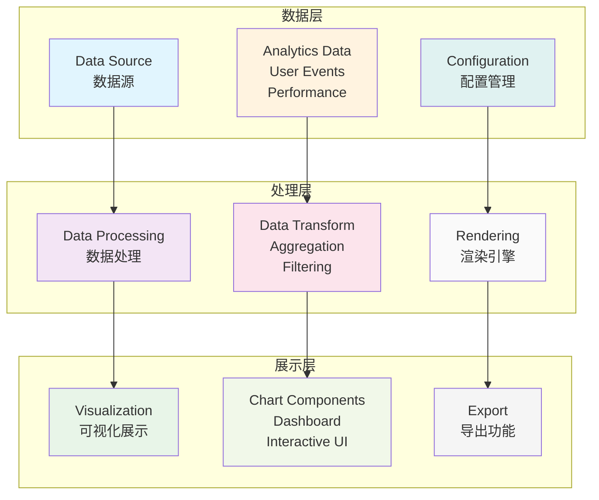

# Flutter 数据可视化

本文档详细介绍 Flutter 应用中数据分析结果的可视化展示方案，包括图表组件、仪表板设计和交互式可视化。

## 📊 可视化架构

### 1. 可视化框架设计



### 2. 可视化管理器

```dart
// lib/analytics/visualization/visualization_manager.dart
import 'dart:async';
import 'dart:ui' as ui;
import 'package:flutter/material.dart';
import 'package:flutter/rendering.dart';

class VisualizationManager {
  static VisualizationManager? _instance;
  final Map<String, ChartConfig> _chartConfigs = {};
  final Map<String, ChartData> _chartDataCache = {};
  final StreamController<ChartUpdateEvent> _updateController =
      StreamController<ChartUpdateEvent>.broadcast();

  VisualizationManager._internal();

  factory VisualizationManager() {
    return _instance ??= VisualizationManager._internal();
  }

  Stream<ChartUpdateEvent> get updateStream => _updateController.stream;

  // 注册图表配置
  void registerChart(String chartId, ChartConfig config) {
    _chartConfigs[chartId] = config;
    print('📊 注册图表: $chartId');
  }

  // 更新图表数据
  void updateChartData(String chartId, ChartData data) {
    _chartDataCache[chartId] = data;

    _updateController.add(ChartUpdateEvent(
      chartId: chartId,
      data: data,
      timestamp: DateTime.now(),
    ));

    print('📈 更新图表数据: $chartId');
  }

  // 获取图表数据
  ChartData? getChartData(String chartId) {
    return _chartDataCache[chartId];
  }

  // 获取图表配置
  ChartConfig? getChartConfig(String chartId) {
    return _chartConfigs[chartId];
  }

  // 创建仪表板
  Dashboard createDashboard({
    required String dashboardId,
    required String title,
    required List<DashboardWidget> widgets,
    DashboardLayout? layout,
  }) {
    return Dashboard(
      id: dashboardId,
      title: title,
      widgets: widgets,
      layout: layout ?? DashboardLayout.grid(),
      manager: this,
    );
  }

  // 导出图表
  Future<ui.Image> exportChart(String chartId) async {
    final config = _chartConfigs[chartId];
    final data = _chartDataCache[chartId];

    if (config == null || data == null) {
      throw Exception('图表配置或数据不存在: $chartId');
    }

    // 创建离屏渲染器
    final recorder = ui.PictureRecorder();
    final canvas = Canvas(recorder);

    // 渲染图表
    final painter = _createChartPainter(config, data);
    painter.paint(canvas, Size(800, 600));

    final picture = recorder.endRecording();
    return await picture.toImage(800, 600);
  }

  ChartPainter _createChartPainter(ChartConfig config, ChartData data) {
    switch (config.type) {
      case ChartType.line:
        return LineChartPainter(config: config, data: data);
      case ChartType.bar:
        return BarChartPainter(config: config, data: data);
      case ChartType.pie:
        return PieChartPainter(config: config, data: data);
      case ChartType.area:
        return AreaChartPainter(config: config, data: data);
      case ChartType.scatter:
        return ScatterChartPainter(config: config, data: data);
      default:
        throw Exception('不支持的图表类型: ${config.type}');
    }
  }

  void dispose() {
    _updateController.close();
    _chartConfigs.clear();
    _chartDataCache.clear();
  }
}

// 图表配置
class ChartConfig {
  final ChartType type;
  final String title;
  final ChartTheme theme;
  final ChartAxis? xAxis;
  final ChartAxis? yAxis;
  final ChartLegend? legend;
  final ChartAnimation? animation;
  final Map<String, dynamic> customOptions;

  ChartConfig({
    required this.type,
    required this.title,
    ChartTheme? theme,
    this.xAxis,
    this.yAxis,
    this.legend,
    this.animation,
    this.customOptions = const {},
  }) : theme = theme ?? ChartTheme.defaultTheme();
}

// 图表数据
class ChartData {
  final List<DataSeries> series;
  final List<String>? categories;
  final Map<String, dynamic> metadata;

  ChartData({
    required this.series,
    this.categories,
    this.metadata = const {},
  });

  factory ChartData.fromMap(Map<String, dynamic> map) {
    final seriesList = (map['series'] as List<dynamic>)
        .map((s) => DataSeries.fromMap(s as Map<String, dynamic>))
        .toList();

    return ChartData(
      series: seriesList,
      categories: (map['categories'] as List<dynamic>?)?.cast<String>(),
      metadata: map['metadata'] as Map<String, dynamic>? ?? {},
    );
  }
}

// 数据系列
class DataSeries {
  final String name;
  final List<DataPoint> data;
  final Color color;
  final SeriesType type;
  final Map<String, dynamic> style;

  DataSeries({
    required this.name,
    required this.data,
    required this.color,
    this.type = SeriesType.line,
    this.style = const {},
  });

  factory DataSeries.fromMap(Map<String, dynamic> map) {
    final dataList = (map['data'] as List<dynamic>)
        .map((d) => DataPoint.fromMap(d as Map<String, dynamic>))
        .toList();

    return DataSeries(
      name: map['name'] as String,
      data: dataList,
      color: Color(map['color'] as int),
      type: SeriesType.values[map['type'] as int? ?? 0],
      style: map['style'] as Map<String, dynamic>? ?? {},
    );
  }
}

// 数据点
class DataPoint {
  final dynamic x;
  final dynamic y;
  final Map<String, dynamic> metadata;

  DataPoint({
    required this.x,
    required this.y,
    this.metadata = const {},
  });

  factory DataPoint.fromMap(Map<String, dynamic> map) {
    return DataPoint(
      x: map['x'],
      y: map['y'],
      metadata: map['metadata'] as Map<String, dynamic>? ?? {},
    );
  }

  double get xValue => (x is num) ? x.toDouble() : 0.0;
  double get yValue => (y is num) ? y.toDouble() : 0.0;
}

// 图表类型
enum ChartType {
  line,
  bar,
  pie,
  area,
  scatter,
  heatmap,
  radar,
  gauge,
}

// 系列类型
enum SeriesType {
  line,
  bar,
  area,
  scatter,
}

// 图表主题
class ChartTheme {
  final Color backgroundColor;
  final Color primaryColor;
  final Color secondaryColor;
  final Color textColor;
  final Color gridColor;
  final TextStyle titleStyle;
  final TextStyle labelStyle;
  final List<Color> colorPalette;

  ChartTheme({
    required this.backgroundColor,
    required this.primaryColor,
    required this.secondaryColor,
    required this.textColor,
    required this.gridColor,
    required this.titleStyle,
    required this.labelStyle,
    required this.colorPalette,
  });

  factory ChartTheme.defaultTheme() {
    return ChartTheme(
      backgroundColor: Colors.white,
      primaryColor: Colors.blue,
      secondaryColor: Colors.grey,
      textColor: Colors.black87,
      gridColor: Colors.grey.shade300,
      titleStyle: const TextStyle(
        fontSize: 18,
        fontWeight: FontWeight.bold,
        color: Colors.black87,
      ),
      labelStyle: const TextStyle(
        fontSize: 12,
        color: Colors.black54,
      ),
      colorPalette: [
        Colors.blue,
        Colors.green,
        Colors.orange,
        Colors.purple,
        Colors.teal,
        Colors.pink,
        Colors.indigo,
        Colors.amber,
      ],
    );
  }

  factory ChartTheme.darkTheme() {
    return ChartTheme(
      backgroundColor: Colors.grey.shade900,
      primaryColor: Colors.blueAccent,
      secondaryColor: Colors.grey.shade600,
      textColor: Colors.white,
      gridColor: Colors.grey.shade700,
      titleStyle: const TextStyle(
        fontSize: 18,
        fontWeight: FontWeight.bold,
        color: Colors.white,
      ),
      labelStyle: const TextStyle(
        fontSize: 12,
        color: Colors.white70,
      ),
      colorPalette: [
        Colors.blueAccent,
        Colors.greenAccent,
        Colors.orangeAccent,
        Colors.purpleAccent,
        Colors.tealAccent,
        Colors.pinkAccent,
        Colors.indigoAccent,
        Colors.amberAccent,
      ],
    );
  }
}

// 图表轴配置
class ChartAxis {
  final String title;
  final bool showGrid;
  final bool showLabels;
  final double? min;
  final double? max;
  final int? tickCount;
  final AxisType type;

  ChartAxis({
    required this.title,
    this.showGrid = true,
    this.showLabels = true,
    this.min,
    this.max,
    this.tickCount,
    this.type = AxisType.linear,
  });
}

enum AxisType {
  linear,
  logarithmic,
  category,
  time,
}

// 图表图例
class ChartLegend {
  final bool show;
  final LegendPosition position;
  final LegendOrientation orientation;

  ChartLegend({
    this.show = true,
    this.position = LegendPosition.bottom,
    this.orientation = LegendOrientation.horizontal,
  });
}

enum LegendPosition {
  top,
  bottom,
  left,
  right,
}

enum LegendOrientation {
  horizontal,
  vertical,
}

// 图表动画
class ChartAnimation {
  final bool enabled;
  final Duration duration;
  final Curve curve;

  ChartAnimation({
    this.enabled = true,
    this.duration = const Duration(milliseconds: 800),
    this.curve = Curves.easeInOut,
  });
}

// 图表更新事件
class ChartUpdateEvent {
  final String chartId;
  final ChartData data;
  final DateTime timestamp;

  ChartUpdateEvent({
    required this.chartId,
    required this.data,
    required this.timestamp,
  });
}
```

### 3. 图表组件

```dart
// lib/analytics/visualization/charts/line_chart.dart
class AnalyticsLineChart extends StatefulWidget {
  final String chartId;
  final ChartConfig config;
  final ChartData? initialData;
  final Function(DataPoint)? onPointTap;
  final Function(List<DataPoint>)? onSelectionChanged;

  const AnalyticsLineChart({
    Key? key,
    required this.chartId,
    required this.config,
    this.initialData,
    this.onPointTap,
    this.onSelectionChanged,
  }) : super(key: key);

  @override
  State<AnalyticsLineChart> createState() => _AnalyticsLineChartState();
}

class _AnalyticsLineChartState extends State<AnalyticsLineChart>
    with TickerProviderStateMixin {
  late AnimationController _animationController;
  late Animation<double> _animation;
  ChartData? _currentData;
  StreamSubscription<ChartUpdateEvent>? _updateSubscription;
  final List<DataPoint> _selectedPoints = [];

  @override
  void initState() {
    super.initState();

    _animationController = AnimationController(
      duration: widget.config.animation?.duration ??
          const Duration(milliseconds: 800),
      vsync: this,
    );

    _animation = Tween<double>(
      begin: 0.0,
      end: 1.0,
    ).animate(CurvedAnimation(
      parent: _animationController,
      curve: widget.config.animation?.curve ?? Curves.easeInOut,
    ));

    _currentData = widget.initialData;

    // 监听数据更新
    _updateSubscription = VisualizationManager()
        .updateStream
        .where((event) => event.chartId == widget.chartId)
        .listen(_onDataUpdate);

    // 注册图表
    VisualizationManager().registerChart(widget.chartId, widget.config);

    if (_currentData != null) {
      _animationController.forward();
    }
  }

  void _onDataUpdate(ChartUpdateEvent event) {
    setState(() {
      _currentData = event.data;
    });

    _animationController.reset();
    _animationController.forward();
  }

  @override
  Widget build(BuildContext context) {
    if (_currentData == null) {
      return _buildLoadingState();
    }

    return Card(
      elevation: 2,
      child: Padding(
        padding: const EdgeInsets.all(16.0),
        child: Column(
          crossAxisAlignment: CrossAxisAlignment.start,
          children: [
            _buildHeader(),
            const SizedBox(height: 16),
            Expanded(
              child: AnimatedBuilder(
                animation: _animation,
                builder: (context, child) {
                  return CustomPaint(
                    painter: LineChartPainter(
                      config: widget.config,
                      data: _currentData!,
                      animationValue: _animation.value,
                      selectedPoints: _selectedPoints,
                    ),
                    child: GestureDetector(
                      onTapDown: _onTapDown,
                      onPanUpdate: _onPanUpdate,
                      onPanEnd: _onPanEnd,
                      child: Container(),
                    ),
                  );
                },
              ),
            ),
            if (widget.config.legend?.show == true) _buildLegend(),
          ],
        ),
      ),
    );
  }

  Widget _buildLoadingState() {
    return Card(
      child: Container(
        height: 300,
        child: const Center(
          child: CircularProgressIndicator(),
        ),
      ),
    );
  }

  Widget _buildHeader() {
    return Row(
      children: [
        Expanded(
          child: Text(
            widget.config.title,
            style: widget.config.theme.titleStyle,
          ),
        ),
        PopupMenuButton<String>(
          icon: const Icon(Icons.more_vert),
          onSelected: _onMenuSelected,
          itemBuilder: (context) => [
            const PopupMenuItem(
              value: 'export',
              child: Row(
                children: [
                  Icon(Icons.download),
                  SizedBox(width: 8),
                  Text('导出图表'),
                ],
              ),
            ),
            const PopupMenuItem(
              value: 'fullscreen',
              child: Row(
                children: [
                  Icon(Icons.fullscreen),
                  SizedBox(width: 8),
                  Text('全屏显示'),
                ],
              ),
            ),
          ],
        ),
      ],
    );
  }

  Widget _buildLegend() {
    if (_currentData == null) return const SizedBox.shrink();

    return Wrap(
      spacing: 16,
      children: _currentData!.series.map((series) {
        return Row(
          mainAxisSize: MainAxisSize.min,
          children: [
            Container(
              width: 12,
              height: 12,
              decoration: BoxDecoration(
                color: series.color,
                shape: BoxShape.circle,
              ),
            ),
            const SizedBox(width: 4),
            Text(
              series.name,
              style: widget.config.theme.labelStyle,
            ),
          ],
        );
      }).toList(),
    );
  }

  void _onTapDown(TapDownDetails details) {
    final RenderBox renderBox = context.findRenderObject() as RenderBox;
    final localPosition = renderBox.globalToLocal(details.globalPosition);

    // 查找最近的数据点
    final nearestPoint = _findNearestPoint(localPosition);
    if (nearestPoint != null) {
      widget.onPointTap?.call(nearestPoint);

      setState(() {
        if (_selectedPoints.contains(nearestPoint)) {
          _selectedPoints.remove(nearestPoint);
        } else {
          _selectedPoints.add(nearestPoint);
        }
      });

      widget.onSelectionChanged?.call(_selectedPoints);
    }
  }

  void _onPanUpdate(DragUpdateDetails details) {
    // 实现拖拽选择功能
  }

  void _onPanEnd(DragEndDetails details) {
    // 结束拖拽选择
  }

  DataPoint? _findNearestPoint(Offset position) {
    // 实现查找最近数据点的逻辑
    return null;
  }

  void _onMenuSelected(String value) {
    switch (value) {
      case 'export':
        _exportChart();
        break;
      case 'fullscreen':
        _showFullscreen();
        break;
    }
  }

  void _exportChart() async {
    try {
      final image = await VisualizationManager().exportChart(widget.chartId);
      // 保存或分享图片
      ScaffoldMessenger.of(context).showSnackBar(
        const SnackBar(content: Text('图表导出成功')),
      );
    } catch (e) {
      ScaffoldMessenger.of(context).showSnackBar(
        SnackBar(content: Text('导出失败: $e')),
      );
    }
  }

  void _showFullscreen() {
    Navigator.of(context).push(
      MaterialPageRoute(
        builder: (context) => FullscreenChart(
          chartId: widget.chartId,
          config: widget.config,
          data: _currentData!,
        ),
      ),
    );
  }

  @override
  void dispose() {
    _animationController.dispose();
    _updateSubscription?.cancel();
    super.dispose();
  }
}

// 折线图绘制器
class LineChartPainter extends CustomPainter {
  final ChartConfig config;
  final ChartData data;
  final double animationValue;
  final List<DataPoint> selectedPoints;

  LineChartPainter({
    required this.config,
    required this.data,
    required this.animationValue,
    required this.selectedPoints,
  });

  @override
  void paint(Canvas canvas, Size size) {
    final theme = config.theme;

    // 绘制背景
    canvas.drawRect(
      Rect.fromLTWH(0, 0, size.width, size.height),
      Paint()..color = theme.backgroundColor,
    );

    // 计算绘图区域
    final padding = const EdgeInsets.all(40);
    final plotArea = Rect.fromLTRB(
      padding.left,
      padding.top,
      size.width - padding.right,
      size.height - padding.bottom,
    );

    // 绘制网格
    if (config.xAxis?.showGrid == true || config.yAxis?.showGrid == true) {
      _drawGrid(canvas, plotArea, theme);
    }

    // 绘制轴
    _drawAxes(canvas, plotArea, theme);

    // 绘制数据系列
    for (final series in data.series) {
      _drawSeries(canvas, plotArea, series);
    }

    // 绘制选中点
    _drawSelectedPoints(canvas, plotArea);
  }

  void _drawGrid(Canvas canvas, Rect plotArea, ChartTheme theme) {
    final gridPaint = Paint()
      ..color = theme.gridColor
      ..strokeWidth = 0.5;

    // 绘制垂直网格线
    for (int i = 0; i <= 10; i++) {
      final x = plotArea.left + (plotArea.width / 10) * i;
      canvas.drawLine(
        Offset(x, plotArea.top),
        Offset(x, plotArea.bottom),
        gridPaint,
      );
    }

    // 绘制水平网格线
    for (int i = 0; i <= 10; i++) {
      final y = plotArea.top + (plotArea.height / 10) * i;
      canvas.drawLine(
        Offset(plotArea.left, y),
        Offset(plotArea.right, y),
        gridPaint,
      );
    }
  }

  void _drawAxes(Canvas canvas, Rect plotArea, ChartTheme theme) {
    final axisPaint = Paint()
      ..color = theme.textColor
      ..strokeWidth = 1.0;

    // 绘制X轴
    canvas.drawLine(
      Offset(plotArea.left, plotArea.bottom),
      Offset(plotArea.right, plotArea.bottom),
      axisPaint,
    );

    // 绘制Y轴
    canvas.drawLine(
      Offset(plotArea.left, plotArea.top),
      Offset(plotArea.left, plotArea.bottom),
      axisPaint,
    );
  }

  void _drawSeries(Canvas canvas, Rect plotArea, DataSeries series) {
    if (series.data.isEmpty) return;

    final paint = Paint()
      ..color = series.color
      ..strokeWidth = 2.0
      ..style = PaintingStyle.stroke;

    final path = Path();

    // 计算数据范围
    final xValues = series.data.map((p) => p.xValue).toList();
    final yValues = series.data.map((p) => p.yValue).toList();

    final xMin = xValues.reduce((a, b) => a < b ? a : b);
    final xMax = xValues.reduce((a, b) => a > b ? a : b);
    final yMin = yValues.reduce((a, b) => a < b ? a : b);
    final yMax = yValues.reduce((a, b) => a > b ? a : b);

    // 绘制折线
    for (int i = 0; i < series.data.length; i++) {
      final point = series.data[i];
      final x = plotArea.left +
          (point.xValue - xMin) / (xMax - xMin) * plotArea.width;
      final y = plotArea.bottom -
          (point.yValue - yMin) / (yMax - yMin) * plotArea.height;

      // 应用动画
      final animatedY = plotArea.bottom -
          (plotArea.bottom - y) * animationValue;

      if (i == 0) {
        path.moveTo(x, animatedY);
      } else {
        path.lineTo(x, animatedY);
      }
    }

    canvas.drawPath(path, paint);

    // 绘制数据点
    final pointPaint = Paint()
      ..color = series.color
      ..style = PaintingStyle.fill;

    for (final point in series.data) {
      final x = plotArea.left +
          (point.xValue - xMin) / (xMax - xMin) * plotArea.width;
      final y = plotArea.bottom -
          (point.yValue - yMin) / (yMax - yMin) * plotArea.height;

      final animatedY = plotArea.bottom -
          (plotArea.bottom - y) * animationValue;

      canvas.drawCircle(Offset(x, animatedY), 3, pointPaint);
    }
  }

  void _drawSelectedPoints(Canvas canvas, Rect plotArea) {
    final selectedPaint = Paint()
      ..color = Colors.red
      ..style = PaintingStyle.stroke
      ..strokeWidth = 2.0;

    for (final point in selectedPoints) {
      // 计算点的位置并绘制选中标记
      // 实现选中点的绘制逻辑
    }
  }

  @override
  bool shouldRepaint(covariant LineChartPainter oldDelegate) {
    return oldDelegate.data != data ||
           oldDelegate.animationValue != animationValue ||
           oldDelegate.selectedPoints != selectedPoints;
  }
}
```

### 4. 仪表板组件

```dart
// lib/analytics/visualization/dashboard.dart
class Dashboard extends StatefulWidget {
  final String id;
  final String title;
  final List<DashboardWidget> widgets;
  final DashboardLayout layout;
  final VisualizationManager manager;

  const Dashboard({
    Key? key,
    required this.id,
    required this.title,
    required this.widgets,
    required this.layout,
    required this.manager,
  }) : super(key: key);

  @override
  State<Dashboard> createState() => _DashboardState();
}

class _DashboardState extends State<Dashboard> {
  late ScrollController _scrollController;
  bool _isEditing = false;

  @override
  void initState() {
    super.initState();
    _scrollController = ScrollController();
  }

  @override
  Widget build(BuildContext context) {
    return Scaffold(
      appBar: AppBar(
        title: Text(widget.title),
        actions: [
          IconButton(
            icon: Icon(_isEditing ? Icons.done : Icons.edit),
            onPressed: () {
              setState(() {
                _isEditing = !_isEditing;
              });
            },
          ),
          IconButton(
            icon: const Icon(Icons.refresh),
            onPressed: _refreshDashboard,
          ),
          PopupMenuButton<String>(
            onSelected: _onMenuSelected,
            itemBuilder: (context) => [
              const PopupMenuItem(
                value: 'export',
                child: Row(
                  children: [
                    Icon(Icons.download),
                    SizedBox(width: 8),
                    Text('导出仪表板'),
                  ],
                ),
              ),
              const PopupMenuItem(
                value: 'settings',
                child: Row(
                  children: [
                    Icon(Icons.settings),
                    SizedBox(width: 8),
                    Text('仪表板设置'),
                  ],
                ),
              ),
            ],
          ),
        ],
      ),
      body: _buildDashboardBody(),
      floatingActionButton: _isEditing
          ? FloatingActionButton(
              onPressed: _addWidget,
              child: const Icon(Icons.add),
            )
          : null,
    );
  }

  Widget _buildDashboardBody() {
    switch (widget.layout.type) {
      case DashboardLayoutType.grid:
        return _buildGridLayout();
      case DashboardLayoutType.flow:
        return _buildFlowLayout();
      case DashboardLayoutType.tabs:
        return _buildTabLayout();
      default:
        return _buildGridLayout();
    }
  }

  Widget _buildGridLayout() {
    return Padding(
      padding: const EdgeInsets.all(16.0),
      child: GridView.builder(
        controller: _scrollController,
        gridDelegate: SliverGridDelegateWithFixedCrossAxisCount(
          crossAxisCount: widget.layout.columns,
          crossAxisSpacing: 16,
          mainAxisSpacing: 16,
          childAspectRatio: widget.layout.aspectRatio,
        ),
        itemCount: widget.widgets.length,
        itemBuilder: (context, index) {
          final dashboardWidget = widget.widgets[index];

          return _buildDashboardWidget(dashboardWidget, index);
        },
      ),
    );
  }

  Widget _buildFlowLayout() {
    return SingleChildScrollView(
      controller: _scrollController,
      padding: const EdgeInsets.all(16.0),
      child: Wrap(
        spacing: 16,
        runSpacing: 16,
        children: widget.widgets.asMap().entries.map((entry) {
          final index = entry.key;
          final dashboardWidget = entry.value;

          return SizedBox(
            width: dashboardWidget.width ?? 300,
            height: dashboardWidget.height ?? 200,
            child: _buildDashboardWidget(dashboardWidget, index),
          );
        }).toList(),
      ),
    );
  }

  Widget _buildTabLayout() {
    final tabs = widget.widgets
        .map((w) => Tab(text: w.title))
        .toList();

    return DefaultTabController(
      length: tabs.length,
      child: Column(
        children: [
          TabBar(tabs: tabs),
          Expanded(
            child: TabBarView(
              children: widget.widgets.asMap().entries.map((entry) {
                final index = entry.key;
                final dashboardWidget = entry.value;

                return Padding(
                  padding: const EdgeInsets.all(16.0),
                  child: _buildDashboardWidget(dashboardWidget, index),
                );
              }).toList(),
            ),
          ),
        ],
      ),
    );
  }

  Widget _buildDashboardWidget(DashboardWidget dashboardWidget, int index) {
    Widget child;

    switch (dashboardWidget.type) {
      case DashboardWidgetType.chart:
        child = _buildChartWidget(dashboardWidget);
        break;
      case DashboardWidgetType.metric:
        child = _buildMetricWidget(dashboardWidget);
        break;
      case DashboardWidgetType.table:
        child = _buildTableWidget(dashboardWidget);
        break;
      case DashboardWidgetType.text:
        child = _buildTextWidget(dashboardWidget);
        break;
      default:
        child = const Center(child: Text('未知组件类型'));
    }

    if (_isEditing) {
      return _buildEditableWidget(child, dashboardWidget, index);
    }

    return child;
  }

  Widget _buildChartWidget(DashboardWidget dashboardWidget) {
    final chartConfig = dashboardWidget.config as ChartConfig;

    return AnalyticsLineChart(
      chartId: dashboardWidget.id,
      config: chartConfig,
    );
  }

  Widget _buildMetricWidget(DashboardWidget dashboardWidget) {
    final metricConfig = dashboardWidget.config as MetricConfig;

    return MetricCard(
      title: dashboardWidget.title,
      value: metricConfig.value,
      unit: metricConfig.unit,
      trend: metricConfig.trend,
      color: metricConfig.color,
    );
  }

  Widget _buildTableWidget(DashboardWidget dashboardWidget) {
    final tableConfig = dashboardWidget.config as TableConfig;

    return DataTableWidget(
      title: dashboardWidget.title,
      columns: tableConfig.columns,
      rows: tableConfig.rows,
    );
  }

  Widget _buildTextWidget(DashboardWidget dashboardWidget) {
    final textConfig = dashboardWidget.config as TextConfig;

    return Card(
      child: Padding(
        padding: const EdgeInsets.all(16.0),
        child: Column(
          crossAxisAlignment: CrossAxisAlignment.start,
          children: [
            Text(
              dashboardWidget.title,
              style: const TextStyle(
                fontSize: 18,
                fontWeight: FontWeight.bold,
              ),
            ),
            const SizedBox(height: 8),
            Text(
              textConfig.content,
              style: textConfig.style,
            ),
          ],
        ),
      ),
    );
  }

  Widget _buildEditableWidget(
    Widget child,
    DashboardWidget dashboardWidget,
    int index,
  ) {
    return Stack(
      children: [
        child,
        Positioned(
          top: 8,
          right: 8,
          child: Row(
            mainAxisSize: MainAxisSize.min,
            children: [
              IconButton(
                icon: const Icon(Icons.edit, size: 16),
                onPressed: () => _editWidget(index),
                style: IconButton.styleFrom(
                  backgroundColor: Colors.white,
                  foregroundColor: Colors.blue,
                ),
              ),
              const SizedBox(width: 4),
              IconButton(
                icon: const Icon(Icons.delete, size: 16),
                onPressed: () => _deleteWidget(index),
                style: IconButton.styleFrom(
                  backgroundColor: Colors.white,
                  foregroundColor: Colors.red,
                ),
              ),
            ],
          ),
        ),
      ],
    );
  }

  void _refreshDashboard() {
    // 刷新所有组件数据
    for (final widget in widget.widgets) {
      if (widget.type == DashboardWidgetType.chart) {
        // 触发图表数据刷新
      }
    }

    ScaffoldMessenger.of(context).showSnackBar(
      const SnackBar(content: Text('仪表板已刷新')),
    );
  }

  void _onMenuSelected(String value) {
    switch (value) {
      case 'export':
        _exportDashboard();
        break;
      case 'settings':
        _showDashboardSettings();
        break;
    }
  }

  void _exportDashboard() {
    // 实现仪表板导出功能
    ScaffoldMessenger.of(context).showSnackBar(
      const SnackBar(content: Text('仪表板导出功能开发中')),
    );
  }

  void _showDashboardSettings() {
    // 显示仪表板设置对话框
  }

  void _addWidget() {
    // 显示添加组件对话框
  }

  void _editWidget(int index) {
    // 编辑组件
  }

  void _deleteWidget(int index) {
    // 删除组件
  }

  @override
  void dispose() {
    _scrollController.dispose();
    super.dispose();
  }
}

// 仪表板组件
class DashboardWidget {
  final String id;
  final String title;
  final DashboardWidgetType type;
  final dynamic config;
  final double? width;
  final double? height;
  final Map<String, dynamic> metadata;

  DashboardWidget({
    required this.id,
    required this.title,
    required this.type,
    required this.config,
    this.width,
    this.height,
    this.metadata = const {},
  });
}

enum DashboardWidgetType {
  chart,
  metric,
  table,
  text,
}

// 仪表板布局
class DashboardLayout {
  final DashboardLayoutType type;
  final int columns;
  final double aspectRatio;
  final Map<String, dynamic> options;

  DashboardLayout({
    required this.type,
    this.columns = 2,
    this.aspectRatio = 1.5,
    this.options = const {},
  });

  factory DashboardLayout.grid({
    int columns = 2,
    double aspectRatio = 1.5,
  }) {
    return DashboardLayout(
      type: DashboardLayoutType.grid,
      columns: columns,
      aspectRatio: aspectRatio,
    );
  }

  factory DashboardLayout.flow() {
    return DashboardLayout(
      type: DashboardLayoutType.flow,
    );
  }

  factory DashboardLayout.tabs() {
    return DashboardLayout(
      type: DashboardLayoutType.tabs,
    );
  }
}

enum DashboardLayoutType {
  grid,
  flow,
  tabs,
}

// 指标配置
class MetricConfig {
  final String value;
  final String? unit;
  final TrendDirection? trend;
  final Color? color;

  MetricConfig({
    required this.value,
    this.unit,
    this.trend,
    this.color,
  });
}

enum TrendDirection {
  up,
  down,
  stable,
}

// 表格配置
class TableConfig {
  final List<String> columns;
  final List<List<String>> rows;

  TableConfig({
    required this.columns,
    required this.rows,
  });
}

// 文本配置
class TextConfig {
  final String content;
  final TextStyle? style;

  TextConfig({
    required this.content,
    this.style,
  });
}
```

## 🎨 交互式可视化

### 1. 实时数据更新

```dart
// lib/analytics/visualization/real_time_chart.dart
class RealTimeChart extends StatefulWidget {
  final String chartId;
  final Duration updateInterval;
  final int maxDataPoints;

  const RealTimeChart({
    Key? key,
    required this.chartId,
    this.updateInterval = const Duration(seconds: 1),
    this.maxDataPoints = 100,
  }) : super(key: key);

  @override
  State<RealTimeChart> createState() => _RealTimeChartState();
}

class _RealTimeChartState extends State<RealTimeChart> {
  Timer? _updateTimer;
  final List<DataPoint> _dataPoints = [];
  late ChartConfig _config;

  @override
  void initState() {
    super.initState();

    _config = ChartConfig(
      type: ChartType.line,
      title: '实时数据监控',
      animation: ChartAnimation(enabled: false),
    );

    _startRealTimeUpdates();
  }

  void _startRealTimeUpdates() {
    _updateTimer = Timer.periodic(widget.updateInterval, (timer) {
      _addNewDataPoint();
    });
  }

  void _addNewDataPoint() {
    final now = DateTime.now();
    final value = _generateRandomValue();

    setState(() {
      _dataPoints.add(DataPoint(
        x: now.millisecondsSinceEpoch,
        y: value,
      ));

      // 限制数据点数量
      if (_dataPoints.length > widget.maxDataPoints) {
        _dataPoints.removeAt(0);
      }
    });

    // 更新图表数据
    final chartData = ChartData(
      series: [
        DataSeries(
          name: '实时数据',
          data: _dataPoints,
          color: Colors.blue,
        ),
      ],
    );

    VisualizationManager().updateChartData(widget.chartId, chartData);
  }

  double _generateRandomValue() {
    final random = Random();
    return 50 + random.nextDouble() * 50; // 50-100之间的随机值
  }

  @override
  Widget build(BuildContext context) {
    return AnalyticsLineChart(
      chartId: widget.chartId,
      config: _config,
    );
  }

  @override
  void dispose() {
    _updateTimer?.cancel();
    super.dispose();
  }
}
```

### 2. 数据钻取

```dart
// lib/analytics/visualization/drill_down_chart.dart
class DrillDownChart extends StatefulWidget {
  final String chartId;
  final List<DrillDownLevel> levels;

  const DrillDownChart({
    Key? key,
    required this.chartId,
    required this.levels,
  }) : super(key: key);

  @override
  State<DrillDownChart> createState() => _DrillDownChartState();
}

class _DrillDownChartState extends State<DrillDownChart> {
  int _currentLevel = 0;
  final List<DrillDownContext> _drillStack = [];

  @override
  Widget build(BuildContext context) {
    final currentLevelConfig = widget.levels[_currentLevel];

    return Column(
      children: [
        _buildBreadcrumb(),
        Expanded(
          child: AnalyticsLineChart(
            chartId: widget.chartId,
            config: currentLevelConfig.config,
            onPointTap: _onDataPointTap,
          ),
        ),
      ],
    );
  }

  Widget _buildBreadcrumb() {
    return Container(
      padding: const EdgeInsets.all(8.0),
      child: Row(
        children: [
          if (_drillStack.isNotEmpty)
            IconButton(
              icon: const Icon(Icons.arrow_back),
              onPressed: _drillUp,
            ),
          Expanded(
            child: Wrap(
              children: _drillStack.asMap().entries.map((entry) {
                final index = entry.key;
                final context = entry.value;

                return Row(
                  mainAxisSize: MainAxisSize.min,
                  children: [
                    TextButton(
                      onPressed: () => _drillToLevel(index),
                      child: Text(context.label),
                    ),
                    if (index < _drillStack.length - 1)
                      const Icon(Icons.chevron_right),
                  ],
                );
              }).toList(),
            ),
          ),
        ],
      ),
    );
  }

  void _onDataPointTap(DataPoint point) {
    if (_currentLevel < widget.levels.length - 1) {
      _drillDown(point);
    }
  }

  void _drillDown(DataPoint point) {
    setState(() {
      _drillStack.add(DrillDownContext(
        level: _currentLevel,
        point: point,
        label: _getLabelForPoint(point),
      ));

      _currentLevel++;
    });

    // 加载下一级数据
    _loadLevelData(_currentLevel, point);
  }

  void _drillUp() {
    if (_drillStack.isNotEmpty) {
      setState(() {
        _drillStack.removeLast();
        _currentLevel = _drillStack.isNotEmpty
            ? _drillStack.last.level + 1
            : 0;
      });

      // 重新加载当前级别数据
      final context = _drillStack.isNotEmpty ? _drillStack.last : null;
      _loadLevelData(_currentLevel, context?.point);
    }
  }

  void _drillToLevel(int level) {
    setState(() {
      _drillStack.removeRange(level + 1, _drillStack.length);
      _currentLevel = level + 1;
    });

    final context = _drillStack.isNotEmpty ? _drillStack.last : null;
    _loadLevelData(_currentLevel, context?.point);
  }

  void _loadLevelData(int level, DataPoint? parentPoint) {
    // 根据级别和父数据点加载相应数据
    final levelConfig = widget.levels[level];

    // 这里应该调用数据服务获取钻取数据
    // 示例：模拟数据加载
    final chartData = _generateDrillDownData(level, parentPoint);

    VisualizationManager().updateChartData(widget.chartId, chartData);
  }

  ChartData _generateDrillDownData(int level, DataPoint? parentPoint) {
    // 模拟生成钻取数据
    final random = Random();
    final dataPoints = List.generate(10, (index) {
      return DataPoint(
        x: index,
        y: random.nextDouble() * 100,
      );
    });

    return ChartData(
      series: [
        DataSeries(
          name: '级别 ${level + 1} 数据',
          data: dataPoints,
          color: Colors.blue,
        ),
      ],
    );
  }

  String _getLabelForPoint(DataPoint point) {
    return '数据点 ${point.x}';
  }
}

class DrillDownLevel {
  final String name;
  final ChartConfig config;
  final String dataSource;

  DrillDownLevel({
    required this.name,
    required this.config,
    required this.dataSource,
  });
}

class DrillDownContext {
  final int level;
  final DataPoint point;
  final String label;

  DrillDownContext({
    required this.level,
    required this.point,
    required this.label,
  });
}
```

## 🚀 最佳实践

### 1. 性能优化

- **数据分页** - 大数据集分页加载
- **虚拟滚动** - 长列表虚拟化渲染
- **缓存策略** - 合理缓存图表数据
- **异步渲染** - 避免阻塞 UI 线程

### 2. 用户体验

- **响应式设计** - 适配不同屏幕尺寸
- **交互反馈** - 提供清晰的操作反馈
- **加载状态** - 显示数据加载进度
- **错误处理** - 优雅处理数据异常

### 3. 可访问性

- **颜色对比** - 确保足够的颜色对比度
- **文字说明** - 为图表提供文字描述
- **键盘导航** - 支持键盘操作
- **屏幕阅读器** - 兼容辅助技术

### 4. 数据安全

- **数据脱敏** - 敏感数据脱敏显示
- **权限控制** - 基于角色的数据访问
- **审计日志** - 记录数据访问日志
- **加密传输** - 确保数据传输安全

通过系统的数据可视化方案，可以将复杂的分析数据转化为直观易懂的图表和仪表板，帮助用户快速理解数据洞察，做出明智的业务决策。
