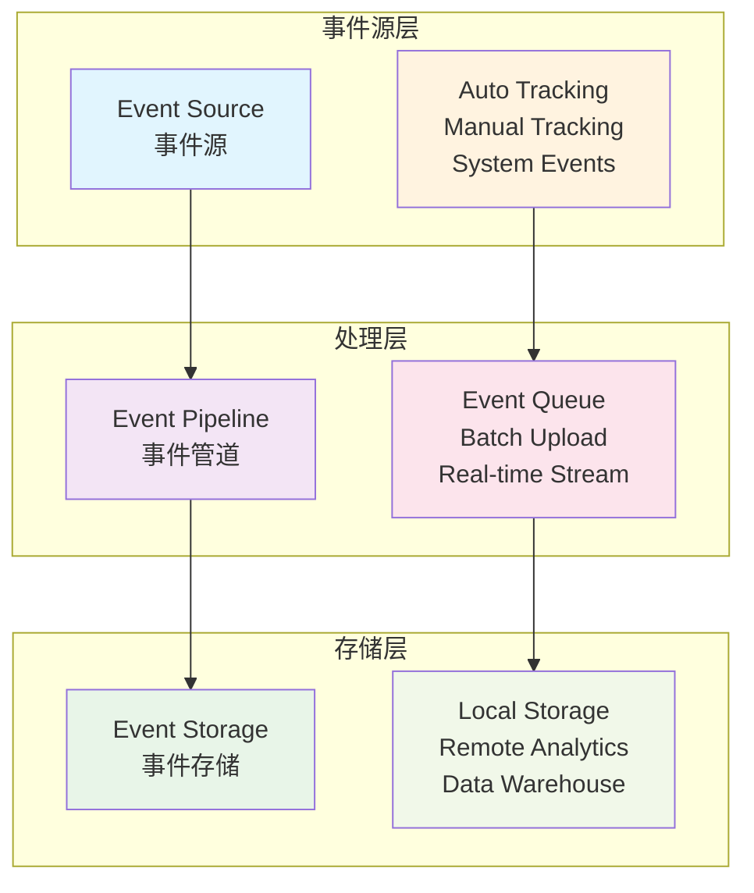

# Flutter 事件追踪和埋点

本文档详细介绍 Flutter 应用中事件追踪和埋点的实现方案，包括自动埋点、手动埋点、事件设计等核心内容。

## 📊 事件追踪架构

### 1. 整体架构设计



### 2. 事件追踪管理器

```dart
// lib/analytics/event_tracker.dart
import 'dart:async';
import 'dart:convert';
import 'dart:io';
import 'package:uuid/uuid.dart';
import 'package:device_info_plus/device_info_plus.dart';
import 'package:package_info_plus/package_info_plus.dart';

class EventTracker {
  static EventTracker? _instance;
  final List<TrackingEvent> _eventQueue = [];
  final Map<String, dynamic> _sessionData = {};
  Timer? _uploadTimer;
  bool _isInitialized = false;

  EventTracker._internal();

  factory EventTracker() {
    return _instance ??= EventTracker._internal();
  }

  Future<void> initialize() async {
    if (_isInitialized) return;

    await _initializeSession();
    await _loadDeviceInfo();
    _startUploadTimer();

    _isInitialized = true;
    print('📊 事件追踪器初始化完成');
  }

  Future<void> _initializeSession() async {
    final sessionId = const Uuid().v4();
    final timestamp = DateTime.now().millisecondsSinceEpoch;

    _sessionData.addAll({
      'session_id': sessionId,
      'session_start': timestamp,
      'app_version': await _getAppVersion(),
      'platform': Platform.operatingSystem,
    });

    print('🔄 会话初始化: $sessionId');
  }

  Future<void> _loadDeviceInfo() async {
    final deviceInfo = DeviceInfoPlugin();

    if (Platform.isAndroid) {
      final androidInfo = await deviceInfo.androidInfo;
      _sessionData.addAll({
        'device_model': androidInfo.model,
        'device_brand': androidInfo.brand,
        'os_version': androidInfo.version.release,
        'device_id': androidInfo.id,
      });
    } else if (Platform.isIOS) {
      final iosInfo = await deviceInfo.iosInfo;
      _sessionData.addAll({
        'device_model': iosInfo.model,
        'device_brand': 'Apple',
        'os_version': iosInfo.systemVersion,
        'device_id': iosInfo.identifierForVendor,
      });
    }
  }

  Future<String> _getAppVersion() async {
    final packageInfo = await PackageInfo.fromPlatform();
    return '${packageInfo.version}+${packageInfo.buildNumber}';
  }

  void _startUploadTimer() {
    _uploadTimer = Timer.periodic(
      AnalyticsConfig.uploadInterval,
      (_) => _uploadEvents(),
    );
  }

  // 追踪事件
  void trackEvent(
    String eventName, {
    Map<String, dynamic>? properties,
    EventPriority priority = EventPriority.normal,
  }) {
    final event = TrackingEvent(
      name: eventName,
      properties: {
        ...?properties,
        ..._sessionData,
        'timestamp': DateTime.now().millisecondsSinceEpoch,
        'event_id': const Uuid().v4(),
      },
      priority: priority,
      timestamp: DateTime.now(),
    );

    _addEvent(event);

    print('📊 事件追踪: $eventName');

    // 高优先级事件立即上传
    if (priority == EventPriority.high) {
      _uploadEvents();
    }
  }

  void _addEvent(TrackingEvent event) {
    _eventQueue.add(event);

    // 队列满时触发上传
    if (_eventQueue.length >= AnalyticsConfig.batchSize) {
      _uploadEvents();
    }
  }

  // 页面访问追踪
  void trackPageView(
    String pageName, {
    Map<String, dynamic>? properties,
  }) {
    trackEvent('page_view', properties: {
      'page_name': pageName,
      'page_url': pageName,
      ...?properties,
    });
  }

  // 用户行为追踪
  void trackUserAction(
    String action, {
    String? target,
    Map<String, dynamic>? properties,
  }) {
    trackEvent('user_action', properties: {
      'action': action,
      'target': target,
      ...?properties,
    });
  }

  // 业务事件追踪
  void trackBusinessEvent(
    String eventType,
    String eventName, {
    Map<String, dynamic>? properties,
  }) {
    trackEvent('business_event', properties: {
      'event_type': eventType,
      'event_name': eventName,
      ...?properties,
    });
  }

  // 错误事件追踪
  void trackError(
    String errorType,
    String errorMessage, {
    String? stackTrace,
    Map<String, dynamic>? properties,
  }) {
    trackEvent(
      'error_event',
      properties: {
        'error_type': errorType,
        'error_message': errorMessage,
        'stack_trace': stackTrace,
        ...?properties,
      },
      priority: EventPriority.high,
    );
  }

  // 性能事件追踪
  void trackPerformance(
    String metricName,
    double value, {
    String? unit,
    Map<String, dynamic>? properties,
  }) {
    trackEvent('performance_metric', properties: {
      'metric_name': metricName,
      'metric_value': value,
      'metric_unit': unit,
      ...?properties,
    });
  }

  // 自定义事件追踪
  void trackCustomEvent(
    String category,
    String action, {
    String? label,
    double? value,
    Map<String, dynamic>? properties,
  }) {
    trackEvent('custom_event', properties: {
      'category': category,
      'action': action,
      'label': label,
      'value': value,
      ...?properties,
    });
  }

  // 上传事件
  Future<void> _uploadEvents() async {
    if (_eventQueue.isEmpty) return;

    final eventsToUpload = List<TrackingEvent>.from(_eventQueue);
    _eventQueue.clear();

    try {
      await _sendEventsToServer(eventsToUpload);
      print('📤 事件上传成功: ${eventsToUpload.length} 个事件');
    } catch (e) {
      print('❌ 事件上传失败: $e');

      // 失败的事件重新加入队列
      _eventQueue.insertAll(0, eventsToUpload);

      // 限制队列大小
      if (_eventQueue.length > AnalyticsConfig.maxQueueSize) {
        _eventQueue.removeRange(
          AnalyticsConfig.maxQueueSize,
          _eventQueue.length,
        );
      }
    }
  }

  Future<void> _sendEventsToServer(List<TrackingEvent> events) async {
    final payload = {
      'events': events.map((e) => e.toJson()).toList(),
      'session_info': _sessionData,
      'upload_time': DateTime.now().millisecondsSinceEpoch,
    };

    // 这里实现实际的网络请求
    // 可以发送到 Firebase、Amplitude、自建服务器等
    await _sendToAnalyticsService(payload);
  }

  Future<void> _sendToAnalyticsService(Map<String, dynamic> payload) async {
    // 示例：发送到自建分析服务
    final dio = Dio();

    try {
      await dio.post(
        '${AnalyticsConfig.serverUrl}/events',
        data: payload,
        options: Options(
          headers: {
            'Content-Type': 'application/json',
            'Authorization': 'Bearer ${AnalyticsConfig.apiKey}',
          },
        ),
      );
    } catch (e) {
      print('❌ 发送到分析服务失败: $e');
      rethrow;
    }
  }

  // 立即上传所有事件
  Future<void> flush() async {
    await _uploadEvents();
  }

  // 清空事件队列
  void clearQueue() {
    _eventQueue.clear();
    print('🗑️  事件队列已清空');
  }

  // 获取队列状态
  EventQueueStatus getQueueStatus() {
    return EventQueueStatus(
      queueSize: _eventQueue.length,
      sessionId: _sessionData['session_id'],
      sessionDuration: DateTime.now().millisecondsSinceEpoch -
          (_sessionData['session_start'] as int),
    );
  }

  void dispose() {
    _uploadTimer?.cancel();
    flush(); // 确保所有事件都被上传
    print('📊 事件追踪器已释放');
  }
}

class TrackingEvent {
  final String name;
  final Map<String, dynamic> properties;
  final EventPriority priority;
  final DateTime timestamp;

  TrackingEvent({
    required this.name,
    required this.properties,
    required this.priority,
    required this.timestamp,
  });

  Map<String, dynamic> toJson() {
    return {
      'name': name,
      'properties': properties,
      'priority': priority.name,
      'timestamp': timestamp.millisecondsSinceEpoch,
    };
  }
}

enum EventPriority {
  low,
  normal,
  high,
}

class EventQueueStatus {
  final int queueSize;
  final String sessionId;
  final int sessionDuration;

  EventQueueStatus({
    required this.queueSize,
    required this.sessionId,
    required this.sessionDuration,
  });
}
```

## 🤖 自动埋点系统

### 1. 自动埋点装饰器

```dart
// lib/analytics/auto_tracking_mixin.dart
mixin AutoTrackingMixin<T extends StatefulWidget> on State<T> {
  late DateTime _pageEnterTime;
  String? _pageName;
  Map<String, dynamic>? _pageProperties;

  @override
  void initState() {
    super.initState();
    _pageEnterTime = DateTime.now();
    _pageName = _getPageName();
    _pageProperties = _getPageProperties();

    WidgetsBinding.instance.addPostFrameCallback((_) {
      _trackPageEnter();
    });
  }

  @override
  void dispose() {
    _trackPageExit();
    super.dispose();
  }

  String _getPageName() {
    return widget.runtimeType.toString().replaceAll('State', '');
  }

  Map<String, dynamic>? _getPageProperties() {
    // 子类可以重写此方法提供页面属性
    return null;
  }

  void _trackPageEnter() {
    if (_pageName != null) {
      EventTracker().trackPageView(
        _pageName!,
        properties: {
          'enter_time': _pageEnterTime.millisecondsSinceEpoch,
          'page_type': 'flutter_page',
          ...?_pageProperties,
        },
      );
    }
  }

  void _trackPageExit() {
    if (_pageName != null) {
      final duration = DateTime.now().difference(_pageEnterTime);

      EventTracker().trackEvent('page_exit', properties: {
        'page_name': _pageName,
        'duration_seconds': duration.inSeconds,
        'exit_time': DateTime.now().millisecondsSinceEpoch,
      });
    }
  }

  // 手动追踪页面内事件
  void trackPageEvent(
    String eventName, {
    Map<String, dynamic>? properties,
  }) {
    EventTracker().trackEvent(eventName, properties: {
      'page_name': _pageName,
      'page_duration': DateTime.now().difference(_pageEnterTime).inSeconds,
      ...?properties,
    });
  }
}
```

### 2. Widget 自动追踪

```dart
// lib/analytics/trackable_widgets.dart
class TrackableButton extends StatelessWidget {
  final Widget child;
  final VoidCallback? onPressed;
  final String? trackingName;
  final Map<String, dynamic>? trackingProperties;

  const TrackableButton({
    Key? key,
    required this.child,
    this.onPressed,
    this.trackingName,
    this.trackingProperties,
  }) : super(key: key);

  @override
  Widget build(BuildContext context) {
    return ElevatedButton(
      onPressed: onPressed != null ? _handlePress : null,
      child: child,
    );
  }

  void _handlePress() {
    // 追踪按钮点击事件
    EventTracker().trackUserAction(
      'button_click',
      target: trackingName ?? 'unknown_button',
      properties: {
        'button_text': _extractButtonText(),
        'timestamp': DateTime.now().millisecondsSinceEpoch,
        ...?trackingProperties,
      },
    );

    onPressed?.call();
  }

  String _extractButtonText() {
    if (child is Text) {
      return (child as Text).data ?? '';
    }
    return 'non_text_button';
  }
}

class TrackableListView extends StatelessWidget {
  final List<Widget> children;
  final String? trackingName;
  final ScrollController? controller;

  const TrackableListView({
    Key? key,
    required this.children,
    this.trackingName,
    this.controller,
  }) : super(key: key);

  @override
  Widget build(BuildContext context) {
    final scrollController = controller ?? ScrollController();

    return NotificationListener<ScrollNotification>(
      onNotification: _handleScroll,
      child: ListView(
        controller: scrollController,
        children: children,
      ),
    );
  }

  bool _handleScroll(ScrollNotification notification) {
    if (notification is ScrollEndNotification) {
      final scrollPercent = notification.metrics.pixels /
          notification.metrics.maxScrollExtent;

      EventTracker().trackUserAction(
        'list_scroll',
        target: trackingName ?? 'unknown_list',
        properties: {
          'scroll_percent': (scrollPercent * 100).round(),
          'scroll_position': notification.metrics.pixels,
          'list_height': notification.metrics.maxScrollExtent,
        },
      );
    }

    return false;
  }
}

class TrackableTextField extends StatefulWidget {
  final String? hintText;
  final String? trackingName;
  final ValueChanged<String>? onChanged;
  final VoidCallback? onEditingComplete;

  const TrackableTextField({
    Key? key,
    this.hintText,
    this.trackingName,
    this.onChanged,
    this.onEditingComplete,
  }) : super(key: key);

  @override
  State<TrackableTextField> createState() => _TrackableTextFieldState();
}

class _TrackableTextFieldState extends State<TrackableTextField> {
  late DateTime _focusTime;
  bool _hasFocus = false;

  @override
  Widget build(BuildContext context) {
    return Focus(
      onFocusChange: _handleFocusChange,
      child: TextField(
        decoration: InputDecoration(
          hintText: widget.hintText,
        ),
        onChanged: _handleTextChange,
        onEditingComplete: _handleEditingComplete,
      ),
    );
  }

  void _handleFocusChange(bool hasFocus) {
    if (hasFocus && !_hasFocus) {
      _focusTime = DateTime.now();
      _trackInputFocus();
    } else if (!hasFocus && _hasFocus) {
      _trackInputBlur();
    }

    _hasFocus = hasFocus;
  }

  void _handleTextChange(String text) {
    widget.onChanged?.call(text);

    // 追踪输入事件（可以设置防抖）
    EventTracker().trackUserAction(
      'text_input',
      target: widget.trackingName ?? 'unknown_textfield',
      properties: {
        'text_length': text.length,
        'has_content': text.isNotEmpty,
      },
    );
  }

  void _handleEditingComplete() {
    widget.onEditingComplete?.call();

    EventTracker().trackUserAction(
      'text_input_complete',
      target: widget.trackingName ?? 'unknown_textfield',
    );
  }

  void _trackInputFocus() {
    EventTracker().trackUserAction(
      'input_focus',
      target: widget.trackingName ?? 'unknown_textfield',
      properties: {
        'focus_time': _focusTime.millisecondsSinceEpoch,
      },
    );
  }

  void _trackInputBlur() {
    final duration = DateTime.now().difference(_focusTime);

    EventTracker().trackUserAction(
      'input_blur',
      target: widget.trackingName ?? 'unknown_textfield',
      properties: {
        'focus_duration_seconds': duration.inSeconds,
        'blur_time': DateTime.now().millisecondsSinceEpoch,
      },
    );
  }
}
```

### 3. 路由自动追踪

```dart
// lib/analytics/route_tracking_observer.dart
class RouteTrackingObserver extends RouteObserver<PageRoute<dynamic>> {
  @override
  void didPush(Route<dynamic> route, Route<dynamic>? previousRoute) {
    super.didPush(route, previousRoute);

    if (route is PageRoute) {
      _trackRouteChange('route_push', route, previousRoute);
    }
  }

  @override
  void didPop(Route<dynamic> route, Route<dynamic>? previousRoute) {
    super.didPop(route, previousRoute);

    if (route is PageRoute) {
      _trackRouteChange('route_pop', route, previousRoute);
    }
  }

  @override
  void didReplace({Route<dynamic>? newRoute, Route<dynamic>? oldRoute}) {
    super.didReplace(newRoute: newRoute, oldRoute: oldRoute);

    if (newRoute is PageRoute) {
      _trackRouteChange('route_replace', newRoute, oldRoute);
    }
  }

  void _trackRouteChange(
    String action,
    Route<dynamic> route,
    Route<dynamic>? previousRoute,
  ) {
    final routeName = _getRouteName(route);
    final previousRouteName = previousRoute != null
        ? _getRouteName(previousRoute)
        : null;

    EventTracker().trackEvent('route_change', properties: {
      'action': action,
      'route_name': routeName,
      'previous_route': previousRouteName,
      'timestamp': DateTime.now().millisecondsSinceEpoch,
    });

    // 同时追踪页面访问
    if (action == 'route_push' || action == 'route_replace') {
      EventTracker().trackPageView(routeName);
    }
  }

  String _getRouteName(Route<dynamic> route) {
    if (route.settings.name != null) {
      return route.settings.name!;
    }

    // 尝试从路由类型获取名称
    return route.runtimeType.toString();
  }
}
```

## 📋 事件设计规范

### 1. 事件命名规范

```dart
// lib/analytics/event_constants.dart
class EventNames {
  // 页面事件
  static const String pageView = 'page_view';
  static const String pageEnter = 'page_enter';
  static const String pageExit = 'page_exit';

  // 用户行为事件
  static const String userAction = 'user_action';
  static const String buttonClick = 'button_click';
  static const String linkClick = 'link_click';
  static const String formSubmit = 'form_submit';

  // 业务事件
  static const String userLogin = 'user_login';
  static const String userLogout = 'user_logout';
  static const String userRegister = 'user_register';
  static const String purchase = 'purchase';
  static const String addToCart = 'add_to_cart';

  // 系统事件
  static const String appStart = 'app_start';
  static const String appBackground = 'app_background';
  static const String appForeground = 'app_foreground';
  static const String errorOccurred = 'error_occurred';

  // 性能事件
  static const String performanceMetric = 'performance_metric';
  static const String loadTime = 'load_time';
  static const String apiResponse = 'api_response';
}

class EventProperties {
  // 通用属性
  static const String timestamp = 'timestamp';
  static const String sessionId = 'session_id';
  static const String userId = 'user_id';
  static const String deviceId = 'device_id';

  // 页面属性
  static const String pageName = 'page_name';
  static const String pageUrl = 'page_url';
  static const String pageType = 'page_type';
  static const String referrer = 'referrer';

  // 用户行为属性
  static const String action = 'action';
  static const String target = 'target';
  static const String category = 'category';
  static const String label = 'label';
  static const String value = 'value';

  // 业务属性
  static const String productId = 'product_id';
  static const String productName = 'product_name';
  static const String productCategory = 'product_category';
  static const String price = 'price';
  static const String currency = 'currency';

  // 技术属性
  static const String platform = 'platform';
  static const String appVersion = 'app_version';
  static const String osVersion = 'os_version';
  static const String deviceModel = 'device_model';
}
```

### 2. 事件验证器

```dart
// lib/analytics/event_validator.dart
class EventValidator {
  static const int maxEventNameLength = 100;
  static const int maxPropertyKeyLength = 50;
  static const int maxPropertyValueLength = 500;
  static const int maxPropertiesCount = 50;

  static ValidationResult validateEvent(
    String eventName,
    Map<String, dynamic>? properties,
  ) {
    final errors = <String>[];

    // 验证事件名称
    if (eventName.isEmpty) {
      errors.add('事件名称不能为空');
    } else if (eventName.length > maxEventNameLength) {
      errors.add('事件名称长度不能超过 $maxEventNameLength 字符');
    } else if (!_isValidEventName(eventName)) {
      errors.add('事件名称格式不正确，只能包含字母、数字和下划线');
    }

    // 验证属性
    if (properties != null) {
      if (properties.length > maxPropertiesCount) {
        errors.add('属性数量不能超过 $maxPropertiesCount 个');
      }

      properties.forEach((key, value) {
        // 验证属性键
        if (key.isEmpty) {
          errors.add('属性键不能为空');
        } else if (key.length > maxPropertyKeyLength) {
          errors.add('属性键 "$key" 长度不能超过 $maxPropertyKeyLength 字符');
        } else if (!_isValidPropertyKey(key)) {
          errors.add('属性键 "$key" 格式不正确');
        }

        // 验证属性值
        if (value != null) {
          final valueStr = value.toString();
          if (valueStr.length > maxPropertyValueLength) {
            errors.add('属性值 "$key" 长度不能超过 $maxPropertyValueLength 字符');
          }

          if (!_isValidPropertyValue(value)) {
            errors.add('属性值 "$key" 类型不支持');
          }
        }
      });
    }

    return ValidationResult(
      isValid: errors.isEmpty,
      errors: errors,
    );
  }

  static bool _isValidEventName(String name) {
    return RegExp(r'^[a-zA-Z][a-zA-Z0-9_]*$').hasMatch(name);
  }

  static bool _isValidPropertyKey(String key) {
    return RegExp(r'^[a-zA-Z][a-zA-Z0-9_]*$').hasMatch(key);
  }

  static bool _isValidPropertyValue(dynamic value) {
    return value is String ||
           value is num ||
           value is bool ||
           value is List ||
           value is Map;
  }

  static Map<String, dynamic> sanitizeProperties(
    Map<String, dynamic> properties,
  ) {
    final sanitized = <String, dynamic>{};

    properties.forEach((key, value) {
      // 清理属性键
      final cleanKey = _sanitizeKey(key);

      // 清理属性值
      final cleanValue = _sanitizeValue(value);

      if (cleanKey.isNotEmpty && cleanValue != null) {
        sanitized[cleanKey] = cleanValue;
      }
    });

    return sanitized;
  }

  static String _sanitizeKey(String key) {
    return key
        .replaceAll(RegExp(r'[^a-zA-Z0-9_]'), '_')
        .substring(0, key.length > maxPropertyKeyLength
            ? maxPropertyKeyLength
            : key.length);
  }

  static dynamic _sanitizeValue(dynamic value) {
    if (value == null) return null;

    if (value is String) {
      return value.length > maxPropertyValueLength
          ? value.substring(0, maxPropertyValueLength)
          : value;
    }

    if (value is num || value is bool) {
      return value;
    }

    if (value is List || value is Map) {
      final jsonStr = jsonEncode(value);
      return jsonStr.length > maxPropertyValueLength
          ? jsonStr.substring(0, maxPropertyValueLength)
          : value;
    }

    // 其他类型转换为字符串
    final str = value.toString();
    return str.length > maxPropertyValueLength
        ? str.substring(0, maxPropertyValueLength)
        : str;
  }
}

class ValidationResult {
  final bool isValid;
  final List<String> errors;

  ValidationResult({
    required this.isValid,
    required this.errors,
  });
}
```

## 🔧 调试和测试

### 1. 事件调试器

```dart
// lib/analytics/event_debugger.dart
class EventDebugger {
  static bool _isEnabled = false;
  static final List<DebugEvent> _debugEvents = [];

  static void enable() {
    _isEnabled = true;
    print('🐛 事件调试器已启用');
  }

  static void disable() {
    _isEnabled = false;
    print('🐛 事件调试器已禁用');
  }

  static void logEvent(
    String eventName,
    Map<String, dynamic>? properties,
  ) {
    if (!_isEnabled) return;

    final debugEvent = DebugEvent(
      name: eventName,
      properties: properties ?? {},
      timestamp: DateTime.now(),
    );

    _debugEvents.add(debugEvent);

    // 保留最近 100 个事件
    if (_debugEvents.length > 100) {
      _debugEvents.removeAt(0);
    }

    _printEvent(debugEvent);
  }

  static void _printEvent(DebugEvent event) {
    print('\n📊 [${event.timestamp.toIso8601String()}] ${event.name}');

    if (event.properties.isNotEmpty) {
      print('   属性:');
      event.properties.forEach((key, value) {
        print('     $key: $value');
      });
    }
  }

  static List<DebugEvent> getRecentEvents({int? limit}) {
    final events = List<DebugEvent>.from(_debugEvents);

    if (limit != null && events.length > limit) {
      return events.sublist(events.length - limit);
    }

    return events;
  }

  static void printEventSummary() {
    if (_debugEvents.isEmpty) {
      print('📊 暂无事件记录');
      return;
    }

    final eventCounts = <String, int>{};

    for (final event in _debugEvents) {
      eventCounts[event.name] = (eventCounts[event.name] ?? 0) + 1;
    }

    print('\n📊 事件统计摘要:');
    print('总事件数: ${_debugEvents.length}');
    print('事件类型: ${eventCounts.length}');
    print('\n事件分布:');

    eventCounts.entries
        .toList()
        ..sort((a, b) => b.value.compareTo(a.value))
        ..forEach((entry) {
          print('  ${entry.key}: ${entry.value}');
        });
  }

  static void clearEvents() {
    _debugEvents.clear();
    print('🗑️  调试事件已清空');
  }
}

class DebugEvent {
  final String name;
  final Map<String, dynamic> properties;
  final DateTime timestamp;

  DebugEvent({
    required this.name,
    required this.properties,
    required this.timestamp,
  });
}
```

## 🚀 最佳实践

### 1. 事件设计原则

- **一致性** - 使用统一的命名规范
- **简洁性** - 事件名称简洁明了
- **完整性** - 包含必要的上下文信息
- **可扩展性** - 预留扩展空间

### 2. 性能优化

- **批量上传** - 减少网络请求频率
- **本地缓存** - 离线时暂存事件
- **异步处理** - 避免阻塞主线程
- **队列管理** - 控制内存使用

### 3. 数据质量

- **事件验证** - 确保数据格式正确
- **重复检测** - 避免重复事件
- **异常处理** - 优雅处理错误情况
- **数据清洗** - 过滤无效数据

### 4. 隐私保护

- **数据脱敏** - 移除敏感信息
- **用户同意** - 获取明确授权
- **数据最小化** - 只收集必要数据
- **安全传输** - 加密数据传输

通过系统的事件追踪和埋点实践，可以全面了解用户行为，为产品优化和业务决策提供数据支持。
