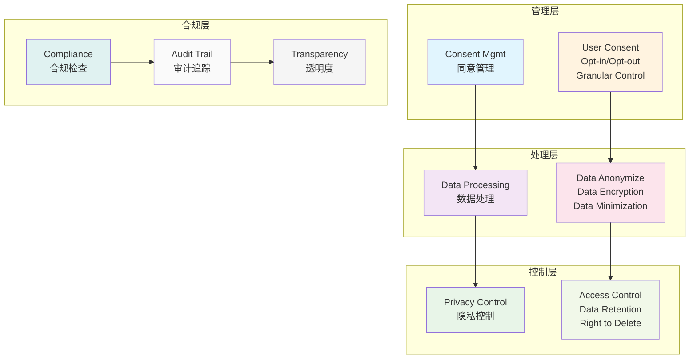

# Flutter 数据分析隐私合规

本文档详细介绍 Flutter 应用中数据分析的隐私保护措施和合规要求，确保符合 GDPR、CCPA 等法律法规。

## 🔒 隐私合规架构

### 1. 隐私保护框架



### 2. 隐私管理器

```dart
// lib/analytics/privacy/privacy_manager.dart
import 'dart:async';
import 'dart:convert';
import 'package:crypto/crypto.dart';

class PrivacyManager {
  static PrivacyManager? _instance;
  final Map<String, ConsentRecord> _consentRecords = {};
  final Map<String, UserDataRecord> _userDataRecords = {};
  final StreamController<PrivacyEvent> _eventController =
      StreamController<PrivacyEvent>.broadcast();

  PrivacyManager._internal();

  factory PrivacyManager() {
    return _instance ??= PrivacyManager._internal();
  }

  Stream<PrivacyEvent> get eventStream => _eventController.stream;

  // 初始化隐私管理
  Future<void> initialize() async {
    await _loadConsentRecords();
    await _loadUserDataRecords();

    // 检查合规性
    await _performComplianceCheck();

    print('🔒 隐私管理器初始化完成');
  }

  // 请求用户同意
  Future<ConsentResult> requestConsent({
    required String userId,
    required List<DataCategory> categories,
    required ConsentContext context,
  }) async {
    final consentRequest = ConsentRequest(
      userId: userId,
      categories: categories,
      context: context,
      timestamp: DateTime.now(),
    );

    // 显示同意对话框
    final userChoice = await _showConsentDialog(consentRequest);

    // 记录同意结果
    final consentRecord = ConsentRecord(
      userId: userId,
      categories: categories,
      granted: userChoice.granted,
      granularChoices: userChoice.granularChoices,
      timestamp: DateTime.now(),
      context: context,
      ipAddress: await _getCurrentIpAddress(),
      userAgent: await _getUserAgent(),
    );

    _consentRecords[userId] = consentRecord;
    await _saveConsentRecord(consentRecord);

    // 发送隐私事件
    _eventController.add(PrivacyEvent(
      type: PrivacyEventType.consentGranted,
      userId: userId,
      data: {'categories': categories.map((c) => c.name).toList()},
      timestamp: DateTime.now(),
    ));

    return ConsentResult(
      granted: userChoice.granted,
      categories: userChoice.granularChoices,
    );
  }

  // 检查数据收集权限
  bool hasConsentForCategory(String userId, DataCategory category) {
    final record = _consentRecords[userId];
    if (record == null) return false;

    // 检查是否已过期
    if (_isConsentExpired(record)) {
      return false;
    }

    // 检查具体类别权限
    return record.granularChoices[category] == true;
  }

  // 撤销同意
  Future<void> revokeConsent(String userId, List<DataCategory> categories) async {
    final record = _consentRecords[userId];
    if (record == null) return;

    // 更新同意记录
    for (final category in categories) {
      record.granularChoices[category] = false;
    }

    record.lastUpdated = DateTime.now();
    await _saveConsentRecord(record);

    // 停止相关数据收集
    await _stopDataCollection(userId, categories);

    _eventController.add(PrivacyEvent(
      type: PrivacyEventType.consentRevoked,
      userId: userId,
      data: {'categories': categories.map((c) => c.name).toList()},
      timestamp: DateTime.now(),
    ));

    print('🚫 用户 $userId 撤销了数据收集同意');
  }

  // 数据匿名化
  String anonymizeUserId(String userId) {
    final bytes = utf8.encode(userId + _getAnonymizationSalt());
    final digest = sha256.convert(bytes);
    return digest.toString().substring(0, 16); // 取前16位作为匿名ID
  }

  // 数据脱敏
  Map<String, dynamic> sanitizeEventData(Map<String, dynamic> data) {
    final sanitized = Map<String, dynamic>.from(data);

    // 移除敏感字段
    final sensitiveFields = [
      'email',
      'phone',
      'address',
      'credit_card',
      'ssn',
      'password',
    ];

    for (final field in sensitiveFields) {
      sanitized.remove(field);
    }

    // 脱敏IP地址
    if (sanitized.containsKey('ip_address')) {
      sanitized['ip_address'] = _maskIpAddress(sanitized['ip_address']);
    }

    // 脱敏设备ID
    if (sanitized.containsKey('device_id')) {
      sanitized['device_id'] = _maskDeviceId(sanitized['device_id']);
    }

    return sanitized;
  }

  // 用户数据导出
  Future<UserDataExport> exportUserData(String userId) async {
    final userRecord = _userDataRecords[userId];
    if (userRecord == null) {
      throw Exception('用户数据记录不存在');
    }

    // 收集用户所有数据
    final analyticsData = await _getUserAnalyticsData(userId);
    final eventData = await _getUserEventData(userId);
    final consentData = _consentRecords[userId];

    final export = UserDataExport(
      userId: userId,
      exportDate: DateTime.now(),
      analyticsData: analyticsData,
      eventData: eventData,
      consentRecord: consentData,
      dataCategories: _getUserDataCategories(userId),
    );

    // 记录导出操作
    await _logDataAccess(DataAccessType.export, userId);

    return export;
  }

  // 用户数据删除
  Future<void> deleteUserData(String userId, {bool hardDelete = false}) async {
    if (hardDelete) {
      // 硬删除：完全移除所有数据
      await _hardDeleteUserData(userId);
    } else {
      // 软删除：标记删除但保留用于合规
      await _softDeleteUserData(userId);
    }

    // 清理内存中的记录
    _consentRecords.remove(userId);
    _userDataRecords.remove(userId);

    _eventController.add(PrivacyEvent(
      type: PrivacyEventType.dataDeleted,
      userId: userId,
      data: {'hard_delete': hardDelete},
      timestamp: DateTime.now(),
    ));

    print('🗑️ 用户 $userId 数据已删除 (硬删除: $hardDelete)');
  }

  // 数据保留策略检查
  Future<void> enforceDataRetention() async {
    final now = DateTime.now();
    final expiredUsers = <String>[];

    for (final entry in _userDataRecords.entries) {
      final userId = entry.key;
      final record = entry.value;

      // 检查数据是否超过保留期限
      if (_isDataRetentionExpired(record, now)) {
        expiredUsers.add(userId);
      }
    }

    // 删除过期数据
    for (final userId in expiredUsers) {
      await deleteUserData(userId, hardDelete: true);
    }

    if (expiredUsers.isNotEmpty) {
      print('🕒 清理了 ${expiredUsers.length} 个用户的过期数据');
    }
  }

  // 合规性检查
  Future<ComplianceReport> performComplianceCheck() async {
    final issues = <ComplianceIssue>[];

    // 检查同意记录
    await _checkConsentCompliance(issues);

    // 检查数据保留
    await _checkDataRetentionCompliance(issues);

    // 检查数据处理
    await _checkDataProcessingCompliance(issues);

    // 检查安全措施
    await _checkSecurityCompliance(issues);

    final report = ComplianceReport(
      checkDate: DateTime.now(),
      issues: issues,
      overallStatus: issues.isEmpty
          ? ComplianceStatus.compliant
          : ComplianceStatus.nonCompliant,
    );

    await _saveComplianceReport(report);

    return report;
  }

  Future<void> _checkConsentCompliance(List<ComplianceIssue> issues) async {
    for (final record in _consentRecords.values) {
      // 检查同意是否过期
      if (_isConsentExpired(record)) {
        issues.add(ComplianceIssue(
          type: ComplianceIssueType.expiredConsent,
          description: '用户 ${record.userId} 的同意已过期',
          severity: IssueSeverity.high,
          userId: record.userId,
        ));
      }

      // 检查同意记录完整性
      if (!_isConsentRecordComplete(record)) {
        issues.add(ComplianceIssue(
          type: ComplianceIssueType.incompleteConsent,
          description: '用户 ${record.userId} 的同意记录不完整',
          severity: IssueSeverity.medium,
          userId: record.userId,
        ));
      }
    }
  }

  Future<void> _checkDataRetentionCompliance(List<ComplianceIssue> issues) async {
    final now = DateTime.now();

    for (final record in _userDataRecords.values) {
      if (_isDataRetentionExpired(record, now)) {
        issues.add(ComplianceIssue(
          type: ComplianceIssueType.dataRetentionViolation,
          description: '用户 ${record.userId} 的数据超过保留期限',
          severity: IssueSeverity.high,
          userId: record.userId,
        ));
      }
    }
  }

  Future<void> _checkDataProcessingCompliance(List<ComplianceIssue> issues) async {
    // 检查数据处理是否符合同意范围
    // 实现具体的数据处理合规检查逻辑
  }

  Future<void> _checkSecurityCompliance(List<ComplianceIssue> issues) async {
    // 检查数据加密
    if (!await _isDataEncrypted()) {
      issues.add(ComplianceIssue(
        type: ComplianceIssueType.securityViolation,
        description: '数据未正确加密',
        severity: IssueSeverity.critical,
      ));
    }

    // 检查访问控制
    if (!await _isAccessControlEnabled()) {
      issues.add(ComplianceIssue(
        type: ComplianceIssueType.securityViolation,
        description: '访问控制未启用',
        severity: IssueSeverity.high,
      ));
    }
  }

  Future<ConsentChoice> _showConsentDialog(ConsentRequest request) async {
    // 这里应该显示实际的同意对话框
    // 返回用户的选择
    return ConsentChoice(
      granted: true,
      granularChoices: {
        for (final category in request.categories) category: true,
      },
    );
  }

  bool _isConsentExpired(ConsentRecord record) {
    final expiryDuration = Duration(days: 365); // 1年有效期
    return DateTime.now().difference(record.timestamp) > expiryDuration;
  }

  bool _isConsentRecordComplete(ConsentRecord record) {
    return record.userId.isNotEmpty &&
           record.timestamp != null &&
           record.ipAddress.isNotEmpty &&
           record.userAgent.isNotEmpty;
  }

  bool _isDataRetentionExpired(UserDataRecord record, DateTime now) {
    final retentionPeriod = Duration(days: 1095); // 3年保留期
    return now.difference(record.createdAt) > retentionPeriod;
  }

  String _getAnonymizationSalt() {
    // 返回用于匿名化的盐值
    return 'privacy_salt_2024';
  }

  String _maskIpAddress(String ipAddress) {
    // 脱敏IP地址，保留前3段
    final parts = ipAddress.split('.');
    if (parts.length == 4) {
      return '${parts[0]}.${parts[1]}.${parts[2]}.xxx';
    }
    return 'xxx.xxx.xxx.xxx';
  }

  String _maskDeviceId(String deviceId) {
    // 脱敏设备ID，只保留前4位和后4位
    if (deviceId.length > 8) {
      return '${deviceId.substring(0, 4)}****${deviceId.substring(deviceId.length - 4)}';
    }
    return '****';
  }

  Future<void> _stopDataCollection(String userId, List<DataCategory> categories) async {
    // 停止指定类别的数据收集
    for (final category in categories) {
      // 通知相关组件停止数据收集
    }
  }

  Future<void> _hardDeleteUserData(String userId) async {
    // 从所有存储中完全删除用户数据
    await _deleteFromAnalyticsDatabase(userId);
    await _deleteFromEventDatabase(userId);
    await _deleteFromFileStorage(userId);
  }

  Future<void> _softDeleteUserData(String userId) async {
    // 标记删除但保留数据用于合规审计
    await _markAsDeleted(userId);
  }

  Future<void> _loadConsentRecords() async {
    // 从持久化存储加载同意记录
  }

  Future<void> _loadUserDataRecords() async {
    // 从持久化存储加载用户数据记录
  }

  Future<void> _saveConsentRecord(ConsentRecord record) async {
    // 保存同意记录到持久化存储
  }

  Future<void> _saveComplianceReport(ComplianceReport report) async {
    // 保存合规报告
  }

  Future<void> _performComplianceCheck() async {
    // 执行初始合规检查
  }

  Future<String> _getCurrentIpAddress() async {
    // 获取当前IP地址
    return '192.168.1.1';
  }

  Future<String> _getUserAgent() async {
    // 获取用户代理字符串
    return 'Flutter App 1.0';
  }

  Future<Map<String, dynamic>> _getUserAnalyticsData(String userId) async {
    // 获取用户分析数据
    return {};
  }

  Future<List<Map<String, dynamic>>> _getUserEventData(String userId) async {
    // 获取用户事件数据
    return [];
  }

  List<DataCategory> _getUserDataCategories(String userId) {
    // 获取用户数据类别
    return [];
  }

  Future<void> _logDataAccess(DataAccessType type, String userId) async {
    // 记录数据访问日志
  }

  Future<bool> _isDataEncrypted() async {
    // 检查数据是否加密
    return true;
  }

  Future<bool> _isAccessControlEnabled() async {
    // 检查访问控制是否启用
    return true;
  }

  Future<void> _deleteFromAnalyticsDatabase(String userId) async {
    // 从分析数据库删除
  }

  Future<void> _deleteFromEventDatabase(String userId) async {
    // 从事件数据库删除
  }

  Future<void> _deleteFromFileStorage(String userId) async {
    // 从文件存储删除
  }

  Future<void> _markAsDeleted(String userId) async {
    // 标记为已删除
  }

  void dispose() {
    _eventController.close();
    _consentRecords.clear();
    _userDataRecords.clear();
  }
}

// 数据类别
enum DataCategory {
  analytics('分析数据'),
  performance('性能数据'),
  behavioral('行为数据'),
  demographic('人口统计'),
  location('位置信息'),
  device('设备信息'),
  usage('使用情况'),
  preferences('用户偏好');

  const DataCategory(this.displayName);
  final String displayName;
}

// 同意记录
class ConsentRecord {
  final String userId;
  final List<DataCategory> categories;
  final bool granted;
  final Map<DataCategory, bool> granularChoices;
  final DateTime timestamp;
  final ConsentContext context;
  final String ipAddress;
  final String userAgent;
  DateTime? lastUpdated;

  ConsentRecord({
    required this.userId,
    required this.categories,
    required this.granted,
    required this.granularChoices,
    required this.timestamp,
    required this.context,
    required this.ipAddress,
    required this.userAgent,
    this.lastUpdated,
  });
}

// 同意上下文
class ConsentContext {
  final String source; // 同意来源（首次启动、设置页面等）
  final String version; // 隐私政策版本
  final String language; // 语言

  ConsentContext({
    required this.source,
    required this.version,
    required this.language,
  });
}

// 同意请求
class ConsentRequest {
  final String userId;
  final List<DataCategory> categories;
  final ConsentContext context;
  final DateTime timestamp;

  ConsentRequest({
    required this.userId,
    required this.categories,
    required this.context,
    required this.timestamp,
  });
}

// 同意选择
class ConsentChoice {
  final bool granted;
  final Map<DataCategory, bool> granularChoices;

  ConsentChoice({
    required this.granted,
    required this.granularChoices,
  });
}

// 同意结果
class ConsentResult {
  final bool granted;
  final Map<DataCategory, bool> categories;

  ConsentResult({
    required this.granted,
    required this.categories,
  });
}

// 用户数据记录
class UserDataRecord {
  final String userId;
  final DateTime createdAt;
  final DateTime lastAccessedAt;
  final List<DataCategory> dataCategories;
  final bool isDeleted;

  UserDataRecord({
    required this.userId,
    required this.createdAt,
    required this.lastAccessedAt,
    required this.dataCategories,
    this.isDeleted = false,
  });
}

// 用户数据导出
class UserDataExport {
  final String userId;
  final DateTime exportDate;
  final Map<String, dynamic> analyticsData;
  final List<Map<String, dynamic>> eventData;
  final ConsentRecord? consentRecord;
  final List<DataCategory> dataCategories;

  UserDataExport({
    required this.userId,
    required this.exportDate,
    required this.analyticsData,
    required this.eventData,
    this.consentRecord,
    required this.dataCategories,
  });

  Map<String, dynamic> toJson() {
    return {
      'user_id': userId,
      'export_date': exportDate.toIso8601String(),
      'analytics_data': analyticsData,
      'event_data': eventData,
      'consent_record': consentRecord != null ? {
        'granted': consentRecord!.granted,
        'timestamp': consentRecord!.timestamp.toIso8601String(),
        'categories': consentRecord!.categories.map((c) => c.name).toList(),
      } : null,
      'data_categories': dataCategories.map((c) => c.name).toList(),
    };
  }
}

// 隐私事件
class PrivacyEvent {
  final PrivacyEventType type;
  final String userId;
  final Map<String, dynamic> data;
  final DateTime timestamp;

  PrivacyEvent({
    required this.type,
    required this.userId,
    required this.data,
    required this.timestamp,
  });
}

enum PrivacyEventType {
  consentGranted,
  consentRevoked,
  dataDeleted,
  dataExported,
  dataAccessed,
}

// 合规报告
class ComplianceReport {
  final DateTime checkDate;
  final List<ComplianceIssue> issues;
  final ComplianceStatus overallStatus;

  ComplianceReport({
    required this.checkDate,
    required this.issues,
    required this.overallStatus,
  });
}

// 合规问题
class ComplianceIssue {
  final ComplianceIssueType type;
  final String description;
  final IssueSeverity severity;
  final String? userId;

  ComplianceIssue({
    required this.type,
    required this.description,
    required this.severity,
    this.userId,
  });
}

enum ComplianceIssueType {
  expiredConsent,
  incompleteConsent,
  dataRetentionViolation,
  securityViolation,
  processingViolation,
}

enum IssueSeverity {
  low,
  medium,
  high,
  critical,
}

enum ComplianceStatus {
  compliant,
  nonCompliant,
  unknown,
}

enum DataAccessType {
  read,
  write,
  delete,
  export,
}
```

### 3. 同意管理 UI

```dart
// lib/analytics/privacy/consent_dialog.dart
class ConsentDialog extends StatefulWidget {
  final ConsentRequest request;
  final Function(ConsentChoice) onChoice;

  const ConsentDialog({
    Key? key,
    required this.request,
    required this.onChoice,
  }) : super(key: key);

  @override
  State<ConsentDialog> createState() => _ConsentDialogState();
}

class _ConsentDialogState extends State<ConsentDialog> {
  final Map<DataCategory, bool> _choices = {};
  bool _acceptAll = false;

  @override
  void initState() {
    super.initState();

    // 初始化选择状态
    for (final category in widget.request.categories) {
      _choices[category] = false;
    }
  }

  @override
  Widget build(BuildContext context) {
    return AlertDialog(
      title: const Text('数据收集同意'),
      content: SizedBox(
        width: double.maxFinite,
        child: Column(
          mainAxisSize: MainAxisSize.min,
          crossAxisAlignment: CrossAxisAlignment.start,
          children: [
            const Text(
              '我们需要您的同意来收集以下类型的数据，以改善您的使用体验：',
              style: TextStyle(fontSize: 14),
            ),
            const SizedBox(height: 16),
            _buildAcceptAllOption(),
            const Divider(),
            Flexible(
              child: ListView(
                shrinkWrap: true,
                children: widget.request.categories
                    .map(_buildCategoryOption)
                    .toList(),
              ),
            ),
            const SizedBox(height: 16),
            _buildPrivacyPolicyLink(),
          ],
        ),
      ),
      actions: [
        TextButton(
          onPressed: _onReject,
          child: const Text('拒绝'),
        ),
        TextButton(
          onPressed: _onAcceptSelected,
          child: const Text('接受选中项'),
        ),
      ],
    );
  }

  Widget _buildAcceptAllOption() {
    return CheckboxListTile(
      title: const Text(
        '接受所有数据收集',
        style: TextStyle(fontWeight: FontWeight.bold),
      ),
      subtitle: const Text('同意收集所有类型的数据'),
      value: _acceptAll,
      onChanged: (value) {
        setState(() {
          _acceptAll = value ?? false;

          // 更新所有类别的选择状态
          for (final category in widget.request.categories) {
            _choices[category] = _acceptAll;
          }
        });
      },
    );
  }

  Widget _buildCategoryOption(DataCategory category) {
    return CheckboxListTile(
      title: Text(category.displayName),
      subtitle: Text(_getCategoryDescription(category)),
      value: _choices[category] ?? false,
      onChanged: (value) {
        setState(() {
          _choices[category] = value ?? false;

          // 检查是否所有类别都被选中
          _acceptAll = _choices.values.every((selected) => selected);
        });
      },
    );
  }

  Widget _buildPrivacyPolicyLink() {
    return GestureDetector(
      onTap: _showPrivacyPolicy,
      child: const Text(
        '查看完整隐私政策',
        style: TextStyle(
          color: Colors.blue,
          decoration: TextDecoration.underline,
        ),
      ),
    );
  }

  String _getCategoryDescription(DataCategory category) {
    switch (category) {
      case DataCategory.analytics:
        return '用于分析应用使用情况和改进功能';
      case DataCategory.performance:
        return '用于监控应用性能和稳定性';
      case DataCategory.behavioral:
        return '用于了解用户行为模式';
      case DataCategory.demographic:
        return '用于了解用户群体特征';
      case DataCategory.location:
        return '用于提供基于位置的服务';
      case DataCategory.device:
        return '用于优化设备兼容性';
      case DataCategory.usage:
        return '用于统计功能使用情况';
      case DataCategory.preferences:
        return '用于记住您的偏好设置';
    }
  }

  void _onReject() {
    final choice = ConsentChoice(
      granted: false,
      granularChoices: {
        for (final category in widget.request.categories) category: false,
      },
    );

    widget.onChoice(choice);
    Navigator.of(context).pop();
  }

  void _onAcceptSelected() {
    final hasAnySelection = _choices.values.any((selected) => selected);

    final choice = ConsentChoice(
      granted: hasAnySelection,
      granularChoices: Map.from(_choices),
    );

    widget.onChoice(choice);
    Navigator.of(context).pop();
  }

  void _showPrivacyPolicy() {
    Navigator.of(context).push(
      MaterialPageRoute(
        builder: (context) => const PrivacyPolicyPage(),
      ),
    );
  }
}

// 隐私政策页面
class PrivacyPolicyPage extends StatelessWidget {
  const PrivacyPolicyPage({Key? key}) : super(key: key);

  @override
  Widget build(BuildContext context) {
    return Scaffold(
      appBar: AppBar(
        title: const Text('隐私政策'),
      ),
      body: const SingleChildScrollView(
        padding: EdgeInsets.all(16.0),
        child: Column(
          crossAxisAlignment: CrossAxisAlignment.start,
          children: [
            Text(
              '隐私政策',
              style: TextStyle(
                fontSize: 24,
                fontWeight: FontWeight.bold,
              ),
            ),
            SizedBox(height: 16),
            Text(
              '最后更新：2024年1月1日',
              style: TextStyle(
                color: Colors.grey,
                fontSize: 14,
              ),
            ),
            SizedBox(height: 24),
            _PolicySection(
              title: '1. 数据收集',
              content: '我们收集以下类型的数据来改善您的使用体验...',
            ),
            _PolicySection(
              title: '2. 数据使用',
              content: '我们使用收集的数据用于以下目的...',
            ),
            _PolicySection(
              title: '3. 数据共享',
              content: '我们不会与第三方共享您的个人数据，除非...',
            ),
            _PolicySection(
              title: '4. 数据安全',
              content: '我们采取适当的技术和组织措施来保护您的数据...',
            ),
            _PolicySection(
              title: '5. 您的权利',
              content: '根据适用的数据保护法律，您有权...',
            ),
            _PolicySection(
              title: '6. 联系我们',
              content: '如果您对本隐私政策有任何疑问，请联系我们...',
            ),
          ],
        ),
      ),
    );
  }
}

class _PolicySection extends StatelessWidget {
  final String title;
  final String content;

  const _PolicySection({
    required this.title,
    required this.content,
  });

  @override
  Widget build(BuildContext context) {
    return Padding(
      padding: const EdgeInsets.only(bottom: 24.0),
      child: Column(
        crossAxisAlignment: CrossAxisAlignment.start,
        children: [
          Text(
            title,
            style: const TextStyle(
              fontSize: 18,
              fontWeight: FontWeight.bold,
            ),
          ),
          const SizedBox(height: 8),
          Text(
            content,
            style: const TextStyle(fontSize: 14, height: 1.5),
          ),
        ],
      ),
    );
  }
}
```

### 4. 隐私设置页面

```dart
// lib/analytics/privacy/privacy_settings_page.dart
class PrivacySettingsPage extends StatefulWidget {
  const PrivacySettingsPage({Key? key}) : super(key: key);

  @override
  State<PrivacySettingsPage> createState() => _PrivacySettingsPageState();
}

class _PrivacySettingsPageState extends State<PrivacySettingsPage> {
  final PrivacyManager _privacyManager = PrivacyManager();
  ConsentRecord? _currentConsent;
  bool _isLoading = true;

  @override
  void initState() {
    super.initState();
    _loadCurrentConsent();
  }

  Future<void> _loadCurrentConsent() async {
    setState(() {
      _isLoading = true;
    });

    // 加载当前用户的同意记录
    // 这里应该从实际存储中加载

    setState(() {
      _isLoading = false;
    });
  }

  @override
  Widget build(BuildContext context) {
    return Scaffold(
      appBar: AppBar(
        title: const Text('隐私设置'),
      ),
      body: _isLoading
          ? const Center(child: CircularProgressIndicator())
          : _buildContent(),
    );
  }

  Widget _buildContent() {
    return ListView(
      padding: const EdgeInsets.all(16.0),
      children: [
        _buildDataCollectionSection(),
        const SizedBox(height: 24),
        _buildDataManagementSection(),
        const SizedBox(height: 24),
        _buildPrivacyInfoSection(),
      ],
    );
  }

  Widget _buildDataCollectionSection() {
    return Card(
      child: Padding(
        padding: const EdgeInsets.all(16.0),
        child: Column(
          crossAxisAlignment: CrossAxisAlignment.start,
          children: [
            const Text(
              '数据收集设置',
              style: TextStyle(
                fontSize: 18,
                fontWeight: FontWeight.bold,
              ),
            ),
            const SizedBox(height: 16),
            ...DataCategory.values.map(_buildCategoryToggle),
            const SizedBox(height: 16),
            ElevatedButton(
              onPressed: _updateConsentSettings,
              child: const Text('保存设置'),
            ),
          ],
        ),
      ),
    );
  }

  Widget _buildCategoryToggle(DataCategory category) {
    final isEnabled = _currentConsent?.granularChoices[category] ?? false;

    return SwitchListTile(
      title: Text(category.displayName),
      subtitle: Text(_getCategoryDescription(category)),
      value: isEnabled,
      onChanged: (value) {
        setState(() {
          if (_currentConsent != null) {
            _currentConsent!.granularChoices[category] = value;
          }
        });
      },
    );
  }

  Widget _buildDataManagementSection() {
    return Card(
      child: Padding(
        padding: const EdgeInsets.all(16.0),
        child: Column(
          crossAxisAlignment: CrossAxisAlignment.start,
          children: [
            const Text(
              '数据管理',
              style: TextStyle(
                fontSize: 18,
                fontWeight: FontWeight.bold,
              ),
            ),
            const SizedBox(height: 16),
            ListTile(
              leading: const Icon(Icons.download),
              title: const Text('导出我的数据'),
              subtitle: const Text('下载您的所有数据副本'),
              onTap: _exportUserData,
            ),
            ListTile(
              leading: const Icon(Icons.delete_forever, color: Colors.red),
              title: const Text('删除我的数据'),
              subtitle: const Text('永久删除您的所有数据'),
              onTap: _deleteUserData,
            ),
          ],
        ),
      ),
    );
  }

  Widget _buildPrivacyInfoSection() {
    return Card(
      child: Padding(
        padding: const EdgeInsets.all(16.0),
        child: Column(
          crossAxisAlignment: CrossAxisAlignment.start,
          children: [
            const Text(
              '隐私信息',
              style: TextStyle(
                fontSize: 18,
                fontWeight: FontWeight.bold,
              ),
            ),
            const SizedBox(height: 16),
            ListTile(
              leading: const Icon(Icons.policy),
              title: const Text('隐私政策'),
              subtitle: const Text('查看完整的隐私政策'),
              onTap: _showPrivacyPolicy,
            ),
            ListTile(
              leading: const Icon(Icons.security),
              title: const Text('数据安全'),
              subtitle: const Text('了解我们如何保护您的数据'),
              onTap: _showDataSecurity,
            ),
            if (_currentConsent != null)
              ListTile(
                leading: const Icon(Icons.info),
                title: const Text('同意记录'),
                subtitle: Text(
                  '最后更新：${_formatDate(_currentConsent!.timestamp)}',
                ),
                onTap: _showConsentHistory,
              ),
          ],
        ),
      ),
    );
  }

  String _getCategoryDescription(DataCategory category) {
    // 与ConsentDialog中的描述保持一致
    switch (category) {
      case DataCategory.analytics:
        return '用于分析应用使用情况和改进功能';
      case DataCategory.performance:
        return '用于监控应用性能和稳定性';
      case DataCategory.behavioral:
        return '用于了解用户行为模式';
      case DataCategory.demographic:
        return '用于了解用户群体特征';
      case DataCategory.location:
        return '用于提供基于位置的服务';
      case DataCategory.device:
        return '用于优化设备兼容性';
      case DataCategory.usage:
        return '用于统计功能使用情况';
      case DataCategory.preferences:
        return '用于记住您的偏好设置';
    }
  }

  String _formatDate(DateTime date) {
    return '${date.year}-${date.month.toString().padLeft(2, '0')}-${date.day.toString().padLeft(2, '0')}';
  }

  Future<void> _updateConsentSettings() async {
    if (_currentConsent == null) return;

    try {
      // 更新同意设置
      final categories = _currentConsent!.granularChoices.entries
          .where((entry) => entry.value)
          .map((entry) => entry.key)
          .toList();

      await _privacyManager.revokeConsent(
        _currentConsent!.userId,
        DataCategory.values.where((c) => !categories.contains(c)).toList(),
      );

      ScaffoldMessenger.of(context).showSnackBar(
        const SnackBar(content: Text('设置已保存')),
      );
    } catch (e) {
      ScaffoldMessenger.of(context).showSnackBar(
        SnackBar(content: Text('保存失败: $e')),
      );
    }
  }

  Future<void> _exportUserData() async {
    try {
      final export = await _privacyManager.exportUserData('current_user');

      // 这里应该实现实际的文件保存或分享功能
      ScaffoldMessenger.of(context).showSnackBar(
        const SnackBar(content: Text('数据导出成功')),
      );
    } catch (e) {
      ScaffoldMessenger.of(context).showSnackBar(
        SnackBar(content: Text('导出失败: $e')),
      );
    }
  }

  Future<void> _deleteUserData() async {
    final confirmed = await showDialog<bool>(
      context: context,
      builder: (context) => AlertDialog(
        title: const Text('确认删除'),
        content: const Text(
          '此操作将永久删除您的所有数据，且无法恢复。您确定要继续吗？',
        ),
        actions: [
          TextButton(
            onPressed: () => Navigator.of(context).pop(false),
            child: const Text('取消'),
          ),
          TextButton(
            onPressed: () => Navigator.of(context).pop(true),
            style: TextButton.styleFrom(foregroundColor: Colors.red),
            child: const Text('删除'),
          ),
        ],
      ),
    );

    if (confirmed == true) {
      try {
        await _privacyManager.deleteUserData('current_user', hardDelete: true);

        ScaffoldMessenger.of(context).showSnackBar(
          const SnackBar(content: Text('数据已删除')),
        );

        // 返回到主页面
        Navigator.of(context).popUntil((route) => route.isFirst);
      } catch (e) {
        ScaffoldMessenger.of(context).showSnackBar(
          SnackBar(content: Text('删除失败: $e')),
        );
      }
    }
  }

  void _showPrivacyPolicy() {
    Navigator.of(context).push(
      MaterialPageRoute(
        builder: (context) => const PrivacyPolicyPage(),
      ),
    );
  }

  void _showDataSecurity() {
    // 显示数据安全信息页面
  }

  void _showConsentHistory() {
    // 显示同意历史记录
  }
}
```

## 🚀 最佳实践

### 1. 合规策略

- **法律遵循** - 遵守 GDPR、CCPA 等法律法规
- **透明度** - 清晰说明数据收集和使用目的
- **最小化原则** - 只收集必要的数据
- **用户控制** - 提供细粒度的隐私控制

### 2. 技术实现

- **数据加密** - 传输和存储时加密敏感数据
- **访问控制** - 严格控制数据访问权限
- **审计日志** - 记录所有数据操作
- **自动化合规** - 自动执行合规检查

### 3. 用户体验

- **简洁明了** - 使用通俗易懂的语言
- **渐进式同意** - 在需要时请求权限
- **易于撤销** - 提供简单的撤销机制
- **及时通知** - 隐私政策变更时通知用户

### 4. 持续改进

- **定期审查** - 定期检查合规性
- **用户反馈** - 收集用户隐私相关反馈
- **法律更新** - 跟踪法律法规变化
- **安全评估** - 定期进行安全评估

通过完善的隐私合规体系，可以在保护用户隐私的同时，合法合规地进行数据分析，建立用户信任，降低法律风险。
