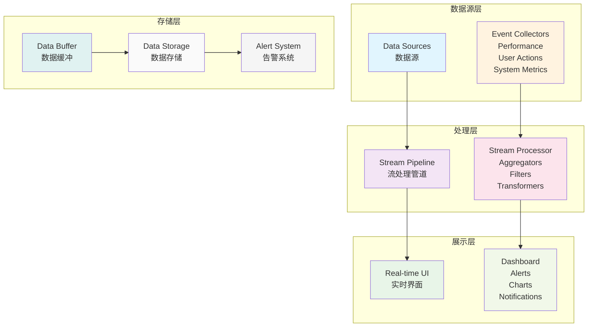

# Flutter 实时监控系统

本文档详细介绍 Flutter 应用的实时数据监控系统，包括实时数据收集、处理、分析和可视化。

## 📊 实时监控架构

### 1. 监控系统架构



### 2. 实时监控管理器

```dart
// lib/analytics/monitoring/real_time_monitor.dart
import 'dart:async';
import 'dart:collection';
import 'dart:math';

class RealTimeMonitor {
  static RealTimeMonitor? _instance;
  final Map<String, StreamController<MonitoringEvent>> _streamControllers = {};
  final Map<String, MetricAggregator> _aggregators = {};
  final Map<String, AlertRule> _alertRules = {};
  final Queue<MonitoringEvent> _eventBuffer = Queue<MonitoringEvent>();
  final StreamController<AlertEvent> _alertController =
      StreamController<AlertEvent>.broadcast();

  Timer? _bufferFlushTimer;
  Timer? _aggregationTimer;
  bool _isInitialized = false;

  RealTimeMonitor._internal();

  factory RealTimeMonitor() {
    return _instance ??= RealTimeMonitor._internal();
  }

  Stream<AlertEvent> get alertStream => _alertController.stream;

  // 初始化监控系统
  Future<void> initialize() async {
    if (_isInitialized) return;

    // 初始化默认指标聚合器
    _initializeDefaultAggregators();

    // 初始化默认告警规则
    _initializeDefaultAlertRules();

    // 启动定时器
    _startTimers();

    _isInitialized = true;
    print('📊 实时监控系统初始化完成');
  }

  // 注册监控流
  Stream<T> registerStream<T extends MonitoringEvent>(String streamId) {
    if (!_streamControllers.containsKey(streamId)) {
      _streamControllers[streamId] = StreamController<MonitoringEvent>.broadcast();
    }

    return _streamControllers[streamId]!.stream.cast<T>();
  }

  // 发送监控事件
  void sendEvent(MonitoringEvent event) {
    // 添加到缓冲区
    _eventBuffer.add(event);

    // 发送到对应的流
    final streamId = event.streamId;
    if (_streamControllers.containsKey(streamId)) {
      _streamControllers[streamId]!.add(event);
    }

    // 更新聚合器
    _updateAggregators(event);

    // 检查告警规则
    _checkAlertRules(event);
  }

  // 注册指标聚合器
  void registerAggregator(String metricId, MetricAggregator aggregator) {
    _aggregators[metricId] = aggregator;
  }

  // 注册告警规则
  void registerAlertRule(String ruleId, AlertRule rule) {
    _alertRules[ruleId] = rule;
  }

  // 获取实时指标
  MetricSnapshot? getMetricSnapshot(String metricId) {
    final aggregator = _aggregators[metricId];
    return aggregator?.getSnapshot();
  }

  // 获取所有指标快照
  Map<String, MetricSnapshot> getAllMetricSnapshots() {
    final snapshots = <String, MetricSnapshot>{};

    for (final entry in _aggregators.entries) {
      final snapshot = entry.value.getSnapshot();
      if (snapshot != null) {
        snapshots[entry.key] = snapshot;
      }
    }

    return snapshots;
  }

  // 创建性能监控器
  PerformanceMonitor createPerformanceMonitor(String name) {
    return PerformanceMonitor(name: name, monitor: this);
  }

  // 创建用户行为监控器
  UserBehaviorMonitor createUserBehaviorMonitor() {
    return UserBehaviorMonitor(monitor: this);
  }

  // 创建系统监控器
  SystemMonitor createSystemMonitor() {
    return SystemMonitor(monitor: this);
  }

  void _initializeDefaultAggregators() {
    // 性能指标聚合器
    registerAggregator('app_launch_time', CounterAggregator());
    registerAggregator('page_load_time', AverageAggregator());
    registerAggregator('memory_usage', GaugeAggregator());
    registerAggregator('cpu_usage', GaugeAggregator());
    registerAggregator('network_requests', CounterAggregator());
    registerAggregator('error_count', CounterAggregator());

    // 用户行为指标聚合器
    registerAggregator('user_sessions', CounterAggregator());
    registerAggregator('page_views', CounterAggregator());
    registerAggregator('button_clicks', CounterAggregator());
    registerAggregator('user_retention', RatioAggregator());

    // 业务指标聚合器
    registerAggregator('conversion_rate', RatioAggregator());
    registerAggregator('revenue', SumAggregator());
    registerAggregator('active_users', UniqueCountAggregator());
  }

  void _initializeDefaultAlertRules() {
    // 性能告警规则
    registerAlertRule('high_memory_usage', AlertRule(
      metricId: 'memory_usage',
      condition: AlertCondition.greaterThan(500 * 1024 * 1024), // 500MB
      severity: AlertSeverity.warning,
      message: '内存使用量过高',
    ));

    registerAlertRule('high_error_rate', AlertRule(
      metricId: 'error_count',
      condition: AlertCondition.greaterThan(10),
      severity: AlertSeverity.critical,
      message: '错误率过高',
      timeWindow: Duration(minutes: 5),
    ));

    registerAlertRule('slow_page_load', AlertRule(
      metricId: 'page_load_time',
      condition: AlertCondition.greaterThan(3000), // 3秒
      severity: AlertSeverity.warning,
      message: '页面加载时间过长',
    ));

    // 业务告警规则
    registerAlertRule('low_conversion_rate', AlertRule(
      metricId: 'conversion_rate',
      condition: AlertCondition.lessThan(0.05), // 5%
      severity: AlertSeverity.warning,
      message: '转化率过低',
      timeWindow: Duration(hours: 1),
    ));
  }

  void _startTimers() {
    // 缓冲区刷新定时器
    _bufferFlushTimer = Timer.periodic(Duration(seconds: 5), (_) {
      _flushEventBuffer();
    });

    // 聚合计算定时器
    _aggregationTimer = Timer.periodic(Duration(seconds: 10), (_) {
      _performAggregation();
    });
  }

  void _updateAggregators(MonitoringEvent event) {
    for (final aggregator in _aggregators.values) {
      aggregator.processEvent(event);
    }
  }

  void _checkAlertRules(MonitoringEvent event) {
    for (final rule in _alertRules.values) {
      if (rule.shouldTrigger(event)) {
        final alertEvent = AlertEvent(
          ruleId: rule.id,
          metricId: rule.metricId,
          severity: rule.severity,
          message: rule.message,
          value: event.value,
          timestamp: DateTime.now(),
        );

        _alertController.add(alertEvent);
      }
    }
  }

  void _flushEventBuffer() {
    if (_eventBuffer.isEmpty) return;

    final events = List<MonitoringEvent>.from(_eventBuffer);
    _eventBuffer.clear();

    // 批量处理事件（例如发送到服务器）
    _processBatchEvents(events);
  }

  void _performAggregation() {
    for (final aggregator in _aggregators.values) {
      aggregator.aggregate();
    }
  }

  Future<void> _processBatchEvents(List<MonitoringEvent> events) async {
    // 这里可以实现批量事件处理逻辑
    // 例如发送到分析服务器、写入数据库等
    print('📦 处理 ${events.length} 个监控事件');
  }

  void dispose() {
    _bufferFlushTimer?.cancel();
    _aggregationTimer?.cancel();

    for (final controller in _streamControllers.values) {
      controller.close();
    }

    _alertController.close();
    _streamControllers.clear();
    _aggregators.clear();
    _alertRules.clear();
    _eventBuffer.clear();

    _isInitialized = false;
  }
}

// 监控事件基类
abstract class MonitoringEvent {
  final String streamId;
  final String eventType;
  final dynamic value;
  final Map<String, dynamic> metadata;
  final DateTime timestamp;

  MonitoringEvent({
    required this.streamId,
    required this.eventType,
    required this.value,
    this.metadata = const {},
    DateTime? timestamp,
  }) : timestamp = timestamp ?? DateTime.now();

  Map<String, dynamic> toJson() {
    return {
      'stream_id': streamId,
      'event_type': eventType,
      'value': value,
      'metadata': metadata,
      'timestamp': timestamp.toIso8601String(),
    };
  }
}

// 性能事件
class PerformanceEvent extends MonitoringEvent {
  PerformanceEvent({
    required String metricName,
    required dynamic value,
    Map<String, dynamic> metadata = const {},
  }) : super(
    streamId: 'performance',
    eventType: metricName,
    value: value,
    metadata: metadata,
  );
}

// 用户行为事件
class UserBehaviorEvent extends MonitoringEvent {
  UserBehaviorEvent({
    required String action,
    required String userId,
    Map<String, dynamic> metadata = const {},
  }) : super(
    streamId: 'user_behavior',
    eventType: action,
    value: userId,
    metadata: metadata,
  );
}

// 系统事件
class SystemEvent extends MonitoringEvent {
  SystemEvent({
    required String metricName,
    required dynamic value,
    Map<String, dynamic> metadata = const {},
  }) : super(
    streamId: 'system',
    eventType: metricName,
    value: value,
    metadata: metadata,
  );
}

// 业务事件
class BusinessEvent extends MonitoringEvent {
  BusinessEvent({
    required String eventName,
    required dynamic value,
    Map<String, dynamic> metadata = const {},
  }) : super(
    streamId: 'business',
    eventType: eventName,
    value: value,
    metadata: metadata,
  );
}

// 指标聚合器基类
abstract class MetricAggregator {
  final String id;
  final Duration timeWindow;
  final Queue<MonitoringEvent> _events = Queue<MonitoringEvent>();

  MetricAggregator({
    required this.id,
    this.timeWindow = const Duration(minutes: 5),
  });

  void processEvent(MonitoringEvent event);
  void aggregate();
  MetricSnapshot? getSnapshot();

  void _cleanOldEvents() {
    final cutoff = DateTime.now().subtract(timeWindow);
    _events.removeWhere((event) => event.timestamp.isBefore(cutoff));
  }
}

// 计数器聚合器
class CounterAggregator extends MetricAggregator {
  int _count = 0;

  CounterAggregator({String? id}) : super(id: id ?? 'counter');

  @override
  void processEvent(MonitoringEvent event) {
    _events.add(event);
    _count++;
  }

  @override
  void aggregate() {
    _cleanOldEvents();
    _count = _events.length;
  }

  @override
  MetricSnapshot getSnapshot() {
    return MetricSnapshot(
      metricId: id,
      value: _count,
      timestamp: DateTime.now(),
      type: MetricType.counter,
    );
  }
}

// 平均值聚合器
class AverageAggregator extends MetricAggregator {
  double _average = 0.0;

  AverageAggregator({String? id}) : super(id: id ?? 'average');

  @override
  void processEvent(MonitoringEvent event) {
    if (event.value is num) {
      _events.add(event);
    }
  }

  @override
  void aggregate() {
    _cleanOldEvents();

    if (_events.isEmpty) {
      _average = 0.0;
      return;
    }

    final sum = _events
        .map((e) => (e.value as num).toDouble())
        .reduce((a, b) => a + b);

    _average = sum / _events.length;
  }

  @override
  MetricSnapshot getSnapshot() {
    return MetricSnapshot(
      metricId: id,
      value: _average,
      timestamp: DateTime.now(),
      type: MetricType.gauge,
    );
  }
}

// 仪表盘聚合器
class GaugeAggregator extends MetricAggregator {
  dynamic _lastValue;

  GaugeAggregator({String? id}) : super(id: id ?? 'gauge');

  @override
  void processEvent(MonitoringEvent event) {
    _lastValue = event.value;
    _events.add(event);
  }

  @override
  void aggregate() {
    _cleanOldEvents();

    if (_events.isNotEmpty) {
      _lastValue = _events.last.value;
    }
  }

  @override
  MetricSnapshot getSnapshot() {
    return MetricSnapshot(
      metricId: id,
      value: _lastValue,
      timestamp: DateTime.now(),
      type: MetricType.gauge,
    );
  }
}

// 求和聚合器
class SumAggregator extends MetricAggregator {
  double _sum = 0.0;

  SumAggregator({String? id}) : super(id: id ?? 'sum');

  @override
  void processEvent(MonitoringEvent event) {
    if (event.value is num) {
      _events.add(event);
    }
  }

  @override
  void aggregate() {
    _cleanOldEvents();

    _sum = _events
        .map((e) => (e.value as num).toDouble())
        .fold(0.0, (a, b) => a + b);
  }

  @override
  MetricSnapshot getSnapshot() {
    return MetricSnapshot(
      metricId: id,
      value: _sum,
      timestamp: DateTime.now(),
      type: MetricType.counter,
    );
  }
}

// 比率聚合器
class RatioAggregator extends MetricAggregator {
  double _ratio = 0.0;
  int _numerator = 0;
  int _denominator = 0;

  RatioAggregator({String? id}) : super(id: id ?? 'ratio');

  @override
  void processEvent(MonitoringEvent event) {
    if (event.metadata.containsKey('numerator') &&
        event.metadata.containsKey('denominator')) {
      _events.add(event);
    }
  }

  @override
  void aggregate() {
    _cleanOldEvents();

    _numerator = 0;
    _denominator = 0;

    for (final event in _events) {
      _numerator += (event.metadata['numerator'] as num).toInt();
      _denominator += (event.metadata['denominator'] as num).toInt();
    }

    _ratio = _denominator > 0 ? _numerator / _denominator : 0.0;
  }

  @override
  MetricSnapshot getSnapshot() {
    return MetricSnapshot(
      metricId: id,
      value: _ratio,
      timestamp: DateTime.now(),
      type: MetricType.gauge,
      metadata: {
        'numerator': _numerator,
        'denominator': _denominator,
      },
    );
  }
}

// 唯一计数聚合器
class UniqueCountAggregator extends MetricAggregator {
  final Set<String> _uniqueValues = <String>{};

  UniqueCountAggregator({String? id}) : super(id: id ?? 'unique_count');

  @override
  void processEvent(MonitoringEvent event) {
    _events.add(event);
    _uniqueValues.add(event.value.toString());
  }

  @override
  void aggregate() {
    _cleanOldEvents();

    _uniqueValues.clear();
    for (final event in _events) {
      _uniqueValues.add(event.value.toString());
    }
  }

  @override
  MetricSnapshot getSnapshot() {
    return MetricSnapshot(
      metricId: id,
      value: _uniqueValues.length,
      timestamp: DateTime.now(),
      type: MetricType.counter,
    );
  }
}

// 指标快照
class MetricSnapshot {
  final String metricId;
  final dynamic value;
  final DateTime timestamp;
  final MetricType type;
  final Map<String, dynamic> metadata;

  MetricSnapshot({
    required this.metricId,
    required this.value,
    required this.timestamp,
    required this.type,
    this.metadata = const {},
  });

  Map<String, dynamic> toJson() {
    return {
      'metric_id': metricId,
      'value': value,
      'timestamp': timestamp.toIso8601String(),
      'type': type.name,
      'metadata': metadata,
    };
  }
}

enum MetricType {
  counter,
  gauge,
  histogram,
  summary,
}

// 告警规则
class AlertRule {
  final String id;
  final String metricId;
  final AlertCondition condition;
  final AlertSeverity severity;
  final String message;
  final Duration timeWindow;
  final Duration cooldown;
  DateTime? _lastTriggered;

  AlertRule({
    String? id,
    required this.metricId,
    required this.condition,
    required this.severity,
    required this.message,
    this.timeWindow = const Duration(minutes: 5),
    this.cooldown = const Duration(minutes: 10),
  }) : id = id ?? '${metricId}_alert';

  bool shouldTrigger(MonitoringEvent event) {
    // 检查冷却期
    if (_lastTriggered != null) {
      final timeSinceLastTrigger = DateTime.now().difference(_lastTriggered!);
      if (timeSinceLastTrigger < cooldown) {
        return false;
      }
    }

    // 检查条件
    if (condition.evaluate(event.value)) {
      _lastTriggered = DateTime.now();
      return true;
    }

    return false;
  }
}

// 告警条件
class AlertCondition {
  final AlertOperator operator;
  final dynamic threshold;

  AlertCondition._(this.operator, this.threshold);

  factory AlertCondition.greaterThan(dynamic value) {
    return AlertCondition._(AlertOperator.greaterThan, value);
  }

  factory AlertCondition.lessThan(dynamic value) {
    return AlertCondition._(AlertOperator.lessThan, value);
  }

  factory AlertCondition.equals(dynamic value) {
    return AlertCondition._(AlertOperator.equals, value);
  }

  factory AlertCondition.notEquals(dynamic value) {
    return AlertCondition._(AlertOperator.notEquals, value);
  }

  bool evaluate(dynamic value) {
    if (value == null || threshold == null) return false;

    switch (operator) {
      case AlertOperator.greaterThan:
        return (value as num) > (threshold as num);
      case AlertOperator.lessThan:
        return (value as num) < (threshold as num);
      case AlertOperator.equals:
        return value == threshold;
      case AlertOperator.notEquals:
        return value != threshold;
    }
  }
}

enum AlertOperator {
  greaterThan,
  lessThan,
  equals,
  notEquals,
}

enum AlertSeverity {
  info,
  warning,
  critical,
}

// 告警事件
class AlertEvent {
  final String ruleId;
  final String metricId;
  final AlertSeverity severity;
  final String message;
  final dynamic value;
  final DateTime timestamp;

  AlertEvent({
    required this.ruleId,
    required this.metricId,
    required this.severity,
    required this.message,
    required this.value,
    required this.timestamp,
  });

  Map<String, dynamic> toJson() {
    return {
      'rule_id': ruleId,
      'metric_id': metricId,
      'severity': severity.name,
      'message': message,
      'value': value,
      'timestamp': timestamp.toIso8601String(),
    };
  }
}
```

### 3. 性能监控器

```dart
// lib/analytics/monitoring/performance_monitor.dart
class PerformanceMonitor {
  final String name;
  final RealTimeMonitor monitor;
  final Map<String, Stopwatch> _stopwatches = {};
  final Map<String, PerformanceMetric> _metrics = {};

  PerformanceMonitor({
    required this.name,
    required this.monitor,
  });

  // 开始性能测量
  void startMeasurement(String operationName) {
    final stopwatch = Stopwatch()..start();
    _stopwatches[operationName] = stopwatch;
  }

  // 结束性能测量
  void endMeasurement(String operationName, {Map<String, dynamic>? metadata}) {
    final stopwatch = _stopwatches.remove(operationName);
    if (stopwatch == null) return;

    stopwatch.stop();
    final duration = stopwatch.elapsedMilliseconds;

    // 发送性能事件
    monitor.sendEvent(PerformanceEvent(
      metricName: operationName,
      value: duration,
      metadata: {
        'operation': operationName,
        'monitor': name,
        ...?metadata,
      },
    ));

    // 更新性能指标
    _updateMetric(operationName, duration);
  }

  // 测量代码块执行时间
  T measureSync<T>(String operationName, T Function() operation, {Map<String, dynamic>? metadata}) {
    startMeasurement(operationName);
    try {
      final result = operation();
      endMeasurement(operationName, metadata: metadata);
      return result;
    } catch (e) {
      endMeasurement(operationName, metadata: {
        'error': e.toString(),
        ...?metadata,
      });
      rethrow;
    }
  }

  // 测量异步操作执行时间
  Future<T> measureAsync<T>(String operationName, Future<T> Function() operation, {Map<String, dynamic>? metadata}) async {
    startMeasurement(operationName);
    try {
      final result = await operation();
      endMeasurement(operationName, metadata: metadata);
      return result;
    } catch (e) {
      endMeasurement(operationName, metadata: {
        'error': e.toString(),
        ...?metadata,
      });
      rethrow;
    }
  }

  // 记录内存使用情况
  void recordMemoryUsage() {
    // 这里应该实现实际的内存使用情况获取
    final memoryUsage = _getCurrentMemoryUsage();

    monitor.sendEvent(PerformanceEvent(
      metricName: 'memory_usage',
      value: memoryUsage,
      metadata: {
        'monitor': name,
        'unit': 'bytes',
      },
    ));
  }

  // 记录CPU使用情况
  void recordCpuUsage() {
    final cpuUsage = _getCurrentCpuUsage();

    monitor.sendEvent(PerformanceEvent(
      metricName: 'cpu_usage',
      value: cpuUsage,
      metadata: {
        'monitor': name,
        'unit': 'percentage',
      },
    ));
  }

  // 记录帧率
  void recordFrameRate(double fps) {
    monitor.sendEvent(PerformanceEvent(
      metricName: 'frame_rate',
      value: fps,
      metadata: {
        'monitor': name,
        'unit': 'fps',
      },
    ));
  }

  // 记录网络请求性能
  void recordNetworkRequest({
    required String url,
    required int statusCode,
    required int responseTime,
    required int responseSize,
  }) {
    monitor.sendEvent(PerformanceEvent(
      metricName: 'network_request',
      value: responseTime,
      metadata: {
        'url': url,
        'status_code': statusCode,
        'response_size': responseSize,
        'monitor': name,
      },
    ));
  }

  // 获取性能指标
  PerformanceMetric? getMetric(String operationName) {
    return _metrics[operationName];
  }

  // 获取所有性能指标
  Map<String, PerformanceMetric> getAllMetrics() {
    return Map.from(_metrics);
  }

  void _updateMetric(String operationName, int duration) {
    final metric = _metrics[operationName] ?? PerformanceMetric(operationName);
    metric.addMeasurement(duration);
    _metrics[operationName] = metric;
  }

  int _getCurrentMemoryUsage() {
    // 这里应该实现实际的内存使用情况获取逻辑
    // 可以使用 dart:developer 的 Service 类或其他方法
    return Random().nextInt(100 * 1024 * 1024); // 模拟数据
  }

  double _getCurrentCpuUsage() {
    // 这里应该实现实际的CPU使用情况获取逻辑
    return Random().nextDouble() * 100; // 模拟数据
  }
}

// 性能指标
class PerformanceMetric {
  final String name;
  final List<int> _measurements = [];
  int _totalMeasurements = 0;
  int _totalDuration = 0;
  int? _minDuration;
  int? _maxDuration;

  PerformanceMetric(this.name);

  void addMeasurement(int duration) {
    _measurements.add(duration);
    _totalMeasurements++;
    _totalDuration += duration;

    _minDuration = _minDuration == null ? duration : math.min(_minDuration!, duration);
    _maxDuration = _maxDuration == null ? duration : math.max(_maxDuration!, duration);

    // 保持最近的100个测量值
    if (_measurements.length > 100) {
      _measurements.removeAt(0);
    }
  }

  double get averageDuration => _totalMeasurements > 0 ? _totalDuration / _totalMeasurements : 0.0;
  int get minDuration => _minDuration ?? 0;
  int get maxDuration => _maxDuration ?? 0;
  int get totalMeasurements => _totalMeasurements;

  double get p95Duration {
    if (_measurements.isEmpty) return 0.0;

    final sorted = List<int>.from(_measurements)..sort();
    final index = (sorted.length * 0.95).ceil() - 1;
    return sorted[index.clamp(0, sorted.length - 1)].toDouble();
  }

  double get p99Duration {
    if (_measurements.isEmpty) return 0.0;

    final sorted = List<int>.from(_measurements)..sort();
    final index = (sorted.length * 0.99).ceil() - 1;
    return sorted[index.clamp(0, sorted.length - 1)].toDouble();
  }

  Map<String, dynamic> toJson() {
    return {
      'name': name,
      'total_measurements': totalMeasurements,
      'average_duration': averageDuration,
      'min_duration': minDuration,
      'max_duration': maxDuration,
      'p95_duration': p95Duration,
      'p99_duration': p99Duration,
    };
  }
}
```

### 4. 用户行为监控器

```dart
// lib/analytics/monitoring/user_behavior_monitor.dart
class UserBehaviorMonitor {
  final RealTimeMonitor monitor;
  final Map<String, UserSession> _activeSessions = {};
  final Map<String, UserJourney> _userJourneys = {};

  UserBehaviorMonitor({required this.monitor});

  // 开始用户会话
  void startSession(String userId, {Map<String, dynamic>? metadata}) {
    final session = UserSession(
      userId: userId,
      startTime: DateTime.now(),
      metadata: metadata ?? {},
    );

    _activeSessions[userId] = session;

    monitor.sendEvent(UserBehaviorEvent(
      action: 'session_start',
      userId: userId,
      metadata: {
        'session_id': session.sessionId,
        ...session.metadata,
      },
    ));
  }

  // 结束用户会话
  void endSession(String userId) {
    final session = _activeSessions.remove(userId);
    if (session == null) return;

    session.endTime = DateTime.now();

    monitor.sendEvent(UserBehaviorEvent(
      action: 'session_end',
      userId: userId,
      metadata: {
        'session_id': session.sessionId,
        'duration': session.duration?.inMilliseconds,
        'page_views': session.pageViews.length,
        'actions': session.actions.length,
      },
    ));
  }

  // 记录页面访问
  void recordPageView(String userId, String pageName, {Map<String, dynamic>? metadata}) {
    final session = _activeSessions[userId];
    if (session != null) {
      session.addPageView(pageName, metadata: metadata);
    }

    monitor.sendEvent(UserBehaviorEvent(
      action: 'page_view',
      userId: userId,
      metadata: {
        'page_name': pageName,
        'session_id': session?.sessionId,
        ...?metadata,
      },
    ));

    // 更新用户旅程
    _updateUserJourney(userId, 'page_view', pageName, metadata);
  }

  // 记录用户操作
  void recordAction(String userId, String action, {Map<String, dynamic>? metadata}) {
    final session = _activeSessions[userId];
    if (session != null) {
      session.addAction(action, metadata: metadata);
    }

    monitor.sendEvent(UserBehaviorEvent(
      action: action,
      userId: userId,
      metadata: {
        'session_id': session?.sessionId,
        ...?metadata,
      },
    ));

    // 更新用户旅程
    _updateUserJourney(userId, 'action', action, metadata);
  }

  // 记录转化事件
  void recordConversion(String userId, String conversionType, {dynamic value, Map<String, dynamic>? metadata}) {
    monitor.sendEvent(UserBehaviorEvent(
      action: 'conversion',
      userId: userId,
      metadata: {
        'conversion_type': conversionType,
        'value': value,
        'session_id': _activeSessions[userId]?.sessionId,
        ...?metadata,
      },
    ));

    // 发送业务事件
    monitor.sendEvent(BusinessEvent(
      eventName: 'conversion',
      value: value ?? 1,
      metadata: {
        'user_id': userId,
        'conversion_type': conversionType,
        ...?metadata,
      },
    ));
  }

  // 记录错误
  void recordError(String userId, String error, {String? stackTrace, Map<String, dynamic>? metadata}) {
    monitor.sendEvent(UserBehaviorEvent(
      action: 'error',
      userId: userId,
      metadata: {
        'error': error,
        'stack_trace': stackTrace,
        'session_id': _activeSessions[userId]?.sessionId,
        ...?metadata,
      },
    ));
  }

  // 获取用户会话
  UserSession? getUserSession(String userId) {
    return _activeSessions[userId];
  }

  // 获取用户旅程
  UserJourney? getUserJourney(String userId) {
    return _userJourneys[userId];
  }

  // 获取活跃用户数
  int getActiveUserCount() {
    return _activeSessions.length;
  }

  void _updateUserJourney(String userId, String eventType, String eventName, Map<String, dynamic>? metadata) {
    final journey = _userJourneys[userId] ?? UserJourney(userId: userId);

    journey.addEvent(JourneyEvent(
      eventType: eventType,
      eventName: eventName,
      timestamp: DateTime.now(),
      metadata: metadata ?? {},
    ));

    _userJourneys[userId] = journey;
  }
}

// 用户会话
class UserSession {
  final String sessionId;
  final String userId;
  final DateTime startTime;
  final Map<String, dynamic> metadata;
  DateTime? endTime;
  final List<PageView> pageViews = [];
  final List<UserAction> actions = [];

  UserSession({
    String? sessionId,
    required this.userId,
    required this.startTime,
    this.metadata = const {},
  }) : sessionId = sessionId ?? _generateSessionId();

  Duration? get duration {
    final end = endTime ?? DateTime.now();
    return end.difference(startTime);
  }

  void addPageView(String pageName, {Map<String, dynamic>? metadata}) {
    pageViews.add(PageView(
      pageName: pageName,
      timestamp: DateTime.now(),
      metadata: metadata ?? {},
    ));
  }

  void addAction(String action, {Map<String, dynamic>? metadata}) {
    actions.add(UserAction(
      action: action,
      timestamp: DateTime.now(),
      metadata: metadata ?? {},
    ));
  }

  static String _generateSessionId() {
    return 'session_${DateTime.now().millisecondsSinceEpoch}_${Random().nextInt(10000)}';
  }

  Map<String, dynamic> toJson() {
    return {
      'session_id': sessionId,
      'user_id': userId,
      'start_time': startTime.toIso8601String(),
      'end_time': endTime?.toIso8601String(),
      'duration': duration?.inMilliseconds,
      'page_views': pageViews.map((pv) => pv.toJson()).toList(),
      'actions': actions.map((a) => a.toJson()).toList(),
      'metadata': metadata,
    };
  }
}

// 页面访问
class PageView {
  final String pageName;
  final DateTime timestamp;
  final Map<String, dynamic> metadata;

  PageView({
    required this.pageName,
    required this.timestamp,
    this.metadata = const {},
  });

  Map<String, dynamic> toJson() {
    return {
      'page_name': pageName,
      'timestamp': timestamp.toIso8601String(),
      'metadata': metadata,
    };
  }
}

// 用户操作
class UserAction {
  final String action;
  final DateTime timestamp;
  final Map<String, dynamic> metadata;

  UserAction({
    required this.action,
    required this.timestamp,
    this.metadata = const {},
  });

  Map<String, dynamic> toJson() {
    return {
      'action': action,
      'timestamp': timestamp.toIso8601String(),
      'metadata': metadata,
    };
  }
}

// 用户旅程
class UserJourney {
  final String userId;
  final List<JourneyEvent> events = [];
  final DateTime startTime;

  UserJourney({
    required this.userId,
    DateTime? startTime,
  }) : startTime = startTime ?? DateTime.now();

  void addEvent(JourneyEvent event) {
    events.add(event);

    // 保持最近的100个事件
    if (events.length > 100) {
      events.removeAt(0);
    }
  }

  List<JourneyEvent> getEventsByType(String eventType) {
    return events.where((event) => event.eventType == eventType).toList();
  }

  Duration get totalDuration {
    if (events.isEmpty) return Duration.zero;
    return events.last.timestamp.difference(startTime);
  }

  Map<String, dynamic> toJson() {
    return {
      'user_id': userId,
      'start_time': startTime.toIso8601String(),
      'total_duration': totalDuration.inMilliseconds,
      'events': events.map((e) => e.toJson()).toList(),
    };
  }
}

// 旅程事件
class JourneyEvent {
  final String eventType;
  final String eventName;
  final DateTime timestamp;
  final Map<String, dynamic> metadata;

  JourneyEvent({
    required this.eventType,
    required this.eventName,
    required this.timestamp,
    this.metadata = const {},
  });

  Map<String, dynamic> toJson() {
    return {
      'event_type': eventType,
      'event_name': eventName,
      'timestamp': timestamp.toIso8601String(),
      'metadata': metadata,
    };
  }
}
```

### 5. 系统监控器

```dart
// lib/analytics/monitoring/system_monitor.dart
class SystemMonitor {
  final RealTimeMonitor monitor;
  Timer? _monitoringTimer;
  bool _isMonitoring = false;

  SystemMonitor({required this.monitor});

  // 开始系统监控
  void startMonitoring({Duration interval = const Duration(seconds: 30)}) {
    if (_isMonitoring) return;

    _isMonitoring = true;
    _monitoringTimer = Timer.periodic(interval, (_) {
      _collectSystemMetrics();
    });

    print('🖥️ 系统监控已启动');
  }

  // 停止系统监控
  void stopMonitoring() {
    _monitoringTimer?.cancel();
    _monitoringTimer = null;
    _isMonitoring = false;

    print('🖥️ 系统监控已停止');
  }

  // 收集系统指标
  void _collectSystemMetrics() {
    _collectMemoryMetrics();
    _collectCpuMetrics();
    _collectNetworkMetrics();
    _collectStorageMetrics();
    _collectBatteryMetrics();
  }

  void _collectMemoryMetrics() {
    final memoryInfo = _getMemoryInfo();

    monitor.sendEvent(SystemEvent(
      metricName: 'memory_usage',
      value: memoryInfo['used'],
      metadata: {
        'total': memoryInfo['total'],
        'free': memoryInfo['free'],
        'usage_percentage': memoryInfo['usage_percentage'],
      },
    ));
  }

  void _collectCpuMetrics() {
    final cpuInfo = _getCpuInfo();

    monitor.sendEvent(SystemEvent(
      metricName: 'cpu_usage',
      value: cpuInfo['usage_percentage'],
      metadata: {
        'cores': cpuInfo['cores'],
        'frequency': cpuInfo['frequency'],
      },
    ));
  }

  void _collectNetworkMetrics() {
    final networkInfo = _getNetworkInfo();

    monitor.sendEvent(SystemEvent(
      metricName: 'network_usage',
      value: networkInfo['total_bytes'],
      metadata: {
        'bytes_sent': networkInfo['bytes_sent'],
        'bytes_received': networkInfo['bytes_received'],
        'connection_type': networkInfo['connection_type'],
        'signal_strength': networkInfo['signal_strength'],
      },
    ));
  }

  void _collectStorageMetrics() {
    final storageInfo = _getStorageInfo();

    monitor.sendEvent(SystemEvent(
      metricName: 'storage_usage',
      value: storageInfo['used'],
      metadata: {
        'total': storageInfo['total'],
        'free': storageInfo['free'],
        'usage_percentage': storageInfo['usage_percentage'],
      },
    ));
  }

  void _collectBatteryMetrics() {
    final batteryInfo = _getBatteryInfo();

    monitor.sendEvent(SystemEvent(
      metricName: 'battery_level',
      value: batteryInfo['level'],
      metadata: {
        'is_charging': batteryInfo['is_charging'],
        'battery_state': batteryInfo['battery_state'],
      },
    ));
  }

  // 模拟系统信息获取方法
  Map<String, dynamic> _getMemoryInfo() {
    // 这里应该实现实际的内存信息获取
    final total = 8 * 1024 * 1024 * 1024; // 8GB
    final used = Random().nextInt(total);
    final free = total - used;

    return {
      'total': total,
      'used': used,
      'free': free,
      'usage_percentage': (used / total * 100).round(),
    };
  }

  Map<String, dynamic> _getCpuInfo() {
    return {
      'usage_percentage': Random().nextDouble() * 100,
      'cores': 8,
      'frequency': 2400, // MHz
    };
  }

  Map<String, dynamic> _getNetworkInfo() {
    final bytesSent = Random().nextInt(1024 * 1024);
    final bytesReceived = Random().nextInt(1024 * 1024);

    return {
      'bytes_sent': bytesSent,
      'bytes_received': bytesReceived,
      'total_bytes': bytesSent + bytesReceived,
      'connection_type': 'wifi',
      'signal_strength': Random().nextInt(100),
    };
  }

  Map<String, dynamic> _getStorageInfo() {
    final total = 256 * 1024 * 1024 * 1024; // 256GB
    final used = Random().nextInt(total);
    final free = total - used;

    return {
      'total': total,
      'used': used,
      'free': free,
      'usage_percentage': (used / total * 100).round(),
    };
  }

  Map<String, dynamic> _getBatteryInfo() {
    return {
      'level': Random().nextInt(100),
      'is_charging': Random().nextBool(),
      'battery_state': ['charging', 'discharging', 'full'][Random().nextInt(3)],
    };
  }

  bool get isMonitoring => _isMonitoring;

  void dispose() {
    stopMonitoring();
  }
}
```

## 🚀 最佳实践

### 1. 性能优化

- **批量处理** - 批量发送监控事件减少开销
- **异步处理** - 使用异步方式处理监控数据
- **内存管理** - 限制缓存大小避免内存泄漏
- **采样策略** - 对高频事件进行采样

### 2. 数据质量

- **数据验证** - 验证监控数据的完整性和准确性
- **异常处理** - 处理监控过程中的异常情况
- **数据清洗** - 过滤无效或异常的监控数据
- **一致性检查** - 确保数据的一致性

### 3. 告警策略

- **分级告警** - 根据严重程度分级处理告警
- **告警聚合** - 避免告警风暴影响系统
- **智能告警** - 使用机器学习优化告警准确性
- **告警恢复** - 及时通知告警恢复状态

### 4. 可视化设计

- **实时更新** - 确保图表数据实时更新
- **交互性** - 提供丰富的交互功能
- **响应式设计** - 适配不同屏幕尺寸
- **性能优化** - 优化图表渲染性能

通过完善的实时监控系统，可以及时发现和解决应用问题，提升用户体验和系统稳定性。
