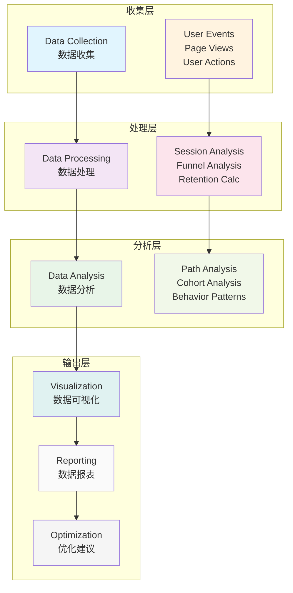

# Flutter 用户行为分析

本文档详细介绍 Flutter 应用中用户行为分析的实现方案，包括用户路径分析、行为漏斗、留存分析等核心功能。

## 🎯 用户行为分析架构

### 1. 分析框架设计



### 2. 用户行为分析器

```dart
// lib/analytics/user_behavior_analyzer.dart
import 'dart:async';
import 'dart:math';

class UserBehaviorAnalyzer {
  static UserBehaviorAnalyzer? _instance;
  final Map<String, UserSession> _activeSessions = {};
  final List<UserEvent> _eventHistory = [];
  final StreamController<BehaviorInsight> _insightController =
      StreamController<BehaviorInsight>.broadcast();

  UserBehaviorAnalyzer._internal();

  factory UserBehaviorAnalyzer() {
    return _instance ??= UserBehaviorAnalyzer._internal();
  }

  Stream<BehaviorInsight> get insightStream => _insightController.stream;

  // 记录用户事件
  void recordUserEvent(UserEvent event) {
    _eventHistory.add(event);

    // 更新用户会话
    _updateUserSession(event);

    // 实时分析
    _performRealTimeAnalysis(event);

    // 限制历史记录大小
    if (_eventHistory.length > 10000) {
      _eventHistory.removeRange(0, 1000);
    }
  }

  void _updateUserSession(UserEvent event) {
    final sessionId = event.sessionId;

    if (!_activeSessions.containsKey(sessionId)) {
      _activeSessions[sessionId] = UserSession(
        sessionId: sessionId,
        userId: event.userId,
        startTime: event.timestamp,
        events: [],
      );
    }

    _activeSessions[sessionId]!.events.add(event);
    _activeSessions[sessionId]!.lastActivityTime = event.timestamp;
  }

  void _performRealTimeAnalysis(UserEvent event) {
    // 检测异常行为
    _detectAnomalies(event);

    // 检测关键行为
    _detectKeyBehaviors(event);

    // 检测用户流失风险
    _detectChurnRisk(event);
  }

  void _detectAnomalies(UserEvent event) {
    final session = _activeSessions[event.sessionId];
    if (session == null) return;

    // 检测快速连续点击
    final recentEvents = session.events
        .where((e) => event.timestamp.difference(e.timestamp).inSeconds < 5)
        .toList();

    if (recentEvents.length > 10) {
      _emitInsight(BehaviorInsight(
        type: InsightType.anomaly,
        title: '检测到异常快速操作',
        description: '用户在5秒内执行了${recentEvents.length}次操作',
        userId: event.userId,
        sessionId: event.sessionId,
        timestamp: event.timestamp,
        severity: InsightSeverity.warning,
      ));
    }
  }

  void _detectKeyBehaviors(UserEvent event) {
    // 检测首次购买
    if (event.eventName == 'purchase' && _isFirstPurchase(event.userId)) {
      _emitInsight(BehaviorInsight(
        type: InsightType.milestone,
        title: '用户首次购买',
        description: '用户完成了首次购买行为',
        userId: event.userId,
        sessionId: event.sessionId,
        timestamp: event.timestamp,
        severity: InsightSeverity.info,
      ));
    }

    // 检测深度使用
    final session = _activeSessions[event.sessionId];
    if (session != null && session.duration.inMinutes > 30) {
      _emitInsight(BehaviorInsight(
        type: InsightType.engagement,
        title: '用户深度使用',
        description: '用户会话时长超过30分钟',
        userId: event.userId,
        sessionId: event.sessionId,
        timestamp: event.timestamp,
        severity: InsightSeverity.info,
      ));
    }
  }

  void _detectChurnRisk(UserEvent event) {
    final userEvents = _getUserEvents(event.userId, days: 7);

    if (userEvents.length < 5) {
      _emitInsight(BehaviorInsight(
        type: InsightType.churnRisk,
        title: '用户活跃度下降',
        description: '用户近7天活跃度较低，存在流失风险',
        userId: event.userId,
        sessionId: event.sessionId,
        timestamp: event.timestamp,
        severity: InsightSeverity.warning,
      ));
    }
  }

  bool _isFirstPurchase(String userId) {
    return _eventHistory
        .where((e) => e.userId == userId && e.eventName == 'purchase')
        .length == 1;
  }

  List<UserEvent> _getUserEvents(String userId, {int days = 30}) {
    final cutoffTime = DateTime.now().subtract(Duration(days: days));

    return _eventHistory
        .where((e) => e.userId == userId && e.timestamp.isAfter(cutoffTime))
        .toList();
  }

  void _emitInsight(BehaviorInsight insight) {
    _insightController.add(insight);
    print('💡 行为洞察: ${insight.title}');
  }

  // 用户路径分析
  Future<UserPathAnalysis> analyzeUserPath(
    String userId, {
    DateTime? startTime,
    DateTime? endTime,
  }) async {
    final events = _getUserEventsInRange(userId, startTime, endTime);

    if (events.isEmpty) {
      return UserPathAnalysis.empty(userId);
    }

    // 构建路径序列
    final pathSequence = events
        .where((e) => e.eventName == 'page_view')
        .map((e) => e.properties['page_name'] as String? ?? 'unknown')
        .toList();

    // 分析路径模式
    final pathPatterns = _analyzePathPatterns(pathSequence);

    // 计算路径指标
    final metrics = _calculatePathMetrics(events);

    return UserPathAnalysis(
      userId: userId,
      pathSequence: pathSequence,
      pathPatterns: pathPatterns,
      metrics: metrics,
      totalEvents: events.length,
      sessionCount: _getSessionCount(events),
      timeRange: DateTimeRange(
        start: events.first.timestamp,
        end: events.last.timestamp,
      ),
    );
  }

  List<UserEvent> _getUserEventsInRange(
    String userId,
    DateTime? startTime,
    DateTime? endTime,
  ) {
    return _eventHistory.where((e) {
      if (e.userId != userId) return false;

      if (startTime != null && e.timestamp.isBefore(startTime)) {
        return false;
      }

      if (endTime != null && e.timestamp.isAfter(endTime)) {
        return false;
      }

      return true;
    }).toList();
  }

  List<PathPattern> _analyzePathPatterns(List<String> pathSequence) {
    final patterns = <String, int>{};

    // 分析2步路径模式
    for (int i = 0; i < pathSequence.length - 1; i++) {
      final pattern = '${pathSequence[i]} -> ${pathSequence[i + 1]}';
      patterns[pattern] = (patterns[pattern] ?? 0) + 1;
    }

    // 分析3步路径模式
    for (int i = 0; i < pathSequence.length - 2; i++) {
      final pattern = '${pathSequence[i]} -> ${pathSequence[i + 1]} -> ${pathSequence[i + 2]}';
      patterns[pattern] = (patterns[pattern] ?? 0) + 1;
    }

    return patterns.entries
        .map((e) => PathPattern(pattern: e.key, frequency: e.value))
        .toList()
      ..sort((a, b) => b.frequency.compareTo(a.frequency));
  }

  PathMetrics _calculatePathMetrics(List<UserEvent> events) {
    final pageViews = events.where((e) => e.eventName == 'page_view').toList();
    final actions = events.where((e) => e.eventName == 'user_action').toList();

    final uniquePages = pageViews
        .map((e) => e.properties['page_name'] as String? ?? 'unknown')
        .toSet()
        .length;

    final avgSessionDuration = _calculateAverageSessionDuration(events);
    final bounceRate = _calculateBounceRate(events);

    return PathMetrics(
      uniquePages: uniquePages,
      totalPageViews: pageViews.length,
      totalActions: actions.length,
      averageSessionDuration: avgSessionDuration,
      bounceRate: bounceRate,
    );
  }

  Duration _calculateAverageSessionDuration(List<UserEvent> events) {
    final sessions = <String, List<UserEvent>>{};

    for (final event in events) {
      sessions.putIfAbsent(event.sessionId, () => []).add(event);
    }

    if (sessions.isEmpty) return Duration.zero;

    final totalDuration = sessions.values.fold<Duration>(
      Duration.zero,
      (total, sessionEvents) {
        if (sessionEvents.length < 2) return total;

        sessionEvents.sort((a, b) => a.timestamp.compareTo(b.timestamp));
        final duration = sessionEvents.last.timestamp
            .difference(sessionEvents.first.timestamp);

        return total + duration;
      },
    );

    return Duration(
      milliseconds: totalDuration.inMilliseconds ~/ sessions.length,
    );
  }

  double _calculateBounceRate(List<UserEvent> events) {
    final sessions = <String, List<UserEvent>>{};

    for (final event in events) {
      sessions.putIfAbsent(event.sessionId, () => []).add(event);
    }

    if (sessions.isEmpty) return 0.0;

    final bouncedSessions = sessions.values
        .where((sessionEvents) => sessionEvents.length == 1)
        .length;

    return bouncedSessions / sessions.length;
  }

  int _getSessionCount(List<UserEvent> events) {
    return events.map((e) => e.sessionId).toSet().length;
  }

  // 漏斗分析
  Future<FunnelAnalysis> analyzeFunnel(
    List<FunnelStep> steps, {
    DateTime? startTime,
    DateTime? endTime,
  }) async {
    final events = _getEventsInRange(startTime, endTime);
    final userJourneys = _groupEventsByUser(events);

    final funnelResults = <FunnelStepResult>[];
    int previousStepUsers = userJourneys.length;

    for (int i = 0; i < steps.length; i++) {
      final step = steps[i];
      final usersInStep = _countUsersInStep(userJourneys, step);

      final conversionRate = i == 0
          ? 1.0
          : usersInStep / previousStepUsers;

      funnelResults.add(FunnelStepResult(
        step: step,
        userCount: usersInStep,
        conversionRate: conversionRate,
        dropOffRate: 1.0 - conversionRate,
      ));

      previousStepUsers = usersInStep;
    }

    return FunnelAnalysis(
      steps: funnelResults,
      totalUsers: userJourneys.length,
      overallConversionRate: funnelResults.isNotEmpty
          ? funnelResults.last.userCount / userJourneys.length
          : 0.0,
      timeRange: DateTimeRange(
        start: startTime ?? DateTime.now().subtract(Duration(days: 30)),
        end: endTime ?? DateTime.now(),
      ),
    );
  }

  List<UserEvent> _getEventsInRange(DateTime? startTime, DateTime? endTime) {
    return _eventHistory.where((e) {
      if (startTime != null && e.timestamp.isBefore(startTime)) {
        return false;
      }

      if (endTime != null && e.timestamp.isAfter(endTime)) {
        return false;
      }

      return true;
    }).toList();
  }

  Map<String, List<UserEvent>> _groupEventsByUser(List<UserEvent> events) {
    final userEvents = <String, List<UserEvent>>{};

    for (final event in events) {
      userEvents.putIfAbsent(event.userId, () => []).add(event);
    }

    return userEvents;
  }

  int _countUsersInStep(
    Map<String, List<UserEvent>> userJourneys,
    FunnelStep step,
  ) {
    return userJourneys.values
        .where((events) => _userCompletedStep(events, step))
        .length;
  }

  bool _userCompletedStep(List<UserEvent> events, FunnelStep step) {
    return events.any((event) {
      if (event.eventName != step.eventName) return false;

      // 检查步骤条件
      if (step.conditions != null) {
        return step.conditions!.every((key, value) {
          return event.properties[key] == value;
        });
      }

      return true;
    });
  }

  // 留存分析
  Future<RetentionAnalysis> analyzeRetention({
    required Duration period,
    required int periods,
    DateTime? startDate,
  }) async {
    final start = startDate ?? DateTime.now().subtract(Duration(days: 30));
    final cohorts = <RetentionCohort>[];

    for (int i = 0; i < periods; i++) {
      final cohortStart = start.add(Duration(
        milliseconds: period.inMilliseconds * i,
      ));
      final cohortEnd = cohortStart.add(period);

      final cohort = await _analyzeCohort(cohortStart, cohortEnd, period);
      cohorts.add(cohort);
    }

    return RetentionAnalysis(
      cohorts: cohorts,
      period: period,
      totalPeriods: periods,
      analysisDate: DateTime.now(),
    );
  }

  Future<RetentionCohort> _analyzeCohort(
    DateTime start,
    DateTime end,
    Duration period,
  ) async {
    // 获取队列中的新用户
    final newUsers = _getNewUsersInPeriod(start, end);

    if (newUsers.isEmpty) {
      return RetentionCohort(
        startDate: start,
        endDate: end,
        initialUsers: 0,
        retentionRates: [],
      );
    }

    // 计算后续期间的留存率
    final retentionRates = <double>[];

    for (int i = 1; i <= 12; i++) { // 分析12个周期的留存
      final periodStart = end.add(Duration(
        milliseconds: period.inMilliseconds * (i - 1),
      ));
      final periodEnd = periodStart.add(period);

      final activeUsers = _getActiveUsersInPeriod(
        newUsers,
        periodStart,
        periodEnd,
      );

      final retentionRate = activeUsers.length / newUsers.length;
      retentionRates.add(retentionRate);
    }

    return RetentionCohort(
      startDate: start,
      endDate: end,
      initialUsers: newUsers.length,
      retentionRates: retentionRates,
    );
  }

  Set<String> _getNewUsersInPeriod(DateTime start, DateTime end) {
    final usersInPeriod = _eventHistory
        .where((e) => e.timestamp.isAfter(start) && e.timestamp.isBefore(end))
        .map((e) => e.userId)
        .toSet();

    // 过滤掉在此期间之前已经活跃的用户
    final existingUsers = _eventHistory
        .where((e) => e.timestamp.isBefore(start))
        .map((e) => e.userId)
        .toSet();

    return usersInPeriod.difference(existingUsers);
  }

  Set<String> _getActiveUsersInPeriod(
    Set<String> users,
    DateTime start,
    DateTime end,
  ) {
    return _eventHistory
        .where((e) =>
            users.contains(e.userId) &&
            e.timestamp.isAfter(start) &&
            e.timestamp.isBefore(end))
        .map((e) => e.userId)
        .toSet();
  }

  // 清理过期会话
  void cleanupExpiredSessions() {
    final now = DateTime.now();
    final expiredSessions = _activeSessions.entries
        .where((entry) =>
            now.difference(entry.value.lastActivityTime).inMinutes > 30)
        .map((entry) => entry.key)
        .toList();

    for (final sessionId in expiredSessions) {
      _activeSessions.remove(sessionId);
    }

    if (expiredSessions.isNotEmpty) {
      print('🧹 清理了 ${expiredSessions.length} 个过期会话');
    }
  }

  void dispose() {
    _insightController.close();
    _activeSessions.clear();
    _eventHistory.clear();
  }
}

// 数据模型
class UserEvent {
  final String eventName;
  final String userId;
  final String sessionId;
  final DateTime timestamp;
  final Map<String, dynamic> properties;

  UserEvent({
    required this.eventName,
    required this.userId,
    required this.sessionId,
    required this.timestamp,
    required this.properties,
  });
}

class UserSession {
  final String sessionId;
  final String userId;
  final DateTime startTime;
  final List<UserEvent> events;
  DateTime lastActivityTime;

  UserSession({
    required this.sessionId,
    required this.userId,
    required this.startTime,
    required this.events,
  }) : lastActivityTime = startTime;

  Duration get duration => lastActivityTime.difference(startTime);
}

class BehaviorInsight {
  final InsightType type;
  final String title;
  final String description;
  final String userId;
  final String sessionId;
  final DateTime timestamp;
  final InsightSeverity severity;

  BehaviorInsight({
    required this.type,
    required this.title,
    required this.description,
    required this.userId,
    required this.sessionId,
    required this.timestamp,
    required this.severity,
  });
}

enum InsightType {
  anomaly,
  milestone,
  engagement,
  churnRisk,
  conversion,
}

enum InsightSeverity {
  info,
  warning,
  critical,
}

class UserPathAnalysis {
  final String userId;
  final List<String> pathSequence;
  final List<PathPattern> pathPatterns;
  final PathMetrics metrics;
  final int totalEvents;
  final int sessionCount;
  final DateTimeRange timeRange;

  UserPathAnalysis({
    required this.userId,
    required this.pathSequence,
    required this.pathPatterns,
    required this.metrics,
    required this.totalEvents,
    required this.sessionCount,
    required this.timeRange,
  });

  factory UserPathAnalysis.empty(String userId) {
    return UserPathAnalysis(
      userId: userId,
      pathSequence: [],
      pathPatterns: [],
      metrics: PathMetrics.empty(),
      totalEvents: 0,
      sessionCount: 0,
      timeRange: DateTimeRange(
        start: DateTime.now(),
        end: DateTime.now(),
      ),
    );
  }
}

class PathPattern {
  final String pattern;
  final int frequency;

  PathPattern({
    required this.pattern,
    required this.frequency,
  });
}

class PathMetrics {
  final int uniquePages;
  final int totalPageViews;
  final int totalActions;
  final Duration averageSessionDuration;
  final double bounceRate;

  PathMetrics({
    required this.uniquePages,
    required this.totalPageViews,
    required this.totalActions,
    required this.averageSessionDuration,
    required this.bounceRate,
  });

  factory PathMetrics.empty() {
    return PathMetrics(
      uniquePages: 0,
      totalPageViews: 0,
      totalActions: 0,
      averageSessionDuration: Duration.zero,
      bounceRate: 0.0,
    );
  }
}

class FunnelStep {
  final String name;
  final String eventName;
  final Map<String, dynamic>? conditions;

  FunnelStep({
    required this.name,
    required this.eventName,
    this.conditions,
  });
}

class FunnelStepResult {
  final FunnelStep step;
  final int userCount;
  final double conversionRate;
  final double dropOffRate;

  FunnelStepResult({
    required this.step,
    required this.userCount,
    required this.conversionRate,
    required this.dropOffRate,
  });
}

class FunnelAnalysis {
  final List<FunnelStepResult> steps;
  final int totalUsers;
  final double overallConversionRate;
  final DateTimeRange timeRange;

  FunnelAnalysis({
    required this.steps,
    required this.totalUsers,
    required this.overallConversionRate,
    required this.timeRange,
  });
}

class RetentionCohort {
  final DateTime startDate;
  final DateTime endDate;
  final int initialUsers;
  final List<double> retentionRates;

  RetentionCohort({
    required this.startDate,
    required this.endDate,
    required this.initialUsers,
    required this.retentionRates,
  });
}

class RetentionAnalysis {
  final List<RetentionCohort> cohorts;
  final Duration period;
  final int totalPeriods;
  final DateTime analysisDate;

  RetentionAnalysis({
    required this.cohorts,
    required this.period,
    required this.totalPeriods,
    required this.analysisDate,
  });
}

class DateTimeRange {
  final DateTime start;
  final DateTime end;

  DateTimeRange({
    required this.start,
    required this.end,
  });

  Duration get duration => end.difference(start);
}
```

### 3. 行为模式识别

```dart
// lib/analytics/behavior_pattern_detector.dart
class BehaviorPatternDetector {
  static const int minPatternLength = 3;
  static const int maxPatternLength = 10;
  static const double minPatternSupport = 0.1; // 最小支持度

  // 检测频繁行为模式
  static List<BehaviorPattern> detectFrequentPatterns(
    List<UserEvent> events,
  ) {
    final sequences = _extractUserSequences(events);
    final patterns = <BehaviorPattern>[];

    for (int length = minPatternLength; length <= maxPatternLength; length++) {
      final lengthPatterns = _findPatternsOfLength(sequences, length);
      patterns.addAll(lengthPatterns);
    }

    // 按支持度排序
    patterns.sort((a, b) => b.support.compareTo(a.support));

    return patterns;
  }

  static List<List<String>> _extractUserSequences(List<UserEvent> events) {
    final userSequences = <String, List<String>>{};

    // 按用户分组事件
    for (final event in events) {
      final sequence = userSequences.putIfAbsent(event.userId, () => []);
      sequence.add(_eventToSequenceItem(event));
    }

    return userSequences.values.toList();
  }

  static String _eventToSequenceItem(UserEvent event) {
    if (event.eventName == 'page_view') {
      return 'page:${event.properties['page_name'] ?? 'unknown'}';
    } else if (event.eventName == 'user_action') {
      return 'action:${event.properties['action'] ?? 'unknown'}';
    } else {
      return 'event:${event.eventName}';
    }
  }

  static List<BehaviorPattern> _findPatternsOfLength(
    List<List<String>> sequences,
    int length,
  ) {
    final patternCounts = <List<String>, int>{};

    // 提取所有长度为length的子序列
    for (final sequence in sequences) {
      for (int i = 0; i <= sequence.length - length; i++) {
        final pattern = sequence.sublist(i, i + length);
        patternCounts[pattern] = (patternCounts[pattern] ?? 0) + 1;
      }
    }

    // 计算支持度并过滤
    final totalSequences = sequences.length;
    final patterns = <BehaviorPattern>[];

    patternCounts.forEach((pattern, count) {
      final support = count / totalSequences;

      if (support >= minPatternSupport) {
        patterns.add(BehaviorPattern(
          sequence: pattern,
          frequency: count,
          support: support,
          confidence: _calculateConfidence(pattern, patternCounts),
        ));
      }
    });

    return patterns;
  }

  static double _calculateConfidence(
    List<String> pattern,
    Map<List<String>, int> patternCounts,
  ) {
    if (pattern.length <= 1) return 1.0;

    final prefix = pattern.sublist(0, pattern.length - 1);
    final prefixCount = patternCounts[prefix] ?? 0;
    final patternCount = patternCounts[pattern] ?? 0;

    return prefixCount > 0 ? patternCount / prefixCount : 0.0;
  }

  // 检测异常行为
  static List<AnomalyDetection> detectAnomalies(
    List<UserEvent> events,
  ) {
    final anomalies = <AnomalyDetection>[];

    // 检测时间异常
    anomalies.addAll(_detectTimeAnomalies(events));

    // 检测频率异常
    anomalies.addAll(_detectFrequencyAnomalies(events));

    // 检测序列异常
    anomalies.addAll(_detectSequenceAnomalies(events));

    return anomalies;
  }

  static List<AnomalyDetection> _detectTimeAnomalies(List<UserEvent> events) {
    final anomalies = <AnomalyDetection>[];

    // 按用户分组
    final userEvents = <String, List<UserEvent>>{};
    for (final event in events) {
      userEvents.putIfAbsent(event.userId, () => []).add(event);
    }

    userEvents.forEach((userId, userEventList) {
      userEventList.sort((a, b) => a.timestamp.compareTo(b.timestamp));

      for (int i = 1; i < userEventList.length; i++) {
        final timeDiff = userEventList[i].timestamp
            .difference(userEventList[i - 1].timestamp);

        // 检测异常快速操作（小于100ms）
        if (timeDiff.inMilliseconds < 100) {
          anomalies.add(AnomalyDetection(
            type: AnomalyType.rapidActions,
            userId: userId,
            description: '检测到异常快速操作，间隔${timeDiff.inMilliseconds}ms',
            timestamp: userEventList[i].timestamp,
            severity: AnomalySeverity.warning,
          ));
        }

        // 检测异常长时间间隔（大于1小时）
        if (timeDiff.inHours > 1) {
          anomalies.add(AnomalyDetection(
            type: AnomalyType.longInterval,
            userId: userId,
            description: '检测到异常长时间间隔，${timeDiff.inHours}小时',
            timestamp: userEventList[i].timestamp,
            severity: AnomalySeverity.info,
          ));
        }
      }
    });

    return anomalies;
  }

  static List<AnomalyDetection> _detectFrequencyAnomalies(
    List<UserEvent> events,
  ) {
    final anomalies = <AnomalyDetection>[];

    // 计算每小时事件频率
    final hourlyFrequency = <String, Map<int, int>>{};

    for (final event in events) {
      final hour = event.timestamp.hour;
      hourlyFrequency
          .putIfAbsent(event.userId, () => {})[hour] =
          (hourlyFrequency[event.userId]![hour] ?? 0) + 1;
    }

    hourlyFrequency.forEach((userId, frequencies) {
      final values = frequencies.values.toList();
      if (values.isEmpty) return;

      final mean = values.reduce((a, b) => a + b) / values.length;
      final variance = values
          .map((v) => pow(v - mean, 2))
          .reduce((a, b) => a + b) / values.length;
      final stdDev = sqrt(variance);

      frequencies.forEach((hour, frequency) {
        // 检测异常高频率（超过3个标准差）
        if (frequency > mean + 3 * stdDev) {
          anomalies.add(AnomalyDetection(
            type: AnomalyType.highFrequency,
            userId: userId,
            description: '检测到异常高频率活动，${hour}时有${frequency}个事件',
            timestamp: DateTime.now(),
            severity: AnomalySeverity.warning,
          ));
        }
      });
    });

    return anomalies;
  }

  static List<AnomalyDetection> _detectSequenceAnomalies(
    List<UserEvent> events,
  ) {
    final anomalies = <AnomalyDetection>[];

    // 检测重复序列
    final userSequences = <String, List<String>>{};

    for (final event in events) {
      userSequences
          .putIfAbsent(event.userId, () => [])
          .add(event.eventName);
    }

    userSequences.forEach((userId, sequence) {
      // 检测重复的3步序列
      for (int i = 0; i <= sequence.length - 6; i++) {
        final pattern1 = sequence.sublist(i, i + 3);
        final pattern2 = sequence.sublist(i + 3, i + 6);

        if (_listsEqual(pattern1, pattern2)) {
          anomalies.add(AnomalyDetection(
            type: AnomalyType.repeatedSequence,
            userId: userId,
            description: '检测到重复序列: ${pattern1.join(' -> ')}',
            timestamp: DateTime.now(),
            severity: AnomalySeverity.info,
          ));
        }
      }
    });

    return anomalies;
  }

  static bool _listsEqual(List<String> list1, List<String> list2) {
    if (list1.length != list2.length) return false;

    for (int i = 0; i < list1.length; i++) {
      if (list1[i] != list2[i]) return false;
    }

    return true;
  }
}

class BehaviorPattern {
  final List<String> sequence;
  final int frequency;
  final double support;
  final double confidence;

  BehaviorPattern({
    required this.sequence,
    required this.frequency,
    required this.support,
    required this.confidence,
  });

  String get patternString => sequence.join(' -> ');
}

class AnomalyDetection {
  final AnomalyType type;
  final String userId;
  final String description;
  final DateTime timestamp;
  final AnomalySeverity severity;

  AnomalyDetection({
    required this.type,
    required this.userId,
    required this.description,
    required this.timestamp,
    required this.severity,
  });
}

enum AnomalyType {
  rapidActions,
  longInterval,
  highFrequency,
  repeatedSequence,
  unusualPattern,
}

enum AnomalySeverity {
  info,
  warning,
  critical,
}
```

## 📊 可视化组件

### 1. 用户路径可视化

```dart
// lib/analytics/widgets/user_path_chart.dart
class UserPathChart extends StatelessWidget {
  final UserPathAnalysis pathAnalysis;

  const UserPathChart({
    Key? key,
    required this.pathAnalysis,
  }) : super(key: key);

  @override
  Widget build(BuildContext context) {
    return Card(
      child: Padding(
        padding: const EdgeInsets.all(16.0),
        child: Column(
          crossAxisAlignment: CrossAxisAlignment.start,
          children: [
            Text(
              '用户路径分析',
              style: Theme.of(context).textTheme.headlineSmall,
            ),
            const SizedBox(height: 16),
            _buildPathSequence(),
            const SizedBox(height: 16),
            _buildPathMetrics(),
            const SizedBox(height: 16),
            _buildTopPatterns(),
          ],
        ),
      ),
    );
  }

  Widget _buildPathSequence() {
    return Column(
      crossAxisAlignment: CrossAxisAlignment.start,
      children: [
        const Text('路径序列:', style: TextStyle(fontWeight: FontWeight.bold)),
        const SizedBox(height: 8),
        Wrap(
          children: pathAnalysis.pathSequence.asMap().entries.map((entry) {
            final index = entry.key;
            final page = entry.value;

            return Row(
              mainAxisSize: MainAxisSize.min,
              children: [
                Chip(
                  label: Text(page),
                  backgroundColor: Colors.blue.shade100,
                ),
                if (index < pathAnalysis.pathSequence.length - 1)
                  const Padding(
                    padding: EdgeInsets.symmetric(horizontal: 8.0),
                    child: Icon(Icons.arrow_forward, size: 16),
                  ),
              ],
            );
          }).toList(),
        ),
      ],
    );
  }

  Widget _buildPathMetrics() {
    final metrics = pathAnalysis.metrics;

    return Column(
      crossAxisAlignment: CrossAxisAlignment.start,
      children: [
        const Text('路径指标:', style: TextStyle(fontWeight: FontWeight.bold)),
        const SizedBox(height: 8),
        Row(
          children: [
            Expanded(
              child: _buildMetricCard(
                '独立页面',
                metrics.uniquePages.toString(),
                Icons.web,
              ),
            ),
            const SizedBox(width: 8),
            Expanded(
              child: _buildMetricCard(
                '页面浏览',
                metrics.totalPageViews.toString(),
                Icons.visibility,
              ),
            ),
            const SizedBox(width: 8),
            Expanded(
              child: _buildMetricCard(
                '用户操作',
                metrics.totalActions.toString(),
                Icons.touch_app,
              ),
            ),
            const SizedBox(width: 8),
            Expanded(
              child: _buildMetricCard(
                '平均时长',
                '${metrics.averageSessionDuration.inMinutes}分钟',
                Icons.timer,
              ),
            ),
          ],
        ),
      ],
    );
  }

  Widget _buildMetricCard(String title, String value, IconData icon) {
    return Container(
      padding: const EdgeInsets.all(12),
      decoration: BoxDecoration(
        color: Colors.grey.shade100,
        borderRadius: BorderRadius.circular(8),
      ),
      child: Column(
        children: [
          Icon(icon, color: Colors.blue),
          const SizedBox(height: 4),
          Text(
            value,
            style: const TextStyle(
              fontSize: 18,
              fontWeight: FontWeight.bold,
            ),
          ),
          Text(
            title,
            style: TextStyle(
              fontSize: 12,
              color: Colors.grey.shade600,
            ),
          ),
        ],
      ),
    );
  }

  Widget _buildTopPatterns() {
    final topPatterns = pathAnalysis.pathPatterns.take(5).toList();

    if (topPatterns.isEmpty) {
      return const Text('暂无路径模式数据');
    }

    return Column(
      crossAxisAlignment: CrossAxisAlignment.start,
      children: [
        const Text('热门路径模式:', style: TextStyle(fontWeight: FontWeight.bold)),
        const SizedBox(height: 8),
        ...topPatterns.map((pattern) => Padding(
          padding: const EdgeInsets.symmetric(vertical: 4.0),
          child: Row(
            children: [
              Expanded(
                child: Text(
                  pattern.pattern,
                  style: const TextStyle(fontSize: 14),
                ),
              ),
              Container(
                padding: const EdgeInsets.symmetric(
                  horizontal: 8,
                  vertical: 4,
                ),
                decoration: BoxDecoration(
                  color: Colors.orange.shade100,
                  borderRadius: BorderRadius.circular(12),
                ),
                child: Text(
                  '${pattern.frequency}次',
                  style: TextStyle(
                    fontSize: 12,
                    color: Colors.orange.shade800,
                  ),
                ),
              ),
            ],
          ),
        )),
      ],
    );
  }
}
```

### 2. 漏斗分析图表

```dart
// lib/analytics/widgets/funnel_chart.dart
class FunnelChart extends StatelessWidget {
  final FunnelAnalysis funnelAnalysis;

  const FunnelChart({
    Key? key,
    required this.funnelAnalysis,
  }) : super(key: key);

  @override
  Widget build(BuildContext context) {
    return Card(
      child: Padding(
        padding: const EdgeInsets.all(16.0),
        child: Column(
          crossAxisAlignment: CrossAxisAlignment.start,
          children: [
            Text(
              '转化漏斗分析',
              style: Theme.of(context).textTheme.headlineSmall,
            ),
            const SizedBox(height: 16),
            _buildFunnelSteps(),
            const SizedBox(height: 16),
            _buildSummary(),
          ],
        ),
      ),
    );
  }

  Widget _buildFunnelSteps() {
    return Column(
      children: funnelAnalysis.steps.asMap().entries.map((entry) {
        final index = entry.key;
        final step = entry.value;
        final isLast = index == funnelAnalysis.steps.length - 1;

        return Column(
          children: [
            _buildFunnelStep(step, index),
            if (!isLast) _buildDropOffIndicator(step),
          ],
        );
      }).toList(),
    );
  }

  Widget _buildFunnelStep(FunnelStepResult step, int index) {
    final width = 300.0 * step.conversionRate;

    return Container(
      margin: const EdgeInsets.symmetric(vertical: 8),
      child: Row(
        children: [
          SizedBox(
            width: 40,
            child: Text(
              '${index + 1}',
              style: const TextStyle(
                fontSize: 18,
                fontWeight: FontWeight.bold,
              ),
            ),
          ),
          Expanded(
            child: Column(
              crossAxisAlignment: CrossAxisAlignment.start,
              children: [
                Container(
                  width: width,
                  height: 60,
                  decoration: BoxDecoration(
                    color: _getStepColor(index),
                    borderRadius: BorderRadius.circular(8),
                  ),
                  child: Center(
                    child: Column(
                      mainAxisAlignment: MainAxisAlignment.center,
                      children: [
                        Text(
                          step.step.name,
                          style: const TextStyle(
                            color: Colors.white,
                            fontWeight: FontWeight.bold,
                          ),
                        ),
                        Text(
                          '${step.userCount} 用户',
                          style: const TextStyle(
                            color: Colors.white,
                            fontSize: 12,
                          ),
                        ),
                      ],
                    ),
                  ),
                ),
                const SizedBox(height: 4),
                Text(
                  '转化率: ${(step.conversionRate * 100).toStringAsFixed(1)}%',
                  style: TextStyle(
                    fontSize: 12,
                    color: Colors.grey.shade600,
                  ),
                ),
              ],
            ),
          ),
        ],
      ),
    );
  }

  Widget _buildDropOffIndicator(FunnelStepResult step) {
    return Padding(
      padding: const EdgeInsets.symmetric(horizontal: 40),
      child: Row(
        children: [
          Icon(
            Icons.trending_down,
            color: Colors.red.shade400,
            size: 16,
          ),
          const SizedBox(width: 8),
          Text(
            '流失率: ${(step.dropOffRate * 100).toStringAsFixed(1)}%',
            style: TextStyle(
              fontSize: 12,
              color: Colors.red.shade600,
            ),
          ),
        ],
      ),
    );
  }

  Color _getStepColor(int index) {
    final colors = [
      Colors.blue,
      Colors.green,
      Colors.orange,
      Colors.purple,
      Colors.teal,
    ];

    return colors[index % colors.length];
  }

  Widget _buildSummary() {
    return Container(
      padding: const EdgeInsets.all(16),
      decoration: BoxDecoration(
        color: Colors.grey.shade100,
        borderRadius: BorderRadius.circular(8),
      ),
      child: Row(
        mainAxisAlignment: MainAxisAlignment.spaceAround,
        children: [
          _buildSummaryItem(
            '总用户数',
            funnelAnalysis.totalUsers.toString(),
            Icons.people,
          ),
          _buildSummaryItem(
            '整体转化率',
            '${(funnelAnalysis.overallConversionRate * 100).toStringAsFixed(1)}%',
            Icons.trending_up,
          ),
          _buildSummaryItem(
            '分析周期',
            '${funnelAnalysis.timeRange.duration.inDays}天',
            Icons.date_range,
          ),
        ],
      ),
    );
  }

  Widget _buildSummaryItem(String title, String value, IconData icon) {
    return Column(
      children: [
        Icon(icon, color: Colors.blue),
        const SizedBox(height: 4),
        Text(
          value,
          style: const TextStyle(
            fontSize: 18,
            fontWeight: FontWeight.bold,
          ),
        ),
        Text(
          title,
          style: TextStyle(
            fontSize: 12,
            color: Colors.grey.shade600,
          ),
        ),
      ],
    );
  }
}
```

## 🚀 最佳实践

### 1. 数据收集策略

- **用户同意** - 明确获取用户数据收集授权
- **数据最小化** - 只收集分析必需的数据
- **实时处理** - 平衡实时性和性能影响
- **数据质量** - 确保数据准确性和完整性

### 2. 分析方法

- **假设驱动** - 基于业务假设进行分析
- **多维分析** - 从不同维度分析用户行为
- **对比分析** - 通过对比发现行为差异
- **趋势分析** - 关注行为变化趋势

### 3. 隐私保护

- **数据脱敏** - 移除或加密敏感信息
- **匿名化处理** - 保护用户身份隐私
- **访问控制** - 严格控制数据访问权限
- **合规性** - 遵守相关法律法规

### 4. 性能优化

- **异步处理** - 避免阻塞主线程
- **批量处理** - 提高数据处理效率
- **缓存策略** - 合理使用缓存减少计算
- **资源管理** - 控制内存和 CPU 使用

通过系统的用户行为分析，可以深入理解用户需求，优化产品体验，提升用户满意度和业务转化率。
