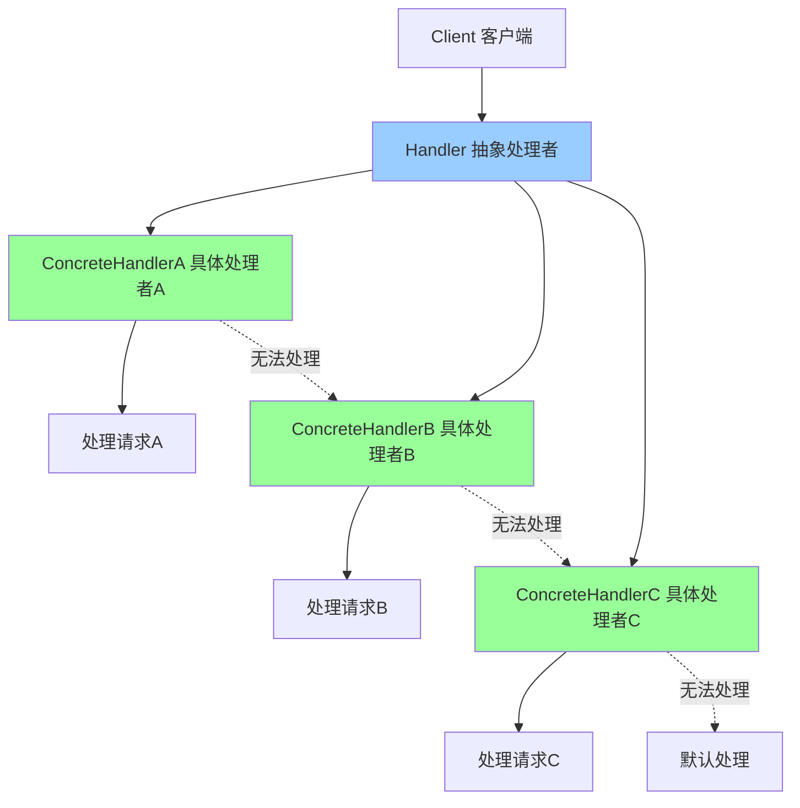

# 责任链模式 (Chain of Responsibility)

> 责任链模式是一种行为型设计模式，允许你将请求沿着处理者链进行发送，直到有一个处理者处理它为止。这种模式避免了请求的发送者和接收者之间的直接耦合。

## 📋 概要

责任链模式将多个对象连接成一条链，并沿着这条链传递请求，直到有一个对象处理它为止。这种模式的主要目的是解耦请求的发送者和接收者，让多个对象都有机会处理请求。

### 核心原理

1. **抽象处理者**: 定义处理请求的接口和实现后继者的链接
2. **具体处理者**: 实现处理请求的具体逻辑
3. **客户端**: 创建处理者链并发送请求

### 适用场景

- 请求的处理需要经过多个对象
- 处理者可以动态组合
- 需要避免请求发送者和接收者之间的直接耦合
- 处理者可以动态添加或删除
- 权限验证、日志记录、异常处理等中间件场景

### 优点

- **解耦**: 发送者和接收者之间解耦
- **灵活性**: 可以动态改变处理者链
- **单一职责**: 每个处理者只负责自己的处理逻辑
- **开闭原则**: 新增处理者不需要修改现有代码

### 缺点

- **性能**: 可能遍历整个链才能找到合适的处理者
- **调试困难**: 请求的处理流程可能比较复杂
- **链过长**: 可能导致链过长，影响性能

## 📋 责任链模式架构图



## 🚀 基础实现

### 1. 简单责任链实现

```dart
// 抽象处理者
abstract class Handler {
  Handler? _nextHandler;

  // 设置下一个处理者
  Handler setNext(Handler handler) {
    _nextHandler = handler;
    return handler;
  }

  // 处理请求
  void handle(String request) {
    if (canHandle(request)) {
      process(request);
    } else if (_nextHandler != null) {
      _nextHandler!.handle(request);
    } else {
      print('没有处理者可以处理请求: $request');
    }
  }

  // 判断是否可以处理请求
  bool canHandle(String request);

  // 处理请求的具体逻辑
  void process(String request);
}

// 具体处理者A
class ConcreteHandlerA extends Handler {
  @override
  bool canHandle(String request) {
    return request.startsWith('A');
  }

  @override
  void process(String request) {
    print('ConcreteHandlerA 处理请求: $request');
  }
}

// 具体处理者B
class ConcreteHandlerB extends Handler {
  @override
  bool canHandle(String request) {
    return request.startsWith('B');
  }

  @override
  void process(String request) {
    print('ConcreteHandlerB 处理请求: $request');
  }
}

// 具体处理者C
class ConcreteHandlerC extends Handler {
  @override
  bool canHandle(String request) {
    return request.startsWith('C');
  }

  @override
  void process(String request) {
    print('ConcreteHandlerC 处理请求: $request');
  }
}

// 使用示例
void main() {
  // 创建处理者链
  final handlerA = ConcreteHandlerA();
  final handlerB = ConcreteHandlerB();
  final handlerC = ConcreteHandlerC();

  // 设置责任链
  handlerA.setNext(handlerB).setNext(handlerC);

  // 发送请求
  handlerA.handle('A请求');
  handlerA.handle('B请求');
  handlerA.handle('C请求');
  handlerA.handle('D请求');
}
```

### 2. 权限验证责任链

```dart
// 请求类
class Request {
  final String _user;
  final String _resource;
  final String _action;
  final Map<String, dynamic> _context;

  Request(this._user, this._resource, this._action, this._context);

  String get user => _user;
  String get resource => _resource;
  String get action => _action;
  Map<String, dynamic> get context => Map.from(_context);

  @override
  String toString() {
    return 'Request{user: $_user, resource: $_resource, action: $_action}';
  }
}

// 响应类
class Response {
  final bool _allowed;
  final String _message;
  final Map<String, dynamic> _data;

  Response(this._allowed, this._message, this._data);

  bool get allowed => _allowed;
  String get message => _message;
  Map<String, dynamic> get data => Map.from(_data);

  @override
  String toString() {
    return 'Response{allowed: $_allowed, message: $_message}';
  }
}

// 权限验证处理者
abstract class PermissionHandler {
  PermissionHandler? _nextHandler;

  PermissionHandler setNext(PermissionHandler handler) {
    _nextHandler = handler;
    return handler;
  }

  Response handle(Request request) {
    if (canHandle(request)) {
      return process(request);
    } else if (_nextHandler != null) {
      return _nextHandler!.handle(request);
    } else {
      return Response(false, '没有处理者可以处理请求', {});
    }
  }

  bool canHandle(Request request);
  Response process(Request request);
}

// 用户存在性验证
class UserExistenceHandler extends PermissionHandler {
  final Set<String> _users = {'admin', 'user1', 'user2', 'guest'};

  @override
  bool canHandle(Request request) {
    return true; // 总是可以处理
  }

  @override
  Response process(Request request) {
    if (_users.contains(request.user)) {
      print('用户存在性验证通过: ${request.user}');
      return Response(true, '用户存在', {'user': request.user});
    } else {
      print('用户不存在: ${request.user}');
      return Response(false, '用户不存在', {});
    }
  }
}

// 资源访问权限验证
class ResourceAccessHandler extends PermissionHandler {
  final Map<String, List<String>> _permissions = {
    'admin': ['read', 'write', 'delete'],
    'user1': ['read', 'write'],
    'user2': ['read'],
    'guest': ['read'],
  };

  @override
  bool canHandle(Request request) {
    return request.context.containsKey('user'); // 需要先验证用户存在性
  }

  @override
  Response process(Request request) {
    final user = request.context['user'] as String;
    final allowedActions = _permissions[user] ?? [];

    if (allowedActions.contains(request.action)) {
      print('资源访问权限验证通过: $user -> ${request.action}');
      return Response(true, '权限验证通过', {
        'user': user,
        'action': request.action,
        'resource': request.resource,
      });
    } else {
      print('权限不足: $user 无法执行 ${request.action}');
      return Response(false, '权限不足', {});
    }
  }
}

// 资源存在性验证
class ResourceExistenceHandler extends PermissionHandler {
  final Set<String> _resources = {'file1', 'file2', 'database', 'api'};

  @override
  bool canHandle(Request request) {
    return request.context.containsKey('action'); // 需要先验证权限
  }

  @override
  Response process(Request request) {
    if (_resources.contains(request.resource)) {
      print('资源存在性验证通过: ${request.resource}');
      return Response(true, '资源存在', {
        'user': request.context['user'],
        'action': request.context['action'],
        'resource': request.resource,
      });
    } else {
      print('资源不存在: ${request.resource}');
      return Response(false, '资源不存在', {});
    }
  }
}

// 审计日志处理者
class AuditLogHandler extends PermissionHandler {
  final List<String> _logs = [];

  @override
  bool canHandle(Request request) {
    return true; // 总是可以处理
  }

  @override
  Response process(Request request) {
    final timestamp = DateTime.now().toIso8601String();
    final logEntry = '[$timestamp] ${request.user} ${request.action} ${request.resource}';
    _logs.add(logEntry);
    print('记录审计日志: $logEntry');

    return Response(true, '审计日志已记录', {
      'user': request.user,
      'action': request.action,
      'resource': request.resource,
      'timestamp': timestamp,
    });
  }

  List<String> getLogs() => List.from(_logs);

  void clearLogs() {
    _logs.clear();
  }
}

// 权限验证器
class PermissionValidator {
  final PermissionHandler _chain;

  PermissionValidator(this._chain);

  Response validate(Request request) {
    print('=== 开始权限验证 ===');
    print('请求: $request');

    final response = _chain.handle(request);

    print('验证结果: $response');
    print('=== 权限验证结束 ===\n');

    return response;
  }
}

// 使用示例
void main() {
  print('=== 权限验证责任链演示 ===');

  // 创建处理者链
  final userHandler = UserExistenceHandler();
  final resourceAccessHandler = ResourceAccessHandler();
  final resourceExistenceHandler = ResourceExistenceHandler();
  final auditHandler = AuditLogHandler();

  // 设置责任链
  userHandler
    .setNext(resourceAccessHandler)
    .setNext(resourceExistenceHandler)
    .setNext(auditHandler);

  final validator = PermissionValidator(userHandler);

  // 测试不同的请求
  final requests = [
    Request('admin', 'file1', 'read', {}),
    Request('user1', 'file2', 'write', {}),
    Request('user2', 'database', 'delete', {}),
    Request('guest', 'api', 'read', {}),
    Request('unknown', 'file1', 'read', {}),
    Request('user1', 'nonexistent', 'read', {}),
  ];

  for (final request in requests) {
    final response = validator.validate(request);

    if (response.allowed) {
      print('✅ 请求被允许');
    } else {
      print('❌ 请求被拒绝: ${response.message}');
    }
    print('');
  }

  // 显示审计日志
  print('=== 审计日志 ===');
  final logs = auditHandler.getLogs();
  for (final log in logs) {
    print('  $log');
  }
}
```

## 🔧 实际应用场景

### 1. HTTP 中间件责任链

```dart
// HTTP请求类
class HttpRequest {
  final String _method;
  final String _path;
  final Map<String, String> _headers;
  final Map<String, dynamic> _body;
  final Map<String, String> _queryParams;

  HttpRequest(this._method, this._path, this._headers, this._body, this._queryParams);

  String get method => _method;
  String get path => _path;
  Map<String, String> get headers => Map.from(_headers);
  Map<String, dynamic> get body => Map.from(_body);
  Map<String, String> get queryParams => Map.from(_queryParams);

  @override
  String toString() {
    return 'HttpRequest{method: $_method, path: $_path}';
  }
}

// HTTP响应类
class HttpResponse {
  final int _statusCode;
  final Map<String, String> _headers;
  final dynamic _body;

  HttpResponse(this._statusCode, this._headers, this._body);

  int get statusCode => _statusCode;
  Map<String, String> get headers => Map.from(_headers);
  dynamic get body => _body;

  @override
  String toString() {
    return 'HttpResponse{statusCode: $_statusCode, body: $_body}';
  }
}

// HTTP中间件处理者
abstract class HttpMiddleware {
  HttpMiddleware? _nextMiddleware;

  HttpMiddleware setNext(HttpMiddleware middleware) {
    _nextMiddleware = middleware;
    return middleware;
  }

  HttpResponse handle(HttpRequest request) {
    // 前置处理
    final preProcessedRequest = preProcess(request);

    // 调用下一个中间件或返回响应
    HttpResponse response;
    if (_nextMiddleware != null) {
      response = _nextMiddleware!.handle(preProcessedRequest);
    } else {
      response = _createDefaultResponse();
    }

    // 后置处理
    return postProcess(preProcessedRequest, response);
  }

  HttpRequest preProcess(HttpRequest request);
  HttpResponse postProcess(HttpRequest request, HttpResponse response);
  HttpResponse _createDefaultResponse() {
    return HttpResponse(404, {'Content-Type': 'application/json'}, {'error': 'Not Found'});
  }
}

// 日志中间件
class LoggingMiddleware extends HttpMiddleware {
  @override
  HttpRequest preProcess(HttpRequest request) {
    print('📝 请求日志: ${request.method} ${request.path}');
    print('   请求头: ${request.headers}');
    print('   查询参数: ${request.queryParams}');
    return request;
  }

  @override
  HttpResponse postProcess(HttpRequest request, HttpResponse response) {
    print('📝 响应日志: ${response.statusCode}');
    print('   响应头: ${response.headers}');
    return response;
  }
}

// 认证中间件
class AuthenticationMiddleware extends HttpMiddleware {
  final Map<String, String> _tokens = {
    'user1': 'token1',
    'user2': 'token2',
    'admin': 'admin_token',
  };

  @override
  HttpRequest preProcess(HttpRequest request) {
    final authHeader = request.headers['Authorization'];

    if (authHeader == null || !authHeader.startsWith('Bearer ')) {
      throw Exception('缺少认证头');
    }

    final token = authHeader.substring(7);
    final user = _getUserByToken(token);

    if (user == null) {
      throw Exception('无效的认证令牌');
    }

    print('🔐 认证成功: $user');

    // 添加用户信息到请求头
    final newHeaders = Map<String, String>.from(request.headers);
    newHeaders['X-User'] = user;

    return HttpRequest(request.method, request.path, newHeaders, request.body, request.queryParams);
  }

  @override
  HttpResponse postProcess(HttpRequest request, HttpResponse response) {
    return response;
  }

  String? _getUserByToken(String token) {
    for (final entry in _tokens.entries) {
      if (entry.value == token) {
        return entry.key;
      }
    }
    return null;
  }
}

// 限流中间件
class RateLimitMiddleware extends HttpMiddleware {
  final Map<String, int> _requestCounts = {};
  final Map<String, DateTime> _lastReset = {};
  final int _maxRequests = 10;
  final Duration _window = Duration(minutes: 1);

  @override
  HttpRequest preProcess(HttpRequest request) {
    final user = request.headers['X-User'];
    if (user == null) {
      return request;
    }

    final now = DateTime.now();
    final lastReset = _lastReset[user];

    // 重置计数器
    if (lastReset == null || now.difference(lastReset) > _window) {
      _requestCounts[user] = 0;
      _lastReset[user] = now;
    }

    // 检查限流
    final currentCount = _requestCounts[user] ?? 0;
    if (currentCount >= _maxRequests) {
      throw Exception('请求频率超限');
    }

    _requestCounts[user] = currentCount + 1;
    print('🚦 限流检查通过: $user (${currentCount + 1}/$_maxRequests)');

    return request;
  }

  @override
  HttpResponse postProcess(HttpRequest request, HttpResponse response) {
    return response;
  }
}

// 缓存中间件
class CacheMiddleware extends HttpMiddleware {
  final Map<String, HttpResponse> _cache = {};
  final Map<String, DateTime> _cacheTimestamps = {};
  final Duration _cacheExpiry = Duration(minutes: 5);

  @override
  HttpRequest preProcess(HttpRequest request) {
    // 只缓存GET请求
    if (request.method != 'GET') {
      return request;
    }

    final cacheKey = '${request.method}_${request.path}';
    final cachedResponse = _cache[cacheKey];
    final timestamp = _cacheTimestamps[cacheKey];

    if (cachedResponse != null && timestamp != null) {
      final now = DateTime.now();
      if (now.difference(timestamp) < _cacheExpiry) {
        print('💾 返回缓存响应: $cacheKey');
        throw CachedResponseException(cachedResponse);
      } else {
        // 缓存过期，清除
        _cache.remove(cacheKey);
        _cacheTimestamps.remove(cacheKey);
      }
    }

    return request;
  }

  @override
  HttpResponse postProcess(HttpRequest request, HttpResponse response) {
    // 缓存成功的GET响应
    if (request.method == 'GET' && response.statusCode == 200) {
      final cacheKey = '${request.method}_${request.path}';
      _cache[cacheKey] = response;
      _cacheTimestamps[cacheKey] = DateTime.now();
      print('💾 缓存响应: $cacheKey');
    }

    return response;
  }
}

// 缓存响应异常
class CachedResponseException implements Exception {
  final HttpResponse response;

  CachedResponseException(this.response);
}

// HTTP服务器
class HttpServer {
  final HttpMiddleware _middleware;

  HttpServer(this._middleware);

  HttpResponse handleRequest(HttpRequest request) {
    try {
      return _middleware.handle(request);
    } on CachedResponseException catch (e) {
      return e.response;
    } catch (e) {
      print('❌ 处理请求时出错: $e');
      return HttpResponse(500, {'Content-Type': 'application/json'}, {'error': e.toString()});
    }
  }
}

// 使用示例
void main() {
  print('=== HTTP中间件责任链演示 ===');

  // 创建中间件链
  final loggingMiddleware = LoggingMiddleware();
  final authMiddleware = AuthenticationMiddleware();
  final rateLimitMiddleware = RateLimitMiddleware();
  final cacheMiddleware = CacheMiddleware();

  // 设置中间件链
  loggingMiddleware
    .setNext(authMiddleware)
    .setNext(rateLimitMiddleware)
    .setNext(cacheMiddleware);

  final server = HttpServer(loggingMiddleware);

  // 测试请求
  final requests = [
    HttpRequest('GET', '/api/users', {
      'Authorization': 'Bearer token1',
      'Content-Type': 'application/json',
    }, {}, {'page': '1'}),

    HttpRequest('POST', '/api/users', {
      'Authorization': 'Bearer admin_token',
      'Content-Type': 'application/json',
    }, {'name': 'John', 'email': 'john@example.com'}, {}),

    HttpRequest('GET', '/api/users', {
      'Authorization': 'Bearer token1',
      'Content-Type': 'application/json',
    }, {}, {'page': '1'}), // 重复请求，应该使用缓存
  ];

  for (int i = 0; i < requests.length; i++) {
    print('=== 处理请求 ${i + 1} ===');
    final response = server.handleRequest(requests[i]);
    print('响应: $response\n');
  }
}
```

## 🧪 测试和调试

### 1. 责任链模式单元测试

```dart
// test/chain_of_responsibility_test.dart
import 'package:flutter_test/flutter_test.dart';
import 'package:myapp/chain_of_responsibility.dart';

void main() {
  group('责任链模式测试', () {
    test('应该正确创建处理者', () {
      final handlerA = ConcreteHandlerA();
      final handlerB = ConcreteHandlerB();

      expect(handlerA, isA<Handler>());
      expect(handlerB, isA<Handler>());
    });

    test('应该正确设置责任链', () {
      final handlerA = ConcreteHandlerA();
      final handlerB = ConcreteHandlerB();

      handlerA.setNext(handlerB);

      expect(handlerA, isNotNull);
      expect(handlerB, isNotNull);
    });

    test('应该正确处理请求', () {
      final handlerA = ConcreteHandlerA();
      final handlerB = ConcreteHandlerB();
      final handlerC = ConcreteHandlerC();

      handlerA.setNext(handlerB).setNext(handlerC);

      expect(() => handlerA.handle('A请求'), returnsNormally);
      expect(() => handlerA.handle('B请求'), returnsNormally);
      expect(() => handlerA.handle('C请求'), returnsNormally);
      expect(() => handlerA.handle('D请求'), returnsNormally);
    });
  });

  group('权限验证责任链测试', () {
    test('应该正确创建请求和响应', () {
      final request = Request('user1', 'file1', 'read', {});
      final response = Response(true, 'success', {});

      expect(request.user, equals('user1'));
      expect(request.resource, equals('file1'));
      expect(request.action, equals('read'));
      expect(response.allowed, isTrue);
      expect(response.message, equals('success'));
    });

    test('用户存在性验证应该正确工作', () {
      final handler = UserExistenceHandler();
      final request = Request('admin', 'file1', 'read', {});

      final response = handler.handle(request);

      expect(response.allowed, isTrue);
      expect(response.data['user'], equals('admin'));
    });

    test('资源访问权限验证应该正确工作', () {
      final handler = ResourceAccessHandler();
      final request = Request('admin', 'file1', 'read', {'user': 'admin'});

      final response = handler.handle(request);

      expect(response.allowed, isTrue);
      expect(response.data['action'], equals('read'));
    });

    test('权限验证器应该正确工作', () {
      final userHandler = UserExistenceHandler();
      final resourceHandler = ResourceAccessHandler();
      userHandler.setNext(resourceHandler);

      final validator = PermissionValidator(userHandler);
      final request = Request('admin', 'file1', 'read', {});

      final response = validator.validate(request);

      expect(response.allowed, isTrue);
    });
  });

  group('HTTP中间件责任链测试', () {
    test('应该正确创建HTTP请求和响应', () {
      final request = HttpRequest('GET', '/api/users', {}, {}, {});
      final response = HttpResponse(200, {}, {'data': 'test'});

      expect(request.method, equals('GET'));
      expect(request.path, equals('/api/users'));
      expect(response.statusCode, equals(200));
      expect(response.body['data'], equals('test'));
    });

    test('日志中间件应该正确工作', () {
      final middleware = LoggingMiddleware();
      final request = HttpRequest('GET', '/api/users', {}, {}, {});

      expect(() => middleware.handle(request), returnsNormally);
    });

    test('认证中间件应该正确工作', () {
      final middleware = AuthenticationMiddleware();
      final request = HttpRequest('GET', '/api/users', {
        'Authorization': 'Bearer token1',
      }, {}, {});

      expect(() => middleware.handle(request), returnsNormally);
    });

    test('HTTP服务器应该正确工作', () {
      final loggingMiddleware = LoggingMiddleware();
      final server = HttpServer(loggingMiddleware);
      final request = HttpRequest('GET', '/api/users', {}, {}, {});

      final response = server.handleRequest(request);

      expect(response, isA<HttpResponse>());
    });
  });
}
```

## 📚 最佳实践

### 1. 设计原则

- **单一职责**: 每个处理者只负责自己的处理逻辑
- **开闭原则**: 新增处理者不需要修改现有代码
- **依赖倒置**: 依赖抽象而不是具体实现
- **接口隔离**: 定义清晰的处理者接口

### 2. 性能优化

- **链长度控制**: 控制责任链的长度
- **缓存机制**: 缓存处理结果
- **异步处理**: 使用异步处理提高性能
- **批量处理**: 批量处理请求

### 3. 错误处理

- **异常传播**: 合理传播异常
- **降级策略**: 提供降级处理方案
- **日志记录**: 记录处理过程
- **监控告警**: 监控处理性能

### 4. 调试技巧

- **链追踪**: 追踪请求在链中的传播
- **性能分析**: 分析处理性能
- **状态监控**: 监控处理者状态
- **日志分析**: 分析处理日志

## 🎯 小结

责任链模式是处理复杂请求流程的强大工具，特别适合需要多个对象协作处理请求的场景。在 Flutter 开发中，它可以用于权限验证、中间件处理、事件处理等。

### 选择建议

- **复杂流程**: 请求需要经过多个处理步骤
- **动态组合**: 处理者可以动态组合
- **解耦需求**: 需要解耦请求发送者和接收者
- **扩展性**: 需要易于添加新的处理者

### 关键要点

1. **链设计**: 设计合适的责任链结构
2. **处理逻辑**: 合理实现处理逻辑
3. **性能考虑**: 注意责任链的性能影响
4. **错误处理**: 提供完善的错误处理机制
5. **扩展性**: 保持系统的扩展性

---

> 💡 **提示**: 责任链模式是处理复杂流程的优秀方案，但要控制链的长度和复杂度。建议在真正需要多个对象协作处理的场景中使用，并注意性能优化和错误处理。

```

```
