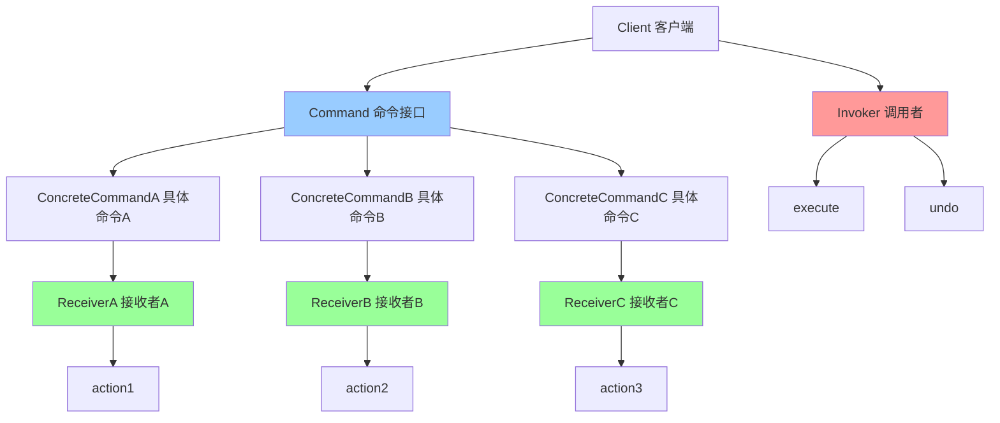

# 命令模式 (Command)

> 命令模式是一种行为型设计模式，它将请求封装成对象，从而让你可以用不同的请求对客户进行参数化，对请求排队或记录请求日志，以及支持可撤销的操作。

## 📋 概要

命令模式将请求封装成对象，使得可以用不同的请求对客户进行参数化，对请求排队或记录请求日志，以及支持可撤销的操作。这种模式的主要目的是将请求的发送者和接收者解耦。

### 核心原理

1. **命令接口**: 定义执行命令的接口
2. **具体命令**: 实现命令接口，封装具体的操作
3. **接收者**: 知道如何执行与命令相关的操作
4. **调用者**: 要求命令执行请求
5. **客户端**: 创建具体命令对象并设置其接收者

### 适用场景

- 需要将请求发送者和接收者解耦
- 需要支持请求的排队、记录日志、撤销等操作
- 需要支持事务操作
- 需要支持宏命令（组合命令）
- 需要支持命令的延迟执行

### 优点

- **解耦**: 请求发送者和接收者之间解耦
- **扩展性**: 容易添加新的命令
- **组合**: 支持宏命令和命令组合
- **撤销**: 容易实现撤销和重做功能
- **队列**: 支持命令的排队执行

### 缺点

- **复杂性**: 可能增加系统的复杂性
- **性能**: 每个命令都需要一个对象
- **内存**: 可能占用更多内存

## 📋 命令模式架构图



## 🚀 基础实现

### 1. 简单命令模式实现

```dart
// 命令接口
abstract class Command {
  void execute();
  void undo();
}

// 接收者
class Light {
  void turnOn() {
    print('灯已打开');
  }

  void turnOff() {
    print('灯已关闭');
  }

  void dim(int level) {
    print('灯亮度调整为: $level%');
  }
}

class Fan {
  void turnOn() {
    print('风扇已打开');
  }

  void turnOff() {
    print('风扇已关闭');
  }

  void setSpeed(int speed) {
    print('风扇速度设置为: $speed');
  }
}

// 具体命令
class LightOnCommand implements Command {
  final Light _light;

  LightOnCommand(this._light);

  @override
  void execute() {
    _light.turnOn();
  }

  @override
  void undo() {
    _light.turnOff();
  }
}

class LightOffCommand implements Command {
  final Light _light;

  LightOffCommand(this._light);

  @override
  void execute() {
    _light.turnOff();
  }

  @override
  void undo() {
    _light.turnOn();
  }
}

class LightDimCommand implements Command {
  final Light _light;
  final int _level;
  int? _previousLevel;

  LightDimCommand(this._light, this._level);

  @override
  void execute() {
    _previousLevel = 100; // 假设之前是100%
    _light.dim(_level);
  }

  @override
  void undo() {
    if (_previousLevel != null) {
      _light.dim(_previousLevel!);
    }
  }
}

class FanOnCommand implements Command {
  final Fan _fan;
  final int _speed;

  FanOnCommand(this._fan, this._speed);

  @override
  void execute() {
    _fan.turnOn();
    _fan.setSpeed(_speed);
  }

  @override
  void undo() {
    _fan.turnOff();
  }
}

class FanOffCommand implements Command {
  final Fan _fan;

  FanOffCommand(this._fan);

  @override
  void execute() {
    _fan.turnOff();
  }

  @override
  void undo() {
    _fan.turnOn();
    _fan.setSpeed(1);
  }
}

// 调用者
class RemoteControl {
  final List<Command> _onCommands = List.filled(7, NoCommand());
  final List<Command> _offCommands = List.filled(7, NoCommand());
  Command? _undoCommand;

  void setCommand(int slot, Command onCommand, Command offCommand) {
    _onCommands[slot] = onCommand;
    _offCommands[slot] = offCommand;
  }

  void onButtonPressed(int slot) {
    _onCommands[slot].execute();
    _undoCommand = _onCommands[slot];
  }

  void offButtonPressed(int slot) {
    _offCommands[slot].execute();
    _undoCommand = _offCommands[slot];
  }

  void undoButtonPressed() {
    _undoCommand?.undo();
  }

  String toString() {
    final buffer = StringBuffer();
    buffer.writeln('\n------ 遥控器 ------');
    for (int i = 0; i < _onCommands.length; i++) {
      buffer.writeln('[slot $i] ${_onCommands[i].runtimeType} ${_offCommands[i].runtimeType}');
    }
    return buffer.toString();
  }
}

// 空命令（空对象模式）
class NoCommand implements Command {
  @override
  void execute() {
    // 什么都不做
  }

  @override
  void undo() {
    // 什么都不做
  }
}

// 使用示例
void main() {
  // 创建接收者
  final light = Light();
  final fan = Fan();

  // 创建命令
  final lightOn = LightOnCommand(light);
  final lightOff = LightOffCommand(light);
  final lightDim = LightDimCommand(light, 50);
  final fanOn = FanOnCommand(fan, 3);
  final fanOff = FanOffCommand(fan);

  // 创建调用者
  final remote = RemoteControl();

  // 设置命令
  remote.setCommand(0, lightOn, lightOff);
  remote.setCommand(1, lightDim, lightOff);
  remote.setCommand(2, fanOn, fanOff);

  print(remote);

  // 执行命令
  print('\n=== 执行命令 ===');
  remote.onButtonPressed(0);  // 开灯
  remote.onButtonPressed(1);  // 调暗灯
  remote.onButtonPressed(2);  // 开风扇

  print('\n=== 撤销命令 ===');
  remote.undoButtonPressed(); // 撤销风扇
  remote.undoButtonPressed(); // 撤销调暗
  remote.undoButtonPressed(); // 撤销开灯
}
```

### 2. 高级命令模式实现

```dart
// 命令接口
abstract class Command {
  Future<void> execute();
  Future<void> undo();
  String get description;
  DateTime get timestamp;
}

// 命令历史记录
class CommandHistory {
  final List<Command> _history = [];
  final List<Command> _redoStack = [];

  void addCommand(Command command) {
    _history.add(command);
    _redoStack.clear(); // 新命令会清除重做栈
  }

  Future<void> undo() async {
    if (_history.isNotEmpty) {
      final command = _history.removeLast();
      await command.undo();
      _redoStack.add(command);
    }
  }

  Future<void> redo() async {
    if (_redoStack.isNotEmpty) {
      final command = _redoStack.removeLast();
      await command.execute();
      _history.add(command);
    }
  }

  bool get canUndo => _history.isNotEmpty;
  bool get canRedo => _redoStack.isNotEmpty;

  List<Command> get history => List.unmodifiable(_history);
  List<Command> get redoStack => List.unmodifiable(_redoStack);
}

// 宏命令
class MacroCommand implements Command {
  final List<Command> _commands;
  final String _description;
  final DateTime _timestamp;

  MacroCommand(this._commands, this._description) : _timestamp = DateTime.now();

  @override
  Future<void> execute() async {
    for (final command in _commands) {
      await command.execute();
    }
  }

  @override
  Future<void> undo() async {
    // 按相反顺序撤销
    for (int i = _commands.length - 1; i >= 0; i--) {
      await _commands[i].undo();
    }
  }

  @override
  String get description => _description;

  @override
  DateTime get timestamp => _timestamp;
}

// 延迟执行命令
class DelayedCommand implements Command {
  final Command _command;
  final Duration _delay;
  final String _description;
  final DateTime _timestamp;

  DelayedCommand(this._command, this._delay, this._description)
    : _timestamp = DateTime.now();

  @override
  Future<void> execute() async {
    await Future.delayed(_delay);
    await _command.execute();
  }

  @override
  Future<void> undo() async {
    await _command.undo();
  }

  @override
  String get description => _description;

  @override
  DateTime get timestamp => _timestamp;
}

// 事务命令
class TransactionCommand implements Command {
  final List<Command> _commands;
  final String _description;
  final DateTime _timestamp;
  bool _executed = false;

  TransactionCommand(this._commands, this._description)
    : _timestamp = DateTime.now();

  @override
  Future<void> execute() async {
    if (_executed) return;

    final executedCommands = <Command>[];

    try {
      for (final command in _commands) {
        await command.execute();
        executedCommands.add(command);
      }
      _executed = true;
    } catch (e) {
      // 回滚已执行的命令
      for (int i = executedCommands.length - 1; i >= 0; i--) {
        await executedCommands[i].undo();
      }
      rethrow;
    }
  }

  @override
  Future<void> undo() async {
    if (!_executed) return;

    for (int i = _commands.length - 1; i >= 0; i--) {
      await _commands[i].undo();
    }
    _executed = false;
  }

  @override
  String get description => _description;

  @override
  DateTime get timestamp => _timestamp;
}

// 命令执行器
class CommandExecutor {
  final CommandHistory _history = CommandHistory();
  final Queue<Command> _commandQueue = Queue();
  bool _isProcessing = false;

  // 同步执行命令
  Future<void> execute(Command command) async {
    await command.execute();
    _history.addCommand(command);
  }

  // 异步执行命令
  Future<void> executeAsync(Command command) async {
    _commandQueue.add(command);
    if (!_isProcessing) {
      _processQueue();
    }
  }

  // 处理命令队列
  Future<void> _processQueue() async {
    _isProcessing = true;

    while (_commandQueue.isNotEmpty) {
      final command = _commandQueue.removeFirst();
      await command.execute();
      _history.addCommand(command);
    }

    _isProcessing = false;
  }

  // 撤销
  Future<void> undo() async {
    await _history.undo();
  }

  // 重做
  Future<void> redo() async {
    await _history.redo();
  }

  // 获取历史记录
  List<Command> get history => _history.history;

  // 检查是否可以撤销/重做
  bool get canUndo => _history.canUndo;
  bool get canRedo => _history.canRedo;

  // 清空历史记录
  void clearHistory() {
    _history._history.clear();
    _history._redoStack.clear();
  }
}

// 具体业务命令示例
class SaveFileCommand implements Command {
  final String _filePath;
  final String _content;
  final String _description;
  final DateTime _timestamp;
  String? _backupContent;

  SaveFileCommand(this._filePath, this._content, this._description)
    : _timestamp = DateTime.now();

  @override
  Future<void> execute() async {
    // 备份原文件内容
    _backupContent = await _readFile(_filePath);

    // 保存新内容
    await _writeFile(_filePath, _content);
    print('文件已保存: $_filePath');
  }

  @override
  Future<void> undo() async {
    if (_backupContent != null) {
      await _writeFile(_filePath, _backupContent!);
      print('文件已恢复: $_filePath');
    }
  }

  @override
  String get description => _description;

  @override
  DateTime get timestamp => _timestamp;

  Future<String> _readFile(String path) async {
    // 模拟文件读取
    await Future.delayed(Duration(milliseconds: 10));
    return 'original content';
  }

  Future<void> _writeFile(String path, String content) async {
    // 模拟文件写入
    await Future.delayed(Duration(milliseconds: 20));
  }
}

class SendEmailCommand implements Command {
  final String _to;
  final String _subject;
  final String _body;
  final String _description;
  final DateTime _timestamp;

  SendEmailCommand(this._to, this._subject, this._body, this._description)
    : _timestamp = DateTime.now();

  @override
  Future<void> execute() async {
    // 模拟发送邮件
    await Future.delayed(Duration(seconds: 1));
    print('邮件已发送到: $_to');
    print('主题: $_subject');
  }

  @override
  Future<void> undo() async {
    // 模拟撤回邮件
    await Future.delayed(Duration(milliseconds: 500));
    print('邮件已撤回: $_to');
  }

  @override
  String get description => _description;

  @override
  DateTime get timestamp => _timestamp;
}

// 使用示例
void main() async {
  final executor = CommandExecutor();

  // 创建命令
  final saveCommand = SaveFileCommand(
    'document.txt',
    'Hello, World!',
    '保存文档',
  );

  final emailCommand = SendEmailCommand(
    'user@example.com',
    '测试邮件',
    '这是一封测试邮件',
    '发送邮件',
  );

  // 创建宏命令
  final macroCommand = MacroCommand(
    [saveCommand, emailCommand],
    '保存并发送邮件',
  );

  // 创建延迟命令
  final delayedCommand = DelayedCommand(
    emailCommand,
    Duration(seconds: 2),
    '延迟发送邮件',
  );

  // 执行命令
  print('=== 执行单个命令 ===');
  await executor.execute(saveCommand);

  print('\n=== 执行宏命令 ===');
  await executor.execute(macroCommand);

  print('\n=== 执行延迟命令 ===');
  await executor.executeAsync(delayedCommand);

  // 等待延迟命令完成
  await Future.delayed(Duration(seconds: 3));

  print('\n=== 撤销操作 ===');
  await executor.undo();

  print('\n=== 重做操作 ===');
  await executor.redo();

  print('\n=== 历史记录 ===');
  for (final command in executor.history) {
    print('${command.timestamp}: ${command.description}');
  }
}
```

## 🔧 实际应用场景

### 1. Flutter 中的撤销/重做功能

```dart
// 文本编辑器命令
abstract class TextEditCommand implements Command {
  final String _description;
  final DateTime _timestamp;

  TextEditCommand(this._description) : _timestamp = DateTime.now();

  @override
  String get description => _description;

  @override
  DateTime get timestamp => _timestamp;
}

class InsertTextCommand extends TextEditCommand {
  final TextEditingController _controller;
  final int _position;
  final String _text;
  final String _originalText;

  InsertTextCommand(
    this._controller,
    this._position,
    this._text,
  ) : super('插入文本: $_text'),
      _originalText = _controller.text;

  @override
  Future<void> execute() async {
    final text = _controller.text;
    final newText = text.substring(0, _position) + _text + text.substring(_position);
    _controller.text = newText;
    _controller.selection = TextSelection.collapsed(offset: _position + _text.length);
  }

  @override
  Future<void> undo() async {
    _controller.text = _originalText;
    _controller.selection = TextSelection.collapsed(offset: _position);
  }
}

class DeleteTextCommand extends TextEditCommand {
  final TextEditingController _controller;
  final int _start;
  final int _end;
  final String _deletedText;
  final String _originalText;

  DeleteTextCommand(
    this._controller,
    this._start,
    this._end,
  ) : _deletedText = _controller.text.substring(_start, _end),
      super('删除文本: $_deletedText'),
      _originalText = _controller.text;

  @override
  Future<void> execute() async {
    final text = _controller.text;
    final newText = text.substring(0, _start) + text.substring(_end);
    _controller.text = newText;
    _controller.selection = TextSelection.collapsed(offset: _start);
  }

  @override
  Future<void> undo() async {
    _controller.text = _originalText;
    _controller.selection = TextSelection(baseOffset: _start, extentOffset: _end);
  }
}

class ReplaceTextCommand extends TextEditCommand {
  final TextEditingController _controller;
  final int _start;
  final int _end;
  final String _newText;
  final String _originalText;
  final String _replacedText;

  ReplaceTextCommand(
    this._controller,
    this._start,
    this._end,
    this._newText,
  ) : _replacedText = _controller.text.substring(_start, _end),
      super('替换文本: $_replacedText -> $_newText'),
      _originalText = _controller.text;

  @override
  Future<void> execute() async {
    final text = _controller.text;
    final newText = text.substring(0, _start) + _newText + text.substring(_end);
    _controller.text = newText;
    _controller.selection = TextSelection.collapsed(offset: _start + _newText.length);
  }

  @override
  Future<void> undo() async {
    _controller.text = _originalText;
    _controller.selection = TextSelection(baseOffset: _start, extentOffset: _end);
  }
}

// 文本编辑器
class TextEditor extends StatefulWidget {
  @override
  _TextEditorState createState() => _TextEditorState();
}

class _TextEditorState extends State<TextEditor> {
  final TextEditingController _controller = TextEditingController();
  final CommandExecutor _executor = CommandExecutor();

  @override
  Widget build(BuildContext context) {
    return Scaffold(
      appBar: AppBar(
        title: Text('文本编辑器'),
        actions: [
          IconButton(
            icon: Icon(Icons.undo),
            onPressed: _executor.canUndo ? _undo : null,
          ),
          IconButton(
            icon: Icon(Icons.redo),
            onPressed: _executor.canRedo ? _redo : null,
          ),
          IconButton(
            icon: Icon(Icons.history),
            onPressed: _showHistory,
          ),
        ],
      ),
      body: Column(
        children: [
          Expanded(
            child: TextField(
              controller: _controller,
              maxLines: null,
              expands: true,
              decoration: InputDecoration(
                hintText: '开始输入...',
                border: OutlineInputBorder(),
              ),
              onChanged: _onTextChanged,
            ),
          ),
          Padding(
            padding: EdgeInsets.all(16),
            child: Row(
              children: [
                ElevatedButton(
                  onPressed: _insertText,
                  child: Text('插入文本'),
                ),
                SizedBox(width: 8),
                ElevatedButton(
                  onPressed: _deleteSelection,
                  child: Text('删除选中'),
                ),
                SizedBox(width: 8),
                ElevatedButton(
                  onPressed: _replaceSelection,
                  child: Text('替换选中'),
                ),
              ],
            ),
          ),
        ],
      ),
    );
  }

  void _onTextChanged(String text) {
    // 可以在这里添加自动保存功能
  }

  void _insertText() {
    final selection = _controller.selection;
    final position = selection.baseOffset;
    final command = InsertTextCommand(_controller, position, 'Hello');
    _executor.execute(command);
  }

  void _deleteSelection() {
    final selection = _controller.selection;
    if (selection.isCollapsed) return;

    final command = DeleteTextCommand(
      _controller,
      selection.start,
      selection.end,
    );
    _executor.execute(command);
  }

  void _replaceSelection() {
    final selection = _controller.selection;
    if (selection.isCollapsed) return;

    final command = ReplaceTextCommand(
      _controller,
      selection.start,
      selection.end,
      'Replaced',
    );
    _executor.execute(command);
  }

  void _undo() async {
    await _executor.undo();
    setState(() {});
  }

  void _redo() async {
    await _executor.redo();
    setState(() {});
  }

  void _showHistory() {
    showDialog(
      context: context,
      builder: (context) => AlertDialog(
        title: Text('操作历史'),
        content: Container(
          width: double.maxFinite,
          height: 300,
          child: ListView.builder(
            itemCount: _executor.history.length,
            itemBuilder: (context, index) {
              final command = _executor.history[index];
              return ListTile(
                title: Text(command.description),
                subtitle: Text(command.timestamp.toString()),
                trailing: IconButton(
                  icon: Icon(Icons.undo),
                  onPressed: () async {
                    await _executor.undo();
                    Navigator.of(context).pop();
                    setState(() {});
                  },
                ),
              );
            },
          ),
        ),
        actions: [
          TextButton(
            onPressed: () => Navigator.of(context).pop(),
            child: Text('关闭'),
          ),
        ],
      ),
    );
  }
}
```

### 2. 网络请求命令

```dart
// 网络请求命令
abstract class NetworkCommand implements Command {
  final String _description;
  final DateTime _timestamp;

  NetworkCommand(this._description) : _timestamp = DateTime.now();

  @override
  String get description => _description;

  @override
  DateTime get timestamp => _timestamp;
}

class GetRequestCommand extends NetworkCommand {
  final String _url;
  final Map<String, String>? _headers;
  dynamic _response;

  GetRequestCommand(this._url, {Map<String, String>? headers})
    : _headers = headers,
      super('GET $_url');

  @override
  Future<void> execute() async {
    // 模拟网络请求
    await Future.delayed(Duration(seconds: 1));
    _response = {'status': 'success', 'data': 'response data'};
    print('GET请求完成: $_url');
  }

  @override
  Future<void> undo() async {
    // 网络请求通常无法撤销，这里只是记录日志
    print('撤销GET请求: $_url (实际无法撤销)');
  }

  dynamic get response => _response;
}

class PostRequestCommand extends NetworkCommand {
  final String _url;
  final Map<String, dynamic> _data;
  final Map<String, String>? _headers;
  dynamic _response;
  String? _createdId;

  PostRequestCommand(this._url, this._data, {Map<String, String>? headers})
    : _headers = headers,
      super('POST $_url');

  @override
  Future<void> execute() async {
    // 模拟网络请求
    await Future.delayed(Duration(seconds: 1));
    _createdId = DateTime.now().millisecondsSinceEpoch.toString();
    _response = {'status': 'success', 'id': _createdId};
    print('POST请求完成: $_url');
  }

  @override
  Future<void> undo() async {
    if (_createdId != null) {
      // 模拟删除创建的资源
      await Future.delayed(Duration(milliseconds: 500));
      print('撤销POST请求: 删除资源 $_createdId');
    }
  }

  dynamic get response => _response;
}

class DeleteRequestCommand extends NetworkCommand {
  final String _url;
  final String _resourceId;
  dynamic _deletedData;

  DeleteRequestCommand(this._url, this._resourceId)
    : super('DELETE $_url/$_resourceId');

  @override
  Future<void> execute() async {
    // 模拟网络请求
    await Future.delayed(Duration(seconds: 1));
    _deletedData = {'id': _resourceId, 'data': 'deleted data'};
    print('DELETE请求完成: $_url/$_resourceId');
  }

  @override
  Future<void> undo() async {
    if (_deletedData != null) {
      // 模拟恢复删除的资源
      await Future.delayed(Duration(milliseconds: 500));
      print('撤销DELETE请求: 恢复资源 $_resourceId');
    }
  }

  dynamic get deletedData => _deletedData;
}

// 网络请求管理器
class NetworkManager {
  final CommandExecutor _executor = CommandExecutor();

  Future<dynamic> get(String url, {Map<String, String>? headers}) async {
    final command = GetRequestCommand(url, headers: headers);
    await _executor.execute(command);
    return command.response;
  }

  Future<dynamic> post(String url, Map<String, dynamic> data, {Map<String, String>? headers}) async {
    final command = PostRequestCommand(url, data, headers: headers);
    await _executor.execute(command);
    return command.response;
  }

  Future<dynamic> delete(String url, String resourceId) async {
    final command = DeleteRequestCommand(url, resourceId);
    await _executor.execute(command);
    return command.deletedData;
  }

  Future<void> undo() async {
    await _executor.undo();
  }

  Future<void> redo() async {
    await _executor.redo();
  }

  bool get canUndo => _executor.canUndo;
  bool get canRedo => _executor.canRedo;

  List<Command> get history => _executor.history;
}

// 使用示例
void main() async {
  final networkManager = NetworkManager();

  print('=== 执行网络请求 ===');

  // GET请求
  final getResponse = await networkManager.get('/api/users');
  print('GET响应: $getResponse');

  // POST请求
  final postResponse = await networkManager.post('/api/users', {
    'name': 'John',
    'email': 'john@example.com',
  });
  print('POST响应: $postResponse');

  // DELETE请求
  final deleteResponse = await networkManager.delete('/api/users', '123');
  print('DELETE响应: $deleteResponse');

  print('\n=== 撤销操作 ===');
  await networkManager.undo(); // 撤销DELETE
  await networkManager.undo(); // 撤销POST
  await networkManager.undo(); // 撤销GET

  print('\n=== 重做操作 ===');
  await networkManager.redo(); // 重做GET
  await networkManager.redo(); // 重做POST
  await networkManager.redo(); // 重做DELETE

  print('\n=== 历史记录 ===');
  for (final command in networkManager.history) {
    print('${command.timestamp}: ${command.description}');
  }
}
```

## 🧪 测试和调试

### 1. 命令模式单元测试

```dart
// test/command_test.dart
import 'package:flutter_test/flutter_test.dart';
import 'package:myapp/command.dart';

void main() {
  group('命令模式测试', () {
    late Light light;
    late Fan fan;
    late LightOnCommand lightOnCommand;
    late LightOffCommand lightOffCommand;
    late FanOnCommand fanOnCommand;
    late FanOffCommand fanOffCommand;

    setUp(() {
      light = Light();
      fan = Fan();
      lightOnCommand = LightOnCommand(light);
      lightOffCommand = LightOffCommand(light);
      fanOnCommand = FanOnCommand(fan, 3);
      fanOffCommand = FanOffCommand(fan);
    });

    test('应该正确执行开灯命令', () {
      final output = <String>[];
      final originalPrint = print;
      print = (Object? object) => output.add(object.toString());

      lightOnCommand.execute();

      print = originalPrint;

      expect(output, contains('灯已打开'));
    });

    test('应该正确撤销开灯命令', () {
      final output = <String>[];
      final originalPrint = print;
      print = (Object? object) => output.add(object.toString());

      lightOnCommand.execute();
      lightOnCommand.undo();

      print = originalPrint;

      expect(output, contains('灯已打开'));
      expect(output, contains('灯已关闭'));
    });

    test('应该正确执行宏命令', () async {
      final macroCommand = MacroCommand(
        [lightOnCommand, fanOnCommand],
        '开灯和风扇',
      );

      final output = <String>[];
      final originalPrint = print;
      print = (Object? object) => output.add(object.toString());

      await macroCommand.execute();

      print = originalPrint;

      expect(output, contains('灯已打开'));
      expect(output, contains('风扇已打开'));
      expect(output, contains('风扇速度设置为: 3'));
    });

    test('应该正确撤销宏命令', () async {
      final macroCommand = MacroCommand(
        [lightOnCommand, fanOnCommand],
        '开灯和风扇',
      );

      final output = <String>[];
      final originalPrint = print;
      print = (Object? object) => output.add(object.toString());

      await macroCommand.execute();
      await macroCommand.undo();

      print = originalPrint;

      expect(output, contains('风扇已关闭'));
      expect(output, contains('灯已关闭'));
    });
  });

  group('命令执行器测试', () {
    late CommandExecutor executor;
    late Light light;
    late LightOnCommand lightOnCommand;
    late LightOffCommand lightOffCommand;

    setUp(() {
      executor = CommandExecutor();
      light = Light();
      lightOnCommand = LightOnCommand(light);
      lightOffCommand = LightOffCommand(light);
    });

    test('应该正确执行命令', () async {
      final output = <String>[];
      final originalPrint = print;
      print = (Object? object) => output.add(object.toString());

      await executor.execute(lightOnCommand);

      print = originalPrint;

      expect(output, contains('灯已打开'));
      expect(executor.history.length, equals(1));
    });

    test('应该正确撤销命令', () async {
      final output = <String>[];
      final originalPrint = print;
      print = (Object? object) => output.add(object.toString());

      await executor.execute(lightOnCommand);
      await executor.undo();

      print = originalPrint;

      expect(output, contains('灯已打开'));
      expect(output, contains('灯已关闭'));
      expect(executor.history.length, equals(0));
    });

    test('应该正确重做命令', () async {
      final output = <String>[];
      final originalPrint = print;
      print = (Object? object) => output.add(object.toString());

      await executor.execute(lightOnCommand);
      await executor.undo();
      await executor.redo();

      print = originalPrint;

      expect(output, contains('灯已打开'));
      expect(output, contains('灯已关闭'));
      expect(output, contains('灯已打开'));
      expect(executor.history.length, equals(1));
    });

    test('应该正确检查撤销/重做状态', () async {
      expect(executor.canUndo, isFalse);
      expect(executor.canRedo, isFalse);

      await executor.execute(lightOnCommand);

      expect(executor.canUndo, isTrue);
      expect(executor.canRedo, isFalse);

      await executor.undo();

      expect(executor.canUndo, isFalse);
      expect(executor.canRedo, isTrue);
    });
  });
}
```

### 2. 性能测试

```dart
// benchmark/command_benchmark.dart
class CommandBenchmark {
  static Future<void> runPerformanceTests() async {
    print('=== 命令模式性能测试 ===');

    await _testCommandExecutionPerformance();
    await _testUndoRedoPerformance();
    await _testMacroCommandPerformance();
    await _testMemoryUsage();
  }

  static Future<void> _testCommandExecutionPerformance() async {
    final executor = CommandExecutor();
    const commandCount = 10000;

    final stopwatch = Stopwatch()..start();

    for (int i = 0; i < commandCount; i++) {
      final command = TestCommand('Command$i');
      await executor.execute(command);
    }

    stopwatch.stop();

    final avgTime = stopwatch.elapsedMicroseconds / commandCount;
    print('执行 $commandCount 个命令平均耗时: ${avgTime.toStringAsFixed(2)}μs');
  }

  static Future<void> _testUndoRedoPerformance() async {
    final executor = CommandExecutor();
    const commandCount = 1000;

    // 先执行一些命令
    for (int i = 0; i < commandCount; i++) {
      final command = TestCommand('Command$i');
      await executor.execute(command);
    }

    // 测试撤销性能
    final undoStopwatch = Stopwatch()..start();

    for (int i = 0; i < commandCount; i++) {
      await executor.undo();
    }

    undoStopwatch.stop();

    final avgUndoTime = undoStopwatch.elapsedMicroseconds / commandCount;
    print('撤销 $commandCount 个命令平均耗时: ${avgUndoTime.toStringAsFixed(2)}μs');

    // 测试重做性能
    final redoStopwatch = Stopwatch()..start();

    for (int i = 0; i < commandCount; i++) {
      await executor.redo();
    }

    redoStopwatch.stop();

    final avgRedoTime = redoStopwatch.elapsedMicroseconds / commandCount;
    print('重做 $commandCount 个命令平均耗时: ${avgRedoTime.toStringAsFixed(2)}μs');
  }

  static Future<void> _testMacroCommandPerformance() async {
    const macroCount = 1000;
    const commandsPerMacro = 10;

    final stopwatch = Stopwatch()..start();

    for (int i = 0; i < macroCount; i++) {
      final commands = <Command>[];
      for (int j = 0; j < commandsPerMacro; j++) {
        commands.add(TestCommand('Macro${i}_Command$j'));
      }

      final macroCommand = MacroCommand(commands, 'Macro$i');
      await macroCommand.execute();
    }

    stopwatch.stop();

    final avgTime = stopwatch.elapsedMicroseconds / macroCount;
    print('执行 $macroCount 个宏命令（每个包含 $commandsPerMacro 个命令）平均耗时: ${avgTime.toStringAsFixed(2)}μs');
  }

  static Future<void> _testMemoryUsage() async {
    final executor = CommandExecutor();
    const commandCount = 10000;

    // 执行大量命令
    for (int i = 0; i < commandCount; i++) {
      final command = TestCommand('Command$i');
      await executor.execute(command);
    }

    // 测试内存使用
    final initialMemory = ProcessInfo.currentRss;

    // 执行一些撤销和重做操作
    for (int i = 0; i < 1000; i++) {
      await executor.undo();
      await executor.redo();
    }

    final finalMemory = ProcessInfo.currentRss;
    final memoryUsed = finalMemory - initialMemory;

    print('内存使用: ${(memoryUsed / 1024 / 1024).toStringAsFixed(2)}MB');
  }
}

class TestCommand implements Command {
  final String _description;
  final DateTime _timestamp;

  TestCommand(this._description) : _timestamp = DateTime.now();

  @override
  Future<void> execute() async {
    // 模拟命令执行
    await Future.delayed(Duration(microseconds: 1));
  }

  @override
  Future<void> undo() async {
    // 模拟命令撤销
    await Future.delayed(Duration(microseconds: 1));
  }

  @override
  String get description => _description;

  @override
  DateTime get timestamp => _timestamp;
}

void main() async {
  await CommandBenchmark.runPerformanceTests();
}
```

## 📚 最佳实践

### 1. 设计原则

- **单一职责**: 每个命令只负责一个操作
- **开闭原则**: 新增命令不需要修改现有代码
- **命令粒度**: 合理设计命令的粒度，避免过于细碎
- **撤销支持**: 为每个命令提供撤销功能

### 2. 性能优化

- **命令缓存**: 对于重复的命令可以缓存结果
- **批量操作**: 使用宏命令组合多个操作
- **延迟执行**: 对于非关键操作可以使用延迟执行
- **内存管理**: 定期清理历史记录

### 3. 错误处理

- **事务支持**: 使用事务命令确保操作的原子性
- **异常隔离**: 确保一个命令的异常不影响其他命令
- **回滚机制**: 提供完善的回滚和恢复机制
- **日志记录**: 记录命令的执行过程和结果

### 4. 调试技巧

- **命令追踪**: 为每个命令添加唯一的追踪 ID
- **性能监控**: 监控命令的执行时间
- **状态检查**: 定期检查命令执行器的状态
- **可视化工具**: 开发命令历史的可视化工具

## 🎯 小结

命令模式是处理复杂操作流程的强大工具，特别适合需要支持撤销、重做、队列等功能的场景。在 Flutter 开发中，它可以用于文本编辑、网络请求、用户操作等场景。

### 选择建议

- **简单场景**: 使用简单的命令实现
- **复杂场景**: 使用高级命令实现，支持宏命令和事务
- **性能敏感**: 考虑命令的优化和缓存策略
- **可维护性**: 注重命令的设计和文档化

### 关键要点

1. **命令设计**: 合理设计命令的粒度和职责
2. **撤销支持**: 为每个命令提供撤销功能
3. **性能考虑**: 避免命令过多，考虑批量操作
4. **错误处理**: 提供完善的错误处理和回滚机制
5. **可测试性**: 确保每个命令都可以独立测试

---

> 💡 **提示**: 命令模式是处理复杂操作流程的优秀方案，但要避免命令过多和过度复杂。建议在真正需要支持撤销、重做、队列等功能的场景中使用，并注意性能优化和错误处理。
