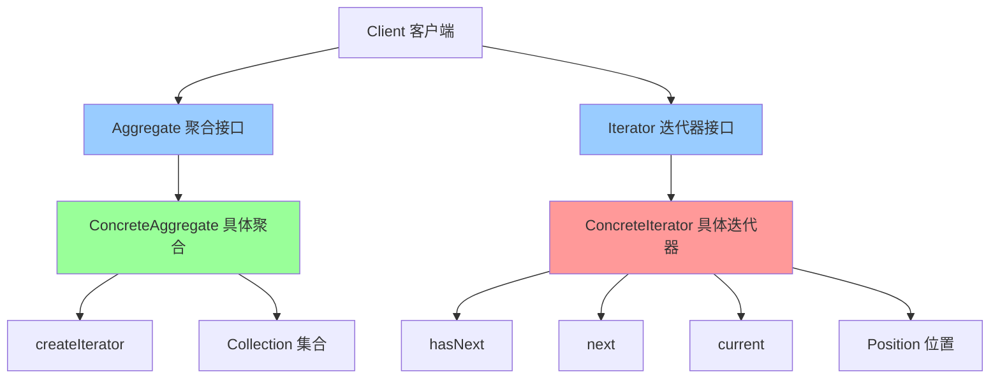

# 迭代器模式 (Iterator)

> 迭代器模式是一种行为型设计模式，提供一种方法顺序访问一个聚合对象中的各个元素，而又不暴露其内部的表示。

## 📋 概要

迭代器模式提供一种方法顺序访问一个聚合对象中的各个元素，而又不暴露其内部的表示。这种模式将遍历逻辑从聚合对象中分离出来，使得聚合对象和遍历逻辑可以独立变化。

### 核心原理

1. **迭代器接口**: 定义访问和遍历元素的接口
2. **具体迭代器**: 实现迭代器接口，跟踪当前遍历位置
3. **聚合接口**: 定义创建迭代器对象的接口
4. **具体聚合**: 实现聚合接口，返回具体迭代器实例
5. **客户端**: 使用迭代器遍历聚合对象

### 适用场景

- 需要访问聚合对象的内容而不暴露其内部结构
- 需要支持对聚合对象的多种遍历方式
- 需要为聚合对象提供一个统一的遍历接口
- 需要支持并行遍历
- 需要支持遍历过程中的修改操作

### 优点

- **封装性**: 封装了聚合对象的内部结构
- **统一接口**: 提供统一的遍历接口
- **多种遍历**: 支持多种遍历方式
- **并行遍历**: 支持多个迭代器同时遍历
- **扩展性**: 易于扩展新的遍历方式

### 缺点

- **复杂性**: 可能增加系统的复杂性
- **性能**: 可能带来一定的性能开销
- **内存**: 迭代器可能占用额外的内存

## 📋 迭代器模式架构图



## 🚀 基础实现

### 1. 简单迭代器实现

```dart
// 迭代器接口
abstract class Iterator<T> {
  bool hasNext();
  T next();
  T get current;
  void reset();
}

// 聚合接口
abstract class Aggregate<T> {
  Iterator<T> createIterator();
  int get length;
  T getAt(int index);
}

// 具体聚合
class BookCollection implements Aggregate<Book> {
  final List<Book> _books = [];

  void addBook(Book book) {
    _books.add(book);
  }

  void removeBook(Book book) {
    _books.remove(book);
  }

  @override
  Iterator<Book> createIterator() {
    return BookIterator(this);
  }

  @override
  int get length => _books.length;

  @override
  Book getAt(int index) {
    return _books[index];
  }
}

// 具体迭代器
class BookIterator implements Iterator<Book> {
  final BookCollection _collection;
  int _currentIndex = 0;

  BookIterator(this._collection);

  @override
  bool hasNext() {
    return _currentIndex < _collection.length;
  }

  @override
  Book next() {
    if (!hasNext()) {
      throw StateError('No more elements');
    }

    final book = _collection.getAt(_currentIndex);
    _currentIndex++;
    return book;
  }

  @override
  Book get current {
    if (_currentIndex >= _collection.length) {
      throw StateError('No current element');
    }
    return _collection.getAt(_currentIndex);
  }

  @override
  void reset() {
    _currentIndex = 0;
  }
}

// 产品类
class Book {
  final String title;
  final String author;
  final int year;

  Book({
    required this.title,
    required this.author,
    required this.year,
  });

  @override
  String toString() {
    return 'Book(title: $title, author: $author, year: $year)';
  }
}

// 使用示例
void main() {
  final collection = BookCollection();

  collection.addBook(Book(title: 'Design Patterns', author: 'GoF', year: 1994));
  collection.addBook(Book(title: 'Clean Code', author: 'Robert Martin', year: 2008));
  collection.addBook(Book(title: 'Refactoring', author: 'Martin Fowler', year: 1999));

  final iterator = collection.createIterator();

  print('=== 遍历书籍 ===');
  while (iterator.hasNext()) {
    final book = iterator.next();
    print(book);
  }

  print('\n=== 重置迭代器 ===');
  iterator.reset();
  while (iterator.hasNext()) {
    final book = iterator.next();
    print(book);
  }
}
```

### 2. 高级迭代器实现

```dart
// 高级迭代器接口
abstract class AdvancedIterator<T> {
  bool hasNext();
  T next();
  T get current;
  void reset();
  void remove();
  int get currentIndex;
  void setCurrentIndex(int index);
}

// 双向迭代器
abstract class BidirectionalIterator<T> extends AdvancedIterator<T> {
  bool hasPrevious();
  T previous();
  T get previous;
}

// 具体双向迭代器
class BidirectionalBookIterator implements BidirectionalIterator<Book> {
  final BookCollection _collection;
  int _currentIndex = 0;

  BidirectionalBookIterator(this._collection);

  @override
  bool hasNext() {
    return _currentIndex < _collection.length;
  }

  @override
  Book next() {
    if (!hasNext()) {
      throw StateError('No more elements');
    }

    final book = _collection.getAt(_currentIndex);
    _currentIndex++;
    return book;
  }

  @override
  bool hasPrevious() {
    return _currentIndex > 0;
  }

  @override
  Book previous() {
    if (!hasPrevious()) {
      throw StateError('No previous elements');
    }

    _currentIndex--;
    return _collection.getAt(_currentIndex);
  }

  @override
  Book get current {
    if (_currentIndex >= _collection.length) {
      throw StateError('No current element');
    }
    return _collection.getAt(_currentIndex);
  }

  @override
  Book get previous {
    if (_currentIndex <= 0) {
      throw StateError('No previous element');
    }
    return _collection.getAt(_currentIndex - 1);
  }

  @override
  void reset() {
    _currentIndex = 0;
  }

  @override
  void remove() {
    if (_currentIndex > 0) {
      _collection.removeBookAt(_currentIndex - 1);
      _currentIndex--;
    }
  }

  @override
  int get currentIndex => _currentIndex;

  @override
  void setCurrentIndex(int index) {
    if (index >= 0 && index <= _collection.length) {
      _currentIndex = index;
    }
  }
}

// 过滤迭代器
class FilterIterator<T> implements Iterator<T> {
  final Iterator<T> _iterator;
  final bool Function(T) _predicate;
  T? _nextElement;
  bool _hasNext = false;

  FilterIterator(this._iterator, this._predicate) {
    _findNext();
  }

  void _findNext() {
    while (_iterator.hasNext()) {
      final element = _iterator.next();
      if (_predicate(element)) {
        _nextElement = element;
        _hasNext = true;
        return;
      }
    }
    _hasNext = false;
  }

  @override
  bool hasNext() {
    return _hasNext;
  }

  @override
  T next() {
    if (!hasNext()) {
      throw StateError('No more elements');
    }

    final element = _nextElement!;
    _findNext();
    return element;
  }

  @override
  T get current {
    if (!_hasNext) {
      throw StateError('No current element');
    }
    return _nextElement!;
  }

  @override
  void reset() {
    _iterator.reset();
    _findNext();
  }
}

// 映射迭代器
class MapIterator<T, R> implements Iterator<R> {
  final Iterator<T> _iterator;
  final R Function(T) _mapper;

  MapIterator(this._iterator, this._mapper);

  @override
  bool hasNext() {
    return _iterator.hasNext();
  }

  @override
  R next() {
    return _mapper(_iterator.next());
  }

  @override
  R get current {
    return _mapper(_iterator.current);
  }

  @override
  void reset() {
    _iterator.reset();
  }
}

// 组合迭代器
class CompositeIterator<T> implements Iterator<T> {
  final List<Iterator<T>> _iterators;
  int _currentIteratorIndex = 0;

  CompositeIterator(this._iterators);

  @override
  bool hasNext() {
    if (_currentIteratorIndex >= _iterators.length) {
      return false;
    }

    if (_iterators[_currentIteratorIndex].hasNext()) {
      return true;
    }

    _currentIteratorIndex++;
    return hasNext();
  }

  @override
  T next() {
    if (!hasNext()) {
      throw StateError('No more elements');
    }

    return _iterators[_currentIteratorIndex].next();
  }

  @override
  T get current {
    if (_currentIteratorIndex >= _iterators.length) {
      throw StateError('No current element');
    }
    return _iterators[_currentIteratorIndex].current;
  }

  @override
  void reset() {
    _currentIteratorIndex = 0;
    for (final iterator in _iterators) {
      iterator.reset();
    }
  }
}

// 使用示例
void main() {
  final collection = BookCollection();

  collection.addBook(Book(title: 'Design Patterns', author: 'GoF', year: 1994));
  collection.addBook(Book(title: 'Clean Code', author: 'Robert Martin', year: 2008));
  collection.addBook(Book(title: 'Refactoring', author: 'Martin Fowler', year: 1999));
  collection.addBook(Book(title: 'Patterns of Enterprise Application Architecture', author: 'Martin Fowler', year: 2002));

  print('=== 双向迭代器 ===');
  final bidirectionalIterator = BidirectionalBookIterator(collection);

  // 向前遍历
  while (bidirectionalIterator.hasNext()) {
    print(bidirectionalIterator.next());
  }

  print('\n=== 向后遍历 ===');
  while (bidirectionalIterator.hasPrevious()) {
    print(bidirectionalIterator.previous());
  }

  print('\n=== 过滤迭代器 ===');
  final filterIterator = FilterIterator<Book>(
    collection.createIterator(),
    (book) => book.year >= 2000,
  );

  while (filterIterator.hasNext()) {
    print(filterIterator.next());
  }

  print('\n=== 映射迭代器 ===');
  final mapIterator = MapIterator<Book, String>(
    collection.createIterator(),
    (book) => '${book.title} (${book.year})',
  );

  while (mapIterator.hasNext()) {
    print(mapIterator.next());
  }
}
```

## 🔧 实际应用场景

### 1. Flutter 中的列表迭代器

```dart
// 自定义列表迭代器
class CustomListIterator<T> implements Iterator<T> {
  final List<T> _list;
  int _currentIndex = 0;

  CustomListIterator(this._list);

  @override
  bool hasNext() {
    return _currentIndex < _list.length;
  }

  @override
  T next() {
    if (!hasNext()) {
      throw StateError('No more elements');
    }

    return _list[_currentIndex++];
  }

  @override
  T get current {
    if (_currentIndex >= _list.length) {
      throw StateError('No current element');
    }
    return _list[_currentIndex];
  }

  @override
  void reset() {
    _currentIndex = 0;
  }
}

// 分页迭代器
class PaginatedIterator<T> implements Iterator<List<T>> {
  final List<T> _data;
  final int _pageSize;
  int _currentPage = 0;

  PaginatedIterator(this._data, this._pageSize);

  @override
  bool hasNext() {
    return _currentPage * _pageSize < _data.length;
  }

  @override
  List<T> next() {
    if (!hasNext()) {
      throw StateError('No more pages');
    }

    final startIndex = _currentPage * _pageSize;
    final endIndex = (startIndex + _pageSize).clamp(0, _data.length);
    final page = _data.sublist(startIndex, endIndex);

    _currentPage++;
    return page;
  }

  @override
  List<T> get current {
    final startIndex = _currentPage * _pageSize;
    final endIndex = (startIndex + _pageSize).clamp(0, _data.length);
    return _data.sublist(startIndex, endIndex);
  }

  @override
  void reset() {
    _currentPage = 0;
  }

  int get totalPages => (_data.length / _pageSize).ceil();
  int get currentPageNumber => _currentPage;
}

// Flutter Widget 中的使用
class IteratorWidget extends StatefulWidget {
  @override
  _IteratorWidgetState createState() => _IteratorWidgetState();
}

class _IteratorWidgetState extends State<IteratorWidget> {
  final List<String> _items = List.generate(100, (i) => 'Item $i');
  late PaginatedIterator<String> _paginatedIterator;
  List<String> _currentPage = [];
  int _currentPageNumber = 0;

  @override
  void initState() {
    super.initState();
    _paginatedIterator = PaginatedIterator(_items, 10);
    _loadNextPage();
  }

  void _loadNextPage() {
    if (_paginatedIterator.hasNext()) {
      setState(() {
        _currentPage = _paginatedIterator.next();
        _currentPageNumber = _paginatedIterator.currentPageNumber;
      });
    }
  }

  void _reset() {
    setState(() {
      _paginatedIterator.reset();
      _currentPage = [];
      _currentPageNumber = 0;
    });
  }

  @override
  Widget build(BuildContext context) {
    return Scaffold(
      appBar: AppBar(
        title: Text('迭代器模式示例'),
        actions: [
          IconButton(
            icon: Icon(Icons.refresh),
            onPressed: _reset,
          ),
        ],
      ),
      body: Column(
        children: [
          // 页面信息
          Container(
            padding: EdgeInsets.all(16),
            color: Colors.blue.shade50,
            child: Row(
              mainAxisAlignment: MainAxisAlignment.spaceBetween,
              children: [
                Text('当前页: $_currentPageNumber'),
                Text('总页数: ${_paginatedIterator.totalPages}'),
              ],
            ),
          ),

          // 列表内容
          Expanded(
            child: ListView.builder(
              itemCount: _currentPage.length,
              itemBuilder: (context, index) {
                return ListTile(
                  title: Text(_currentPage[index]),
                  leading: CircleAvatar(
                    child: Text('${_currentPageNumber * 10 + index + 1}'),
                  ),
                );
              },
            ),
          ),

          // 分页控制
          Container(
            padding: EdgeInsets.all(16),
            child: Row(
              mainAxisAlignment: MainAxisAlignment.spaceEvenly,
              children: [
                ElevatedButton(
                  onPressed: _currentPageNumber > 1 ? _loadPreviousPage : null,
                  child: Text('上一页'),
                ),
                ElevatedButton(
                  onPressed: _paginatedIterator.hasNext() ? _loadNextPage : null,
                  child: Text('下一页'),
                ),
              ],
            ),
          ),
        ],
      ),
    );
  }

  void _loadPreviousPage() {
    // 这里需要实现上一页逻辑
    // 为了简化，我们重置到第一页
    _reset();
    _loadNextPage();
  }
}
```

### 2. 文件系统迭代器

```dart
// 文件系统项
abstract class FileSystemItem {
  String get name;
  String get path;
  bool get isDirectory;
  int get size;
  DateTime get lastModified;
}

// 文件
class File implements FileSystemItem {
  final String _name;
  final String _path;
  final int _size;
  final DateTime _lastModified;

  File(this._name, this._path, this._size, this._lastModified);

  @override
  String get name => _name;

  @override
  String get path => _path;

  @override
  bool get isDirectory => false;

  @override
  int get size => _size;

  @override
  DateTime get lastModified => _lastModified;
}

// 目录
class Directory implements FileSystemItem {
  final String _name;
  final String _path;
  final DateTime _lastModified;
  final List<FileSystemItem> _children = [];

  Directory(this._name, this._path, this._lastModified);

  @override
  String get name => _name;

  @override
  String get path => _path;

  @override
  bool get isDirectory => true;

  @override
  int get size => _children.fold(0, (sum, item) => sum + item.size);

  @override
  DateTime get lastModified => _lastModified;

  void addChild(FileSystemItem item) {
    _children.add(item);
  }

  List<FileSystemItem> get children => List.unmodifiable(_children);
}

// 文件系统迭代器
class FileSystemIterator implements Iterator<FileSystemItem> {
  final List<FileSystemItem> _items;
  int _currentIndex = 0;

  FileSystemIterator(this._items);

  @override
  bool hasNext() {
    return _currentIndex < _items.length;
  }

  @override
  FileSystemItem next() {
    if (!hasNext()) {
      throw StateError('No more elements');
    }

    return _items[_currentIndex++];
  }

  @override
  FileSystemItem get current {
    if (_currentIndex >= _items.length) {
      throw StateError('No current element');
    }
    return _items[_currentIndex];
  }

  @override
  void reset() {
    _currentIndex = 0;
  }
}

// 递归文件系统迭代器
class RecursiveFileSystemIterator implements Iterator<FileSystemItem> {
  final Directory _root;
  final List<FileSystemItem> _stack = [];
  int _currentIndex = 0;

  RecursiveFileSystemIterator(this._root) {
    _buildStack(_root);
  }

  void _buildStack(Directory directory) {
    for (final item in directory.children) {
      _stack.add(item);
      if (item.isDirectory) {
        _buildStack(item as Directory);
      }
    }
  }

  @override
  bool hasNext() {
    return _currentIndex < _stack.length;
  }

  @override
  FileSystemItem next() {
    if (!hasNext()) {
      throw StateError('No more elements');
    }

    return _stack[_currentIndex++];
  }

  @override
  FileSystemItem get current {
    if (_currentIndex >= _stack.length) {
      throw StateError('No current element');
    }
    return _stack[_currentIndex];
  }

  @override
  void reset() {
    _currentIndex = 0;
  }
}

// 文件系统管理器
class FileSystemManager {
  final Directory _root;

  FileSystemManager(this._root);

  Iterator<FileSystemItem> createIterator() {
    return FileSystemIterator(_root.children);
  }

  Iterator<FileSystemItem> createRecursiveIterator() {
    return RecursiveFileSystemIterator(_root);
  }

  Iterator<FileSystemItem> createFilteredIterator(bool Function(FileSystemItem) predicate) {
    return FilterIterator(createIterator(), predicate);
  }

  Iterator<FileSystemItem> createDirectoryIterator() {
    return createFilteredIterator((item) => item.isDirectory);
  }

  Iterator<FileSystemItem> createFileIterator() {
    return createFilteredIterator((item) => !item.isDirectory);
  }

  Iterator<FileSystemItem> createLargeFileIterator(int minSize) {
    return createFilteredIterator((item) => !item.isDirectory && item.size >= minSize);
  }
}

// 使用示例
void main() {
  // 创建文件系统结构
  final root = Directory('root', '/', DateTime.now());

  final documents = Directory('Documents', '/Documents', DateTime.now());
  final pictures = Directory('Pictures', '/Pictures', DateTime.now());

  documents.addChild(File('report.pdf', '/Documents/report.pdf', 1024 * 1024, DateTime.now()));
  documents.addChild(File('presentation.pptx', '/Documents/presentation.pptx', 2048 * 1024, DateTime.now()));

  pictures.addChild(File('photo1.jpg', '/Pictures/photo1.jpg', 512 * 1024, DateTime.now()));
  pictures.addChild(File('photo2.jpg', '/Pictures/photo2.jpg', 768 * 1024, DateTime.now()));

  root.addChild(documents);
  root.addChild(pictures);
  root.addChild(File('readme.txt', '/readme.txt', 1024, DateTime.now()));

  final manager = FileSystemManager(root);

  print('=== 所有项目 ===');
  final allIterator = manager.createIterator();
  while (allIterator.hasNext()) {
    final item = allIterator.next();
    print('${item.name} (${item.isDirectory ? '目录' : '文件'})');
  }

  print('\n=== 递归遍历 ===');
  final recursiveIterator = manager.createRecursiveIterator();
  while (recursiveIterator.hasNext()) {
    final item = recursiveIterator.next();
    print('${item.path} (${item.isDirectory ? '目录' : '文件'})');
  }

  print('\n=== 只显示目录 ===');
  final directoryIterator = manager.createDirectoryIterator();
  while (directoryIterator.hasNext()) {
    final item = directoryIterator.next();
    print('${item.name} (目录)');
  }

  print('\n=== 只显示文件 ===');
  final fileIterator = manager.createFileIterator();
  while (fileIterator.hasNext()) {
    final item = fileIterator.next();
    print('${item.name} (文件, ${item.size} bytes)');
  }

  print('\n=== 大文件 (>1MB) ===');
  final largeFileIterator = manager.createLargeFileIterator(1024 * 1024);
  while (largeFileIterator.hasNext()) {
    final item = largeFileIterator.next();
    print('${item.name} (${item.size} bytes)');
  }
}
```

## 🧪 测试和调试

### 1. 迭代器模式单元测试

```dart
// test/iterator_test.dart
import 'package:flutter_test/flutter_test.dart';
import 'package:myapp/iterator.dart';

void main() {
  group('迭代器模式测试', () {
    late BookCollection collection;
    late Iterator<Book> iterator;

    setUp(() {
      collection = BookCollection();
      collection.addBook(Book(title: 'Book1', author: 'Author1', year: 2000));
      collection.addBook(Book(title: 'Book2', author: 'Author2', year: 2001));
      collection.addBook(Book(title: 'Book3', author: 'Author3', year: 2002));

      iterator = collection.createIterator();
    });

    test('应该正确遍历所有元素', () {
      final books = <Book>[];

      while (iterator.hasNext()) {
        books.add(iterator.next());
      }

      expect(books.length, equals(3));
      expect(books[0].title, equals('Book1'));
      expect(books[1].title, equals('Book2'));
      expect(books[2].title, equals('Book3'));
    });

    test('应该正确处理空集合', () {
      final emptyCollection = BookCollection();
      final emptyIterator = emptyCollection.createIterator();

      expect(emptyIterator.hasNext(), isFalse);
      expect(() => emptyIterator.next(), throwsStateError);
    });

    test('应该正确重置迭代器', () {
      // 第一次遍历
      final firstBooks = <Book>[];
      while (iterator.hasNext()) {
        firstBooks.add(iterator.next());
      }

      // 重置
      iterator.reset();

      // 第二次遍历
      final secondBooks = <Book>[];
      while (iterator.hasNext()) {
        secondBooks.add(iterator.next());
      }

      expect(firstBooks.length, equals(secondBooks.length));
      for (int i = 0; i < firstBooks.length; i++) {
        expect(firstBooks[i].title, equals(secondBooks[i].title));
      }
    });

    test('应该正确处理当前元素', () {
      expect(iterator.hasNext(), isTrue);
      expect(iterator.current.title, equals('Book1'));

      iterator.next();
      expect(iterator.current.title, equals('Book2'));
    });
  });

  group('过滤迭代器测试', () {
    late BookCollection collection;

    setUp(() {
      collection = BookCollection();
      collection.addBook(Book(title: 'Book1', author: 'Author1', year: 2000));
      collection.addBook(Book(title: 'Book2', author: 'Author2', year: 2005));
      collection.addBook(Book(title: 'Book3', author: 'Author3', year: 2010));
    });

    test('应该正确过滤元素', () {
      final filterIterator = FilterIterator<Book>(
        collection.createIterator(),
        (book) => book.year >= 2005,
      );

      final filteredBooks = <Book>[];
      while (filterIterator.hasNext()) {
        filteredBooks.add(filterIterator.next());
      }

      expect(filteredBooks.length, equals(2));
      expect(filteredBooks[0].title, equals('Book2'));
      expect(filteredBooks[1].title, equals('Book3'));
    });

    test('应该正确处理空过滤结果', () {
      final filterIterator = FilterIterator<Book>(
        collection.createIterator(),
        (book) => book.year > 2020,
      );

      expect(filterIterator.hasNext(), isFalse);
      expect(() => filterIterator.next(), throwsStateError);
    });
  });

  group('映射迭代器测试', () {
    late BookCollection collection;

    setUp(() {
      collection = BookCollection();
      collection.addBook(Book(title: 'Book1', author: 'Author1', year: 2000));
      collection.addBook(Book(title: 'Book2', author: 'Author2', year: 2001));
    });

    test('应该正确映射元素', () {
      final mapIterator = MapIterator<Book, String>(
        collection.createIterator(),
        (book) => '${book.title} by ${book.author}',
      );

      final mappedResults = <String>[];
      while (mapIterator.hasNext()) {
        mappedResults.add(mapIterator.next());
      }

      expect(mappedResults.length, equals(2));
      expect(mappedResults[0], equals('Book1 by Author1'));
      expect(mappedResults[1], equals('Book2 by Author2'));
    });
  });
}
```

### 2. 性能测试

```dart
// benchmark/iterator_benchmark.dart
class IteratorBenchmark {
  static Future<void> runPerformanceTests() async {
    print('=== 迭代器模式性能测试 ===');

    await _testBasicIteratorPerformance();
    await _testFilterIteratorPerformance();
    await _testMapIteratorPerformance();
    await _testMemoryUsage();
  }

  static Future<void> _testBasicIteratorPerformance() async {
    const itemCount = 100000;
    final items = List.generate(itemCount, (i) => 'Item$i');

    final stopwatch = Stopwatch()..start();

    final iterator = CustomListIterator(items);
    int count = 0;

    while (iterator.hasNext()) {
      iterator.next();
      count++;
    }

    stopwatch.stop();

    expect(count, equals(itemCount));
    print('遍历 $itemCount 个元素耗时: ${stopwatch.elapsedMilliseconds}ms');
  }

  static Future<void> _testFilterIteratorPerformance() async {
    const itemCount = 100000;
    final items = List.generate(itemCount, (i) => i);

    final stopwatch = Stopwatch()..start();

    final filterIterator = FilterIterator<int>(
      CustomListIterator(items),
      (item) => item % 2 == 0,
    );

    int count = 0;
    while (filterIterator.hasNext()) {
      filterIterator.next();
      count++;
    }

    stopwatch.stop();

    expect(count, equals(itemCount ~/ 2));
    print('过滤遍历 $itemCount 个元素耗时: ${stopwatch.elapsedMilliseconds}ms');
  }

  static Future<void> _testMapIteratorPerformance() async {
    const itemCount = 100000;
    final items = List.generate(itemCount, (i) => i);

    final stopwatch = Stopwatch()..start();

    final mapIterator = MapIterator<int, String>(
      CustomListIterator(items),
      (item) => 'Item$item',
    );

    int count = 0;
    while (mapIterator.hasNext()) {
      mapIterator.next();
      count++;
    }

    stopwatch.stop();

    expect(count, equals(itemCount));
    print('映射遍历 $itemCount 个元素耗时: ${stopwatch.elapsedMilliseconds}ms');
  }

  static Future<void> _testMemoryUsage() async {
    const itemCount = 10000;
    final items = List.generate(itemCount, (i) => 'Item$i');

    final initialMemory = ProcessInfo.currentRss;

    // 创建多个迭代器
    final iterators = <Iterator<String>>[];
    for (int i = 0; i < 100; i++) {
      iterators.add(CustomListIterator(items));
    }

    // 使用迭代器
    for (final iterator in iterators) {
      while (iterator.hasNext()) {
        iterator.next();
      }
    }

    final finalMemory = ProcessInfo.currentRss;
    final memoryUsed = finalMemory - initialMemory;

    print('内存使用: ${(memoryUsed / 1024 / 1024).toStringAsFixed(2)}MB');
  }
}

void main() async {
  await IteratorBenchmark.runPerformanceTests();
}
```

## 📚 最佳实践

### 1. 设计原则

- **单一职责**: 每个迭代器只负责一种遍历方式
- **开闭原则**: 新增遍历方式不需要修改现有代码
- **封装性**: 隐藏聚合对象的内部结构
- **一致性**: 提供一致的遍历接口

### 2. 性能优化

- **延迟计算**: 延迟计算下一个元素
- **缓存**: 缓存已计算的结果
- **并行遍历**: 支持并行遍历提高性能
- **内存管理**: 及时释放不需要的资源

### 3. 错误处理

- **边界检查**: 检查遍历边界
- **异常处理**: 提供清晰的错误信息
- **状态验证**: 验证迭代器状态
- **并发安全**: 确保并发遍历的安全性

### 4. 调试技巧

- **状态追踪**: 追踪迭代器的状态变化
- **性能监控**: 监控遍历性能
- **内存分析**: 分析内存使用情况
- **并发调试**: 调试并发遍历问题

## 🎯 小结

迭代器模式是遍历聚合对象的强大工具，特别适合需要隐藏内部结构、支持多种遍历方式的场景。在 Flutter 开发中，它可以用于列表遍历、文件系统遍历、数据流处理等。

### 选择建议

- **简单遍历**: 使用语言内置的迭代器
- **复杂遍历**: 使用自定义迭代器
- **多种遍历**: 使用不同的迭代器实现
- **性能敏感**: 注意迭代器的性能优化

### 关键要点

1. **迭代器设计**: 合理设计迭代器的接口和方法
2. **封装性**: 隐藏聚合对象的内部结构
3. **性能考虑**: 注意迭代器的性能开销
4. **错误处理**: 提供完善的错误处理机制
5. **可扩展性**: 设计易于扩展的迭代器

---

> 💡 **提示**: 迭代器模式是遍历聚合对象的优秀方案，但要避免过度使用和过度复杂。建议在真正需要隐藏内部结构、支持多种遍历方式的场景中使用，并注意性能优化和错误处理。
