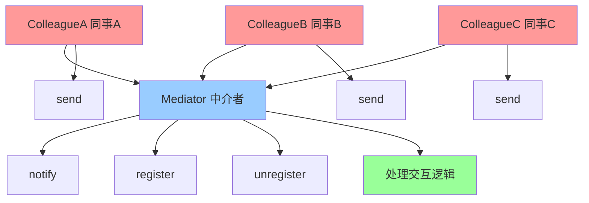

# 中介者模式 (Mediator)

> 中介者模式是一种行为型设计模式，定义一个中介对象来封装一系列对象交互，使对象之间不需要显式地相互引用，从而使其耦合松散。

## 📋 概要

中介者模式通过引入中介者对象来封装对象间的交互，使对象之间不需要直接相互引用，从而降低它们之间的耦合度。中介者负责协调各个对象之间的通信。

### 核心原理

1. **中介者**: 定义对象间交互的接口
2. **具体中介者**: 实现中介者接口，协调各个对象
3. **同事对象**: 需要与其他对象交互的对象
4. **抽象同事**: 定义同事对象的接口
5. **具体同事**: 实现同事对象的具体行为

### 适用场景

- 对象间存在复杂的交互关系
- 需要降低对象间的耦合度
- 需要集中控制对象间的通信
- 需要简化对象间的交互逻辑
- 需要支持对象间的动态交互

### 优点

- **降低耦合**: 减少对象间的直接依赖
- **集中控制**: 集中管理对象间的交互
- **易于维护**: 简化对象间的交互逻辑
- **易于扩展**: 容易添加新的同事对象
- **简化通信**: 简化对象间的通信方式

### 缺点

- **复杂性**: 中介者可能变得复杂
- **性能影响**: 可能影响系统性能
- **调试困难**: 中介者逻辑可能难以调试
- **单点故障**: 中介者成为单点故障

## 📋 中介者模式架构图



## 🚀 基础实现

### 1. 简单中介者实现

```dart
// 抽象中介者
abstract class Mediator {
  void register(Colleague colleague);
  void unregister(Colleague colleague);
  void notify(Colleague sender, String event);
}

// 抽象同事
abstract class Colleague {
  final Mediator _mediator;
  final String _name;

  Colleague(this._mediator, this._name);

  Mediator get mediator => _mediator;
  String get name => _name;

  void send(String event);
  void receive(String event);
}

// 具体中介者
class ConcreteMediator implements Mediator {
  final Map<String, Colleague> _colleagues = {};

  @override
  void register(Colleague colleague) {
    _colleagues[colleague.name] = colleague;
    print('注册同事: ${colleague.name}');
  }

  @override
  void unregister(Colleague colleague) {
    _colleagues.remove(colleague.name);
    print('注销同事: ${colleague.name}');
  }

  @override
  void notify(Colleague sender, String event) {
    print('中介者收到来自 ${sender.name} 的事件: $event');

    // 根据事件类型处理不同的交互逻辑
    switch (event) {
      case 'start':
        _handleStartEvent(sender);
        break;
      case 'stop':
        _handleStopEvent(sender);
        break;
      case 'update':
        _handleUpdateEvent(sender);
        break;
      default:
        _handleDefaultEvent(sender, event);
    }
  }

  void _handleStartEvent(Colleague sender) {
    print('处理开始事件');
    // 通知其他同事开始工作
    for (final colleague in _colleagues.values) {
      if (colleague != sender) {
        colleague.receive('started_by_${sender.name}');
      }
    }
  }

  void _handleStopEvent(Colleague sender) {
    print('处理停止事件');
    // 通知其他同事停止工作
    for (final colleague in _colleagues.values) {
      if (colleague != sender) {
        colleague.receive('stopped_by_${sender.name}');
      }
    }
  }

  void _handleUpdateEvent(Colleague sender) {
    print('处理更新事件');
    // 通知其他同事更新状态
    for (final colleague in _colleagues.values) {
      if (colleague != sender) {
        colleague.receive('updated_by_${sender.name}');
      }
    }
  }

  void _handleDefaultEvent(Colleague sender, String event) {
    print('处理默认事件: $event');
    // 广播事件给所有同事
    for (final colleague in _colleagues.values) {
      if (colleague != sender) {
        colleague.receive(event);
      }
    }
  }
}

// 具体同事A
class ConcreteColleagueA extends Colleague {
  ConcreteColleagueA(Mediator mediator, String name) : super(mediator, name);

  @override
  void send(String event) {
    print('${name} 发送事件: $event');
    mediator.notify(this, event);
  }

  @override
  void receive(String event) {
    print('${name} 收到事件: $event');
    // 处理收到的事件
    _handleReceivedEvent(event);
  }

  void _handleReceivedEvent(String event) {
    switch (event) {
      case 'started_by_ColleagueB':
        print('${name} 响应 ColleagueB 的开始事件');
        break;
      case 'stopped_by_ColleagueC':
        print('${name} 响应 ColleagueC 的停止事件');
        break;
      default:
        print('${name} 处理事件: $event');
    }
  }

  void doWork() {
    print('${name} 开始工作');
    send('start');
  }

  void finishWork() {
    print('${name} 完成工作');
    send('stop');
  }
}

// 具体同事B
class ConcreteColleagueB extends Colleague {
  ConcreteColleagueB(Mediator mediator, String name) : super(mediator, name);

  @override
  void send(String event) {
    print('${name} 发送事件: $event');
    mediator.notify(this, event);
  }

  @override
  void receive(String event) {
    print('${name} 收到事件: $event');
    _handleReceivedEvent(event);
  }

  void _handleReceivedEvent(String event) {
    switch (event) {
      case 'started_by_ColleagueA':
        print('${name} 响应 ColleagueA 的开始事件');
        break;
      case 'updated_by_ColleagueC':
        print('${name} 响应 ColleagueC 的更新事件');
        break;
      default:
        print('${name} 处理事件: $event');
    }
  }

  void updateData() {
    print('${name} 更新数据');
    send('update');
  }
}

// 具体同事C
class ConcreteColleagueC extends Colleague {
  ConcreteColleagueC(Mediator mediator, String name) : super(mediator, name);

  @override
  void send(String event) {
    print('${name} 发送事件: $event');
    mediator.notify(this, event);
  }

  @override
  void receive(String event) {
    print('${name} 收到事件: $event');
    _handleReceivedEvent(event);
  }

  void _handleReceivedEvent(String event) {
    switch (event) {
      case 'started_by_ColleagueA':
        print('${name} 响应 ColleagueA 的开始事件');
        break;
      case 'stopped_by_ColleagueB':
        print('${name} 响应 ColleagueB 的停止事件');
        break;
      default:
        print('${name} 处理事件: $event');
    }
  }

  void processData() {
    print('${name} 处理数据');
    send('process');
  }
}

// 使用示例
void main() {
  final mediator = ConcreteMediator();

  final colleagueA = ConcreteColleagueA(mediator, 'ColleagueA');
  final colleagueB = ConcreteColleagueB(mediator, 'ColleagueB');
  final colleagueC = ConcreteColleagueC(mediator, 'ColleagueC');

  // 注册同事
  mediator.register(colleagueA);
  mediator.register(colleagueB);
  mediator.register(colleagueC);

  print('=== 开始交互 ===');

  // 同事A开始工作
  colleagueA.doWork();

  print('\n--- 分隔线 ---\n');

  // 同事B更新数据
  colleagueB.updateData();

  print('\n--- 分隔线 ---\n');

  // 同事C处理数据
  colleagueC.processData();

  print('\n--- 分隔线 ---\n');

  // 同事A完成工作
  colleagueA.finishWork();
}
```

## 🎯 小结

中介者模式是管理复杂对象交互的强大工具，特别适合需要降低对象间耦合度的场景。在 Flutter 开发中，它可以用于状态管理、网络请求、UI 组件交互等。

### 选择建议

- **复杂交互**: 对象间存在复杂的交互关系
- **耦合降低**: 需要降低对象间的耦合度
- **集中控制**: 需要集中控制对象间的通信
- **动态交互**: 需要支持对象间的动态交互

### 关键要点

1. **中介者设计**: 设计合适的中介者接口
2. **交互逻辑**: 合理封装交互逻辑
3. **性能考虑**: 注意中介者的性能影响
4. **错误处理**: 提供完善的错误处理机制
5. **扩展性**: 保持系统的扩展性

---

> 💡 **提示**: 中介者模式是管理复杂交互的优秀方案，但要避免中介者变得过于复杂。建议在真正需要降低对象间耦合度的场景中使用，并注意性能优化和错误处理。
