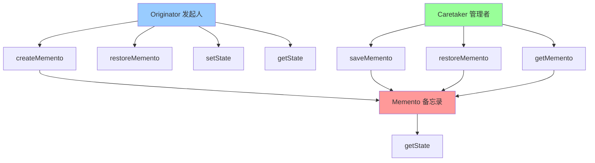

# 备忘录模式 (Memento)

> 备忘录模式是一种行为型设计模式，在不破坏封装性的前提下，捕获并外部化一个对象的内部状态，以便以后可以将该对象恢复到之前保存的状态。

## 📋 概要

备忘录模式允许在不暴露对象实现细节的情况下保存和恢复对象的内部状态。这种模式通过创建一个备忘录对象来存储原始对象的状态，并在需要时恢复。

### 核心原理

1. **发起人(Originator)**: 需要保存状态的对象
2. **备忘录(Memento)**: 存储发起人内部状态的对象
3. **管理者(Caretaker)**: 负责保存和恢复备忘录的对象
4. **状态保存**: 捕获对象的当前状态
5. **状态恢复**: 将对象恢复到之前的状态

### 适用场景

- 需要保存对象的历史状态
- 需要实现撤销/重做功能
- 需要保存对象的快照
- 需要实现状态回滚
- 需要保护对象状态的封装性

### 优点

- **状态保护**: 保护对象状态的封装性
- **历史管理**: 支持状态历史管理
- **撤销功能**: 实现撤销/重做功能
- **状态隔离**: 状态与对象分离
- **易于扩展**: 容易添加新的状态管理功能

### 缺点

- **内存使用**: 可能占用大量内存
- **性能影响**: 状态保存和恢复可能影响性能
- **复杂性**: 增加系统的复杂性
- **状态同步**: 需要处理状态同步问题

## 📋 备忘录模式架构图



## 🚀 基础实现

### 1. 简单备忘录实现

```dart
// 备忘录接口
abstract class Memento {
  String getState();
}

// 具体备忘录
class ConcreteMemento implements Memento {
  final String _state;
  final DateTime _timestamp;
  
  ConcreteMemento(this._state) : _timestamp = DateTime.now();
  
  @override
  String getState() => _state;
  
  DateTime get timestamp => _timestamp;
  
  @override
  String toString() {
    return 'Memento{state: $_state, timestamp: $_timestamp}';
  }
}

// 发起人
class Originator {
  String _state = '';
  
  String get state => _state;
  
  void setState(String state) {
    print('设置状态: $state');
    _state = state;
  }
  
  // 创建备忘录
  Memento createMemento() {
    print('创建备忘录，当前状态: $_state');
    return ConcreteMemento(_state);
  }
  
  // 从备忘录恢复状态
  void restoreMemento(Memento memento) {
    _state = memento.getState();
    print('从备忘录恢复状态: $_state');
  }
  
  void showState() {
    print('当前状态: $_state');
  }
}

// 管理者
class Caretaker {
  final List<Memento> _mementos = [];
  
  void saveMemento(Memento memento) {
    _mementos.add(memento);
    print('保存备忘录: ${_mementos.length}');
  }
  
  Memento? getMemento(int index) {
    if (index >= 0 && index < _mementos.length) {
      return _mementos[index];
    }
    return null;
  }
  
  Memento? getLastMemento() {
    if (_mementos.isNotEmpty) {
      return _mementos.last;
    }
    return null;
  }
  
  void showHistory() {
    print('备忘录历史:');
    for (int i = 0; i < _mementos.length; i++) {
      print('  $i: ${_mementos[i]}');
    }
  }
  
  int get mementosCount => _mementos.length;
}

// 使用示例
void main() {
  final originator = Originator();
  final caretaker = Caretaker();
  
  print('=== 备忘录模式演示 ===');
  
  // 设置初始状态
  originator.setState('初始状态');
  caretaker.saveMemento(originator.createMemento());
  
  // 修改状态
  originator.setState('状态1');
  caretaker.saveMemento(originator.createMemento());
  
  originator.setState('状态2');
  caretaker.saveMemento(originator.createMemento());
  
  originator.setState('状态3');
  caretaker.saveMemento(originator.createMemento());
  
  // 显示历史
  caretaker.showHistory();
  
  print('\n=== 状态恢复 ===');
  
  // 恢复到状态2
  final memento2 = caretaker.getMemento(2);
  if (memento2 != null) {
    originator.restoreMemento(memento2);
    originator.showState();
  }
  
  // 恢复到初始状态
  final memento0 = caretaker.getMemento(0);
  if (memento0 != null) {
    originator.restoreMemento(memento0);
    originator.showState();
  }
  
  // 恢复到最后一个状态
  final lastMemento = caretaker.getLastMemento();
  if (lastMemento != null) {
    originator.restoreMemento(lastMemento);
    originator.showState();
  }
}
```

### 2. 文本编辑器备忘录

```dart
// 文本编辑器备忘录
class TextMemento implements Memento {
  final String _content;
  final int _cursorPosition;
  final DateTime _timestamp;
  
  TextMemento(this._content, this._cursorPosition) : _timestamp = DateTime.now();
  
  @override
  String getState() => '$_content|$_cursorPosition';
  
  String get content => _content;
  int get cursorPosition => _cursorPosition;
  DateTime get timestamp => _timestamp;
  
  @override
  String toString() {
    return 'TextMemento{content: "${_content.length} chars", cursor: $_cursorPosition, time: $_timestamp}';
  }
}

// 文本编辑器
class TextEditor {
  String _content = '';
  int _cursorPosition = 0;
  
  String get content => _content;
  int get cursorPosition => _cursorPosition;
  
  void setContent(String content) {
    _content = content;
    _cursorPosition = content.length;
    print('设置内容: "${_content.length} 字符"');
  }
  
  void insertText(String text) {
    final before = _content.substring(0, _cursorPosition);
    final after = _content.substring(_cursorPosition);
    _content = before + text + after;
    _cursorPosition += text.length;
    print('插入文本: "$text"');
  }
  
  void deleteText(int count) {
    if (count > 0 && _cursorPosition >= count) {
      final before = _content.substring(0, _cursorPosition - count);
      final after = _content.substring(_cursorPosition);
      _content = before + after;
      _cursorPosition -= count;
      print('删除文本: $count 字符');
    }
  }
  
  void moveCursor(int position) {
    if (position >= 0 && position <= _content.length) {
      _cursorPosition = position;
      print('移动光标到位置: $_cursorPosition');
    }
  }
  
  Memento createMemento() {
    return TextMemento(_content, _cursorPosition);
  }
  
  void restoreMemento(Memento memento) {
    if (memento is TextMemento) {
      _content = memento.content;
      _cursorPosition = memento.cursorPosition;
      print('恢复文本状态: "${_content.length} 字符", 光标位置: $_cursorPosition');
    }
  }
  
  void showContent() {
    print('内容: "$_content"');
    print('光标位置: $_cursorPosition');
    if (_cursorPosition < _content.length) {
      final charAtCursor = _content[_cursorPosition];
      print('光标处字符: "$charAtCursor"');
    }
  }
}

// 文本编辑器历史管理器
class TextHistoryManager {
  final List<TextMemento> _history = [];
  int _currentIndex = -1;
  static const int maxHistorySize = 50;
  
  void saveState(TextMemento memento) {
    // 移除当前位置之后的历史记录
    if (_currentIndex < _history.length - 1) {
      _history.removeRange(_currentIndex + 1, _history.length);
    }
    
    // 添加新的备忘录
    _history.add(memento);
    _currentIndex = _history.length - 1;
    
    // 限制历史记录大小
    if (_history.length > maxHistorySize) {
      _history.removeAt(0);
      _currentIndex--;
    }
    
    print('保存状态: ${_history.length} 个历史记录');
  }
  
  TextMemento? undo() {
    if (_currentIndex > 0) {
      _currentIndex--;
      print('撤销到状态: $_currentIndex');
      return _history[_currentIndex];
    }
    print('无法撤销');
    return null;
  }
  
  TextMemento? redo() {
    if (_currentIndex < _history.length - 1) {
      _currentIndex++;
      print('重做到状态: $_currentIndex');
      return _history[_currentIndex];
    }
    print('无法重做');
    return null;
  }
  
  bool get canUndo => _currentIndex > 0;
  bool get canRedo => _currentIndex < _history.length - 1;
  
  void showHistory() {
    print('历史记录 (当前: $_currentIndex):');
    for (int i = 0; i < _history.length; i++) {
      final marker = i == _currentIndex ? '>' : ' ';
      print('  $marker $i: ${_history[i]}');
    }
  }
  
  void clearHistory() {
    _history.clear();
    _currentIndex = -1;
    print('清除历史记录');
  }
}

// 使用示例
void main() {
  final editor = TextEditor();
  final historyManager = TextHistoryManager();
  
  print('=== 文本编辑器备忘录演示 ===');
  
  // 初始状态
  editor.setContent('Hello');
  historyManager.saveState(editor.createMemento() as TextMemento);
  
  // 编辑操作
  editor.insertText(' World');
  historyManager.saveState(editor.createMemento() as TextMemento);
  
  editor.insertText('!');
  historyManager.saveState(editor.createMemento() as TextMemento);
  
  editor.moveCursor(5);
  editor.insertText(' Beautiful');
  historyManager.saveState(editor.createMemento() as TextMemento);
  
  editor.moveCursor(0);
  editor.insertText('Say: ');
  historyManager.saveState(editor.createMemento() as TextMemento);
  
  print('\n当前内容:');
  editor.showContent();
  
  print('\n=== 历史记录 ===');
  historyManager.showHistory();
  
  print('\n=== 撤销操作 ===');
  
  // 撤销
  final undoMemento = historyManager.undo();
  if (undoMemento != null) {
    editor.restoreMemento(undoMemento);
    editor.showContent();
  }
  
  // 再次撤销
  final undoMemento2 = historyManager.undo();
  if (undoMemento2 != null) {
    editor.restoreMemento(undoMemento2);
    editor.showContent();
  }
  
  print('\n=== 重做操作 ===');
  
  // 重做
  final redoMemento = historyManager.redo();
  if (redoMemento != null) {
    editor.restoreMemento(redoMemento);
    editor.showContent();
  }
  
  print('\n=== 最终历史记录 ===');
  historyManager.showHistory();
}
```

## 🧪 测试和调试

### 1. 备忘录模式单元测试

```dart
// test/memento_test.dart
import 'package:flutter_test/flutter_test.dart';
import 'package:myapp/memento.dart';

void main() {
  group('备忘录模式测试', () {
    test('应该正确创建备忘录', () {
      final originator = Originator();
      originator.setState('test state');
      
      final memento = originator.createMemento();
      
      expect(memento, isA<ConcreteMemento>());
      expect(memento.getState(), equals('test state'));
    });
    
    test('应该正确恢复备忘录', () {
      final originator = Originator();
      originator.setState('initial state');
      
      final memento = originator.createMemento();
      originator.setState('new state');
      
      originator.restoreMemento(memento);
      
      expect(originator.state, equals('initial state'));
    });
    
    test('管理者应该正确保存备忘录', () {
      final caretaker = Caretaker();
      final memento = ConcreteMemento('test state');
      
      caretaker.saveMemento(memento);
      
      expect(caretaker.mementosCount, equals(1));
      expect(caretaker.getMemento(0), equals(memento));
    });
    
    test('管理者应该正确获取备忘录', () {
      final caretaker = Caretaker();
      final memento1 = ConcreteMemento('state 1');
      final memento2 = ConcreteMemento('state 2');
      
      caretaker.saveMemento(memento1);
      caretaker.saveMemento(memento2);
      
      expect(caretaker.getMemento(0), equals(memento1));
      expect(caretaker.getMemento(1), equals(memento2));
      expect(caretaker.getLastMemento(), equals(memento2));
    });
  });
  
  group('文本编辑器备忘录测试', () {
    test('应该正确保存文本状态', () {
      final editor = TextEditor();
      editor.setContent('Hello World');
      editor.moveCursor(5);
      
      final memento = editor.createMemento() as TextMemento;
      
      expect(memento.content, equals('Hello World'));
      expect(memento.cursorPosition, equals(5));
    });
    
    test('应该正确恢复文本状态', () {
      final editor = TextEditor();
      editor.setContent('Hello World');
      editor.moveCursor(5);
      
      final memento = editor.createMemento() as TextMemento;
      editor.setContent('Different content');
      editor.moveCursor(0);
      
      editor.restoreMemento(memento);
      
      expect(editor.content, equals('Hello World'));
      expect(editor.cursorPosition, equals(5));
    });
    
    test('历史管理器应该正确撤销重做', () {
      final editor = TextEditor();
      final historyManager = TextHistoryManager();
      
      editor.setContent('State 1');
      historyManager.saveState(editor.createMemento() as TextMemento);
      
      editor.setContent('State 2');
      historyManager.saveState(editor.createMemento() as TextMemento);
      
      editor.setContent('State 3');
      historyManager.saveState(editor.createMemento() as TextMemento);
      
      // 撤销
      final undoMemento = historyManager.undo();
      expect(undoMemento, isNotNull);
      expect(undoMemento!.content, equals('State 2'));
      
      // 重做
      final redoMemento = historyManager.redo();
      expect(redoMemento, isNotNull);
      expect(redoMemento!.content, equals('State 3'));
    });
  });
}
```

## 📚 最佳实践

### 1. 设计原则
- **封装性**: 保护对象状态的封装性
- **单一职责**: 备忘录只负责状态存储
- **开闭原则**: 支持扩展新的状态类型
- **接口隔离**: 定义清晰的备忘录接口

### 2. 性能优化
- **状态压缩**: 压缩大型状态数据
- **增量保存**: 只保存变化的状态
- **内存管理**: 限制历史记录数量
- **延迟加载**: 延迟加载大型状态

### 3. 错误处理
- **状态验证**: 验证备忘录状态的有效性
- **异常处理**: 处理状态恢复异常
- **回滚机制**: 提供状态恢复失败的回滚
- **日志记录**: 记录状态变化日志

### 4. 调试技巧
- **状态追踪**: 追踪状态变化过程
- **历史分析**: 分析状态历史记录
- **性能监控**: 监控状态保存性能
- **内存分析**: 分析内存使用情况

## 🎯 小结

备忘录模式是保存和恢复对象状态的强大工具，特别适合需要实现撤销/重做功能的场景。在 Flutter 开发中，它可以用于文本编辑器、游戏状态、表单状态等。

### 选择建议

- **状态保存**: 需要保存对象的历史状态
- **撤销重做**: 需要实现撤销/重做功能
- **状态回滚**: 需要实现状态回滚
- **快照功能**: 需要创建对象快照

### 关键要点

1. **状态封装**: 保护对象状态的封装性
2. **历史管理**: 合理管理状态历史
3. **性能考虑**: 注意状态保存的性能影响
4. **内存管理**: 合理管理内存使用
5. **错误处理**: 提供完善的错误处理机制

---

> 💡 **提示**: 备忘录模式是状态管理的优秀方案，但要权衡内存使用和性能影响。建议在真正需要状态历史管理的场景中使用，并注意内存优化和性能监控。 