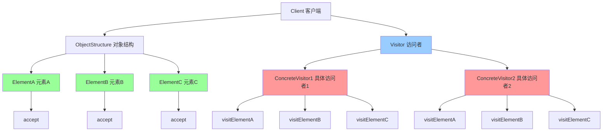

# 访问者模式 (Visitor)

> 访问者模式是一种行为型设计模式，表示一个作用于某对象结构中的各元素的操作，它使你可以在不改变各元素的类的前提下定义作用于这些元素的新操作。

## 📋 概要

访问者模式允许在不修改现有类结构的情况下，为类层次结构添加新的操作。这种模式通过将操作封装在访问者对象中，实现了操作与数据结构的分离。

### 核心原理

1. **访问者(Visitor)**: 定义访问操作的接口
2. **具体访问者(ConcreteVisitor)**: 实现具体的访问操作
3. **元素(Element)**: 定义接受访问者的接口
4. **具体元素(ConcreteElement)**: 实现接受访问者的方法
5. **对象结构(ObjectStructure)**: 管理元素集合

### 适用场景

- 需要对复杂对象结构进行操作
- 需要在不修改类的情况下添加新操作
- 需要对不同对象执行不同操作
- 需要将操作与数据结构分离
- 需要支持多种操作类型

### 优点

- **开闭原则**: 易于添加新操作
- **单一职责**: 将操作与数据结构分离
- **易于扩展**: 支持新的访问者类型
- **操作集中**: 相关操作集中在一个访问者中
- **类型安全**: 编译时类型检查

### 缺点

- **复杂性**: 增加系统复杂性
- **破坏封装**: 可能破坏封装性
- **难以维护**: 访问者可能变得复杂
- **性能影响**: 可能影响性能

## 📋 访问者模式架构图



## 🚀 基础实现

### 1. 简单访问者实现

```dart
// 访问者接口
abstract class Visitor {
  void visitConcreteElementA(ConcreteElementA element);
  void visitConcreteElementB(ConcreteElementB element);
  void visitConcreteElementC(ConcreteElementC element);
}

// 元素接口
abstract class Element {
  void accept(Visitor visitor);
}

// 具体元素A
class ConcreteElementA implements Element {
  final String _name;
  final int _value;
  
  ConcreteElementA(this._name, this._value);
  
  String get name => _name;
  int get value => _value;
  
  @override
  void accept(Visitor visitor) {
    visitor.visitConcreteElementA(this);
  }
  
  void operationA() {
    print('ConcreteElementA 特有操作: $_name, $_value');
  }
}

// 具体元素B
class ConcreteElementB implements Element {
  final String _type;
  final double _price;
  
  ConcreteElementB(this._type, this._price);
  
  String get type => _type;
  double get price => _price;
  
  @override
  void accept(Visitor visitor) {
    visitor.visitConcreteElementB(this);
  }
  
  void operationB() {
    print('ConcreteElementB 特有操作: $_type, \$$_price');
  }
}

// 具体元素C
class ConcreteElementC implements Element {
  final bool _active;
  final List<String> _tags;
  
  ConcreteElementC(this._active, this._tags);
  
  bool get active => _active;
  List<String> get tags => List.from(_tags);
  
  @override
  void accept(Visitor visitor) {
    visitor.visitConcreteElementC(this);
  }
  
  void operationC() {
    print('ConcreteElementC 特有操作: $_active, $_tags');
  }
}

// 具体访问者1 - 显示访问者
class DisplayVisitor implements Visitor {
  @override
  void visitConcreteElementA(ConcreteElementA element) {
    print('显示访问者访问 ConcreteElementA:');
    print('  名称: ${element.name}');
    print('  值: ${element.value}');
    element.operationA();
  }
  
  @override
  void visitConcreteElementB(ConcreteElementB element) {
    print('显示访问者访问 ConcreteElementB:');
    print('  类型: ${element.type}');
    print('  价格: \$${element.price}');
    element.operationB();
  }
  
  @override
  void visitConcreteElementC(ConcreteElementC element) {
    print('显示访问者访问 ConcreteElementC:');
    print('  激活状态: ${element.active}');
    print('  标签: ${element.tags}');
    element.operationC();
  }
}

// 具体访问者2 - 计算访问者
class CalculateVisitor implements Visitor {
  int _totalValue = 0;
  double _totalPrice = 0.0;
  int _activeCount = 0;
  
  @override
  void visitConcreteElementA(ConcreteElementA element) {
    _totalValue += element.value;
    print('计算访问者处理 ConcreteElementA: 值 ${element.value}');
  }
  
  @override
  void visitConcreteElementB(ConcreteElementB element) {
    _totalPrice += element.price;
    print('计算访问者处理 ConcreteElementB: 价格 \$${element.price}');
  }
  
  @override
  void visitConcreteElementC(ConcreteElementC element) {
    if (element.active) {
      _activeCount++;
    }
    print('计算访问者处理 ConcreteElementC: 激活状态 ${element.active}');
  }
  
  void showResults() {
    print('=== 计算结果 ===');
    print('总价值: $_totalValue');
    print('总价格: \$${_totalPrice.toStringAsFixed(2)}');
    print('激活元素数量: $_activeCount');
  }
  
  void reset() {
    _totalValue = 0;
    _totalPrice = 0.0;
    _activeCount = 0;
  }
}

// 具体访问者3 - 导出访问者
class ExportVisitor implements Visitor {
  final List<String> _exportData = [];
  
  @override
  void visitConcreteElementA(ConcreteElementA element) {
    _exportData.add('ElementA: ${element.name}, ${element.value}');
    print('导出访问者处理 ConcreteElementA: ${element.name}');
  }
  
  @override
  void visitConcreteElementB(ConcreteElementB element) {
    _exportData.add('ElementB: ${element.type}, \$${element.price}');
    print('导出访问者处理 ConcreteElementB: ${element.type}');
  }
  
  @override
  void visitConcreteElementC(ConcreteElementC element) {
    _exportData.add('ElementC: ${element.active}, ${element.tags}');
    print('导出访问者处理 ConcreteElementC: ${element.active}');
  }
  
  List<String> getExportData() => List.from(_exportData);
  
  void exportToFile(String filename) {
    print('=== 导出到文件: $filename ===');
    for (final line in _exportData) {
      print('  $line');
    }
  }
  
  void clear() {
    _exportData.clear();
  }
}

// 对象结构
class ObjectStructure {
  final List<Element> _elements = [];
  
  void addElement(Element element) {
    _elements.add(element);
    print('添加元素: ${element.runtimeType}');
  }
  
  void removeElement(Element element) {
    _elements.remove(element);
    print('移除元素: ${element.runtimeType}');
  }
  
  void accept(Visitor visitor) {
    print('对象结构接受访问者: ${visitor.runtimeType}');
    for (final element in _elements) {
      element.accept(visitor);
    }
  }
  
  List<Element> getElements() => List.from(_elements);
  
  int get elementCount => _elements.length;
}

// 使用示例
void main() {
  final objectStructure = ObjectStructure();
  
  // 添加元素
  objectStructure.addElement(ConcreteElementA('产品A', 100));
  objectStructure.addElement(ConcreteElementB('服务B', 50.5));
  objectStructure.addElement(ConcreteElementC(true, ['标签1', '标签2']));
  objectStructure.addElement(ConcreteElementA('产品C', 200));
  objectStructure.addElement(ConcreteElementB('服务D', 75.25));
  objectStructure.addElement(ConcreteElementC(false, ['标签3']));
  
  print('=== 显示访问者 ===');
  final displayVisitor = DisplayVisitor();
  objectStructure.accept(displayVisitor);
  
  print('\n=== 计算访问者 ===');
  final calculateVisitor = CalculateVisitor();
  objectStructure.accept(calculateVisitor);
  calculateVisitor.showResults();
  
  print('\n=== 导出访问者 ===');
  final exportVisitor = ExportVisitor();
  objectStructure.accept(exportVisitor);
  exportVisitor.exportToFile('data.txt');
  
  print('\n=== 元素统计 ===');
  print('总元素数量: ${objectStructure.elementCount}');
}
```

### 2. 文档结构访问者

```dart
// 文档元素接口
abstract class DocumentElement {
  void accept(DocumentVisitor visitor);
  String getContent();
}

// 文档访问者接口
abstract class DocumentVisitor {
  void visitParagraph(Paragraph paragraph);
  void visitHeading(Heading heading);
  void visitList(ListElement list);
  void visitImage(ImageElement image);
}

// 段落元素
class Paragraph implements DocumentElement {
  final String _text;
  final String _style;
  
  Paragraph(this._text, this._style);
  
  String get text => _text;
  String get style => _style;
  
  @override
  void accept(DocumentVisitor visitor) {
    visitor.visitParagraph(this);
  }
  
  @override
  String getContent() => _text;
  
  int getWordCount() {
    return _text.split(' ').length;
  }
  
  int getCharacterCount() {
    return _text.length;
  }
}

// 标题元素
class Heading implements DocumentElement {
  final String _text;
  final int _level;
  
  Heading(this._text, this._level);
  
  String get text => _text;
  int get level => _level;
  
  @override
  void accept(DocumentVisitor visitor) {
    visitor.visitHeading(this);
  }
  
  @override
  String getContent() => _text;
  
  String getHeadingTag() {
    return 'h$_level';
  }
}

// 列表元素
class ListElement implements DocumentElement {
  final List<String> _items;
  final bool _ordered;
  
  ListElement(this._items, this._ordered);
  
  List<String> get items => List.from(_items);
  bool get ordered => _ordered;
  
  @override
  void accept(DocumentVisitor visitor) {
    visitor.visitList(this);
  }
  
  @override
  String getContent() => _items.join(', ');
  
  int getItemCount() {
    return _items.length;
  }
}

// 图片元素
class ImageElement implements DocumentElement {
  final String _src;
  final String _alt;
  final int _width;
  final int _height;
  
  ImageElement(this._src, this._alt, this._width, this._height);
  
  String get src => _src;
  String get alt => _alt;
  int get width => _width;
  int get height => _height;
  
  @override
  void accept(DocumentVisitor visitor) {
    visitor.visitImage(this);
  }
  
  @override
  String getContent() => _alt;
  
  int getSize() {
    return _width * _height;
  }
}

// 文档统计访问者
class DocumentStatsVisitor implements DocumentVisitor {
  int _paragraphCount = 0;
  int _headingCount = 0;
  int _listCount = 0;
  int _imageCount = 0;
  int _totalWords = 0;
  int _totalCharacters = 0;
  int _totalImagesSize = 0;
  
  @override
  void visitParagraph(Paragraph paragraph) {
    _paragraphCount++;
    _totalWords += paragraph.getWordCount();
    _totalCharacters += paragraph.getCharacterCount();
    print('统计段落: ${paragraph.getWordCount()} 词, ${paragraph.getCharacterCount()} 字符');
  }
  
  @override
  void visitHeading(Heading heading) {
    _headingCount++;
    _totalCharacters += heading.text.length;
    print('统计标题: 级别 ${heading.level}, "${heading.text}"');
  }
  
  @override
  void visitList(ListElement list) {
    _listCount++;
    _totalCharacters += list.getContent().length;
    print('统计列表: ${list.getItemCount()} 个项目, 有序: ${list.ordered}');
  }
  
  @override
  void visitImage(ImageElement image) {
    _imageCount++;
    _totalImagesSize += image.getSize();
    print('统计图片: ${image.src}, 尺寸: ${image.width}x${image.height}');
  }
  
  void showStats() {
    print('=== 文档统计 ===');
    print('段落数量: $_paragraphCount');
    print('标题数量: $_headingCount');
    print('列表数量: $_listCount');
    print('图片数量: $_imageCount');
    print('总词数: $_totalWords');
    print('总字符数: $_totalCharacters');
    print('总图片尺寸: $_totalImagesSize 像素');
  }
  
  void reset() {
    _paragraphCount = 0;
    _headingCount = 0;
    _listCount = 0;
    _imageCount = 0;
    _totalWords = 0;
    _totalCharacters = 0;
    _totalImagesSize = 0;
  }
}

// HTML导出访问者
class HtmlExportVisitor implements DocumentVisitor {
  final List<String> _htmlLines = [];
  
  @override
  void visitParagraph(Paragraph paragraph) {
    final style = paragraph.style.isNotEmpty ? ' class="$style"' : '';
    _htmlLines.add('<p$style>${paragraph.text}</p>');
    print('导出段落为HTML: ${paragraph.text.substring(0, 20)}...');
  }
  
  @override
  void visitHeading(Heading heading) {
    _htmlLines.add('<${heading.getHeadingTag()}>${heading.text}</${heading.getHeadingTag()}>');
    print('导出标题为HTML: ${heading.getHeadingTag()} - ${heading.text}');
  }
  
  @override
  void visitList(ListElement list) {
    final tag = list.ordered ? 'ol' : 'ul';
    _htmlLines.add('<$tag>');
    for (final item in list.items) {
      _htmlLines.add('  <li>$item</li>');
    }
    _htmlLines.add('</$tag>');
    print('导出列表为HTML: ${list.ordered ? '有序' : '无序'}列表');
  }
  
  @override
  void visitImage(ImageElement image) {
    _htmlLines.add('');
    print('导出图片为HTML: ${image.src}');
  }
  
  String generateHtml() {
    final html = '''
<!DOCTYPE html>
<html>
<head>
    <title>导出文档</title>
</head>
<body>
${_htmlLines.join('\n')}
</body>
</html>''';
    return html;
  }
  
  void exportToFile(String filename) {
    final html = generateHtml();
    print('=== 导出HTML到文件: $filename ===');
    print(html);
  }
  
  void clear() {
    _htmlLines.clear();
  }
}

// 文档对象结构
class Document {
  final List<DocumentElement> _elements = [];
  
  void addElement(DocumentElement element) {
    _elements.add(element);
    print('添加文档元素: ${element.runtimeType}');
  }
  
  void removeElement(DocumentElement element) {
    _elements.remove(element);
    print('移除文档元素: ${element.runtimeType}');
  }
  
  void accept(DocumentVisitor visitor) {
    print('文档接受访问者: ${visitor.runtimeType}');
    for (final element in _elements) {
      element.accept(visitor);
    }
  }
  
  List<DocumentElement> getElements() => List.from(_elements);
  
  int get elementCount => _elements.length;
}

// 使用示例
void main() {
  final document = Document();
  
  // 添加文档元素
  document.addElement(Heading('文档标题', 1));
  document.addElement(Paragraph('这是一个段落，包含一些文本内容。', 'normal'));
  document.addElement(Heading('子标题', 2));
  document.addElement(Paragraph('这是另一个段落，用于演示访问者模式。', 'highlight'));
  document.addElement(ListElement(['项目1', '项目2', '项目3'], true));
  document.addElement(ImageElement('image1.jpg', '示例图片', 800, 600));
  document.addElement(Paragraph('最后一个段落，总结文档内容。', 'summary'));
  document.addElement(ListElement(['无序项目A', '无序项目B'], false));
  
  print('=== 文档统计访问者 ===');
  final statsVisitor = DocumentStatsVisitor();
  document.accept(statsVisitor);
  statsVisitor.showStats();
  
  print('\n=== HTML导出访问者 ===');
  final htmlVisitor = HtmlExportVisitor();
  document.accept(htmlVisitor);
  htmlVisitor.exportToFile('document.html');
  
  print('\n=== 文档信息 ===');
  print('总元素数量: ${document.elementCount}');
}
```

## 🧪 测试和调试

### 1. 访问者模式单元测试

```dart
// test/visitor_test.dart
import 'package:flutter_test/flutter_test.dart';
import 'package:myapp/visitor.dart';

void main() {
  group('访问者模式测试', () {
    test('应该正确创建元素', () {
      final elementA = ConcreteElementA('测试', 100);
      final elementB = ConcreteElementB('类型', 50.5);
      final elementC = ConcreteElementC(true, ['标签']);
      
      expect(elementA.name, equals('测试'));
      expect(elementA.value, equals(100));
      expect(elementB.type, equals('类型'));
      expect(elementB.price, equals(50.5));
      expect(elementC.active, isTrue);
      expect(elementC.tags, equals(['标签']));
    });
    
    test('元素应该正确接受访问者', () {
      final elementA = ConcreteElementA('测试', 100);
      final displayVisitor = DisplayVisitor();
      
      // 不应该抛出异常
      expect(() => elementA.accept(displayVisitor), returnsNormally);
    });
    
    test('对象结构应该正确管理元素', () {
      final objectStructure = ObjectStructure();
      final elementA = ConcreteElementA('测试', 100);
      final elementB = ConcreteElementB('类型', 50.5);
      
      objectStructure.addElement(elementA);
      objectStructure.addElement(elementB);
      
      expect(objectStructure.elementCount, equals(2));
      expect(objectStructure.getElements(), containsAll([elementA, elementB]));
      
      objectStructure.removeElement(elementA);
      expect(objectStructure.elementCount, equals(1));
      expect(objectStructure.getElements(), contains(elementB));
    });
    
    test('计算访问者应该正确计算', () {
      final objectStructure = ObjectStructure();
      objectStructure.addElement(ConcreteElementA('A', 100));
      objectStructure.addElement(ConcreteElementB('B', 50.5));
      objectStructure.addElement(ConcreteElementC(true, []));
      
      final calculateVisitor = CalculateVisitor();
      objectStructure.accept(calculateVisitor);
      
      // 验证计算结果
      expect(calculateVisitor, isNotNull);
    });
    
    test('导出访问者应该正确导出', () {
      final objectStructure = ObjectStructure();
      objectStructure.addElement(ConcreteElementA('A', 100));
      objectStructure.addElement(ConcreteElementB('B', 50.5));
      
      final exportVisitor = ExportVisitor();
      objectStructure.accept(exportVisitor);
      
      final exportData = exportVisitor.getExportData();
      expect(exportData.length, equals(2));
      expect(exportData[0], contains('ElementA'));
      expect(exportData[1], contains('ElementB'));
    });
  });
  
  group('文档访问者测试', () {
    test('应该正确创建文档元素', () {
      final paragraph = Paragraph('测试段落', 'normal');
      final heading = Heading('测试标题', 1);
      final list = ListElement(['项目1', '项目2'], true);
      final image = ImageElement('test.jpg', '测试图片', 100, 100);
      
      expect(paragraph.text, equals('测试段落'));
      expect(heading.text, equals('测试标题'));
      expect(list.items.length, equals(2));
      expect(image.src, equals('test.jpg'));
    });
    
    test('文档元素应该正确接受访问者', () {
      final paragraph = Paragraph('测试段落', 'normal');
      final statsVisitor = DocumentStatsVisitor();
      
      expect(() => paragraph.accept(statsVisitor), returnsNormally);
    });
    
    test('文档统计访问者应该正确统计', () {
      final document = Document();
      document.addElement(Paragraph('测试段落', 'normal'));
      document.addElement(Heading('测试标题', 1));
      document.addElement(ListElement(['项目1'], true));
      document.addElement(ImageElement('test.jpg', '测试', 100, 100));
      
      final statsVisitor = DocumentStatsVisitor();
      document.accept(statsVisitor);
      
      // 验证统计结果
      expect(statsVisitor, isNotNull);
    });
    
    test('HTML导出访问者应该正确生成HTML', () {
      final document = Document();
      document.addElement(Paragraph('测试段落', 'normal'));
      document.addElement(Heading('测试标题', 1));
      
      final htmlVisitor = HtmlExportVisitor();
      document.accept(htmlVisitor);
      
      final html = htmlVisitor.generateHtml();
      expect(html, contains('<!DOCTYPE html>'));
      expect(html, contains('<p>测试段落</p>'));
      expect(html, contains('<h1>测试标题</h1>'));
    });
  });
}
```

## 📚 最佳实践

### 1. 设计原则
- **开闭原则**: 易于添加新操作
- **单一职责**: 将操作与数据结构分离
- **依赖倒置**: 依赖抽象而不是具体实现
- **接口隔离**: 定义清晰的访问者接口

### 2. 性能优化
- **访问者缓存**: 缓存访问者实例
- **批量处理**: 批量处理元素
- **内存管理**: 及时释放访问者资源
- **延迟计算**: 延迟计算复杂操作

### 3. 错误处理
- **访问者验证**: 验证访问者参数
- **异常处理**: 处理访问过程中的异常
- **错误恢复**: 提供错误恢复机制
- **日志记录**: 记录访问操作日志

### 4. 调试技巧
- **访问追踪**: 追踪访问过程
- **状态监控**: 监控访问者状态
- **性能分析**: 分析访问性能
- **内存分析**: 分析内存使用情况

## 🎯 小结

访问者模式是扩展对象操作能力的强大工具，特别适合需要对复杂对象结构进行操作而不修改原有类的场景。在 Flutter 开发中，它可以用于文档处理、UI组件操作、数据导出等。

### 选择建议

- **复杂操作**: 需要对复杂对象结构进行操作
- **操作扩展**: 需要在不修改类的情况下添加新操作
- **操作分离**: 需要将操作与数据结构分离
- **类型安全**: 需要编译时类型检查

### 关键要点

1. **访问者设计**: 设计合适的访问者接口
2. **操作封装**: 合理封装操作逻辑
3. **性能考虑**: 注意访问者的性能影响
4. **类型安全**: 确保类型安全
5. **错误处理**: 提供完善的错误处理机制

---

> 💡 **提示**: 访问者模式是扩展操作能力的优秀方案，但要权衡复杂性和性能影响。建议在真正需要操作扩展的场景中使用，并注意性能优化和错误处理。 