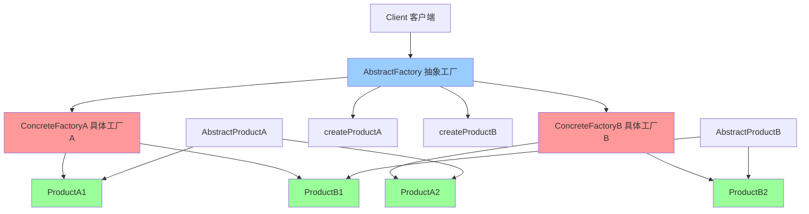

# 抽象工厂模式 (Abstract Factory)

> 抽象工厂模式是一种创建型设计模式，提供一个创建一系列相关或相互依赖对象的接口，而无需指定它们的具体类。

## 📋 概要

抽象工厂模式提供一个创建一系列相关或相互依赖对象的接口，而无需指定它们的具体类。这种模式围绕一个超级工厂创建其他工厂，该超级工厂又称为其他工厂的工厂。

### 核心原理

1. **抽象工厂**: 声明创建抽象产品对象的操作接口
2. **具体工厂**: 实现抽象工厂的接口，创建具体的产品对象
3. **抽象产品**: 为一类产品对象声明一个接口
4. **具体产品**: 实现抽象产品接口，定义具体产品
5. **客户端**: 使用抽象工厂和抽象产品

### 适用场景

- 需要创建一系列相关的产品对象
- 需要确保产品之间的兼容性
- 需要支持产品的扩展
- 需要隐藏产品创建的复杂性
- 需要支持不同的产品族

### 优点

- **产品兼容性**: 确保产品之间的兼容性
- **易于扩展**: 容易添加新的产品族
- **封装性**: 隐藏产品创建的复杂性
- **一致性**: 保证产品族的一致性
- **解耦**: 客户端与具体产品解耦

### 缺点

- **复杂性**: 增加系统的复杂性
- **扩展困难**: 添加新产品类型困难
- **性能**: 可能带来性能开销
- **维护**: 需要维护更多的类

## 📋 抽象工厂模式架构图



## 🚀 基础实现

### 1. 简单抽象工厂实现

```dart
// 抽象产品A
abstract class AbstractProductA {
  String operationA();
}

// 抽象产品B
abstract class AbstractProductB {
  String operationB();
  String collaborate(AbstractProductA collaborator);
}

// 具体产品A1
class ConcreteProductA1 implements AbstractProductA {
  @override
  String operationA() {
    return 'ConcreteProductA1: 操作A的结果';
  }
}

// 具体产品A2
class ConcreteProductA2 implements AbstractProductA {
  @override
  String operationA() {
    return 'ConcreteProductA2: 操作A的结果';
  }
}

// 具体产品B1
class ConcreteProductB1 implements AbstractProductB {
  @override
  String operationB() {
    return 'ConcreteProductB1: 操作B的结果';
  }
  
  @override
  String collaborate(AbstractProductA collaborator) {
    final result = collaborator.operationA();
    return 'ConcreteProductB1 与 ($result) 协作';
  }
}

// 具体产品B2
class ConcreteProductB2 implements AbstractProductB {
  @override
  String operationB() {
    return 'ConcreteProductB2: 操作B的结果';
  }
  
  @override
  String collaborate(AbstractProductA collaborator) {
    final result = collaborator.operationA();
    return 'ConcreteProductB2 与 ($result) 协作';
  }
}

// 抽象工厂
abstract class AbstractFactory {
  AbstractProductA createProductA();
  AbstractProductB createProductB();
}

// 具体工厂1
class ConcreteFactory1 implements AbstractFactory {
  @override
  AbstractProductA createProductA() {
    return ConcreteProductA1();
  }
  
  @override
  AbstractProductB createProductB() {
    return ConcreteProductB1();
  }
}

// 具体工厂2
class ConcreteFactory2 implements AbstractFactory {
  @override
  AbstractProductA createProductA() {
    return ConcreteProductA2();
  }
  
  @override
  AbstractProductB createProductB() {
    return ConcreteProductB2();
  }
}

// 客户端代码
class Client {
  final AbstractFactory _factory;
  
  Client(this._factory);
  
  void run() {
    final productA = _factory.createProductA();
    final productB = _factory.createProductB();
    
    print(productA.operationA());
    print(productB.operationB());
    print(productB.collaborate(productA));
  }
}

// 使用示例
void main() {
  print('=== 使用工厂1 ===');
  final client1 = Client(ConcreteFactory1());
  client1.run();
  
  print('\n=== 使用工厂2 ===');
  final client2 = Client(ConcreteFactory2());
  client2.run();
}
```

### 2. UI组件抽象工厂

```dart
// 抽象按钮
abstract class Button {
  void render();
  void onClick();
}

// 抽象复选框
abstract class Checkbox {
  void render();
  void onCheck();
}

// Windows风格按钮
class WindowsButton implements Button {
  @override
  void render() {
    print('渲染 Windows 风格的按钮');
  }
  
  @override
  void onClick() {
    print('Windows 按钮被点击');
  }
}

// Windows风格复选框
class WindowsCheckbox implements Checkbox {
  @override
  void render() {
    print('渲染 Windows 风格的复选框');
  }
  
  @override
  void onCheck() {
    print('Windows 复选框被选中');
  }
}

// macOS风格按钮
class MacOSButton implements Button {
  @override
  void render() {
    print('渲染 macOS 风格的按钮');
  }
  
  @override
  void onClick() {
    print('macOS 按钮被点击');
  }
}

// macOS风格复选框
class MacOSCheckbox implements Checkbox {
  @override
  void render() {
    print('渲染 macOS 风格的复选框');
  }
  
  @override
  void onCheck() {
    print('macOS 复选框被选中');
  }
}

// 抽象UI工厂
abstract class UIFactory {
  Button createButton();
  Checkbox createCheckbox();
}

// Windows UI工厂
class WindowsUIFactory implements UIFactory {
  @override
  Button createButton() {
    return WindowsButton();
  }
  
  @override
  Checkbox createCheckbox() {
    return WindowsCheckbox();
  }
}

// macOS UI工厂
class MacOSUIFactory implements UIFactory {
  @override
  Button createButton() {
    return MacOSButton();
  }
  
  @override
  Checkbox createCheckbox() {
    return MacOSCheckbox();
  }
}

// 应用程序
class Application {
  final UIFactory _factory;
  
  Application(this._factory);
  
  void createUI() {
    final button = _factory.createButton();
    final checkbox = _factory.createCheckbox();
    
    button.render();
    checkbox.render();
    
    button.onClick();
    checkbox.onCheck();
  }
}

// 使用示例
void main() {
  print('=== Windows 应用程序 ===');
  final windowsApp = Application(WindowsUIFactory());
  windowsApp.createUI();
  
  print('\n=== macOS 应用程序 ===');
  final macApp = Application(MacOSUIFactory());
  macApp.createUI();
}
```

## 🔧 实际应用场景

### 1. 数据库连接抽象工厂

```dart
// 抽象连接
abstract class Connection {
  void connect();
  void disconnect();
  void execute(String query);
}

// 抽象命令
abstract class Command {
  void execute();
}

// MySQL连接
class MySQLConnection implements Connection {
  @override
  void connect() {
    print('连接到 MySQL 数据库');
  }
  
  @override
  void disconnect() {
    print('断开 MySQL 数据库连接');
  }
  
  @override
  void execute(String query) {
    print('MySQL 执行查询: $query');
  }
}

// MySQL命令
class MySQLCommand implements Command {
  final Connection _connection;
  final String _query;
  
  MySQLCommand(this._connection, this._query);
  
  @override
  void execute() {
    _connection.execute(_query);
  }
}

// PostgreSQL连接
class PostgreSQLConnection implements Connection {
  @override
  void connect() {
    print('连接到 PostgreSQL 数据库');
  }
  
  @override
  void disconnect() {
    print('断开 PostgreSQL 数据库连接');
  }
  
  @override
  void execute(String query) {
    print('PostgreSQL 执行查询: $query');
  }
}

// PostgreSQL命令
class PostgreSQLCommand implements Command {
  final Connection _connection;
  final String _query;
  
  PostgreSQLCommand(this._connection, this._query);
  
  @override
  void execute() {
    _connection.execute(_query);
  }
}

// 抽象数据库工厂
abstract class DatabaseFactory {
  Connection createConnection();
  Command createCommand(Connection connection, String query);
}

// MySQL工厂
class MySQLFactory implements DatabaseFactory {
  @override
  Connection createConnection() {
    return MySQLConnection();
  }
  
  @override
  Command createCommand(Connection connection, String query) {
    return MySQLCommand(connection, query);
  }
}

// PostgreSQL工厂
class PostgreSQLFactory implements DatabaseFactory {
  @override
  Connection createConnection() {
    return PostgreSQLConnection();
  }
  
  @override
  Command createCommand(Connection connection, String query) {
    return PostgreSQLCommand(connection, query);
  }
}

// 数据库管理器
class DatabaseManager {
  final DatabaseFactory _factory;
  
  DatabaseManager(this._factory);
  
  void executeQuery(String query) {
    final connection = _factory.createConnection();
    final command = _factory.createCommand(connection, query);
    
    connection.connect();
    command.execute();
    connection.disconnect();
  }
}

// 使用示例
void main() {
  print('=== MySQL 数据库 ===');
  final mysqlManager = DatabaseManager(MySQLFactory());
  mysqlManager.executeQuery('SELECT * FROM users');
  
  print('\n=== PostgreSQL 数据库 ===');
  final postgresManager = DatabaseManager(PostgreSQLFactory());
  postgresManager.executeQuery('SELECT * FROM users');
}
```

### 2. 主题系统抽象工厂

```dart
// 抽象颜色
abstract class Color {
  String getHex();
  String getName();
}

// 抽象字体
abstract class Font {
  String getFamily();
  double getSize();
  String getWeight();
}

// 浅色主题颜色
class LightColor implements Color {
  @override
  String getHex() => '#FFFFFF';
  
  @override
  String getName() => '浅色';
}

// 深色主题颜色
class DarkColor implements Color {
  @override
  String getHex() => '#000000';
  
  @override
  String getName() => '深色';
}

// 浅色主题字体
class LightFont implements Font {
  @override
  String getFamily() => 'Arial';
  
  @override
  double getSize() => 14.0;
  
  @override
  String getWeight() => 'normal';
}

// 深色主题字体
class DarkFont implements Font {
  @override
  String getFamily() => 'Roboto';
  
  @override
  double getSize() => 16.0;
  
  @override
  String getWeight() => 'bold';
}

// 抽象主题工厂
abstract class ThemeFactory {
  Color createColor();
  Font createFont();
}

// 浅色主题工厂
class LightThemeFactory implements ThemeFactory {
  @override
  Color createColor() {
    return LightColor();
  }
  
  @override
  Font createFont() {
    return LightFont();
  }
}

// 深色主题工厂
class DarkThemeFactory implements ThemeFactory {
  @override
  Color createColor() {
    return DarkColor();
  }
  
  @override
  Font createFont() {
    return DarkFont();
  }
}

// 主题管理器
class ThemeManager {
  final ThemeFactory _factory;
  
  ThemeManager(this._factory);
  
  void applyTheme() {
    final color = _factory.createColor();
    final font = _factory.createFont();
    
    print('应用主题:');
    print('颜色: ${color.getName()} (${color.getHex()})');
    print('字体: ${font.getFamily()} ${font.getSize()} ${font.getWeight()}');
  }
}

// Flutter Widget 中的使用
class ThemeWidget extends StatelessWidget {
  final ThemeFactory themeFactory;
  
  ThemeWidget(this.themeFactory);
  
  @override
  Widget build(BuildContext context) {
    final color = themeFactory.createColor();
    final font = themeFactory.createFont();
    
    return Scaffold(
      backgroundColor: Color(int.parse(color.getHex().replaceAll('#', '0xFF'))),
      appBar: AppBar(
        title: Text(
          '主题示例',
          style: TextStyle(
            fontFamily: font.getFamily(),
            fontSize: font.getSize(),
            fontWeight: font.getWeight() == 'bold' ? FontWeight.bold : FontWeight.normal,
          ),
        ),
      ),
      body: Center(
        child: Text(
          '这是一个主题示例',
          style: TextStyle(
            fontFamily: font.getFamily(),
            fontSize: font.getSize(),
            fontWeight: font.getWeight() == 'bold' ? FontWeight.bold : FontWeight.normal,
          ),
        ),
      ),
    );
  }
}

// 使用示例
void main() {
  print('=== 浅色主题 ===');
  final lightTheme = ThemeManager(LightThemeFactory());
  lightTheme.applyTheme();
  
  print('\n=== 深色主题 ===');
  final darkTheme = ThemeManager(DarkThemeFactory());
  darkTheme.applyTheme();
  
  // Flutter 应用
  runApp(MaterialApp(
    home: ThemeWidget(LightThemeFactory()),
  ));
}
```

## 🧪 测试和调试

### 1. 抽象工厂模式单元测试

```dart
// test/abstract_factory_test.dart
import 'package:flutter_test/flutter_test.dart';
import 'package:myapp/abstract_factory.dart';

void main() {
  group('抽象工厂模式测试', () {
    test('应该正确创建产品A1', () {
      final factory = ConcreteFactory1();
      final product = factory.createProductA();
      
      expect(product, isA<ConcreteProductA1>());
      expect(product.operationA(), equals('ConcreteProductA1: 操作A的结果'));
    });
    
    test('应该正确创建产品B1', () {
      final factory = ConcreteFactory1();
      final product = factory.createProductB();
      
      expect(product, isA<ConcreteProductB1>());
      expect(product.operationB(), equals('ConcreteProductB1: 操作B的结果'));
    });
    
    test('应该正确创建产品A2', () {
      final factory = ConcreteFactory2();
      final product = factory.createProductA();
      
      expect(product, isA<ConcreteProductA2>());
      expect(product.operationA(), equals('ConcreteProductA2: 操作A的结果'));
    });
    
    test('应该正确创建产品B2', () {
      final factory = ConcreteFactory2();
      final product = factory.createProductB();
      
      expect(product, isA<ConcreteProductB2>());
      expect(product.operationB(), equals('ConcreteProductB2: 操作B的结果'));
    });
    
    test('产品应该能够协作', () {
      final factory = ConcreteFactory1();
      final productA = factory.createProductA();
      final productB = factory.createProductB();
      
      final result = productB.collaborate(productA);
      expect(result, contains('ConcreteProductB1 与'));
      expect(result, contains('ConcreteProductA1: 操作A的结果'));
    });
  });
  
  group('UI工厂测试', () {
    test('Windows工厂应该创建Windows组件', () {
      final factory = WindowsUIFactory();
      final button = factory.createButton();
      final checkbox = factory.createCheckbox();
      
      expect(button, isA<WindowsButton>());
      expect(checkbox, isA<WindowsCheckbox>());
    });
    
    test('macOS工厂应该创建macOS组件', () {
      final factory = MacOSUIFactory();
      final button = factory.createButton();
      final checkbox = factory.createCheckbox();
      
      expect(button, isA<MacOSButton>());
      expect(checkbox, isA<MacOSCheckbox>());
    });
  });
  
  group('数据库工厂测试', () {
    test('MySQL工厂应该创建MySQL组件', () {
      final factory = MySQLFactory();
      final connection = factory.createConnection();
      final command = factory.createCommand(connection, 'SELECT * FROM users');
      
      expect(connection, isA<MySQLConnection>());
      expect(command, isA<MySQLCommand>());
    });
    
    test('PostgreSQL工厂应该创建PostgreSQL组件', () {
      final factory = PostgreSQLFactory();
      final connection = factory.createConnection();
      final command = factory.createCommand(connection, 'SELECT * FROM users');
      
      expect(connection, isA<PostgreSQLConnection>());
      expect(command, isA<PostgreSQLCommand>());
    });
  });
}
```

## 📚 最佳实践

### 1. 设计原则
- **产品族一致性**: 确保同一工厂创建的产品兼容
- **开闭原则**: 支持添加新的产品族
- **依赖倒置**: 依赖抽象而不是具体实现
- **单一职责**: 每个工厂只负责创建相关的产品

### 2. 性能优化
- **对象池**: 使用对象池管理产品实例
- **缓存**: 缓存常用的产品实例
- **延迟创建**: 延迟创建产品实例
- **内存管理**: 及时释放不需要的产品

### 3. 错误处理
- **工厂验证**: 验证工厂配置
- **产品验证**: 验证产品创建结果
- **异常处理**: 处理产品创建异常
- **降级策略**: 提供产品创建失败时的降级方案

### 4. 调试技巧
- **工厂追踪**: 追踪工厂创建过程
- **产品验证**: 验证产品创建结果
- **性能监控**: 监控产品创建性能
- **日志记录**: 记录工厂操作日志

## 🎯 小结

抽象工厂模式是创建相关产品族的强大工具，特别适合需要确保产品兼容性的场景。在 Flutter 开发中，它可以用于主题系统、数据库连接、UI组件等。

### 选择建议

- **产品族**: 需要创建相关的产品族
- **兼容性**: 需要确保产品之间的兼容性
- **扩展性**: 需要支持新的产品族
- **一致性**: 需要保证产品族的一致性

### 关键要点

1. **工厂设计**: 设计合适的抽象工厂接口
2. **产品族**: 确保产品族的兼容性
3. **扩展性**: 支持添加新的产品族
4. **性能考虑**: 注意产品创建的性能
5. **错误处理**: 提供完善的错误处理机制

---

> 💡 **提示**: 抽象工厂模式是创建相关产品族的优秀方案，但要避免过度复杂和过度设计。建议在真正需要确保产品兼容性的场景中使用，并注意性能优化和错误处理。 