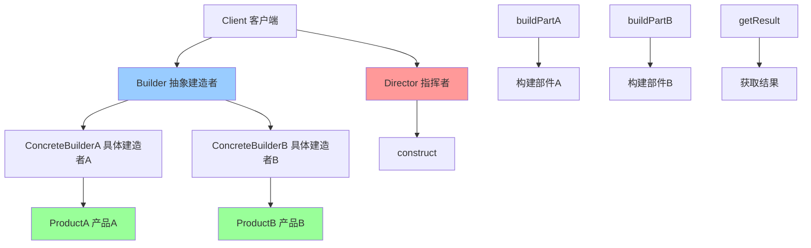

# 建造者模式 (Builder)

> 建造者模式是一种创建型设计模式，用于构建复杂对象。它将复杂对象的构建过程分解为多个步骤，允许你使用相同的构建过程创建不同的表示。

## 📋 概要

建造者模式将一个复杂对象的构建过程分解为多个步骤，允许你使用相同的构建过程创建不同的表示。这种模式特别适用于构建具有多个可选参数或配置选项的对象。

### 核心原理

1. **产品**: 要构建的复杂对象
2. **抽象建造者**: 定义构建产品的接口
3. **具体建造者**: 实现构建产品的具体步骤
4. **指挥者**: 使用建造者构建产品
5. **客户端**: 创建建造者并获取产品

### 适用场景

- 构建复杂对象，对象有很多可选参数
- 需要创建不同表示的对象
- 对象的构建过程需要多个步骤
- 需要确保对象构建的不可变性
- 需要链式调用构建对象

### 优点

- **分步构建**: 可以分步骤构建复杂对象
- **链式调用**: 支持链式调用，代码更简洁
- **不可变性**: 可以创建不可变对象
- **灵活性**: 可以创建不同的对象表示
- **可读性**: 构建过程更清晰易读

### 缺点

- **复杂性**: 可能增加系统的复杂性
- **性能**: 可能带来一定的性能开销
- **维护**: 需要维护多个建造者类

## 📋 建造者模式架构图



## 🚀 基础实现

### 1. 简单建造者实现

```dart
// 产品
class Computer {
  final String cpu;
  final String memory;
  final String storage;
  final String graphics;
  
  Computer({
    required this.cpu,
    required this.memory,
    required this.storage,
    required this.graphics,
  });
  
  @override
  String toString() {
    return 'Computer(cpu: $cpu, memory: $memory, storage: $storage, graphics: $graphics)';
  }
}

// 抽象建造者
abstract class ComputerBuilder {
  void buildCpu();
  void buildMemory();
  void buildStorage();
  void buildGraphics();
  Computer getResult();
}

// 具体建造者
class GamingComputerBuilder implements ComputerBuilder {
  Computer? _computer;
  
  @override
  void buildCpu() {
    _computer = Computer(
      cpu: 'Intel i9-12900K',
      memory: '',
      storage: '',
      graphics: '',
    );
  }
  
  @override
  void buildMemory() {
    _computer = Computer(
      cpu: _computer!.cpu,
      memory: '32GB DDR5',
      storage: _computer!.storage,
      graphics: _computer!.graphics,
    );
  }
  
  @override
  void buildStorage() {
    _computer = Computer(
      cpu: _computer!.cpu,
      memory: _computer!.memory,
      storage: '2TB NVMe SSD',
      graphics: _computer!.graphics,
    );
  }
  
  @override
  void buildGraphics() {
    _computer = Computer(
      cpu: _computer!.cpu,
      memory: _computer!.memory,
      storage: _computer!.storage,
      graphics: 'RTX 4090',
    );
  }
  
  @override
  Computer getResult() {
    return _computer!;
  }
}

class OfficeComputerBuilder implements ComputerBuilder {
  Computer? _computer;
  
  @override
  void buildCpu() {
    _computer = Computer(
      cpu: 'Intel i5-12400',
      memory: '',
      storage: '',
      graphics: '',
    );
  }
  
  @override
  void buildMemory() {
    _computer = Computer(
      cpu: _computer!.cpu,
      memory: '16GB DDR4',
      storage: _computer!.storage,
      graphics: _computer!.graphics,
    );
  }
  
  @override
  void buildStorage() {
    _computer = Computer(
      cpu: _computer!.cpu,
      memory: _computer!.memory,
      storage: '512GB SSD',
      graphics: _computer!.graphics,
    );
  }
  
  @override
  void buildGraphics() {
    _computer = Computer(
      cpu: _computer!.cpu,
      memory: _computer!.memory,
      storage: _computer!.storage,
      graphics: 'Integrated Graphics',
    );
  }
  
  @override
  Computer getResult() {
    return _computer!;
  }
}

// 指挥者
class ComputerDirector {
  Computer construct(ComputerBuilder builder) {
    builder.buildCpu();
    builder.buildMemory();
    builder.buildStorage();
    builder.buildGraphics();
    return builder.getResult();
  }
}

// 使用示例
void main() {
  final director = ComputerDirector();
  
  // 构建游戏电脑
  final gamingBuilder = GamingComputerBuilder();
  final gamingComputer = director.construct(gamingBuilder);
  print('游戏电脑: $gamingComputer');
  
  // 构建办公电脑
  final officeBuilder = OfficeComputerBuilder();
  final officeComputer = director.construct(officeBuilder);
  print('办公电脑: $officeComputer');
}
```

### 2. 链式建造者实现

```dart
// 产品
class User {
  final String name;
  final String email;
  final String? phone;
  final int? age;
  final String? address;
  final List<String> hobbies;
  final Map<String, dynamic> preferences;
  
  User({
    required this.name,
    required this.email,
    this.phone,
    this.age,
    this.address,
    this.hobbies = const [],
    this.preferences = const {},
  });
  
  @override
  String toString() {
    return 'User(name: $name, email: $email, phone: $phone, age: $age, address: $address, hobbies: $hobbies, preferences: $preferences)';
  }
}

// 链式建造者
class UserBuilder {
  String _name = '';
  String _email = '';
  String? _phone;
  int? _age;
  String? _address;
  List<String> _hobbies = [];
  Map<String, dynamic> _preferences = {};
  
  UserBuilder name(String name) {
    _name = name;
    return this;
  }
  
  UserBuilder email(String email) {
    _email = email;
    return this;
  }
  
  UserBuilder phone(String phone) {
    _phone = phone;
    return this;
  }
  
  UserBuilder age(int age) {
    _age = age;
    return this;
  }
  
  UserBuilder address(String address) {
    _address = address;
    return this;
  }
  
  UserBuilder addHobby(String hobby) {
    _hobbies.add(hobby);
    return this;
  }
  
  UserBuilder addHobbies(List<String> hobbies) {
    _hobbies.addAll(hobbies);
    return this;
  }
  
  UserBuilder setPreference(String key, dynamic value) {
    _preferences[key] = value;
    return this;
  }
  
  UserBuilder setPreferences(Map<String, dynamic> preferences) {
    _preferences.addAll(preferences);
    return this;
  }
  
  User build() {
    if (_name.isEmpty) {
      throw ArgumentError('Name is required');
    }
    if (_email.isEmpty) {
      throw ArgumentError('Email is required');
    }
    
    return User(
      name: _name,
      email: _email,
      phone: _phone,
      age: _age,
      address: _address,
      hobbies: List.unmodifiable(_hobbies),
      preferences: Map.unmodifiable(_preferences),
    );
  }
  
  // 重置建造者
  void reset() {
    _name = '';
    _email = '';
    _phone = null;
    _age = null;
    _address = null;
    _hobbies.clear();
    _preferences.clear();
  }
}

// 使用示例
void main() {
  // 构建简单用户
  final simpleUser = UserBuilder()
    .name('John Doe')
    .email('john@example.com')
    .build();
  print('简单用户: $simpleUser');
  
  // 构建复杂用户
  final complexUser = UserBuilder()
    .name('Jane Smith')
    .email('jane@example.com')
    .phone('+1234567890')
    .age(30)
    .address('123 Main St, City, Country')
    .addHobby('reading')
    .addHobby('swimming')
    .addHobbies(['coding', 'gaming'])
    .setPreference('theme', 'dark')
    .setPreference('language', 'en')
    .setPreferences({
      'notifications': true,
      'privacy': 'public',
    })
    .build();
  print('复杂用户: $complexUser');
  
  // 构建多个用户
  final builder = UserBuilder();
  
  final user1 = builder
    .name('Alice')
    .email('alice@example.com')
    .age(25)
    .build();
  
  builder.reset();
  
  final user2 = builder
    .name('Bob')
    .email('bob@example.com')
    .age(35)
    .build();
    
  print('用户1: $user1');
  print('用户2: $user2');
}
```

## 🔧 实际应用场景

### 1. Flutter Widget 构建器

```dart
// Widget 构建器
class CustomCardBuilder {
  Widget? _child;
  Color _backgroundColor = Colors.white;
  double _elevation = 2.0;
  EdgeInsets _padding = EdgeInsets.all(16.0);
  EdgeInsets _margin = EdgeInsets.zero;
  BorderRadius _borderRadius = BorderRadius.circular(8.0);
  BoxBorder? _border;
  List<BoxShadow> _shadows = [];
  
  CustomCardBuilder child(Widget child) {
    _child = child;
    return this;
  }
  
  CustomCardBuilder backgroundColor(Color color) {
    _backgroundColor = color;
    return this;
  }
  
  CustomCardBuilder elevation(double elevation) {
    _elevation = elevation;
    return this;
  }
  
  CustomCardBuilder padding(EdgeInsets padding) {
    _padding = padding;
    return this;
  }
  
  CustomCardBuilder margin(EdgeInsets margin) {
    _margin = margin;
    return this;
  }
  
  CustomCardBuilder borderRadius(BorderRadius radius) {
    _borderRadius = radius;
    return this;
  }
  
  CustomCardBuilder border(Border border) {
    _border = border;
    return this;
  }
  
  CustomCardBuilder addShadow(BoxShadow shadow) {
    _shadows.add(shadow);
    return this;
  }
  
  CustomCardBuilder addShadows(List<BoxShadow> shadows) {
    _shadows.addAll(shadows);
    return this;
  }
  
  Widget build() {
    if (_child == null) {
      throw ArgumentError('Child is required');
    }
    
    return Container(
      margin: _margin,
      decoration: BoxDecoration(
        color: _backgroundColor,
        borderRadius: _borderRadius,
        border: _border,
        boxShadow: _shadows.isNotEmpty ? _shadows : [
          BoxShadow(
            color: Colors.black.withOpacity(0.1),
            blurRadius: _elevation,
            offset: Offset(0, _elevation / 2),
          ),
        ],
      ),
      child: Padding(
        padding: _padding,
        child: _child,
      ),
    );
  }
}

// 使用示例
class BuilderWidget extends StatelessWidget {
  @override
  Widget build(BuildContext context) {
    return Scaffold(
      appBar: AppBar(title: Text('建造者模式示例')),
      body: Padding(
        padding: EdgeInsets.all(16),
        child: Column(
          children: [
            // 简单卡片
            CustomCardBuilder()
              .child(Text('简单卡片'))
              .build(),
            
            SizedBox(height: 16),
            
            // 复杂卡片
            CustomCardBuilder()
              .child(
                Column(
                  crossAxisAlignment: CrossAxisAlignment.start,
                  children: [
                    Text(
                      '复杂卡片',
                      style: TextStyle(
                        fontSize: 18,
                        fontWeight: FontWeight.bold,
                      ),
                    ),
                    SizedBox(height: 8),
                    Text('这是一个使用建造者模式构建的复杂卡片'),
                  ],
                ),
              )
              .backgroundColor(Colors.blue.shade50)
              .elevation(8.0)
              .padding(EdgeInsets.all(20))
              .margin(EdgeInsets.symmetric(vertical: 8))
              .borderRadius(BorderRadius.circular(16))
              .border(Border.all(color: Colors.blue, width: 2))
              .addShadow(BoxShadow(
                color: Colors.blue.withOpacity(0.3),
                blurRadius: 10,
                offset: Offset(0, 5),
              ))
              .build(),
            
            SizedBox(height: 16),
            
            // 警告卡片
            CustomCardBuilder()
              .child(
                Row(
                  children: [
                    Icon(Icons.warning, color: Colors.orange),
                    SizedBox(width: 8),
                    Expanded(
                      child: Text('这是一个警告卡片'),
                    ),
                  ],
                ),
              )
              .backgroundColor(Colors.orange.shade50)
              .border(Border.all(color: Colors.orange, width: 1))
              .borderRadius(BorderRadius.circular(4))
              .build(),
          ],
        ),
      ),
    );
  }
}
```

### 2. HTTP 请求构建器

```dart
// HTTP 请求构建器
class HttpRequestBuilder {
  String _method = 'GET';
  String _url = '';
  Map<String, String> _headers = {};
  Map<String, dynamic> _queryParams = {};
  dynamic _body;
  Duration _timeout = Duration(seconds: 30);
  bool _followRedirects = true;
  int _maxRedirects = 5;
  
  HttpRequestBuilder method(String method) {
    _method = method.toUpperCase();
    return this;
  }
  
  HttpRequestBuilder url(String url) {
    _url = url;
    return this;
  }
  
  HttpRequestBuilder addHeader(String key, String value) {
    _headers[key] = value;
    return this;
  }
  
  HttpRequestBuilder addHeaders(Map<String, String> headers) {
    _headers.addAll(headers);
    return this;
  }
  
  HttpRequestBuilder addQueryParam(String key, dynamic value) {
    _queryParams[key] = value;
    return this;
  }
  
  HttpRequestBuilder addQueryParams(Map<String, dynamic> params) {
    _queryParams.addAll(params);
    return this;
  }
  
  HttpRequestBuilder body(dynamic body) {
    _body = body;
    return this;
  }
  
  HttpRequestBuilder timeout(Duration timeout) {
    _timeout = timeout;
    return this;
  }
  
  HttpRequestBuilder followRedirects(bool follow) {
    _followRedirects = follow;
    return this;
  }
  
  HttpRequestBuilder maxRedirects(int max) {
    _maxRedirects = max;
    return this;
  }
  
  HttpRequest build() {
    if (_url.isEmpty) {
      throw ArgumentError('URL is required');
    }
    
    // 构建查询参数
    String finalUrl = _url;
    if (_queryParams.isNotEmpty) {
      final queryString = _queryParams.entries
        .map((e) => '${e.key}=${Uri.encodeComponent(e.value.toString())}')
        .join('&');
      finalUrl += '?$queryString';
    }
    
    return HttpRequest(
      method: _method,
      url: finalUrl,
      headers: Map.unmodifiable(_headers),
      body: _body,
      timeout: _timeout,
      followRedirects: _followRedirects,
      maxRedirects: _maxRedirects,
    );
  }
  
  void reset() {
    _method = 'GET';
    _url = '';
    _headers.clear();
    _queryParams.clear();
    _body = null;
    _timeout = Duration(seconds: 30);
    _followRedirects = true;
    _maxRedirects = 5;
  }
}

// HTTP 请求类
class HttpRequest {
  final String method;
  final String url;
  final Map<String, String> headers;
  final dynamic body;
  final Duration timeout;
  final bool followRedirects;
  final int maxRedirects;
  
  HttpRequest({
    required this.method,
    required this.url,
    required this.headers,
    this.body,
    required this.timeout,
    required this.followRedirects,
    required this.maxRedirects,
  });
  
  @override
  String toString() {
    return 'HttpRequest(method: $method, url: $url, headers: $headers, body: $body)';
  }
}

// HTTP 客户端
class HttpClient {
  Future<HttpResponse> send(HttpRequest request) async {
    print('发送请求: ${request.method} ${request.url}');
    print('请求头: ${request.headers}');
    if (request.body != null) {
      print('请求体: ${request.body}');
    }
    
    // 模拟网络请求
    await Future.delayed(Duration(seconds: 1));
    
    return HttpResponse(
      statusCode: 200,
      body: {'message': 'success'},
    );
  }
}

// HTTP 响应类
class HttpResponse {
  final int statusCode;
  final Map<String, String> headers;
  final dynamic body;
  
  HttpResponse({
    required this.statusCode,
    this.headers = const {},
    this.body,
  });
}

// 使用示例
void main() async {
  final client = HttpClient();
  
  // 构建简单GET请求
  final getRequest = HttpRequestBuilder()
    .method('GET')
    .url('https://api.example.com/users')
    .addHeader('Accept', 'application/json')
    .build();
  
  final getResponse = await client.send(getRequest);
  print('GET响应: ${getResponse.statusCode}');
  
  // 构建复杂POST请求
  final postRequest = HttpRequestBuilder()
    .method('POST')
    .url('https://api.example.com/users')
    .addHeader('Content-Type', 'application/json')
    .addHeader('Authorization', 'Bearer token123')
    .addQueryParam('include', 'profile')
    .addQueryParam('version', 'v2')
    .body({
      'name': 'John Doe',
      'email': 'john@example.com',
      'age': 30,
    })
    .timeout(Duration(seconds: 60))
    .followRedirects(false)
    .build();
  
  final postResponse = await client.send(postRequest);
  print('POST响应: ${postResponse.statusCode}');
  
  // 构建API请求模板
  final apiBuilder = HttpRequestBuilder()
    .addHeader('Accept', 'application/json')
    .addHeader('User-Agent', 'MyApp/1.0')
    .timeout(Duration(seconds: 30));
  
  // 使用模板构建不同请求
  final usersRequest = apiBuilder
    .method('GET')
    .url('https://api.example.com/users')
    .build();
  
  final postsRequest = apiBuilder
    .method('GET')
    .url('https://api.example.com/posts')
    .addQueryParam('limit', 10)
    .build();
  
  print('用户请求: $usersRequest');
  print('文章请求: $postsRequest');
}
```

## 🧪 测试和调试

### 1. 建造者模式单元测试

```dart
// test/builder_test.dart
import 'package:flutter_test/flutter_test.dart';
import 'package:myapp/builder.dart';

void main() {
  group('建造者模式测试', () {
    test('应该正确构建简单用户', () {
      final user = UserBuilder()
        .name('John Doe')
        .email('john@example.com')
        .build();
      
      expect(user.name, equals('John Doe'));
      expect(user.email, equals('john@example.com'));
      expect(user.phone, isNull);
      expect(user.age, isNull);
      expect(user.hobbies, isEmpty);
      expect(user.preferences, isEmpty);
    });
    
    test('应该正确构建复杂用户', () {
      final user = UserBuilder()
        .name('Jane Smith')
        .email('jane@example.com')
        .phone('+1234567890')
        .age(30)
        .address('123 Main St')
        .addHobby('reading')
        .addHobbies(['swimming', 'coding'])
        .setPreference('theme', 'dark')
        .setPreferences({'language': 'en', 'notifications': true})
        .build();
      
      expect(user.name, equals('Jane Smith'));
      expect(user.email, equals('jane@example.com'));
      expect(user.phone, equals('+1234567890'));
      expect(user.age, equals(30));
      expect(user.address, equals('123 Main St'));
      expect(user.hobbies, containsAll(['reading', 'swimming', 'coding']));
      expect(user.preferences['theme'], equals('dark'));
      expect(user.preferences['language'], equals('en'));
      expect(user.preferences['notifications'], isTrue);
    });
    
    test('应该验证必需字段', () {
      expect(() => UserBuilder().build(), throwsArgumentError);
      expect(() => UserBuilder().name('John').build(), throwsArgumentError);
      expect(() => UserBuilder().email('john@example.com').build(), throwsArgumentError);
    });
    
    test('应该支持链式调用', () {
      final user = UserBuilder()
        .name('John')
        .email('john@example.com')
        .age(25)
        .addHobby('gaming')
        .setPreference('theme', 'light')
        .build();
      
      expect(user.name, equals('John'));
      expect(user.email, equals('john@example.com'));
      expect(user.age, equals(25));
      expect(user.hobbies, contains('gaming'));
      expect(user.preferences['theme'], equals('light'));
    });
    
    test('应该支持重置功能', () {
      final builder = UserBuilder()
        .name('John')
        .email('john@example.com')
        .age(25);
      
      builder.reset();
      
      expect(() => builder.build(), throwsArgumentError);
    });
  });
  
  group('HTTP请求构建器测试', () {
    test('应该正确构建GET请求', () {
      final request = HttpRequestBuilder()
        .method('GET')
        .url('https://api.example.com/users')
        .addHeader('Accept', 'application/json')
        .build();
      
      expect(request.method, equals('GET'));
      expect(request.url, equals('https://api.example.com/users'));
      expect(request.headers['Accept'], equals('application/json'));
      expect(request.body, isNull);
    });
    
    test('应该正确构建POST请求', () {
      final request = HttpRequestBuilder()
        .method('POST')
        .url('https://api.example.com/users')
        .addHeader('Content-Type', 'application/json')
        .body({'name': 'John'})
        .build();
      
      expect(request.method, equals('POST'));
      expect(request.url, equals('https://api.example.com/users'));
      expect(request.headers['Content-Type'], equals('application/json'));
      expect(request.body, equals({'name': 'John'}));
    });
    
    test('应该正确构建查询参数', () {
      final request = HttpRequestBuilder()
        .method('GET')
        .url('https://api.example.com/users')
        .addQueryParam('page', 1)
        .addQueryParam('limit', 10)
        .addQueryParam('search', 'john')
        .build();
      
      expect(request.url, contains('page=1'));
      expect(request.url, contains('limit=10'));
      expect(request.url, contains('search=john'));
    });
    
    test('应该验证必需字段', () {
      expect(() => HttpRequestBuilder().build(), throwsArgumentError);
    });
  });
}
```

### 2. 性能测试

```dart
// benchmark/builder_benchmark.dart
class BuilderBenchmark {
  static Future<void> runPerformanceTests() async {
    print('=== 建造者模式性能测试 ===');
    
    await _testUserBuilderPerformance();
    await _testHttpRequestBuilderPerformance();
    await _testWidgetBuilderPerformance();
    await _testMemoryUsage();
  }
  
  static Future<void> _testUserBuilderPerformance() async {
    const userCount = 10000;
    final users = <User>[];
    
    final stopwatch = Stopwatch()..start();
    
    for (int i = 0; i < userCount; i++) {
      final user = UserBuilder()
        .name('User$i')
        .email('user$i@example.com')
        .age(20 + (i % 50))
        .addHobby('hobby1')
        .addHobby('hobby2')
        .setPreference('theme', 'dark')
        .build();
      
      users.add(user);
    }
    
    stopwatch.stop();
    
    final avgTime = stopwatch.elapsedMicroseconds / userCount;
    print('构建 $userCount 个用户平均耗时: ${avgTime.toStringAsFixed(2)}μs');
  }
  
  static Future<void> _testHttpRequestBuilderPerformance() async {
    const requestCount = 10000;
    final requests = <HttpRequest>[];
    
    final stopwatch = Stopwatch()..start();
    
    for (int i = 0; i < requestCount; i++) {
      final request = HttpRequestBuilder()
        .method('GET')
        .url('https://api.example.com/data$i')
        .addHeader('Accept', 'application/json')
        .addHeader('Authorization', 'Bearer token$i')
        .addQueryParam('page', i)
        .addQueryParam('limit', 10)
        .timeout(Duration(seconds: 30))
        .build();
      
      requests.add(request);
    }
    
    stopwatch.stop();
    
    final avgTime = stopwatch.elapsedMicroseconds / requestCount;
    print('构建 $requestCount 个HTTP请求平均耗时: ${avgTime.toStringAsFixed(2)}μs');
  }
  
  static Future<void> _testWidgetBuilderPerformance() async {
    const widgetCount = 1000;
    final widgets = <Widget>[];
    
    final stopwatch = Stopwatch()..start();
    
    for (int i = 0; i < widgetCount; i++) {
      final widget = CustomCardBuilder()
        .child(Text('Widget $i'))
        .backgroundColor(Colors.blue.shade50)
        .elevation(2.0)
        .padding(EdgeInsets.all(16))
        .borderRadius(BorderRadius.circular(8))
        .build();
      
      widgets.add(widget);
    }
    
    stopwatch.stop();
    
    final avgTime = stopwatch.elapsedMicroseconds / widgetCount;
    print('构建 $widgetCount 个Widget平均耗时: ${avgTime.toStringAsFixed(2)}μs');
  }
  
  static Future<void> _testMemoryUsage() async {
    final users = <User>[];
    const userCount = 10000;
    
    // 构建大量用户
    for (int i = 0; i < userCount; i++) {
      final user = UserBuilder()
        .name('User$i')
        .email('user$i@example.com')
        .age(25)
        .addHobbies(['hobby1', 'hobby2', 'hobby3'])
        .setPreferences({
          'theme': 'dark',
          'language': 'en',
          'notifications': true,
        })
        .build();
      
      users.add(user);
    }
    
    // 测试内存使用
    final initialMemory = ProcessInfo.currentRss;
    
    // 执行一些操作
    for (int i = 0; i < 1000; i++) {
      final user = users[i % users.length];
      user.toString();
    }
    
    final finalMemory = ProcessInfo.currentRss;
    final memoryUsed = finalMemory - initialMemory;
    
    print('内存使用: ${(memoryUsed / 1024 / 1024).toStringAsFixed(2)}MB');
  }
}

void main() async {
  await BuilderBenchmark.runPerformanceTests();
}
```

## 📚 最佳实践

### 1. 设计原则
- **单一职责**: 每个建造者只负责一种产品的构建
- **开闭原则**: 新增产品类型不需要修改现有代码
- **链式调用**: 使用链式调用提高代码可读性
- **不可变性**: 构建完成后返回不可变对象

### 2. 性能优化
- **对象复用**: 复用建造者对象减少创建开销
- **延迟构建**: 延迟构建复杂对象
- **缓存**: 缓存常用的构建结果
- **内存管理**: 及时清理不需要的建造者

### 3. 错误处理
- **参数验证**: 在构建时验证必需参数
- **异常处理**: 提供清晰的错误信息
- **默认值**: 为可选参数提供合理的默认值
- **类型安全**: 使用强类型确保类型安全

### 4. 调试技巧
- **构建追踪**: 记录构建过程的关键步骤
- **参数检查**: 检查构建参数的有效性
- **性能监控**: 监控构建过程的性能
- **内存分析**: 分析构建过程的内存使用

## 🎯 小结

建造者模式是构建复杂对象的强大工具，特别适合需要多个可选参数或配置选项的场景。在 Flutter 开发中，它可以用于构建 Widget、HTTP 请求、数据模型等。

### 选择建议

- **简单对象**: 使用构造函数或工厂方法
- **复杂对象**: 使用建造者模式
- **链式调用**: 使用链式建造者提高可读性
- **不可变性**: 构建完成后返回不可变对象

### 关键要点

1. **建造者设计**: 合理设计建造者的接口和方法
2. **链式调用**: 使用链式调用提高代码可读性
3. **参数验证**: 在构建时验证必需参数
4. **错误处理**: 提供清晰的错误信息
5. **性能考虑**: 注意建造者可能带来的性能开销

---

> 💡 **提示**: 建造者模式是构建复杂对象的优秀方案，但要避免过度使用和过度复杂。建议在真正需要多个可选参数或配置选项的场景中使用，并注意性能优化和错误处理。 