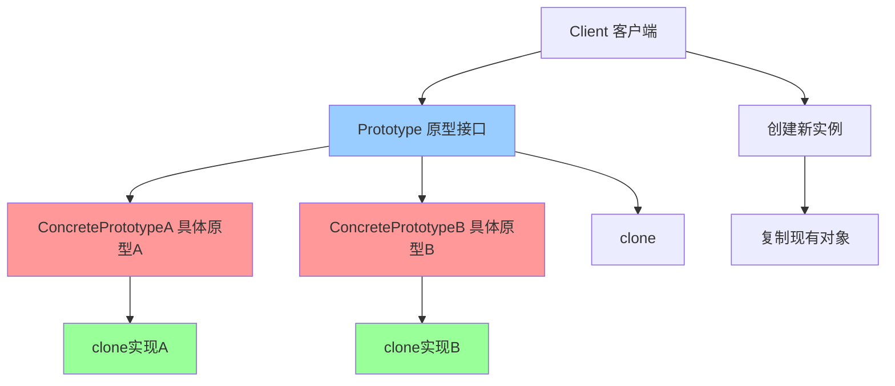

# 原型模式 (Prototype)

> 原型模式是一种创建型设计模式，通过复制现有实例来创建新实例，而不是通过类来创建。

## 📋 概要

原型模式允许通过复制现有对象来创建新对象，而不是通过类来创建。这种模式通过克隆现有对象来创建新对象，避免了重复的初始化过程。

### 核心原理

1. **原型接口**: 声明克隆方法的接口
2. **具体原型**: 实现克隆方法的具体类
3. **客户端**: 使用原型来创建新对象
4. **克隆**: 复制现有对象的状态
5. **浅拷贝/深拷贝**: 决定复制深度

### 适用场景

- 需要避免重复的初始化过程
- 对象创建成本较高
- 需要动态创建对象
- 需要保持对象状态
- 需要避免构造函数限制

### 优点

- **性能优化**: 避免重复的初始化过程
- **灵活性**: 动态创建对象
- **简化创建**: 简化复杂对象的创建
- **状态保持**: 保持对象状态
- **减少依赖**: 减少对具体类的依赖

### 缺点

- **复杂性**: 实现深拷贝可能复杂
- **内存使用**: 可能增加内存使用
- **调试困难**: 克隆对象可能难以调试
- **循环引用**: 深拷贝可能遇到循环引用问题

## 📋 原型模式架构图



## 🚀 基础实现

### 1. 简单原型实现

```dart
// 原型接口
abstract class Prototype {
  Prototype clone();
  String getDescription();
}

// 具体原型A
class ConcretePrototypeA implements Prototype {
  final String _name;
  final int _value;
  final List<String> _items;
  
  ConcretePrototypeA(this._name, this._value, this._items);
  
  @override
  Prototype clone() {
    // 深拷贝
    return ConcretePrototypeA(
      _name,
      _value,
      List<String>.from(_items),
    );
  }
  
  @override
  String getDescription() {
    return 'ConcretePrototypeA: $_name, $_value, $_items';
  }
  
  void addItem(String item) {
    _items.add(item);
  }
  
  void setValue(int value) {
    // 注意：这里不能直接修改 _value，因为它是 final
    // 在实际应用中，可能需要使用可变字段
  }
}

// 具体原型B
class ConcretePrototypeB implements Prototype {
  final String _type;
  final Map<String, dynamic> _config;
  
  ConcretePrototypeB(this._type, this._config);
  
  @override
  Prototype clone() {
    // 深拷贝
    return ConcretePrototypeB(
      _type,
      Map<String, dynamic>.from(_config),
    );
  }
  
  @override
  String getDescription() {
    return 'ConcretePrototypeB: $_type, $_config';
  }
  
  void setConfig(String key, dynamic value) {
    _config[key] = value;
  }
}

// 原型管理器
class PrototypeManager {
  final Map<String, Prototype> _prototypes = {};
  
  void registerPrototype(String key, Prototype prototype) {
    _prototypes[key] = prototype;
  }
  
  Prototype? getPrototype(String key) {
    return _prototypes[key]?.clone();
  }
  
  List<String> getAvailableKeys() {
    return _prototypes.keys.toList();
  }
}

// 客户端代码
class Client {
  final PrototypeManager _manager;
  
  Client(this._manager);
  
  void createFromPrototype(String key) {
    final prototype = _manager.getPrototype(key);
    if (prototype != null) {
      print('从原型创建: ${prototype.getDescription()}');
    } else {
      print('原型不存在: $key');
    }
  }
}

// 使用示例
void main() {
  final manager = PrototypeManager();
  
  // 注册原型
  manager.registerPrototype('A', ConcretePrototypeA('原型A', 100, ['item1', 'item2']));
  manager.registerPrototype('B', ConcretePrototypeB('类型B', {'key1': 'value1', 'key2': 42}));
  
  final client = Client(manager);
  
  // 从原型创建对象
  client.createFromPrototype('A');
  client.createFromPrototype('B');
  client.createFromPrototype('C'); // 不存在的原型
}
```

### 2. 可变的原型实现

```dart
// 可变原型接口
abstract class MutablePrototype {
  MutablePrototype clone();
  String getDescription();
  void modify();
}

// 可变具体原型
class MutableConcretePrototype implements MutablePrototype {
  String _name;
  int _value;
  List<String> _items;
  
  MutableConcretePrototype(this._name, this._value, this._items);
  
  @override
  MutablePrototype clone() {
    return MutableConcretePrototype(
      _name,
      _value,
      List<String>.from(_items),
    );
  }
  
  @override
  String getDescription() {
    return 'MutableConcretePrototype: $_name, $_value, $_items';
  }
  
  @override
  void modify() {
    _name = '${_name}_modified';
    _value += 10;
    _items.add('new_item');
  }
  
  void setName(String name) {
    _name = name;
  }
  
  void setValue(int value) {
    _value = value;
  }
  
  void addItem(String item) {
    _items.add(item);
  }
}

// 原型缓存
class PrototypeCache {
  final Map<String, MutablePrototype> _cache = {};
  
  void put(String key, MutablePrototype prototype) {
    _cache[key] = prototype;
  }
  
  MutablePrototype? get(String key) {
    return _cache[key]?.clone();
  }
  
  void clear() {
    _cache.clear();
  }
  
  int get size => _cache.length;
}

// 使用示例
void main() {
  final cache = PrototypeCache();
  
  // 创建并缓存原型
  final original = MutableConcretePrototype('原始', 100, ['item1']);
  cache.put('default', original);
  
  print('原始原型: ${original.getDescription()}');
  
  // 从缓存获取克隆
  final clone1 = cache.get('default');
  final clone2 = cache.get('default');
  
  if (clone1 != null && clone2 != null) {
    print('克隆1: ${clone1.getDescription()}');
    print('克隆2: ${clone2.getDescription()}');
    
    // 修改克隆
    clone1.modify();
    clone2.setName('自定义名称');
    clone2.addItem('自定义项目');
    
    print('修改后克隆1: ${clone1.getDescription()}');
    print('修改后克隆2: ${clone2.getDescription()}');
    print('原始原型: ${original.getDescription()}'); // 原始原型不变
  }
}
```

## 🔧 实际应用场景

### 1. 文档模板原型

```dart
// 文档原型
abstract class Document {
  Document clone();
  void fill(String content);
  void display();
  String getTitle();
}

// 简历文档
class Resume implements Document {
  String _name;
  String _email;
  String _phone;
  List<String> _experience;
  List<String> _education;
  
  Resume({
    required String name,
    required String email,
    required String phone,
    List<String>? experience,
    List<String>? education,
  }) : _name = name,
       _email = email,
       _phone = phone,
       _experience = experience ?? [],
       _education = education ?? [];
  
  @override
  Document clone() {
    return Resume(
      name: _name,
      email: _email,
      phone: _phone,
      experience: List<String>.from(_experience),
      education: List<String>.from(_education),
    );
  }
  
  @override
  void fill(String content) {
    // 填充内容
    print('填充简历内容: $content');
  }
  
  @override
  void display() {
    print('=== 简历 ===');
    print('姓名: $_name');
    print('邮箱: $_email');
    print('电话: $_phone');
    print('工作经验: $_experience');
    print('教育背景: $_education');
  }
  
  @override
  String getTitle() => '简历 - $_name';
  
  void addExperience(String experience) {
    _experience.add(experience);
  }
  
  void addEducation(String education) {
    _education.add(education);
  }
}

// 报告文档
class Report implements Document {
  String _title;
  String _author;
  String _content;
  DateTime _date;
  
  Report({
    required String title,
    required String author,
    String? content,
    DateTime? date,
  }) : _title = title,
       _author = author,
       _content = content ?? '',
       _date = date ?? DateTime.now();
  
  @override
  Document clone() {
    return Report(
      title: _title,
      author: _author,
      content: _content,
      date: _date,
    );
  }
  
  @override
  void fill(String content) {
    _content = content;
    print('填充报告内容: $content');
  }
  
  @override
  void display() {
    print('=== 报告 ===');
    print('标题: $_title');
    print('作者: $_author');
    print('日期: ${_date.toLocal()}');
    print('内容: $_content');
  }
  
  @override
  String getTitle() => '报告 - $_title';
}

// 文档管理器
class DocumentManager {
  final Map<String, Document> _templates = {};
  
  void registerTemplate(String name, Document template) {
    _templates[name] = template;
  }
  
  Document? createDocument(String templateName) {
    return _templates[templateName]?.clone();
  }
  
  List<String> getAvailableTemplates() {
    return _templates.keys.toList();
  }
}

// 使用示例
void main() {
  final manager = DocumentManager();
  
  // 注册模板
  manager.registerTemplate('resume', Resume(
    name: '张三',
    email: 'zhangsan@example.com',
    phone: '13800138000',
    experience: ['公司A - 开发工程师', '公司B - 高级工程师'],
    education: ['计算机科学学士'],
  ));
  
  manager.registerTemplate('report', Report(
    title: '项目报告',
    author: '李四',
    content: '这是一个项目报告模板',
  ));
  
  // 创建文档
  final resume1 = manager.createDocument('resume') as Resume?;
  final resume2 = manager.createDocument('resume') as Resume?;
  final report = manager.createDocument('report') as Report?;
  
  if (resume1 != null && resume2 != null && report != null) {
    // 修改文档
    resume1.addExperience('公司C - 技术主管');
    resume2.addEducation('MBA');
    report.fill('这是具体的报告内容');
    
    // 显示文档
    resume1.display();
    print('\n');
    resume2.display();
    print('\n');
    report.display();
  }
}
```

### 2. 游戏对象原型

```dart
// 游戏对象原型
abstract class GameObject {
  GameObject clone();
  void update();
  void render();
  String getType();
}

// 敌人原型
class Enemy implements GameObject {
  String _type;
  int _health;
  int _damage;
  double _speed;
  List<String> _abilities;
  
  Enemy({
    required String type,
    required int health,
    required int damage,
    required double speed,
    List<String>? abilities,
  }) : _type = type,
       _health = health,
       _damage = damage,
       _speed = speed,
       _abilities = abilities ?? [];
  
  @override
  GameObject clone() {
    return Enemy(
      type: _type,
      health: _health,
      damage: _damage,
      speed: _speed,
      abilities: List<String>.from(_abilities),
    );
  }
  
  @override
  void update() {
    print('更新敌人: $_type, 生命值: $_health');
  }
  
  @override
  void render() {
    print('渲染敌人: $_type');
  }
  
  @override
  String getType() => _type;
  
  void takeDamage(int damage) {
    _health -= damage;
    if (_health < 0) _health = 0;
  }
  
  void addAbility(String ability) {
    _abilities.add(ability);
  }
  
  bool isAlive() => _health > 0;
}

// 道具原型
class Item implements GameObject {
  String _name;
  String _description;
  int _value;
  bool _isConsumable;
  
  Item({
    required String name,
    required String description,
    required int value,
    required bool isConsumable,
  }) : _name = name,
       _description = description,
       _value = value,
       _isConsumable = isConsumable;
  
  @override
  GameObject clone() {
    return Item(
      name: _name,
      description: _description,
      value: _value,
      isConsumable: _isConsumable,
    );
  }
  
  @override
  void update() {
    print('更新道具: $_name');
  }
  
  @override
  void render() {
    print('渲染道具: $_name - $_description');
  }
  
  @override
  String getType() => 'Item';
  
  void use() {
    if (_isConsumable) {
      print('使用消耗品: $_name');
    } else {
      print('使用道具: $_name');
    }
  }
}

// 游戏对象工厂
class GameObjectFactory {
  final Map<String, GameObject> _prototypes = {};
  
  void registerPrototype(String name, GameObject prototype) {
    _prototypes[name] = prototype;
  }
  
  GameObject? createObject(String name) {
    return _prototypes[name]?.clone();
  }
  
  List<String> getAvailableObjects() {
    return _prototypes.keys.toList();
  }
}

// 游戏管理器
class GameManager {
  final GameObjectFactory _factory;
  final List<GameObject> _objects = [];
  
  GameManager(this._factory);
  
  void spawnObject(String prototypeName) {
    final object = _factory.createObject(prototypeName);
    if (object != null) {
      _objects.add(object);
      print('生成对象: ${object.getType()}');
    }
  }
  
  void updateAll() {
    for (final object in _objects) {
      object.update();
    }
  }
  
  void renderAll() {
    for (final object in _objects) {
      object.render();
    }
  }
  
  void clear() {
    _objects.clear();
  }
  
  int get objectCount => _objects.length;
}

// 使用示例
void main() {
  final factory = GameObjectFactory();
  
  // 注册原型
  factory.registerPrototype('goblin', Enemy(
    type: '哥布林',
    health: 50,
    damage: 10,
    speed: 2.0,
    abilities: ['攻击', '逃跑'],
  ));
  
  factory.registerPrototype('troll', Enemy(
    type: '巨魔',
    health: 200,
    damage: 30,
    speed: 1.0,
    abilities: ['攻击', '狂暴'],
  ));
  
  factory.registerPrototype('health_potion', Item(
    name: '生命药水',
    description: '恢复生命值',
    value: 50,
    isConsumable: true,
  ));
  
  factory.registerPrototype('sword', Item(
    name: '铁剑',
    description: '锋利的武器',
    value: 100,
    isConsumable: false,
  ));
  
  final gameManager = GameManager(factory);
  
  // 生成游戏对象
  gameManager.spawnObject('goblin');
  gameManager.spawnObject('troll');
  gameManager.spawnObject('health_potion');
  gameManager.spawnObject('sword');
  
  print('\n=== 游戏更新 ===');
  gameManager.updateAll();
  
  print('\n=== 游戏渲染 ===');
  gameManager.renderAll();
  
  print('\n对象总数: ${gameManager.objectCount}');
}
```

## 🧪 测试和调试

### 1. 原型模式单元测试

```dart
// test/prototype_test.dart
import 'package:flutter_test/flutter_test.dart';
import 'package:myapp/prototype.dart';

void main() {
  group('原型模式测试', () {
    test('应该正确克隆ConcretePrototypeA', () {
      final original = ConcretePrototypeA('测试', 100, ['item1', 'item2']);
      final clone = original.clone() as ConcretePrototypeA;
      
      expect(clone, isA<ConcretePrototypeA>());
      expect(clone.getDescription(), equals(original.getDescription()));
    });
    
    test('克隆对象应该独立', () {
      final original = ConcretePrototypeA('测试', 100, ['item1']);
      final clone = original.clone() as ConcretePrototypeA;
      
      clone.addItem('item2');
      
      expect(original.getDescription(), contains('item1'));
      expect(original.getDescription(), isNot(contains('item2')));
      expect(clone.getDescription(), contains('item1'));
      expect(clone.getDescription(), contains('item2'));
    });
    
    test('应该正确克隆ConcretePrototypeB', () {
      final original = ConcretePrototypeB('类型', {'key': 'value'});
      final clone = original.clone() as ConcretePrototypeB;
      
      expect(clone, isA<ConcretePrototypeB>());
      expect(clone.getDescription(), equals(original.getDescription()));
    });
    
    test('原型管理器应该正确工作', () {
      final manager = PrototypeManager();
      final prototype = ConcretePrototypeA('测试', 100, []);
      
      manager.registerPrototype('test', prototype);
      
      expect(manager.getAvailableKeys(), contains('test'));
      
      final clone = manager.getPrototype('test');
      expect(clone, isNotNull);
      expect(clone, isA<ConcretePrototypeA>());
    });
  });
  
  group('可变原型测试', () {
    test('可变原型应该正确克隆', () {
      final original = MutableConcretePrototype('原始', 100, ['item1']);
      final clone = original.clone() as MutableConcretePrototype;
      
      expect(clone, isA<MutableConcretePrototype>());
      expect(clone.getDescription(), equals(original.getDescription()));
    });
    
    test('克隆后修改应该独立', () {
      final original = MutableConcretePrototype('原始', 100, ['item1']);
      final clone = original.clone() as MutableConcretePrototype;
      
      clone.modify();
      
      expect(original.getDescription(), contains('原始'));
      expect(clone.getDescription(), contains('原始_modified'));
    });
  });
  
  group('文档原型测试', () {
    test('简历应该正确克隆', () {
      final original = Resume(
        name: '张三',
        email: 'test@example.com',
        phone: '123456',
        experience: ['公司A'],
        education: ['大学A'],
      );
      
      final clone = original.clone() as Resume;
      
      expect(clone, isA<Resume>());
      expect(clone.getTitle(), equals(original.getTitle()));
    });
    
    test('报告应该正确克隆', () {
      final original = Report(
        title: '测试报告',
        author: '李四',
        content: '测试内容',
      );
      
      final clone = original.clone() as Report;
      
      expect(clone, isA<Report>());
      expect(clone.getTitle(), equals(original.getTitle()));
    });
  });
  
  group('游戏对象原型测试', () {
    test('敌人应该正确克隆', () {
      final original = Enemy(
        type: '哥布林',
        health: 50,
        damage: 10,
        speed: 2.0,
        abilities: ['攻击'],
      );
      
      final clone = original.clone() as Enemy;
      
      expect(clone, isA<Enemy>());
      expect(clone.getType(), equals(original.getType()));
    });
    
    test('道具应该正确克隆', () {
      final original = Item(
        name: '药水',
        description: '恢复生命',
        value: 50,
        isConsumable: true,
      );
      
      final clone = original.clone() as Item;
      
      expect(clone, isA<Item>());
      expect(clone.getType(), equals(original.getType()));
    });
  });
}
```

## 📚 最佳实践

### 1. 设计原则
- **深拷贝**: 确保克隆对象的独立性
- **性能考虑**: 避免不必要的深拷贝
- **内存管理**: 及时释放不需要的原型
- **类型安全**: 确保克隆方法的类型安全

### 2. 性能优化
- **原型缓存**: 缓存常用的原型
- **延迟克隆**: 延迟克隆直到需要
- **对象池**: 使用对象池管理原型
- **内存优化**: 优化深拷贝的内存使用

### 3. 错误处理
- **原型验证**: 验证原型对象
- **克隆异常**: 处理克隆过程中的异常
- **循环引用**: 处理深拷贝中的循环引用
- **内存不足**: 处理内存不足的情况

### 4. 调试技巧
- **原型追踪**: 追踪原型创建过程
- **克隆验证**: 验证克隆结果
- **性能监控**: 监控克隆性能
- **内存分析**: 分析内存使用情况

## 🎯 小结

原型模式是创建对象的强大工具，特别适合需要避免重复初始化过程的场景。在 Flutter 开发中，它可以用于文档模板、游戏对象、UI组件等。

### 选择建议

- **初始化成本**: 对象创建成本较高
- **状态保持**: 需要保持对象状态
- **动态创建**: 需要动态创建对象
- **模板系统**: 需要模板系统

### 关键要点

1. **克隆深度**: 选择合适的克隆深度
2. **性能优化**: 注意克隆的性能影响
3. **内存管理**: 合理管理原型内存
4. **类型安全**: 确保克隆的类型安全
5. **错误处理**: 提供完善的错误处理

---

> 💡 **提示**: 原型模式是避免重复初始化的优秀方案，但要权衡深拷贝的性能成本。建议在对象创建成本较高的场景中使用，并注意内存管理和性能优化。 