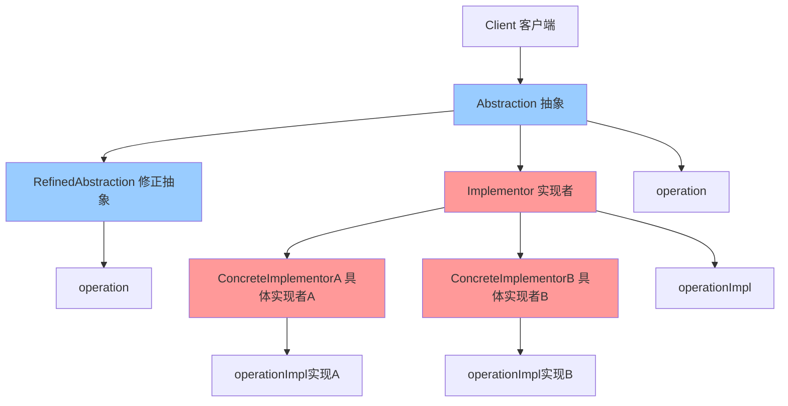

# 桥接模式 (Bridge)

> 桥接模式是一种结构型设计模式，将抽象部分与实现部分分离，使它们都可以独立地变化。

## 📋 概要

桥接模式通过将抽象和实现分离，使它们可以独立变化。这种模式使用组合关系代替继承关系，从而降低了抽象和实现这两个可变维度的耦合度。

### 核心原理

1. **抽象(Abstraction)**: 定义抽象类的接口
2. **修正抽象(RefinedAbstraction)**: 扩展抽象类的功能
3. **实现者(Implementor)**: 定义实现类的接口
4. **具体实现者(ConcreteImplementor)**: 实现实现者接口
5. **桥接**: 抽象类持有实现者的引用

### 适用场景

- 需要将抽象和实现分离
- 需要支持多种实现方式
- 需要避免继承的静态绑定
- 需要支持运行时切换实现
- 需要支持多维度变化

### 优点

- **解耦**: 抽象与实现分离
- **扩展性**: 易于扩展新的抽象和实现
- **灵活性**: 支持运行时切换实现
- **避免继承**: 避免继承的静态绑定问题
- **多维度**: 支持多维度变化

### 缺点

- **复杂性**: 增加系统复杂性
- **理解困难**: 可能难以理解
- **设计过度**: 可能过度设计
- **性能影响**: 可能影响性能

## 📋 桥接模式架构图



## 🚀 基础实现

### 1. 简单桥接实现

```dart
// 实现者接口
abstract class Implementor {
  void operationImpl();
}

// 具体实现者A
class ConcreteImplementorA implements Implementor {
  @override
  void operationImpl() {
    print('ConcreteImplementorA 的具体实现');
  }
}

// 具体实现者B
class ConcreteImplementorB implements Implementor {
  @override
  void operationImpl() {
    print('ConcreteImplementorB 的具体实现');
  }
}

// 抽象类
abstract class Abstraction {
  final Implementor _implementor;

  Abstraction(this._implementor);

  void operation() {
    print('抽象类的操作');
    _implementor.operationImpl();
  }

  Implementor get implementor => _implementor;
}

// 修正抽象类
class RefinedAbstraction extends Abstraction {
  RefinedAbstraction(Implementor implementor) : super(implementor);

  @override
  void operation() {
    print('修正抽象类的操作');
    super.operation();
  }

  void additionalOperation() {
    print('修正抽象类的额外操作');
    _implementor.operationImpl();
  }
}

// 使用示例
void main() {
  print('=== 桥接模式演示 ===');

  // 使用实现者A
  final implementorA = ConcreteImplementorA();
  final abstractionA = RefinedAbstraction(implementorA);

  print('使用实现者A:');
  abstractionA.operation();
  abstractionA.additionalOperation();

  print('\n使用实现者B:');
  // 使用实现者B
  final implementorB = ConcreteImplementorB();
  final abstractionB = RefinedAbstraction(implementorB);

  abstractionB.operation();
  abstractionB.additionalOperation();

  print('\n运行时切换实现:');
  // 运行时切换实现
  final abstraction = RefinedAbstraction(implementorA);
  abstraction.operation();

  // 切换到实现者B
  final newAbstraction = RefinedAbstraction(implementorB);
  newAbstraction.operation();
}
```

### 2. 图形绘制桥接

```dart
// 绘制实现者接口
abstract class DrawingAPI {
  void drawCircle(double x, double y, double radius);
  void drawRectangle(double x, double y, double width, double height);
  void drawLine(double x1, double y1, double x2, double y2);
}

// 具体绘制实现者 - 屏幕绘制
class ScreenDrawingAPI implements DrawingAPI {
  @override
  void drawCircle(double x, double y, double radius) {
    print('在屏幕上绘制圆形: 位置($x, $y), 半径$radius');
  }

  @override
  void drawRectangle(double x, double y, double width, double height) {
    print('在屏幕上绘制矩形: 位置($x, $y), 尺寸${width}x$height');
  }

  @override
  void drawLine(double x1, double y1, double x2, double y2) {
    print('在屏幕上绘制直线: 从($x1, $y1)到($x2, $y2)');
  }
}

// 具体绘制实现者 - 打印机绘制
class PrinterDrawingAPI implements DrawingAPI {
  @override
  void drawCircle(double x, double y, double radius) {
    print('在打印机上绘制圆形: 位置($x, $y), 半径$radius');
  }

  @override
  void drawRectangle(double x, double y, double width, double height) {
    print('在打印机上绘制矩形: 位置($x, $y), 尺寸${width}x$height');
  }

  @override
  void drawLine(double x1, double y1, double x2, double y2) {
    print('在打印机上绘制直线: 从($x1, $y1)到($x2, $y2)');
  }
}

// 具体绘制实现者 - 文件绘制
class FileDrawingAPI implements DrawingAPI {
  final List<String> _commands = [];

  @override
  void drawCircle(double x, double y, double radius) {
    _commands.add('CIRCLE $x $y $radius');
    print('添加圆形命令到文件: 位置($x, $y), 半径$radius');
  }

  @override
  void drawRectangle(double x, double y, double width, double height) {
    _commands.add('RECTANGLE $x $y $width $height');
    print('添加矩形命令到文件: 位置($x, $y), 尺寸${width}x$height');
  }

  @override
  void drawLine(double x1, double y1, double x2, double y2) {
    _commands.add('LINE $x1 $y1 $x2 $y2');
    print('添加直线命令到文件: 从($x1, $y1)到($x2, $y2)');
  }

  void saveToFile(String filename) {
    print('=== 保存绘制命令到文件: $filename ===');
    for (final command in _commands) {
      print('  $command');
    }
  }

  void clear() {
    _commands.clear();
  }
}

// 形状抽象类
abstract class Shape {
  final DrawingAPI _drawingAPI;

  Shape(this._drawingAPI);

  void draw();
  void resize(double percentage);

  DrawingAPI get drawingAPI => _drawingAPI;
}

// 圆形类
class Circle extends Shape {
  double _x, _y, _radius;

  Circle(DrawingAPI drawingAPI, this._x, this._y, this._radius)
    : super(drawingAPI);

  double get x => _x;
  double get y => _y;
  double get radius => _radius;

  @override
  void draw() {
    print('绘制圆形');
    _drawingAPI.drawCircle(_x, _y, _radius);
  }

  @override
  void resize(double percentage) {
    _radius *= percentage / 100.0;
    print('调整圆形大小: 新半径 $_radius');
  }

  void move(double newX, double newY) {
    _x = newX;
    _y = newY;
    print('移动圆形到: ($_x, $_y)');
  }
}

// 矩形类
class Rectangle extends Shape {
  double _x, _y, _width, _height;

  Rectangle(DrawingAPI drawingAPI, this._x, this._y, this._width, this._height)
    : super(drawingAPI);

  double get x => _x;
  double get y => _y;
  double get width => _width;
  double get height => _height;

  @override
  void draw() {
    print('绘制矩形');
    _drawingAPI.drawRectangle(_x, _y, _width, _height);
  }

  @override
  void resize(double percentage) {
    _width *= percentage / 100.0;
    _height *= percentage / 100.0;
    print('调整矩形大小: 新尺寸 ${_width}x$_height');
  }

  void rotate(double angle) {
    print('旋转矩形: ${angle}度');
  }
}

// 线条类
class Line extends Shape {
  double _x1, _y1, _x2, _y2;

  Line(DrawingAPI drawingAPI, this._x1, this._y1, this._x2, this._y2)
    : super(drawingAPI);

  double get x1 => _x1;
  double get y1 => _y1;
  double get x2 => _x2;
  double get y2 => _y2;

  @override
  void draw() {
    print('绘制直线');
    _drawingAPI.drawLine(_x1, _y1, _x2, _y2);
  }

  @override
  void resize(double percentage) {
    final dx = _x2 - _x1;
    final dy = _y2 - _y1;
    _x2 = _x1 + dx * percentage / 100.0;
    _y2 = _y1 + dy * percentage / 100.0;
    print('调整直线长度: 新终点 ($_x2, $_y2)');
  }

  void setEndPoint(double x2, double y2) {
    _x2 = x2;
    _y2 = y2;
    print('设置直线终点: ($_x2, $_y2)');
  }
}

// 使用示例
void main() {
  print('=== 图形绘制桥接模式演示 ===');

  // 创建不同的绘制API
  final screenAPI = ScreenDrawingAPI();
  final printerAPI = PrinterDrawingAPI();
  final fileAPI = FileDrawingAPI();

  print('\n=== 屏幕绘制 ===');
  final screenCircle = Circle(screenAPI, 10, 10, 5);
  final screenRectangle = Rectangle(screenAPI, 20, 20, 15, 10);
  final screenLine = Line(screenAPI, 0, 0, 30, 30);

  screenCircle.draw();
  screenRectangle.draw();
  screenLine.draw();

  print('\n=== 打印机绘制 ===');
  final printerCircle = Circle(printerAPI, 10, 10, 5);
  final printerRectangle = Rectangle(printerAPI, 20, 20, 15, 10);
  final printerLine = Line(printerAPI, 0, 0, 30, 30);

  printerCircle.draw();
  printerRectangle.draw();
  printerLine.draw();

  print('\n=== 文件绘制 ===');
  final fileCircle = Circle(fileAPI, 10, 10, 5);
  final fileRectangle = Rectangle(fileAPI, 20, 20, 15, 10);
  final fileLine = Line(fileAPI, 0, 0, 30, 30);

  fileCircle.draw();
  fileRectangle.draw();
  fileLine.draw();

  fileAPI.saveToFile('drawing.txt');

  print('\n=== 形状操作 ===');
  screenCircle.resize(150);
  screenCircle.move(15, 15);
  screenCircle.draw();

  screenRectangle.resize(80);
  screenRectangle.rotate(45);
  screenRectangle.draw();

  screenLine.resize(200);
  screenLine.setEndPoint(50, 50);
  screenLine.draw();
}
```

## 🔧 实际应用场景

### 1. 消息发送桥接

```dart
// 消息发送实现者接口
abstract class MessageSender {
  void sendMessage(String message, String recipient);
  bool isAvailable();
  String getSenderType();
}

// 邮件发送实现者
class EmailSender implements MessageSender {
  final String _smtpServer;
  final String _username;

  EmailSender(this._smtpServer, this._username);

  @override
  void sendMessage(String message, String recipient) {
    print('通过邮件发送消息:');
    print('  SMTP服务器: $_smtpServer');
    print('  发送者: $_username');
    print('  接收者: $recipient');
    print('  消息: $message');
  }

  @override
  bool isAvailable() {
    return _smtpServer.isNotEmpty && _username.isNotEmpty;
  }

  @override
  String getSenderType() => 'Email';
}

// 短信发送实现者
class SMSSender implements MessageSender {
  final String _gateway;
  final String _apiKey;

  SMSSender(this._gateway, this._apiKey);

  @override
  void sendMessage(String message, String recipient) {
    print('通过短信发送消息:');
    print('  网关: $_gateway');
    print('  API密钥: ${_apiKey.substring(0, 8)}...');
    print('  接收者: $recipient');
    print('  消息: $message');
  }

  @override
  bool isAvailable() {
    return _gateway.isNotEmpty && _apiKey.isNotEmpty;
  }

  @override
  String getSenderType() => 'SMS';
}

// 推送通知发送实现者
class PushSender implements MessageSender {
  final String _serverUrl;
  final String _appId;

  PushSender(this._serverUrl, this._appId);

  @override
  void sendMessage(String message, String recipient) {
    print('通过推送通知发送消息:');
    print('  服务器: $_serverUrl');
    print('  应用ID: $_appId');
    print('  设备ID: $recipient');
    print('  消息: $message');
  }

  @override
  bool isAvailable() {
    return _serverUrl.isNotEmpty && _appId.isNotEmpty;
  }

  @override
  String getSenderType() => 'Push';
}

// 消息抽象类
abstract class Message {
  final MessageSender _sender;
  final String _content;
  final String _recipient;

  Message(this._sender, this._content, this._recipient);

  void send();
  void validate();

  String get content => _content;
  String get recipient => _recipient;
  MessageSender get sender => _sender;
}

// 普通消息类
class SimpleMessage extends Message {
  SimpleMessage(MessageSender sender, String content, String recipient)
    : super(sender, content, recipient);

  @override
  void send() {
    print('发送普通消息');
    validate();
    _sender.sendMessage(_content, _recipient);
  }

  @override
  void validate() {
    if (_content.isEmpty) {
      throw Exception('消息内容不能为空');
    }
    if (_recipient.isEmpty) {
      throw Exception('接收者不能为空');
    }
    if (!_sender.isAvailable()) {
      throw Exception('发送者不可用');
    }
    print('普通消息验证通过');
  }
}

// 紧急消息类
class UrgentMessage extends Message {
  final int _priority;

  UrgentMessage(MessageSender sender, String content, String recipient, this._priority)
    : super(sender, content, recipient);

  int get priority => _priority;

  @override
  void send() {
    print('发送紧急消息 (优先级: $_priority)');
    validate();
    final urgentContent = '[紧急] $_content';
    _sender.sendMessage(urgentContent, _recipient);
  }

  @override
  void validate() {
    if (_content.isEmpty) {
      throw Exception('消息内容不能为空');
    }
    if (_recipient.isEmpty) {
      throw Exception('接收者不能为空');
    }
    if (!_sender.isAvailable()) {
      throw Exception('发送者不可用');
    }
    if (_priority < 1 || _priority > 10) {
      throw Exception('优先级必须在1-10之间');
    }
    print('紧急消息验证通过');
  }

  void escalate() {
    print('升级紧急消息优先级');
    _priority = (_priority + 1).clamp(1, 10);
  }
}

// 群发消息类
class BroadcastMessage extends Message {
  final List<String> _recipients;

  BroadcastMessage(MessageSender sender, String content, List<String> recipients)
    : super(sender, content, recipients.join(', ')),
      _recipients = List.from(recipients);

  List<String> get recipients => List.from(_recipients);

  @override
  void send() {
    print('发送群发消息 (${_recipients.length} 个接收者)');
    validate();

    for (final recipient in _recipients) {
      print('发送给: $recipient');
      _sender.sendMessage(_content, recipient);
    }
  }

  @override
  void validate() {
    if (_content.isEmpty) {
      throw Exception('消息内容不能为空');
    }
    if (_recipients.isEmpty) {
      throw Exception('接收者列表不能为空');
    }
    if (!_sender.isAvailable()) {
      throw Exception('发送者不可用');
    }
    print('群发消息验证通过');
  }

  void addRecipient(String recipient) {
    _recipients.add(recipient);
    print('添加接收者: $recipient');
  }

  void removeRecipient(String recipient) {
    _recipients.remove(recipient);
    print('移除接收者: $recipient');
  }
}

// 使用示例
void main() {
  print('=== 消息发送桥接模式演示 ===');

  // 创建不同的发送者
  final emailSender = EmailSender('smtp.example.com', 'user@example.com');
  final smsSender = SMSSender('sms.gateway.com', 'api_key_12345678');
  final pushSender = PushSender('push.server.com', 'app_12345');

  print('\n=== 普通消息 ===');
  final simpleEmail = SimpleMessage(emailSender, '你好，这是一封测试邮件', 'recipient@example.com');
  final simpleSMS = SimpleMessage(smsSender, '你好，这是一条测试短信', '+1234567890');
  final simplePush = SimpleMessage(pushSender, '你好，这是一条测试推送', 'device_12345');

  simpleEmail.send();
  print('');
  simpleSMS.send();
  print('');
  simplePush.send();

  print('\n=== 紧急消息 ===');
  final urgentEmail = UrgentMessage(emailSender, '系统故障，请立即处理', 'admin@example.com', 8);
  final urgentSMS = UrgentMessage(smsSender, '服务器宕机，需要紧急修复', '+1234567890', 10);

  urgentEmail.send();
  print('');
  urgentSMS.send();

  print('\n=== 群发消息 ===');
  final broadcastEmail = BroadcastMessage(
    emailSender,
    '系统维护通知',
    ['user1@example.com', 'user2@example.com', 'user3@example.com']
  );

  broadcastEmail.send();

  print('\n=== 运行时切换发送者 ===');
  // 创建消息
  final message = SimpleMessage(emailSender, '测试消息', 'test@example.com');
  message.send();

  // 切换到短信发送
  final smsMessage = SimpleMessage(smsSender, '测试消息', '+1234567890');
  smsMessage.send();

  // 切换到推送发送
  final pushMessage = SimpleMessage(pushSender, '测试消息', 'device_12345');
  pushMessage.send();
}
```

## 🧪 测试和调试

### 1. 桥接模式单元测试

```dart
// test/bridge_test.dart
import 'package:flutter_test/flutter_test.dart';
import 'package:myapp/bridge.dart';

void main() {
  group('桥接模式测试', () {
    test('应该正确创建实现者', () {
      final implementorA = ConcreteImplementorA();
      final implementorB = ConcreteImplementorB();

      expect(implementorA, isA<Implementor>());
      expect(implementorB, isA<Implementor>());
    });

    test('应该正确创建抽象类', () {
      final implementor = ConcreteImplementorA();
      final abstraction = RefinedAbstraction(implementor);

      expect(abstraction, isA<Abstraction>());
      expect(abstraction.implementor, equals(implementor));
    });

    test('抽象类应该正确调用实现者', () {
      final implementor = ConcreteImplementorA();
      final abstraction = RefinedAbstraction(implementor);

      expect(() => abstraction.operation(), returnsNormally);
    });

    test('修正抽象类应该正确工作', () {
      final implementor = ConcreteImplementorA();
      final refinedAbstraction = RefinedAbstraction(implementor);

      expect(() => refinedAbstraction.operation(), returnsNormally);
      expect(() => refinedAbstraction.additionalOperation(), returnsNormally);
    });
  });

  group('图形绘制桥接测试', () {
    test('应该正确创建绘制API', () {
      final screenAPI = ScreenDrawingAPI();
      final printerAPI = PrinterDrawingAPI();
      final fileAPI = FileDrawingAPI();

      expect(screenAPI, isA<DrawingAPI>());
      expect(printerAPI, isA<DrawingAPI>());
      expect(fileAPI, isA<DrawingAPI>());
    });

    test('应该正确创建形状', () {
      final api = ScreenDrawingAPI();
      final circle = Circle(api, 10, 10, 5);
      final rectangle = Rectangle(api, 20, 20, 15, 10);
      final line = Line(api, 0, 0, 30, 30);

      expect(circle, isA<Shape>());
      expect(rectangle, isA<Shape>());
      expect(line, isA<Shape>());
      expect(circle.drawingAPI, equals(api));
    });

    test('形状应该正确绘制', () {
      final api = ScreenDrawingAPI();
      final circle = Circle(api, 10, 10, 5);

      expect(() => circle.draw(), returnsNormally);
    });

    test('形状应该正确调整大小', () {
      final api = ScreenDrawingAPI();
      final circle = Circle(api, 10, 10, 5);

      circle.resize(150);
      expect(circle.radius, equals(7.5));
    });

    test('文件API应该正确保存命令', () {
      final fileAPI = FileDrawingAPI();
      fileAPI.drawCircle(10, 10, 5);
      fileAPI.drawRectangle(20, 20, 15, 10);

      expect(() => fileAPI.saveToFile('test.txt'), returnsNormally);
    });
  });

  group('消息发送桥接测试', () {
    test('应该正确创建发送者', () {
      final emailSender = EmailSender('smtp.example.com', 'user@example.com');
      final smsSender = SMSSender('gateway.com', 'api_key');
      final pushSender = PushSender('server.com', 'app_id');

      expect(emailSender, isA<MessageSender>());
      expect(smsSender, isA<MessageSender>());
      expect(pushSender, isA<MessageSender>());
    });

    test('发送者应该正确检查可用性', () {
      final emailSender = EmailSender('smtp.example.com', 'user@example.com');
      final emptySender = EmailSender('', '');

      expect(emailSender.isAvailable(), isTrue);
      expect(emptySender.isAvailable(), isFalse);
    });

    test('应该正确创建消息', () {
      final sender = EmailSender('smtp.example.com', 'user@example.com');
      final simpleMessage = SimpleMessage(sender, 'test', 'recipient@example.com');
      final urgentMessage = UrgentMessage(sender, 'test', 'recipient@example.com', 5);
      final broadcastMessage = BroadcastMessage(sender, 'test', ['user1@example.com']);

      expect(simpleMessage, isA<Message>());
      expect(urgentMessage, isA<Message>());
      expect(broadcastMessage, isA<Message>());
    });

    test('消息应该正确验证', () {
      final sender = EmailSender('smtp.example.com', 'user@example.com');
      final message = SimpleMessage(sender, 'test', 'recipient@example.com');

      expect(() => message.validate(), returnsNormally);
    });

    test('消息验证应该抛出异常', () {
      final sender = EmailSender('smtp.example.com', 'user@example.com');
      final emptyMessage = SimpleMessage(sender, '', 'recipient@example.com');

      expect(() => emptyMessage.validate(), throwsException);
    });

    test('消息应该正确发送', () {
      final sender = EmailSender('smtp.example.com', 'user@example.com');
      final message = SimpleMessage(sender, 'test', 'recipient@example.com');

      expect(() => message.send(), returnsNormally);
    });
  });
}
```

## 📚 最佳实践

### 1. 设计原则

- **开闭原则**: 易于扩展新的抽象和实现
- **依赖倒置**: 依赖抽象而不是具体实现
- **单一职责**: 抽象和实现各司其职
- **接口隔离**: 定义清晰的接口

### 2. 性能优化

- **实现者缓存**: 缓存常用的实现者
- **延迟初始化**: 延迟初始化实现者
- **内存管理**: 及时释放不需要的实现者
- **连接池**: 使用连接池管理实现者

### 3. 错误处理

- **实现者验证**: 验证实现者的有效性
- **异常处理**: 处理实现者的异常
- **降级策略**: 提供实现者失败时的降级方案
- **日志记录**: 记录桥接操作的日志

### 4. 调试技巧

- **桥接追踪**: 追踪抽象和实现的交互
- **状态监控**: 监控实现者的状态
- **性能分析**: 分析桥接的性能瓶颈
- **内存分析**: 分析内存使用情况

## 🎯 小结

桥接模式是分离抽象和实现的强大工具，特别适合需要支持多种实现方式的场景。在 Flutter 开发中，它可以用于图形绘制、消息发送、数据存储等。

### 选择建议

- **多实现**: 需要支持多种实现方式
- **解耦**: 需要将抽象和实现分离
- **扩展性**: 需要易于扩展新的实现
- **灵活性**: 需要运行时切换实现

### 关键要点

1. **桥接设计**: 设计合适的抽象和实现接口
2. **解耦程度**: 合理控制抽象和实现的耦合度
3. **性能考虑**: 注意桥接的性能影响
4. **扩展性**: 保持系统的扩展性
5. **错误处理**: 提供完善的错误处理机制

---

> 💡 **提示**: 桥接模式是分离抽象和实现的优秀方案，但要权衡复杂性和性能影响。建议在真正需要多实现支持的场景中使用，并注意性能优化和错误处理。
