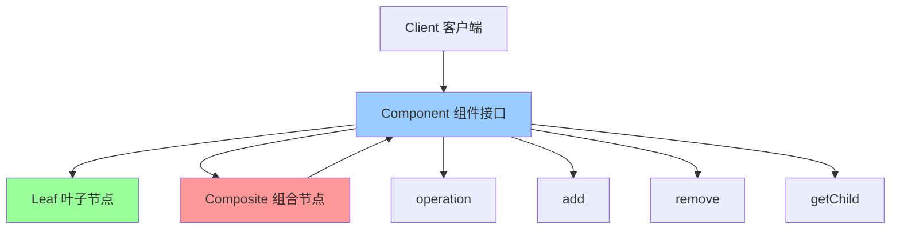

# 组合模式 (Composite)

> 组合模式是一种结构型设计模式，将对象组合成树形结构以表示"部分-整体"的层次结构，使得用户对单个对象和组合对象的使用具有一致性。

## 📋 概要

组合模式将对象组合成树形结构以表示"部分-整体"的层次结构，使得用户对单个对象和组合对象的使用具有一致性。这种模式允许客户端统一处理单个对象和组合对象。

### 核心原理

1. **组件接口**: 定义叶子节点和组合节点的共同接口
2. **叶子节点**: 实现组件接口，表示组合中的叶子对象
3. **组合节点**: 实现组件接口，包含子组件
4. **客户端**: 通过组件接口操作对象

### 适用场景

- 需要表示对象的部分-整体层次结构
- 希望用户忽略组合对象与单个对象的不同
- 需要统一处理单个对象和组合对象
- 需要动态添加或删除组件
- 需要遍历组合结构

### 优点

- **统一接口**: 统一处理单个对象和组合对象
- **简化客户端**: 客户端代码更简洁
- **易于扩展**: 容易添加新的组件类型
- **递归结构**: 支持递归组合
- **灵活性**: 动态组合对象

### 缺点

- **类型检查**: 可能需要进行类型检查
- **性能**: 递归操作可能影响性能
- **复杂性**: 可能增加系统复杂性
- **安全性**: 可能违反类型安全

## 📋 组合模式架构图



## 🚀 基础实现

### 1. 简单组合模式实现

```dart
// 组件接口
abstract class Component {
  String get name;
  void operation();
  void add(Component component);
  void remove(Component component);
  Component? getChild(int index);
  List<Component> getChildren();
}

// 叶子节点
class Leaf implements Component {
  final String _name;
  
  Leaf(this._name);
  
  @override
  String get name => _name;
  
  @override
  void operation() {
    print('叶子节点: $_name 执行操作');
  }
  
  @override
  void add(Component component) {
    throw UnsupportedError('叶子节点不能添加子组件');
  }
  
  @override
  void remove(Component component) {
    throw UnsupportedError('叶子节点不能删除子组件');
  }
  
  @override
  Component? getChild(int index) {
    return null;
  }
  
  @override
  List<Component> getChildren() {
    return [];
  }
}

// 组合节点
class Composite implements Component {
  final String _name;
  final List<Component> _children = [];
  
  Composite(this._name);
  
  @override
  String get name => _name;
  
  @override
  void operation() {
    print('组合节点: $_name 执行操作');
    for (final child in _children) {
      child.operation();
    }
  }
  
  @override
  void add(Component component) {
    _children.add(component);
  }
  
  @override
  void remove(Component component) {
    _children.remove(component);
  }
  
  @override
  Component? getChild(int index) {
    if (index >= 0 && index < _children.length) {
      return _children[index];
    }
    return null;
  }
  
  @override
  List<Component> getChildren() {
    return List.unmodifiable(_children);
  }
}

// 使用示例
void main() {
  // 创建组合结构
  final root = Composite('根节点');
  
  final branch1 = Composite('分支1');
  final branch2 = Composite('分支2');
  
  final leaf1 = Leaf('叶子1');
  final leaf2 = Leaf('叶子2');
  final leaf3 = Leaf('叶子3');
  
  // 构建树形结构
  root.add(branch1);
  root.add(branch2);
  
  branch1.add(leaf1);
  branch1.add(leaf2);
  branch2.add(leaf3);
  
  // 执行操作
  print('=== 执行组合操作 ===');
  root.operation();
  
  print('\n=== 遍历结构 ===');
  _traverseComponent(root, 0);
}

void _traverseComponent(Component component, int depth) {
  final indent = '  ' * depth;
  print('$indent${component.name}');
  
  for (final child in component.getChildren()) {
    _traverseComponent(child, depth + 1);
  }
}
```

### 2. 文件系统组合模式

```dart
// 文件系统组件
abstract class FileSystemComponent {
  String get name;
  int get size;
  void display(String indent);
  void add(FileSystemComponent component);
  void remove(FileSystemComponent component);
  FileSystemComponent? find(String name);
}

// 文件
class File implements FileSystemComponent {
  final String _name;
  final int _size;
  
  File(this._name, this._size);
  
  @override
  String get name => _name;
  
  @override
  int get size => _size;
  
  @override
  void display(String indent) {
    print('$indent📄 $_name ($_size bytes)');
  }
  
  @override
  void add(FileSystemComponent component) {
    throw UnsupportedError('文件不能添加子组件');
  }
  
  @override
  void remove(FileSystemComponent component) {
    throw UnsupportedError('文件不能删除子组件');
  }
  
  @override
  FileSystemComponent? find(String name) {
    return _name == name ? this : null;
  }
}

// 目录
class Directory implements FileSystemComponent {
  final String _name;
  final List<FileSystemComponent> _children = [];
  
  Directory(this._name);
  
  @override
  String get name => _name;
  
  @override
  int get size {
    return _children.fold(0, (sum, child) => sum + child.size);
  }
  
  @override
  void display(String indent) {
    print('$indent📁 $_name (${size} bytes)');
    for (final child in _children) {
      child.display(indent + '  ');
    }
  }
  
  @override
  void add(FileSystemComponent component) {
    _children.add(component);
  }
  
  @override
  void remove(FileSystemComponent component) {
    _children.remove(component);
  }
  
  @override
  FileSystemComponent? find(String name) {
    if (_name == name) {
      return this;
    }
    
    for (final child in _children) {
      final result = child.find(name);
      if (result != null) {
        return result;
      }
    }
    
    return null;
  }
  
  List<FileSystemComponent> getChildren() {
    return List.unmodifiable(_children);
  }
}

// 使用示例
void main() {
  // 创建文件系统结构
  final root = Directory('根目录');
  
  final documents = Directory('文档');
  final pictures = Directory('图片');
  final music = Directory('音乐');
  
  final report = File('报告.pdf', 1024 * 1024);
  final photo1 = File('照片1.jpg', 512 * 1024);
  final photo2 = File('照片2.jpg', 768 * 1024);
  final song1 = File('歌曲1.mp3', 2048 * 1024);
  final song2 = File('歌曲2.mp3', 1536 * 1024);
  
  // 构建文件系统
  root.add(documents);
  root.add(pictures);
  root.add(music);
  
  documents.add(report);
  pictures.add(photo1);
  pictures.add(photo2);
  music.add(song1);
  music.add(song2);
  
  // 显示文件系统结构
  print('=== 文件系统结构 ===');
  root.display('');
  
  // 查找文件
  print('\n=== 查找文件 ===');
  final found = root.find('照片1.jpg');
  if (found != null) {
    print('找到文件: ${found.name}');
  }
  
  // 计算总大小
  print('\n=== 目录大小 ===');
  print('根目录大小: ${root.size} bytes');
  print('文档目录大小: ${documents.size} bytes');
  print('图片目录大小: ${pictures.size} bytes');
  print('音乐目录大小: ${music.size} bytes');
}
```

## 🔧 实际应用场景

### 1. Flutter Widget 组合

```dart
// Widget 组件接口
abstract class WidgetComponent {
  String get name;
  Widget build(BuildContext context);
  void add(WidgetComponent component);
  void remove(WidgetComponent component);
  List<WidgetComponent> getChildren();
}

// 叶子 Widget
class TextWidget implements WidgetComponent {
  final String _name;
  final String _text;
  final TextStyle? _style;
  
  TextWidget(this._name, this._text, {this._style});
  
  @override
  String get name => _name;
  
  @override
  Widget build(BuildContext context) {
    return Text(_text, style: _style);
  }
  
  @override
  void add(WidgetComponent component) {
    throw UnsupportedError('TextWidget 不能添加子组件');
  }
  
  @override
  void remove(WidgetComponent component) {
    throw UnsupportedError('TextWidget 不能删除子组件');
  }
  
  @override
  List<WidgetComponent> getChildren() {
    return [];
  }
}

// 组合 Widget
class ContainerWidget implements WidgetComponent {
  final String _name;
  final List<WidgetComponent> _children = [];
  final EdgeInsets? _padding;
  final Color? _color;
  
  ContainerWidget(this._name, {this._padding, this._color});
  
  @override
  String get name => _name;
  
  @override
  Widget build(BuildContext context) {
    return Container(
      padding: _padding,
      color: _color,
      child: _children.isEmpty
        ? null
        : _children.length == 1
          ? _children.first.build(context)
          : Column(
              children: _children.map((child) => child.build(context)).toList(),
            ),
    );
  }
  
  @override
  void add(WidgetComponent component) {
    _children.add(component);
  }
  
  @override
  void remove(WidgetComponent component) {
    _children.remove(component);
  }
  
  @override
  List<WidgetComponent> getChildren() {
    return List.unmodifiable(_children);
  }
}

// Flutter Widget 使用
class CompositeWidget extends StatelessWidget {
  final WidgetComponent rootComponent;
  
  CompositeWidget(this.rootComponent);
  
  @override
  Widget build(BuildContext context) {
    return Scaffold(
      appBar: AppBar(title: Text('组合模式示例')),
      body: Padding(
        padding: EdgeInsets.all(16),
        child: rootComponent.build(context),
      ),
    );
  }
}

// 使用示例
void main() {
  // 创建 Widget 组合
  final root = ContainerWidget('根容器', padding: EdgeInsets.all(16));
  
  final header = ContainerWidget('头部', color: Colors.blue.shade100);
  final content = ContainerWidget('内容', color: Colors.grey.shade100);
  final footer = ContainerWidget('底部', color: Colors.green.shade100);
  
  final title = TextWidget('标题', '组合模式示例', style: TextStyle(fontSize: 24, fontWeight: FontWeight.bold));
  final subtitle = TextWidget('副标题', '这是一个组合模式的示例');
  final description = TextWidget('描述', '组合模式允许你统一处理单个对象和组合对象');
  
  // 构建 Widget 树
  root.add(header);
  root.add(content);
  root.add(footer);
  
  header.add(title);
  content.add(subtitle);
  content.add(description);
  
  // 运行应用
  runApp(MaterialApp(
    home: CompositeWidget(root),
  ));
}
```

## 🧪 测试和调试

### 1. 组合模式单元测试

```dart
// test/composite_test.dart
import 'package:flutter_test/flutter_test.dart';
import 'package:myapp/composite.dart';

void main() {
  group('组合模式测试', () {
    late Composite root;
    late Composite branch1;
    late Composite branch2;
    late Leaf leaf1;
    late Leaf leaf2;
    late Leaf leaf3;
    
    setUp(() {
      root = Composite('根节点');
      branch1 = Composite('分支1');
      branch2 = Composite('分支2');
      leaf1 = Leaf('叶子1');
      leaf2 = Leaf('叶子2');
      leaf3 = Leaf('叶子3');
    });
    
    test('应该正确添加子组件', () {
      root.add(branch1);
      root.add(leaf1);
      
      expect(root.getChildren().length, equals(2));
      expect(root.getChildren(), contains(branch1));
      expect(root.getChildren(), contains(leaf1));
    });
    
    test('应该正确删除子组件', () {
      root.add(branch1);
      root.add(leaf1);
      root.remove(branch1);
      
      expect(root.getChildren().length, equals(1));
      expect(root.getChildren(), contains(leaf1));
      expect(root.getChildren(), isNot(contains(branch1)));
    });
    
    test('应该正确获取子组件', () {
      root.add(branch1);
      root.add(leaf1);
      
      expect(root.getChild(0), equals(branch1));
      expect(root.getChild(1), equals(leaf1));
      expect(root.getChild(2), isNull);
    });
    
    test('叶子节点不能添加子组件', () {
      expect(() => leaf1.add(leaf2), throwsUnsupportedError);
    });
    
    test('叶子节点不能删除子组件', () {
      expect(() => leaf1.remove(leaf2), throwsUnsupportedError);
    });
    
    test('叶子节点没有子组件', () {
      expect(leaf1.getChildren(), isEmpty);
      expect(leaf1.getChild(0), isNull);
    });
  });
  
  group('文件系统组合测试', () {
    late Directory root;
    late Directory documents;
    late File report;
    
    setUp(() {
      root = Directory('根目录');
      documents = Directory('文档');
      report = File('报告.pdf', 1024);
    });
    
    test('应该正确计算文件大小', () {
      expect(report.size, equals(1024));
    });
    
    test('应该正确计算目录大小', () {
      documents.add(report);
      root.add(documents);
      
      expect(documents.size, equals(1024));
      expect(root.size, equals(1024));
    });
    
    test('应该正确查找文件', () {
      documents.add(report);
      root.add(documents);
      
      final found = root.find('报告.pdf');
      expect(found, equals(report));
      
      final notFound = root.find('不存在的文件');
      expect(notFound, isNull);
    });
  });
}
```

## 📚 最佳实践

### 1. 设计原则
- **统一接口**: 叶子节点和组合节点应该有统一的接口
- **递归结构**: 支持递归组合结构
- **类型安全**: 注意类型检查和安全性
- **性能考虑**: 避免过深的递归结构

### 2. 性能优化
- **缓存**: 缓存计算结果
- **延迟计算**: 延迟计算复杂操作
- **剪枝**: 避免不必要的遍历
- **内存管理**: 及时清理不需要的组件

### 3. 错误处理
- **类型检查**: 检查组件类型
- **边界检查**: 检查索引边界
- **异常处理**: 处理不支持的操作
- **验证**: 验证组件状态

### 4. 调试技巧
- **遍历**: 遍历组合结构
- **可视化**: 可视化组合结构
- **日志**: 记录操作日志
- **状态检查**: 检查组件状态

## 🎯 小结

组合模式是处理树形结构的强大工具，特别适合需要统一处理单个对象和组合对象的场景。在 Flutter 开发中，它可以用于 Widget 组合、文件系统、UI 组件等。

### 选择建议

- **树形结构**: 使用组合模式处理树形结构
- **统一接口**: 需要统一处理单个和组合对象
- **递归操作**: 需要递归操作对象
- **动态组合**: 需要动态组合对象

### 关键要点

1. **接口设计**: 设计统一的组件接口
2. **递归处理**: 正确处理递归结构
3. **类型安全**: 注意类型安全性
4. **性能优化**: 优化递归操作性能
5. **错误处理**: 处理不支持的操作

---

> 💡 **提示**: 组合模式是处理树形结构的优秀方案，但要避免过深的递归和过度复杂。建议在真正需要统一处理单个和组合对象的场景中使用，并注意性能优化和类型安全。 