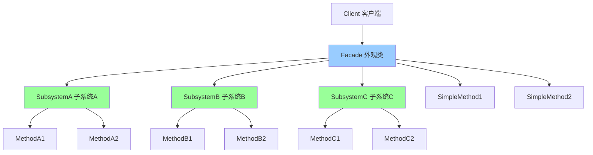

# 外观模式 (Facade)

> 外观模式是一种结构型设计模式，为子系统中的一组接口提供一个统一的高层接口。外观模式定义了一个高层接口，这个接口使得子系统更加容易使用。

## 📋 概要

外观模式为子系统中的一组接口提供一个统一的高层接口。外观模式定义了一个高层接口，这个接口使得子系统更加容易使用。这种模式隐藏了子系统的复杂性，为客户端提供了一个简单的接口。

### 核心原理

1. **外观类**: 为子系统提供一个统一的接口
2. **子系统类**: 实现子系统的功能
3. **客户端**: 通过外观类使用子系统
4. **依赖关系**: 外观类依赖子系统类

### 适用场景

- 需要简化复杂子系统的使用
- 需要为子系统提供一个统一的接口
- 需要将子系统与客户端解耦
- 需要支持子系统的分层
- 需要为子系统提供一个简单的接口

### 优点

- **简化接口**: 简化了子系统的使用
- **解耦**: 将客户端与子系统解耦
- **统一接口**: 提供统一的接口
- **易于维护**: 易于维护和修改
- **易于测试**: 易于测试子系统

### 缺点

- **过度封装**: 可能过度封装子系统
- **性能**: 可能带来一定的性能开销
- **灵活性**: 可能降低系统的灵活性

## 📋 外观模式架构图



## 🚀 基础实现

### 1. 简单外观模式实现

```dart
// 子系统A
class AudioSystem {
  void turnOn() {
    print('音频系统已开启');
  }

  void turnOff() {
    print('音频系统已关闭');
  }

  void setVolume(int volume) {
    print('音量设置为: $volume');
  }

  void playMusic(String song) {
    print('播放音乐: $song');
  }
}

// 子系统B
class VideoSystem {
  void turnOn() {
    print('视频系统已开启');
  }

  void turnOff() {
    print('视频系统已关闭');
  }

  void setBrightness(int brightness) {
    print('亮度设置为: $brightness');
  }

  void playVideo(String video) {
    print('播放视频: $video');
  }
}

// 子系统C
class LightSystem {
  void turnOn() {
    print('灯光系统已开启');
  }

  void turnOff() {
    print('灯光系统已关闭');
  }

  void setBrightness(int brightness) {
    print('灯光亮度设置为: $brightness');
  }

  void setColor(String color) {
    print('灯光颜色设置为: $color');
  }
}

// 外观类
class HomeTheaterFacade {
  final AudioSystem _audioSystem;
  final VideoSystem _videoSystem;
  final LightSystem _lightSystem;

  HomeTheaterFacade()
    : _audioSystem = AudioSystem(),
      _videoSystem = VideoSystem(),
      _lightSystem = LightSystem();

  // 观看电影
  void watchMovie(String movie) {
    print('=== 开始观看电影: $movie ===');

    _lightSystem.turnOn();
    _lightSystem.setBrightness(20);
    _lightSystem.setColor('blue');

    _videoSystem.turnOn();
    _videoSystem.setBrightness(80);
    _videoSystem.playVideo(movie);

    _audioSystem.turnOn();
    _audioSystem.setVolume(70);
  }

  // 结束观看
  void endMovie() {
    print('=== 结束观看电影 ===');

    _audioSystem.turnOff();
    _videoSystem.turnOff();
    _lightSystem.turnOff();
  }

  // 听音乐
  void listenToMusic(String song) {
    print('=== 开始听音乐: $song ===');

    _lightSystem.turnOn();
    _lightSystem.setBrightness(50);
    _lightSystem.setColor('warm');

    _audioSystem.turnOn();
    _audioSystem.setVolume(60);
    _audioSystem.playMusic(song);
  }

  // 结束音乐
  void endMusic() {
    print('=== 结束听音乐 ===');

    _audioSystem.turnOff();
    _lightSystem.turnOff();
  }

  // 所有系统关闭
  void turnOffAll() {
    print('=== 关闭所有系统 ===');

    _audioSystem.turnOff();
    _videoSystem.turnOff();
    _lightSystem.turnOff();
  }
}

// 使用示例
void main() {
  final homeTheater = HomeTheaterFacade();

  // 观看电影
  homeTheater.watchMovie('The Matrix');

  print('\n');

  // 结束观看
  homeTheater.endMovie();

  print('\n');

  // 听音乐
  homeTheater.listenToMusic('Bohemian Rhapsody');

  print('\n');

  // 结束音乐
  homeTheater.endMusic();

  print('\n');

  // 关闭所有系统
  homeTheater.turnOffAll();
}
```

### 2. 高级外观模式实现

```dart
// 数据库子系统
class DatabaseSystem {
  void connect() {
    print('数据库连接已建立');
  }

  void disconnect() {
    print('数据库连接已断开');
  }

  void executeQuery(String query) {
    print('执行查询: $query');
  }

  void commitTransaction() {
    print('事务已提交');
  }

  void rollbackTransaction() {
    print('事务已回滚');
  }
}

// 缓存子系统
class CacheSystem {
  final Map<String, dynamic> _cache = {};

  void set(String key, dynamic value) {
    _cache[key] = value;
    print('缓存设置: $key = $value');
  }

  dynamic get(String key) {
    final value = _cache[key];
    print('缓存获取: $key = $value');
    return value;
  }

  void remove(String key) {
    _cache.remove(key);
    print('缓存删除: $key');
  }

  void clear() {
    _cache.clear();
    print('缓存已清空');
  }

  bool has(String key) {
    return _cache.containsKey(key);
  }
}

// 日志子系统
class LogSystem {
  void info(String message) {
    print('[INFO] $message');
  }

  void warning(String message) {
    print('[WARNING] $message');
  }

  void error(String message) {
    print('[ERROR] $message');
  }

  void debug(String message) {
    print('[DEBUG] $message');
  }
}

// 安全子系统
class SecuritySystem {
  bool _isAuthenticated = false;
  String? _currentUser;

  bool authenticate(String username, String password) {
    // 模拟认证
    if (username == 'admin' && password == 'password') {
      _isAuthenticated = true;
      _currentUser = username;
      print('用户认证成功: $username');
      return true;
    } else {
      print('用户认证失败: $username');
      return false;
    }
  }

  void logout() {
    _isAuthenticated = false;
    _currentUser = null;
    print('用户已登出');
  }

  bool get isAuthenticated => _isAuthenticated;
  String? get currentUser => _currentUser;

  void checkPermission(String operation) {
    if (!_isAuthenticated) {
      throw Exception('用户未认证');
    }
    print('权限检查通过: $operation');
  }
}

// 应用外观类
class ApplicationFacade {
  final DatabaseSystem _databaseSystem;
  final CacheSystem _cacheSystem;
  final LogSystem _logSystem;
  final SecuritySystem _securitySystem;

  ApplicationFacade()
    : _databaseSystem = DatabaseSystem(),
      _cacheSystem = CacheSystem(),
      _logSystem = LogSystem(),
      _securitySystem = SecuritySystem();

  // 启动应用
  Future<void> startApplication() async {
    _logSystem.info('应用启动中...');

    try {
      _databaseSystem.connect();
      _logSystem.info('数据库连接成功');

      _cacheSystem.clear();
      _logSystem.info('缓存系统初始化完成');

      _logSystem.info('应用启动完成');
    } catch (e) {
      _logSystem.error('应用启动失败: $e');
      rethrow;
    }
  }

  // 关闭应用
  Future<void> stopApplication() async {
    _logSystem.info('应用关闭中...');

    try {
      _databaseSystem.disconnect();
      _cacheSystem.clear();

      if (_securitySystem.isAuthenticated) {
        _securitySystem.logout();
      }

      _logSystem.info('应用关闭完成');
    } catch (e) {
      _logSystem.error('应用关闭失败: $e');
      rethrow;
    }
  }

  // 用户登录
  Future<bool> login(String username, String password) async {
    _logSystem.info('用户登录尝试: $username');

    try {
      final success = _securitySystem.authenticate(username, password);

      if (success) {
        _logSystem.info('用户登录成功: $username');

        // 缓存用户信息
        _cacheSystem.set('currentUser', username);
        _cacheSystem.set('loginTime', DateTime.now());

        return true;
      } else {
        _logSystem.warning('用户登录失败: $username');
        return false;
      }
    } catch (e) {
      _logSystem.error('登录过程出错: $e');
      return false;
    }
  }

  // 用户登出
  Future<void> logout() async {
    if (_securitySystem.isAuthenticated) {
      _logSystem.info('用户登出: ${_securitySystem.currentUser}');

      _securitySystem.logout();
      _cacheSystem.remove('currentUser');
      _cacheSystem.remove('loginTime');
    }
  }

  // 执行查询
  Future<dynamic> executeQuery(String query) async {
    _securitySystem.checkPermission('execute_query');

    _logSystem.debug('执行查询: $query');

    // 检查缓存
    final cacheKey = 'query_${query.hashCode}';
    if (_cacheSystem.has(cacheKey)) {
      _logSystem.info('从缓存获取查询结果');
      return _cacheSystem.get(cacheKey);
    }

    // 执行数据库查询
    _databaseSystem.executeQuery(query);

    // 模拟查询结果
    final result = {'query': query, 'result': 'data'};

    // 缓存结果
    _cacheSystem.set(cacheKey, result);

    _logSystem.info('查询执行完成');
    return result;
  }

  // 获取应用状态
  Map<String, dynamic> getApplicationStatus() {
    return {
      'authenticated': _securitySystem.isAuthenticated,
      'currentUser': _securitySystem.currentUser,
      'cacheSize': _cacheSystem._cache.length,
      'timestamp': DateTime.now(),
    };
  }
}

// 使用示例
void main() async {
  final app = ApplicationFacade();

  try {
    // 启动应用
    await app.startApplication();

    print('\n=== 应用状态 ===');
    print(app.getApplicationStatus());

    print('\n=== 用户登录 ===');
    final loginSuccess = await app.login('admin', 'password');
    print('登录结果: $loginSuccess');

    if (loginSuccess) {
      print('\n=== 执行查询 ===');
      final result = await app.executeQuery('SELECT * FROM users');
      print('查询结果: $result');

      print('\n=== 再次执行相同查询（应该从缓存获取）===');
      final cachedResult = await app.executeQuery('SELECT * FROM users');
      print('缓存结果: $result');

      print('\n=== 应用状态 ===');
      print(app.getApplicationStatus());

      print('\n=== 用户登出 ===');
      await app.logout();
    }

    print('\n=== 关闭应用 ===');
    await app.stopApplication();

  } catch (e) {
    print('应用运行出错: $e');
  }
}
```

## 🔧 实际应用场景

### 1. Flutter 应用管理外观

```dart
// 网络子系统
class NetworkManager {
  bool _isConnected = false;

  Future<bool> connect() async {
    await Future.delayed(Duration(seconds: 1));
    _isConnected = true;
    print('网络连接已建立');
    return true;
  }

  void disconnect() {
    _isConnected = false;
    print('网络连接已断开');
  }

  bool get isConnected => _isConnected;

  Future<Map<String, dynamic>> get(String url) async {
    if (!_isConnected) {
      throw Exception('网络未连接');
    }

    await Future.delayed(Duration(milliseconds: 500));
    return {'url': url, 'data': 'response data'};
  }
}

// 存储子系统
class StorageManager {
  final Map<String, dynamic> _storage = {};

  Future<void> save(String key, dynamic value) async {
    await Future.delayed(Duration(milliseconds: 100));
    _storage[key] = value;
    print('数据已保存: $key');
  }

  Future<dynamic> load(String key) async {
    await Future.delayed(Duration(milliseconds: 100));
    final value = _storage[key];
    print('数据已加载: $key = $value');
    return value;
  }

  Future<void> remove(String key) async {
    await Future.delayed(Duration(milliseconds: 100));
    _storage.remove(key);
    print('数据已删除: $key');
  }

  Future<void> clear() async {
    await Future.delayed(Duration(milliseconds: 100));
    _storage.clear();
    print('存储已清空');
  }
}

// 主题子系统
class ThemeManager {
  String _currentTheme = 'light';

  void setTheme(String theme) {
    _currentTheme = theme;
    print('主题已切换为: $theme');
  }

  String get currentTheme => _currentTheme;

  Map<String, dynamic> getThemeData(String theme) {
    switch (theme) {
      case 'light':
        return {
          'primaryColor': Colors.blue,
          'backgroundColor': Colors.white,
          'textColor': Colors.black,
        };
      case 'dark':
        return {
          'primaryColor': Colors.blue.shade700,
          'backgroundColor': Colors.grey.shade900,
          'textColor': Colors.white,
        };
      default:
        return getThemeData('light');
    }
  }
}

// 应用外观类
class FlutterAppFacade {
  final NetworkManager _networkManager;
  final StorageManager _storageManager;
  final ThemeManager _themeManager;

  FlutterAppFacade()
    : _networkManager = NetworkManager(),
      _storageManager = StorageManager(),
      _themeManager = ThemeManager();

  // 初始化应用
  Future<void> initializeApp() async {
    print('=== 应用初始化 ===');

    // 连接网络
    await _networkManager.connect();

    // 加载用户设置
    final savedTheme = await _storageManager.load('theme') ?? 'light';
    _themeManager.setTheme(savedTheme);

    print('应用初始化完成');
  }

  // 获取数据
  Future<Map<String, dynamic>> fetchData(String url) async {
    print('=== 获取数据 ===');

    try {
      // 检查缓存
      final cachedData = await _storageManager.load('cache_$url');
      if (cachedData != null) {
        print('从缓存获取数据');
        return cachedData;
      }

      // 从网络获取
      final data = await _networkManager.get(url);

      // 缓存数据
      await _storageManager.save('cache_$url', data);

      return data;
    } catch (e) {
      print('获取数据失败: $e');
      rethrow;
    }
  }

  // 切换主题
  Future<void> switchTheme(String theme) async {
    print('=== 切换主题 ===');

    _themeManager.setTheme(theme);
    await _storageManager.save('theme', theme);

    print('主题切换完成');
  }

  // 清除缓存
  Future<void> clearCache() async {
    print('=== 清除缓存 ===');

    await _storageManager.clear();
    print('缓存清除完成');
  }

  // 获取应用状态
  Map<String, dynamic> getAppStatus() {
    return {
      'networkConnected': _networkManager.isConnected,
      'currentTheme': _themeManager.currentTheme,
      'themeData': _themeManager.getThemeData(_themeManager.currentTheme),
    };
  }

  // 关闭应用
  Future<void> closeApp() async {
    print('=== 关闭应用 ===');

    _networkManager.disconnect();
    await _storageManager.save('lastCloseTime', DateTime.now());

    print('应用关闭完成');
  }
}

// Flutter Widget 中的使用
class FacadeWidget extends StatefulWidget {
  @override
  _FacadeWidgetState createState() => _FacadeWidgetState();
}

class _FacadeWidgetState extends State<FacadeWidget> {
  late FlutterAppFacade _appFacade;
  Map<String, dynamic> _appStatus = {};
  bool _isLoading = false;

  @override
  void initState() {
    super.initState();
    _appFacade = FlutterAppFacade();
    _initializeApp();
  }

  Future<void> _initializeApp() async {
    setState(() {
      _isLoading = true;
    });

    try {
      await _appFacade.initializeApp();
      _updateAppStatus();
    } catch (e) {
      print('应用初始化失败: $e');
    } finally {
      setState(() {
        _isLoading = false;
      });
    }
  }

  void _updateAppStatus() {
    setState(() {
      _appStatus = _appFacade.getAppStatus();
    });
  }

  Future<void> _fetchData() async {
    setState(() {
      _isLoading = true;
    });

    try {
      final data = await _appFacade.fetchData('https://api.example.com/data');
      print('获取的数据: $data');
    } catch (e) {
      print('获取数据失败: $e');
    } finally {
      setState(() {
        _isLoading = false;
      });
    }
  }

  Future<void> _switchTheme() async {
    final currentTheme = _appStatus['currentTheme'] as String;
    final newTheme = currentTheme == 'light' ? 'dark' : 'light';

    await _appFacade.switchTheme(newTheme);
    _updateAppStatus();
  }

  Future<void> _clearCache() async {
    await _appFacade.clearCache();
    print('缓存已清除');
  }

  @override
  Widget build(BuildContext context) {
    return Scaffold(
      appBar: AppBar(
        title: Text('外观模式示例'),
        actions: [
          IconButton(
            icon: Icon(Icons.refresh),
            onPressed: _fetchData,
          ),
          IconButton(
            icon: Icon(Icons.brightness_6),
            onPressed: _switchTheme,
          ),
          IconButton(
            icon: Icon(Icons.clear_all),
            onPressed: _clearCache,
          ),
        ],
      ),
      body: _isLoading
        ? Center(child: CircularProgressIndicator())
        : Padding(
            padding: EdgeInsets.all(16),
            child: Column(
              crossAxisAlignment: CrossAxisAlignment.start,
              children: [
                Text(
                  '应用状态',
                  style: TextStyle(fontSize: 20, fontWeight: FontWeight.bold),
                ),
                SizedBox(height: 16),
                Card(
                  child: Padding(
                    padding: EdgeInsets.all(16),
                    child: Column(
                      crossAxisAlignment: CrossAxisAlignment.start,
                      children: [
                        Text('网络状态: ${_appStatus['networkConnected'] ? '已连接' : '未连接'}'),
                        Text('当前主题: ${_appStatus['currentTheme']}'),
                        SizedBox(height: 8),
                        Text('主题数据:', style: TextStyle(fontWeight: FontWeight.bold)),
                        Text(_appStatus['themeData']?.toString() ?? '无'),
                      ],
                    ),
                  ),
                ),
                SizedBox(height: 16),
                ElevatedButton(
                  onPressed: _fetchData,
                  child: Text('获取数据'),
                ),
                SizedBox(height: 8),
                ElevatedButton(
                  onPressed: _switchTheme,
                  child: Text('切换主题'),
                ),
                SizedBox(height: 8),
                ElevatedButton(
                  onPressed: _clearCache,
                  child: Text('清除缓存'),
                ),
              ],
            ),
          ),
    );
  }
}
```

### 2. 支付系统外观

```dart
// 支付子系统
class PaymentProcessor {
  Future<bool> processPayment(double amount, String currency) async {
    await Future.delayed(Duration(seconds: 1));
    print('支付处理: $amount $currency');
    return true;
  }

  Future<bool> refundPayment(String transactionId) async {
    await Future.delayed(Duration(seconds: 1));
    print('退款处理: $transactionId');
    return true;
  }
}

// 库存子系统
class InventoryManager {
  final Map<String, int> _inventory = {
    'product1': 100,
    'product2': 50,
    'product3': 200,
  };

  bool checkStock(String productId, int quantity) {
    final available = _inventory[productId] ?? 0;
    return available >= quantity;
  }

  void updateStock(String productId, int quantity) {
    final current = _inventory[productId] ?? 0;
    _inventory[productId] = current - quantity;
    print('库存更新: $productId, 剩余: ${_inventory[productId]}');
  }

  Map<String, int> getInventory() {
    return Map.unmodifiable(_inventory);
  }
}

// 通知子系统
class NotificationService {
  void sendEmail(String to, String subject, String body) {
    print('发送邮件: $to - $subject');
  }

  void sendSMS(String phone, String message) {
    print('发送短信: $phone - $message');
  }

  void sendPushNotification(String userId, String title, String body) {
    print('发送推送: $userId - $title');
  }
}

// 订单子系统
class OrderManager {
  final List<Map<String, dynamic>> _orders = [];

  String createOrder(Map<String, dynamic> orderData) {
    final orderId = DateTime.now().millisecondsSinceEpoch.toString();
    final order = {
      'id': orderId,
      'data': orderData,
      'status': 'pending',
      'createdAt': DateTime.now(),
    };

    _orders.add(order);
    print('订单创建: $orderId');
    return orderId;
  }

  void updateOrderStatus(String orderId, String status) {
    final order = _orders.firstWhere((o) => o['id'] == orderId);
    order['status'] = status;
    print('订单状态更新: $orderId -> $status');
  }

  Map<String, dynamic>? getOrder(String orderId) {
    try {
      return _orders.firstWhere((o) => o['id'] == orderId);
    } catch (e) {
      return null;
    }
  }
}

// 电商外观类
class ECommerceFacade {
  final PaymentProcessor _paymentProcessor;
  final InventoryManager _inventoryManager;
  final NotificationService _notificationService;
  final OrderManager _orderManager;

  ECommerceFacade()
    : _paymentProcessor = PaymentProcessor(),
      _inventoryManager = InventoryManager(),
      _notificationService = NotificationService(),
      _orderManager = OrderManager();

  // 购买商品
  Future<Map<String, dynamic>> purchaseProduct({
    required String productId,
    required int quantity,
    required double price,
    required String currency,
    required String customerEmail,
    required String customerPhone,
  }) async {
    print('=== 开始购买流程 ===');

    try {
      // 检查库存
      if (!_inventoryManager.checkStock(productId, quantity)) {
        throw Exception('库存不足');
      }

      // 创建订单
      final orderData = {
        'productId': productId,
        'quantity': quantity,
        'price': price,
        'currency': currency,
        'customerEmail': customerEmail,
        'customerPhone': customerPhone,
      };

      final orderId = _orderManager.createOrder(orderData);

      // 处理支付
      final paymentSuccess = await _paymentProcessor.processPayment(
        price * quantity,
        currency,
      );

      if (!paymentSuccess) {
        _orderManager.updateOrderStatus(orderId, 'payment_failed');
        throw Exception('支付失败');
      }

      // 更新库存
      _inventoryManager.updateStock(productId, quantity);

      // 更新订单状态
      _orderManager.updateOrderStatus(orderId, 'completed');

      // 发送通知
      _notificationService.sendEmail(
        customerEmail,
        '订单确认',
        '您的订单 $orderId 已确认，感谢您的购买！',
      );

      _notificationService.sendSMS(
        customerPhone,
        '订单 $orderId 已确认，感谢您的购买！',
      );

      print('=== 购买流程完成 ===');

      return {
        'success': true,
        'orderId': orderId,
        'message': '购买成功',
      };

    } catch (e) {
      print('购买流程失败: $e');
      return {
        'success': false,
        'error': e.toString(),
      };
    }
  }

  // 退款
  Future<Map<String, dynamic>> refundOrder(String orderId) async {
    print('=== 开始退款流程 ===');

    try {
      final order = _orderManager.getOrder(orderId);
      if (order == null) {
        throw Exception('订单不存在');
      }

      if (order['status'] != 'completed') {
        throw Exception('订单状态不允许退款');
      }

      // 处理退款
      final refundSuccess = await _paymentProcessor.refundPayment(orderId);

      if (!refundSuccess) {
        throw Exception('退款失败');
      }

      // 恢复库存
      final orderData = order['data'] as Map<String, dynamic>;
      final productId = orderData['productId'] as String;
      final quantity = orderData['quantity'] as int;

      // 这里应该调用库存恢复方法
      print('库存恢复: $productId, 数量: $quantity');

      // 更新订单状态
      _orderManager.updateOrderStatus(orderId, 'refunded');

      // 发送通知
      final customerEmail = orderData['customerEmail'] as String;
      _notificationService.sendEmail(
        customerEmail,
        '退款确认',
        '您的订单 $orderId 退款已处理，退款将在3-5个工作日内到账。',
      );

      print('=== 退款流程完成 ===');

      return {
        'success': true,
        'orderId': orderId,
        'message': '退款成功',
      };

    } catch (e) {
      print('退款流程失败: $e');
      return {
        'success': false,
        'error': e.toString(),
      };
    }
  }

  // 获取库存信息
  Map<String, int> getInventory() {
    return _inventoryManager.getInventory();
  }

  // 获取订单信息
  Map<String, dynamic>? getOrder(String orderId) {
    return _orderManager.getOrder(orderId);
  }
}

// 使用示例
void main() async {
  final ecommerce = ECommerceFacade();

  print('=== 查看库存 ===');
  print(ecommerce.getInventory());

  print('\n=== 购买商品 ===');
  final purchaseResult = await ecommerce.purchaseProduct(
    productId: 'product1',
    quantity: 2,
    price: 29.99,
    currency: 'USD',
    customerEmail: 'customer@example.com',
    customerPhone: '+1234567890',
  );

  print('购买结果: $purchaseResult');

  if (purchaseResult['success']) {
    final orderId = purchaseResult['orderId'] as String;

    print('\n=== 查看订单 ===');
    final order = ecommerce.getOrder(orderId);
    print('订单信息: $order');

    print('\n=== 退款 ===');
    final refundResult = await ecommerce.refundOrder(orderId);
    print('退款结果: $refundResult');
  }

  print('\n=== 查看库存 ===');
  print(ecommerce.getInventory());
}
```

## 🧪 测试和调试

### 1. 外观模式单元测试

```dart
// test/facade_test.dart
import 'package:flutter_test/flutter_test.dart';
import 'package:myapp/facade.dart';

void main() {
  group('外观模式测试', () {
    late HomeTheaterFacade homeTheater;

    setUp(() {
      homeTheater = HomeTheaterFacade();
    });

    test('应该正确观看电影', () {
      final output = <String>[];
      final originalPrint = print;
      print = (Object? object) => output.add(object.toString());

      homeTheater.watchMovie('The Matrix');

      print = originalPrint;

      expect(output, contains('=== 开始观看电影: The Matrix ==='));
      expect(output, contains('灯光系统已开启'));
      expect(output, contains('视频系统已开启'));
      expect(output, contains('音频系统已开启'));
    });

    test('应该正确结束观看', () {
      final output = <String>[];
      final originalPrint = print;
      print = (Object? object) => output.add(object.toString());

      homeTheater.endMovie();

      print = originalPrint;

      expect(output, contains('=== 结束观看电影 ==='));
      expect(output, contains('音频系统已关闭'));
      expect(output, contains('视频系统已关闭'));
      expect(output, contains('灯光系统已关闭'));
    });

    test('应该正确听音乐', () {
      final output = <String>[];
      final originalPrint = print;
      print = (Object? object) => output.add(object.toString());

      homeTheater.listenToMusic('Bohemian Rhapsody');

      print = originalPrint;

      expect(output, contains('=== 开始听音乐: Bohemian Rhapsody ==='));
      expect(output, contains('灯光系统已开启'));
      expect(output, contains('音频系统已开启'));
    });
  });

  group('应用外观测试', () {
    late ApplicationFacade appFacade;

    setUp(() {
      appFacade = ApplicationFacade();
    });

    test('应该正确启动应用', () async {
      final output = <String>[];
      final originalPrint = print;
      print = (Object? object) => output.add(object.toString());

      await appFacade.startApplication();

      print = originalPrint;

      expect(output, contains('应用启动中...'));
      expect(output, contains('数据库连接成功'));
      expect(output, contains('缓存系统初始化完成'));
      expect(output, contains('应用启动完成'));
    });

    test('应该正确登录用户', () async {
      await appFacade.startApplication();

      final result = await appFacade.login('admin', 'password');

      expect(result, isTrue);

      final status = appFacade.getApplicationStatus();
      expect(status['authenticated'], isTrue);
      expect(status['currentUser'], equals('admin'));
    });

    test('应该正确处理登录失败', () async {
      await appFacade.startApplication();

      final result = await appFacade.login('admin', 'wrong_password');

      expect(result, isFalse);

      final status = appFacade.getApplicationStatus();
      expect(status['authenticated'], isFalse);
    });

    test('应该正确执行查询', () async {
      await appFacade.startApplication();
      await appFacade.login('admin', 'password');

      final result = await appFacade.executeQuery('SELECT * FROM users');

      expect(result, isA<Map<String, dynamic>>());
      expect(result['query'], equals('SELECT * FROM users'));
    });
  });
}
```

### 2. 性能测试

```dart
// benchmark/facade_benchmark.dart
class FacadeBenchmark {
  static Future<void> runPerformanceTests() async {
    print('=== 外观模式性能测试 ===');

    await _testHomeTheaterPerformance();
    await _testApplicationFacadePerformance();
    await _testECommerceFacadePerformance();
    await _testMemoryUsage();
  }

  static Future<void> _testHomeTheaterPerformance() async {
    const operationCount = 1000;
    final homeTheater = HomeTheaterFacade();

    final stopwatch = Stopwatch()..start();

    for (int i = 0; i < operationCount; i++) {
      homeTheater.watchMovie('Movie$i');
      homeTheater.endMovie();
    }

    stopwatch.stop();

    final avgTime = stopwatch.elapsedMicroseconds / operationCount;
    print('家庭影院操作平均耗时: ${avgTime.toStringAsFixed(2)}μs');
  }

  static Future<void> _testApplicationFacadePerformance() async {
    const operationCount = 100;
    final appFacade = ApplicationFacade();

    await appFacade.startApplication();
    await appFacade.login('admin', 'password');

    final stopwatch = Stopwatch()..start();

    for (int i = 0; i < operationCount; i++) {
      await appFacade.executeQuery('SELECT * FROM table$i');
    }

    stopwatch.stop();

    final avgTime = stopwatch.elapsedMicroseconds / operationCount;
    print('应用外观操作平均耗时: ${avgTime.toStringAsFixed(2)}μs');

    await appFacade.stopApplication();
  }

  static Future<void> _testECommerceFacadePerformance() async {
    const operationCount = 50;
    final ecommerce = ECommerceFacade();

    final stopwatch = Stopwatch()..start();

    for (int i = 0; i < operationCount; i++) {
      await ecommerce.purchaseProduct(
        productId: 'product$i',
        quantity: 1,
        price: 10.0,
        currency: 'USD',
        customerEmail: 'customer$i@example.com',
        customerPhone: '+1234567890',
      );
    }

    stopwatch.stop();

    final avgTime = stopwatch.elapsedMicroseconds / operationCount;
    print('电商外观操作平均耗时: ${avgTime.toStringAsFixed(2)}μs');
  }

  static Future<void> _testMemoryUsage() async {
    final facades = <dynamic>[];
    const facadeCount = 100;

    // 创建大量外观对象
    for (int i = 0; i < facadeCount; i++) {
      facades.add(HomeTheaterFacade());
      facades.add(ApplicationFacade());
      facades.add(ECommerceFacade());
    }

    final initialMemory = ProcessInfo.currentRss;

    // 执行一些操作
    for (int i = 0; i < 100; i++) {
      final facade = facades[i % facades.length];
      if (facade is HomeTheaterFacade) {
        facade.watchMovie('Test Movie');
      }
    }

    final finalMemory = ProcessInfo.currentRss;
    final memoryUsed = finalMemory - initialMemory;

    print('内存使用: ${(memoryUsed / 1024 / 1024).toStringAsFixed(2)}MB');
  }
}

void main() async {
  await FacadeBenchmark.runPerformanceTests();
}
```

## 📚 最佳实践

### 1. 设计原则

- **单一职责**: 外观类应该只负责简化子系统接口
- **开闭原则**: 新增功能不应该修改外观类
- **依赖倒置**: 外观类应该依赖抽象而不是具体实现
- **接口隔离**: 外观类应该提供简洁的接口

### 2. 性能优化

- **延迟初始化**: 延迟初始化子系统
- **缓存**: 缓存子系统状态
- **异步操作**: 使用异步操作提高性能
- **资源管理**: 及时释放子系统资源

### 3. 错误处理

- **异常传播**: 正确传播子系统异常
- **降级策略**: 提供子系统失败时的降级方案
- **日志记录**: 记录外观类的操作日志
- **状态检查**: 检查子系统状态

### 4. 调试技巧

- **操作追踪**: 追踪外观类的操作
- **性能监控**: 监控外观类的性能
- **状态检查**: 检查子系统状态
- **日志分析**: 分析操作日志

## 🎯 小结

外观模式是简化复杂子系统的强大工具，特别适合需要为客户端提供简单接口的场景。在 Flutter 开发中，它可以用于应用管理、系统集成、服务封装等。

### 选择建议

- **复杂子系统**: 使用外观模式简化接口
- **系统集成**: 使用外观模式集成多个系统
- **服务封装**: 使用外观模式封装服务
- **客户端简化**: 使用外观模式简化客户端代码

### 关键要点

1. **外观设计**: 合理设计外观类的接口
2. **子系统管理**: 正确管理子系统的生命周期
3. **错误处理**: 提供完善的错误处理机制
4. **性能考虑**: 注意外观类的性能开销
5. **可维护性**: 设计易于维护的外观类

---

> 💡 **提示**: 外观模式是简化复杂子系统的优秀方案，但要避免过度封装和过度复杂。建议在真正需要简化子系统接口的场景中使用，并注意性能优化和错误处理。
