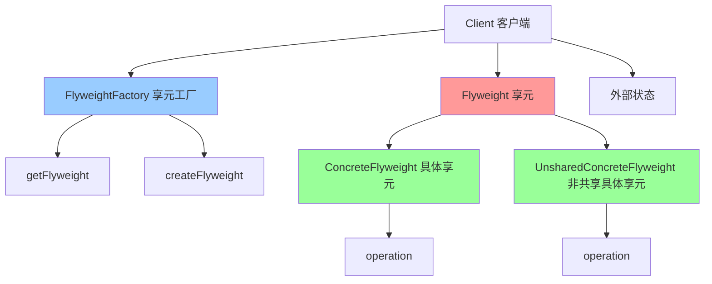

# 享元模式 (Flyweight)

> 享元模式是一种结构型设计模式，通过共享技术有效地支持大量细粒度对象的复用。

## 📋 概要

享元模式通过共享已经存在的对象来大幅度减少需要创建的对象数量，避免大量相似对象的开销，从而提高系统资源的利用率。

### 核心原理

1. **享元(Flyweight)**: 包含内部状态和外部状态
2. **具体享元(ConcreteFlyweight)**: 实现享元接口
3. **非共享具体享元(UnsharedConcreteFlyweight)**: 不能被共享的享元
4. **享元工厂(FlyweightFactory)**: 创建和管理享元对象
5. **客户端(Client)**: 使用享元对象

### 适用场景

- 系统中存在大量相似对象
- 需要减少内存使用
- 对象的大部分状态可以外部化
- 需要缓存对象以提高性能
- 需要共享对象以减少创建开销

### 优点

- **内存优化**: 减少内存使用
- **性能提升**: 减少对象创建开销
- **资源共享**: 共享相似对象
- **缓存友好**: 支持对象缓存
- **扩展性好**: 易于添加新的享元类型

### 缺点

- **复杂性**: 增加系统复杂性
- **状态管理**: 需要管理外部状态
- **线程安全**: 需要考虑线程安全问题
- **调试困难**: 共享对象可能难以调试

## 📋 享元模式架构图



## 🚀 基础实现

### 1. 简单享元实现

```dart
// 享元接口
abstract class Flyweight {
  void operation(String extrinsicState);
}

// 具体享元
class ConcreteFlyweight implements Flyweight {
  final String _intrinsicState;
  
  ConcreteFlyweight(this._intrinsicState);
  
  String get intrinsicState => _intrinsicState;
  
  @override
  void operation(String extrinsicState) {
    print('具体享元操作: 内部状态=$_intrinsicState, 外部状态=$extrinsicState');
  }
}

// 非共享具体享元
class UnsharedConcreteFlyweight implements Flyweight {
  final String _allState;
  
  UnsharedConcreteFlyweight(this._allState);
  
  @override
  void operation(String extrinsicState) {
    print('非共享具体享元操作: 状态=$_allState, 外部状态=$extrinsicState');
  }
}

// 享元工厂
class FlyweightFactory {
  final Map<String, Flyweight> _flyweights = {};
  
  Flyweight getFlyweight(String key) {
    if (_flyweights.containsKey(key)) {
      print('获取已存在的享元: $key');
      return _flyweights[key]!;
    } else {
      print('创建新的享元: $key');
      final flyweight = ConcreteFlyweight(key);
      _flyweights[key] = flyweight;
      return flyweight;
    }
  }
  
  UnsharedConcreteFlyweight createUnsharedFlyweight(String state) {
    print('创建非共享享元: $state');
    return UnsharedConcreteFlyweight(state);
  }
  
  int getFlyweightCount() {
    return _flyweights.length;
  }
  
  void showFlyweights() {
    print('=== 享元池内容 ===');
    for (final entry in _flyweights.entries) {
      print('  ${entry.key}: ${entry.value.runtimeType}');
    }
  }
}

// 使用示例
void main() {
  print('=== 享元模式演示 ===');
  
  final factory = FlyweightFactory();
  
  // 使用相同的享元
  final flyweight1 = factory.getFlyweight('A');
  final flyweight2 = factory.getFlyweight('A');
  final flyweight3 = factory.getFlyweight('B');
  
  print('flyweight1 == flyweight2: ${identical(flyweight1, flyweight2)}');
  print('flyweight1 == flyweight3: ${identical(flyweight1, flyweight3)}');
  
  // 执行操作
  flyweight1.operation('外部状态1');
  flyweight2.operation('外部状态2');
  flyweight3.operation('外部状态3');
  
  // 创建非共享享元
  final unsharedFlyweight = factory.createUnsharedFlyweight('特殊状态');
  unsharedFlyweight.operation('外部状态4');
  
  print('\n享元池统计:');
  factory.showFlyweights();
  print('享元数量: ${factory.getFlyweightCount()}');
}
```

### 2. 字符享元实现

```dart
// 字符享元
class CharacterFlyweight {
  final String _character;
  final String _font;
  final int _size;
  final String _color;
  
  CharacterFlyweight(this._character, this._font, this._size, this._color);
  
  String get character => _character;
  String get font => _font;
  int get size => _size;
  String get color => _color;
  
  void display(int x, int y) {
    print('显示字符: $_character, 字体: $_font, 大小: $_size, 颜色: $_color, 位置: ($x, $y)');
  }
  
  @override
  bool operator ==(Object other) {
    if (identical(this, other)) return true;
    return other is CharacterFlyweight &&
        other._character == _character &&
        other._font == _font &&
        other._size == _size &&
        other._color == _color;
  }
  
  @override
  int get hashCode {
    return _character.hashCode ^ _font.hashCode ^ _size.hashCode ^ _color.hashCode;
  }
  
  @override
  String toString() {
    return 'CharacterFlyweight{character: $_character, font: $_font, size: $_size, color: $_color}';
  }
}

// 字符享元工厂
class CharacterFlyweightFactory {
  final Map<String, CharacterFlyweight> _characters = {};
  
  CharacterFlyweight getCharacter(String character, String font, int size, String color) {
    final key = '${character}_${font}_${size}_$color';
    
    if (_characters.containsKey(key)) {
      print('获取已存在的字符享元: $key');
      return _characters[key]!;
    } else {
      print('创建新的字符享元: $key');
      final flyweight = CharacterFlyweight(character, font, size, color);
      _characters[key] = flyweight;
      return flyweight;
    }
  }
  
  int getCharacterCount() {
    return _characters.length;
  }
  
  void showCharacters() {
    print('=== 字符享元池 ===');
    for (final entry in _characters.entries) {
      print('  ${entry.key}: ${entry.value}');
    }
  }
}

// 字符上下文
class CharacterContext {
  final CharacterFlyweight _flyweight;
  final int _x;
  final int _y;
  
  CharacterContext(this._flyweight, this._x, this._y);
  
  CharacterFlyweight get flyweight => _flyweight;
  int get x => _x;
  int get y => _y;
  
  void display() {
    _flyweight.display(_x, _y);
  }
}

// 文本编辑器
class TextEditor {
  final CharacterFlyweightFactory _factory;
  final List<CharacterContext> _characters = [];
  
  TextEditor(this._factory);
  
  void addCharacter(String character, String font, int size, String color, int x, int y) {
    final flyweight = _factory.getCharacter(character, font, size, color);
    final context = CharacterContext(flyweight, x, y);
    _characters.add(context);
    print('添加字符: $character 到位置 ($x, $y)');
  }
  
  void displayText() {
    print('=== 显示文本 ===');
    for (final context in _characters) {
      context.display();
    }
  }
  
  void showStatistics() {
    print('=== 文本统计 ===');
    print('字符总数: ${_characters.length}');
    print('享元数量: ${_factory.getCharacterCount()}');
    print('内存节省: ${_characters.length - _factory.getCharacterCount()} 个对象');
  }
}

// 使用示例
void main() {
  print('=== 字符享元模式演示 ===');
  
  final factory = CharacterFlyweightFactory();
  final editor = TextEditor(factory);
  
  // 添加相同的字符
  editor.addCharacter('A', 'Arial', 12, 'black', 0, 0);
  editor.addCharacter('A', 'Arial', 12, 'black', 10, 0);
  editor.addCharacter('A', 'Arial', 12, 'black', 20, 0);
  
  // 添加不同的字符
  editor.addCharacter('B', 'Arial', 12, 'black', 30, 0);
  editor.addCharacter('A', 'Times', 12, 'black', 40, 0);
  editor.addCharacter('A', 'Arial', 14, 'black', 50, 0);
  editor.addCharacter('A', 'Arial', 12, 'red', 60, 0);
  
  print('\n=== 显示文本 ===');
  editor.displayText();
  
  print('\n=== 统计信息 ===');
  editor.showStatistics();
  
  print('\n=== 享元池内容 ===');
  factory.showCharacters();
}
```

## 🔧 实际应用场景

### 1. 游戏对象享元

```dart
// 游戏对象享元
class GameObjectFlyweight {
  final String _type;
  final String _texture;
  final int _width;
  final int _height;
  final String _animation;
  
  GameObjectFlyweight(this._type, this._texture, this._width, this._height, this._animation);
  
  String get type => _type;
  String get texture => _texture;
  int get width => _width;
  int get height => _height;
  String get animation => _animation;
  
  void render(int x, int y, String state) {
    print('渲染游戏对象: $_type, 纹理: $_texture, 位置: ($x, $y), 状态: $state');
  }
  
  void animate(String animationState) {
    print('播放动画: $_animation, 状态: $animationState');
  }
  
  @override
  bool operator ==(Object other) {
    if (identical(this, other)) return true;
    return other is GameObjectFlyweight &&
        other._type == _type &&
        other._texture == _texture &&
        other._width == _width &&
        other._height == _height &&
        other._animation == _animation;
  }
  
  @override
  int get hashCode {
    return _type.hashCode ^ _texture.hashCode ^ _width.hashCode ^ _height.hashCode ^ _animation.hashCode;
  }
}

// 游戏对象享元工厂
class GameObjectFlyweightFactory {
  final Map<String, GameObjectFlyweight> _objects = {};
  
  GameObjectFlyweight getGameObject(String type, String texture, int width, int height, String animation) {
    final key = '${type}_${texture}_${width}_${height}_$animation';
    
    if (_objects.containsKey(key)) {
      print('获取已存在的游戏对象享元: $key');
      return _objects[key]!;
    } else {
      print('创建新的游戏对象享元: $key');
      final flyweight = GameObjectFlyweight(type, texture, width, height, animation);
      _objects[key] = flyweight;
      return flyweight;
    }
  }
  
  int getObjectCount() {
    return _objects.length;
  }
  
  void showObjects() {
    print('=== 游戏对象享元池 ===');
    for (final entry in _objects.entries) {
      print('  ${entry.key}: ${entry.value}');
    }
  }
}

// 游戏对象实例
class GameObjectInstance {
  final GameObjectFlyweight _flyweight;
  final int _x;
  final int _y;
  final String _state;
  
  GameObjectInstance(this._flyweight, this._x, this._y, this._state);
  
  GameObjectFlyweight get flyweight => _flyweight;
  int get x => _x;
  int get y => _y;
  String get state => _state;
  
  void render() {
    _flyweight.render(_x, _y, _state);
  }
  
  void animate() {
    _flyweight.animate(_state);
  }
  
  void move(int newX, int newY) {
    print('移动游戏对象: 从($_x, $_y) 到 ($newX, $newY)');
  }
}

// 游戏世界
class GameWorld {
  final GameObjectFlyweightFactory _factory;
  final List<GameObjectInstance> _instances = [];
  
  GameWorld(this._factory);
  
  void spawnObject(String type, String texture, int width, int height, String animation, int x, int y, String state) {
    final flyweight = _factory.getGameObject(type, texture, width, height, animation);
    final instance = GameObjectInstance(flyweight, x, y, state);
    _instances.add(instance);
    print('生成游戏对象: $type 在位置 ($x, $y)');
  }
  
  void renderWorld() {
    print('=== 渲染游戏世界 ===');
    for (final instance in _instances) {
      instance.render();
    }
  }
  
  void animateWorld() {
    print('=== 播放游戏世界动画 ===');
    for (final instance in _instances) {
      instance.animate();
    }
  }
  
  void showStatistics() {
    print('=== 游戏世界统计 ===');
    print('对象实例总数: ${_instances.length}');
    print('享元对象数量: ${_factory.getObjectCount()}');
    print('内存节省: ${_instances.length - _factory.getObjectCount()} 个对象');
  }
}

// 使用示例
void main() {
  print('=== 游戏对象享元模式演示 ===');
  
  final factory = GameObjectFlyweightFactory();
  final world = GameWorld(factory);
  
  // 生成大量相同的敌人
  for (int i = 0; i < 10; i++) {
    world.spawnObject('Enemy', 'enemy.png', 32, 32, 'walk', i * 50, 100, 'idle');
  }
  
  // 生成大量相同的道具
  for (int i = 0; i < 5; i++) {
    world.spawnObject('Item', 'item.png', 16, 16, 'spin', i * 30, 200, 'normal');
  }
  
  // 生成不同的对象
  world.spawnObject('Player', 'player.png', 32, 32, 'run', 0, 0, 'moving');
  world.spawnObject('Boss', 'boss.png', 64, 64, 'attack', 300, 150, 'aggressive');
  
  print('\n=== 渲染游戏世界 ===');
  world.renderWorld();
  
  print('\n=== 播放动画 ===');
  world.animateWorld();
  
  print('\n=== 统计信息 ===');
  world.showStatistics();
  
  print('\n=== 享元池内容 ===');
  factory.showObjects();
}
```

## 🧪 测试和调试

### 1. 享元模式单元测试

```dart
// test/flyweight_test.dart
import 'package:flutter_test/flutter_test.dart';
import 'package:myapp/flyweight.dart';

void main() {
  group('享元模式测试', () {
    test('应该正确创建享元', () {
      final flyweight = ConcreteFlyweight('test');
      
      expect(flyweight, isA<Flyweight>());
      expect(flyweight.intrinsicState, equals('test'));
    });
    
    test('应该正确创建非共享享元', () {
      final unsharedFlyweight = UnsharedConcreteFlyweight('test');
      
      expect(unsharedFlyweight, isA<Flyweight>());
    });
    
    test('享元工厂应该正确管理享元', () {
      final factory = FlyweightFactory();
      
      final flyweight1 = factory.getFlyweight('A');
      final flyweight2 = factory.getFlyweight('A');
      final flyweight3 = factory.getFlyweight('B');
      
      expect(identical(flyweight1, flyweight2), isTrue);
      expect(identical(flyweight1, flyweight3), isFalse);
      expect(factory.getFlyweightCount(), equals(2));
    });
    
    test('享元应该正确执行操作', () {
      final flyweight = ConcreteFlyweight('test');
      
      expect(() => flyweight.operation('external'), returnsNormally);
    });
  });
  
  group('字符享元测试', () {
    test('应该正确创建字符享元', () {
      final flyweight = CharacterFlyweight('A', 'Arial', 12, 'black');
      
      expect(flyweight.character, equals('A'));
      expect(flyweight.font, equals('Arial'));
      expect(flyweight.size, equals(12));
      expect(flyweight.color, equals('black'));
    });
    
    test('字符享元工厂应该正确管理享元', () {
      final factory = CharacterFlyweightFactory();
      
      final flyweight1 = factory.getCharacter('A', 'Arial', 12, 'black');
      final flyweight2 = factory.getCharacter('A', 'Arial', 12, 'black');
      final flyweight3 = factory.getCharacter('B', 'Arial', 12, 'black');
      
      expect(identical(flyweight1, flyweight2), isTrue);
      expect(identical(flyweight1, flyweight3), isFalse);
      expect(factory.getCharacterCount(), equals(2));
    });
    
    test('字符上下文应该正确工作', () {
      final factory = CharacterFlyweightFactory();
      final flyweight = factory.getCharacter('A', 'Arial', 12, 'black');
      final context = CharacterContext(flyweight, 10, 20);
      
      expect(context.flyweight, equals(flyweight));
      expect(context.x, equals(10));
      expect(context.y, equals(20));
      
      expect(() => context.display(), returnsNormally);
    });
    
    test('文本编辑器应该正确工作', () {
      final factory = CharacterFlyweightFactory();
      final editor = TextEditor(factory);
      
      editor.addCharacter('A', 'Arial', 12, 'black', 0, 0);
      editor.addCharacter('A', 'Arial', 12, 'black', 10, 0);
      
      expect(() => editor.displayText(), returnsNormally);
      expect(() => editor.showStatistics(), returnsNormally);
    });
  });
  
  group('游戏对象享元测试', () {
    test('应该正确创建游戏对象享元', () {
      final flyweight = GameObjectFlyweight('Enemy', 'enemy.png', 32, 32, 'walk');
      
      expect(flyweight.type, equals('Enemy'));
      expect(flyweight.texture, equals('enemy.png'));
      expect(flyweight.width, equals(32));
      expect(flyweight.height, equals(32));
      expect(flyweight.animation, equals('walk'));
    });
    
    test('游戏对象享元工厂应该正确管理享元', () {
      final factory = GameObjectFlyweightFactory();
      
      final flyweight1 = factory.getGameObject('Enemy', 'enemy.png', 32, 32, 'walk');
      final flyweight2 = factory.getGameObject('Enemy', 'enemy.png', 32, 32, 'walk');
      final flyweight3 = factory.getGameObject('Player', 'player.png', 32, 32, 'run');
      
      expect(identical(flyweight1, flyweight2), isTrue);
      expect(identical(flyweight1, flyweight3), isFalse);
      expect(factory.getObjectCount(), equals(2));
    });
    
    test('游戏对象实例应该正确工作', () {
      final factory = GameObjectFlyweightFactory();
      final flyweight = factory.getGameObject('Enemy', 'enemy.png', 32, 32, 'walk');
      final instance = GameObjectInstance(flyweight, 10, 20, 'idle');
      
      expect(instance.flyweight, equals(flyweight));
      expect(instance.x, equals(10));
      expect(instance.y, equals(20));
      expect(instance.state, equals('idle'));
      
      expect(() => instance.render(), returnsNormally);
      expect(() => instance.animate(), returnsNormally);
      expect(() => instance.move(15, 25), returnsNormally);
    });
    
    test('游戏世界应该正确工作', () {
      final factory = GameObjectFlyweightFactory();
      final world = GameWorld(factory);
      
      world.spawnObject('Enemy', 'enemy.png', 32, 32, 'walk', 0, 0, 'idle');
      world.spawnObject('Enemy', 'enemy.png', 32, 32, 'walk', 50, 0, 'idle');
      
      expect(() => world.renderWorld(), returnsNormally);
      expect(() => world.animateWorld(), returnsNormally);
      expect(() => world.showStatistics(), returnsNormally);
    });
  });
}
```

## 📚 最佳实践

### 1. 设计原则
- **单一职责**: 享元只负责内部状态管理
- **开闭原则**: 易于扩展新的享元类型
- **依赖倒置**: 依赖抽象而不是具体实现
- **接口隔离**: 定义清晰的享元接口

### 2. 性能优化
- **享元缓存**: 缓存常用的享元对象
- **内存管理**: 及时释放不需要的享元
- **对象池**: 使用对象池管理享元
- **延迟加载**: 延迟创建享元对象

### 3. 错误处理
- **享元验证**: 验证享元的有效性
- **异常处理**: 处理享元创建异常
- **降级策略**: 提供享元创建失败时的降级方案
- **日志记录**: 记录享元操作日志

### 4. 调试技巧
- **享元追踪**: 追踪享元的创建和使用
- **内存分析**: 分析内存使用情况
- **性能监控**: 监控享元的性能影响
- **状态检查**: 检查享元的状态一致性

## 🎯 小结

享元模式是优化内存使用的强大工具，特别适合需要管理大量相似对象的场景。在 Flutter 开发中，它可以用于字符渲染、游戏对象、UI组件等。

### 选择建议

- **大量对象**: 系统中存在大量相似对象
- **内存优化**: 需要减少内存使用
- **性能提升**: 需要提高对象创建性能
- **资源共享**: 需要共享相似对象

### 关键要点

1. **享元设计**: 设计合适的享元接口
2. **状态分离**: 合理分离内部状态和外部状态
3. **内存管理**: 注意享元的内存管理
4. **线程安全**: 确保享元的线程安全
5. **错误处理**: 提供完善的错误处理机制

---

> 💡 **提示**: 享元模式是内存优化的优秀方案，但要权衡复杂性和性能影响。建议在真正需要管理大量相似对象的场景中使用，并注意内存管理和线程安全。 