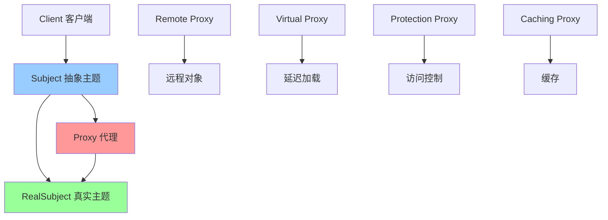

# 代理模式 (Proxy)

> 代理模式是一种结构型设计模式，为其他对象提供一种代理以控制对这个对象的访问。代理模式在访问对象时引入一定程度的间接性，可以用于控制访问、延迟加载、缓存等场景。

## 📋 概要

代理模式为其他对象提供一种代理以控制对这个对象的访问。代理对象在客户端和目标对象之间起到中介的作用，可以控制对目标对象的访问，添加额外的功能，或者完全替换目标对象。

### 核心原理

1. **抽象主题**: 定义代理和真实主题的共同接口
2. **真实主题**: 实现抽象主题，定义代理所代表的真实对象
3. **代理**: 实现抽象主题，控制对真实主题的访问
4. **客户端**: 通过代理访问真实主题

### 适用场景

- 需要控制对对象的访问
- 需要延迟加载（懒加载）
- 需要缓存对象
- 需要添加额外的功能（如日志、权限检查）
- 需要远程代理
- 需要虚拟代理

### 优点

- **控制访问**: 可以控制对目标对象的访问
- **延迟加载**: 可以实现延迟加载，提高性能
- **缓存**: 可以实现缓存功能
- **扩展性**: 可以在不修改目标对象的情况下添加功能
- **安全性**: 可以提供访问控制和安全检查

### 缺点

- **复杂性**: 可能增加系统的复杂性
- **性能**: 可能引入额外的性能开销
- **调试**: 可能使调试变得困难

## 📋 代理模式架构图



## 🚀 基础实现

### 1. 简单代理实现

```dart
// 抽象主题
abstract class Subject {
  void request();
}

// 真实主题
class RealSubject implements Subject {
  @override
  void request() {
    print('真实主题处理请求');
  }
}

// 代理
class Proxy implements Subject {
  RealSubject? _realSubject;
  
  @override
  void request() {
    if (_realSubject == null) {
      _realSubject = RealSubject();
    }
    _realSubject!.request();
  }
}

// 使用示例
void main() {
  final proxy = Proxy();
  proxy.request();
}
```

### 2. 高级代理实现

```dart
// 抽象主题
abstract class Image {
  void display();
  String get fileName;
}

// 真实主题
class RealImage implements Image {
  final String _fileName;
  
  RealImage(this._fileName) {
    _loadFromDisk();
  }
  
  void _loadFromDisk() {
    print('加载图片: $_fileName');
  }
  
  @override
  void display() {
    print('显示图片: $_fileName');
  }
  
  @override
  String get fileName => _fileName;
}

// 虚拟代理（延迟加载）
class VirtualProxy implements Image {
  final String _fileName;
  RealImage? _realImage;
  
  VirtualProxy(this._fileName);
  
  @override
  void display() {
    if (_realImage == null) {
      _realImage = RealImage(_fileName);
    }
    _realImage!.display();
  }
  
  @override
  String get fileName => _fileName;
}

// 保护代理
class ProtectionProxy implements Image {
  final Image _image;
  final String _userRole;
  
  ProtectionProxy(this._image, this._userRole);
  
  @override
  void display() {
    if (_userRole == 'admin') {
      _image.display();
    } else {
      print('权限不足，无法显示图片');
    }
  }
  
  @override
  String get fileName => _image.fileName;
}

// 缓存代理
class CachingProxy implements Image {
  final Image _image;
  bool _isLoaded = false;
  
  CachingProxy(this._image);
  
  @override
  void display() {
    if (!_isLoaded) {
      _image.display();
      _isLoaded = true;
      print('图片已缓存');
    } else {
      print('从缓存显示图片: ${_image.fileName}');
    }
  }
  
  @override
  String get fileName => _image.fileName;
}

// 日志代理
class LoggingProxy implements Image {
  final Image _image;
  
  LoggingProxy(this._image);
  
  @override
  void display() {
    print('开始显示图片: ${_image.fileName}');
    final stopwatch = Stopwatch()..start();
    
    _image.display();
    
    stopwatch.stop();
    print('图片显示完成，耗时: ${stopwatch.elapsedMilliseconds}ms');
  }
  
  @override
  String get fileName => _image.fileName;
}

// 使用示例
void main() {
  print('=== 虚拟代理（延迟加载）===');
  final virtualProxy = VirtualProxy('large_image.jpg');
  print('代理已创建，但图片未加载');
  virtualProxy.display(); // 此时才加载图片
  
  print('\n=== 保护代理（权限控制）===');
  final realImage = RealImage('secret.jpg');
  final adminProxy = ProtectionProxy(realImage, 'admin');
  final userProxy = ProtectionProxy(realImage, 'user');
  
  adminProxy.display(); // 可以显示
  userProxy.display();  // 权限不足
  
  print('\n=== 缓存代理===');
  final cachingProxy = CachingProxy(realImage);
  cachingProxy.display(); // 第一次加载
  cachingProxy.display(); // 从缓存显示
  
  print('\n=== 日志代理===');
  final loggingProxy = LoggingProxy(realImage);
  loggingProxy.display();
}
```

## 🔧 实际应用场景

### 1. 网络图片加载代理

```dart
// 图片接口
abstract class ImageLoader {
  Future<void> loadImage(String url);
  Widget getImageWidget();
  bool get isLoaded;
}

// 真实图片加载器
class RealImageLoader implements ImageLoader {
  final String _url;
  Widget? _imageWidget;
  bool _isLoaded = false;
  
  RealImageLoader(this._url);
  
  @override
  Future<void> loadImage(String url) async {
    print('开始加载图片: $url');
    
    // 模拟网络请求
    await Future.delayed(Duration(seconds: 2));
    
    // 模拟加载成功
    _imageWidget = Container(
      width: 200,
      height: 200,
      color: Colors.blue,
      child: Center(
        child: Text('图片: $url'),
      ),
    );
    
    _isLoaded = true;
    print('图片加载完成: $url');
  }
  
  @override
  Widget getImageWidget() {
    if (!_isLoaded) {
      return Container(
        width: 200,
        height: 200,
        color: Colors.grey,
        child: Center(child: CircularProgressIndicator()),
      );
    }
    return _imageWidget!;
  }
  
  @override
  bool get isLoaded => _isLoaded;
}

// 图片加载代理
class ImageLoaderProxy implements ImageLoader {
  final String _url;
  RealImageLoader? _realLoader;
  final Map<String, Widget> _cache = {};
  
  ImageLoaderProxy(this._url);
  
  @override
  Future<void> loadImage(String url) async {
    // 检查缓存
    if (_cache.containsKey(url)) {
      print('从缓存加载图片: $url');
      return;
    }
    
    // 延迟创建真实加载器
    if (_realLoader == null) {
      _realLoader = RealImageLoader(url);
    }
    
    await _realLoader!.loadImage(url);
    
    // 缓存图片
    _cache[url] = _realLoader!.getImageWidget();
  }
  
  @override
  Widget getImageWidget() {
    // 检查缓存
    if (_cache.containsKey(_url)) {
      return _cache[_url]!;
    }
    
    // 延迟创建真实加载器
    if (_realLoader == null) {
      _realLoader = RealImageLoader(_url);
    }
    
    return _realLoader!.getImageWidget();
  }
  
  @override
  bool get isLoaded {
    if (_cache.containsKey(_url)) {
      return true;
    }
    
    if (_realLoader == null) {
      return false;
    }
    
    return _realLoader!.isLoaded;
  }
  
  // 清除缓存
  void clearCache() {
    _cache.clear();
    print('图片缓存已清除');
  }
}

// Flutter Widget 中的使用
class ProxyImageWidget extends StatefulWidget {
  final String imageUrl;
  
  ProxyImageWidget({required this.imageUrl});
  
  @override
  _ProxyImageWidgetState createState() => _ProxyImageWidgetState();
}

class _ProxyImageWidgetState extends State<ProxyImageWidget> {
  late ImageLoaderProxy _imageProxy;
  
  @override
  void initState() {
    super.initState();
    _imageProxy = ImageLoaderProxy(widget.imageUrl);
    _loadImage();
  }
  
  Future<void> _loadImage() async {
    await _imageProxy.loadImage(widget.imageUrl);
    if (mounted) {
      setState(() {});
    }
  }
  
  @override
  Widget build(BuildContext context) {
    return Column(
      children: [
        _imageProxy.getImageWidget(),
        SizedBox(height: 16),
        ElevatedButton(
          onPressed: _imageProxy.clearCache,
          child: Text('清除缓存'),
        ),
      ],
    );
  }
}
```

### 2. 网络请求代理

```dart
// 网络请求接口
abstract class HttpClient {
  Future<Map<String, dynamic>> get(String url);
  Future<Map<String, dynamic>> post(String url, Map<String, dynamic> data);
  Future<Map<String, dynamic>> put(String url, Map<String, dynamic> data);
  Future<Map<String, dynamic>> delete(String url);
}

// 真实网络客户端
class RealHttpClient implements HttpClient {
  @override
  Future<Map<String, dynamic>> get(String url) async {
    print('发送GET请求: $url');
    await Future.delayed(Duration(seconds: 1));
    return {'status': 'success', 'data': 'response data'};
  }
  
  @override
  Future<Map<String, dynamic>> post(String url, Map<String, dynamic> data) async {
    print('发送POST请求: $url');
    await Future.delayed(Duration(seconds: 1));
    return {'status': 'success', 'data': data};
  }
  
  @override
  Future<Map<String, dynamic>> put(String url, Map<String, dynamic> data) async {
    print('发送PUT请求: $url');
    await Future.delayed(Duration(seconds: 1));
    return {'status': 'success', 'data': data};
  }
  
  @override
  Future<Map<String, dynamic>> delete(String url) async {
    print('发送DELETE请求: $url');
    await Future.delayed(Duration(seconds: 1));
    return {'status': 'success', 'message': 'deleted'};
  }
}

// 缓存代理
class CachingHttpProxy implements HttpClient {
  final HttpClient _client;
  final Map<String, Map<String, dynamic>> _cache = {};
  final Duration _cacheExpiry;
  
  CachingHttpProxy(this._client, {this._cacheExpiry = const Duration(minutes: 5)});
  
  @override
  Future<Map<String, dynamic>> get(String url) async {
    // 检查缓存
    if (_cache.containsKey(url)) {
      final cachedData = _cache[url]!;
      final timestamp = cachedData['_timestamp'] as DateTime;
      
      if (DateTime.now().difference(timestamp) < _cacheExpiry) {
        print('从缓存获取: $url');
        return Map.from(cachedData)..remove('_timestamp');
      }
    }
    
    // 发送请求
    final response = await _client.get(url);
    
    // 缓存响应
    final cacheData = Map<String, dynamic>.from(response);
    cacheData['_timestamp'] = DateTime.now();
    _cache[url] = cacheData;
    
    return response;
  }
  
  @override
  Future<Map<String, dynamic>> post(String url, Map<String, dynamic> data) async {
    final response = await _client.post(url, data);
    
    // POST请求成功后清除相关缓存
    _clearRelatedCache(url);
    
    return response;
  }
  
  @override
  Future<Map<String, dynamic>> put(String url, Map<String, dynamic> data) async {
    final response = await _client.put(url, data);
    
    // PUT请求成功后清除相关缓存
    _clearRelatedCache(url);
    
    return response;
  }
  
  @override
  Future<Map<String, dynamic>> delete(String url) async {
    final response = await _client.delete(url);
    
    // DELETE请求成功后清除相关缓存
    _clearRelatedCache(url);
    
    return response;
  }
  
  void _clearRelatedCache(String url) {
    final keysToRemove = <String>[];
    for (final key in _cache.keys) {
      if (key.startsWith(url.split('?')[0])) {
        keysToRemove.add(key);
      }
    }
    
    for (final key in keysToRemove) {
      _cache.remove(key);
    }
    
    if (keysToRemove.isNotEmpty) {
      print('清除相关缓存: ${keysToRemove.join(", ")}');
    }
  }
  
  void clearCache() {
    _cache.clear();
    print('所有缓存已清除');
  }
  
  Map<String, dynamic> get cacheInfo => {
    'size': _cache.length,
    'keys': _cache.keys.toList(),
  };
}

// 日志代理
class LoggingHttpProxy implements HttpClient {
  final HttpClient _client;
  
  LoggingHttpProxy(this._client);
  
  @override
  Future<Map<String, dynamic>> get(String url) async {
    final stopwatch = Stopwatch()..start();
    print('[HTTP] GET $url - 开始');
    
    try {
      final response = await _client.get(url);
      stopwatch.stop();
      print('[HTTP] GET $url - 成功 (${stopwatch.elapsedMilliseconds}ms)');
      return response;
    } catch (e) {
      stopwatch.stop();
      print('[HTTP] GET $url - 失败 (${stopwatch.elapsedMilliseconds}ms): $e');
      rethrow;
    }
  }
  
  @override
  Future<Map<String, dynamic>> post(String url, Map<String, dynamic> data) async {
    final stopwatch = Stopwatch()..start();
    print('[HTTP] POST $url - 开始');
    
    try {
      final response = await _client.post(url, data);
      stopwatch.stop();
      print('[HTTP] POST $url - 成功 (${stopwatch.elapsedMilliseconds}ms)');
      return response;
    } catch (e) {
      stopwatch.stop();
      print('[HTTP] POST $url - 失败 (${stopwatch.elapsedMilliseconds}ms): $e');
      rethrow;
    }
  }
  
  @override
  Future<Map<String, dynamic>> put(String url, Map<String, dynamic> data) async {
    final stopwatch = Stopwatch()..start();
    print('[HTTP] PUT $url - 开始');
    
    try {
      final response = await _client.put(url, data);
      stopwatch.stop();
      print('[HTTP] PUT $url - 成功 (${stopwatch.elapsedMilliseconds}ms)');
      return response;
    } catch (e) {
      stopwatch.stop();
      print('[HTTP] PUT $url - 失败 (${stopwatch.elapsedMilliseconds}ms): $e');
      rethrow;
    }
  }
  
  @override
  Future<Map<String, dynamic>> delete(String url) async {
    final stopwatch = Stopwatch()..start();
    print('[HTTP] DELETE $url - 开始');
    
    try {
      final response = await _client.delete(url);
      stopwatch.stop();
      print('[HTTP] DELETE $url - 成功 (${stopwatch.elapsedMilliseconds}ms)');
      return response;
    } catch (e) {
      stopwatch.stop();
      print('[HTTP] DELETE $url - 失败 (${stopwatch.elapsedMilliseconds}ms): $e');
      rethrow;
    }
  }
}

// 权限代理
class AuthHttpProxy implements HttpClient {
  final HttpClient _client;
  final String? _token;
  
  AuthHttpProxy(this._client, this._token);
  
  @override
  Future<Map<String, dynamic>> get(String url) async {
    if (_token == null) {
      throw Exception('需要认证令牌');
    }
    
    // 添加认证头
    print('添加认证头: Bearer $_token');
    return await _client.get(url);
  }
  
  @override
  Future<Map<String, dynamic>> post(String url, Map<String, dynamic> data) async {
    if (_token == null) {
      throw Exception('需要认证令牌');
    }
    
    print('添加认证头: Bearer $_token');
    return await _client.post(url, data);
  }
  
  @override
  Future<Map<String, dynamic>> put(String url, Map<String, dynamic> data) async {
    if (_token == null) {
      throw Exception('需要认证令牌');
    }
    
    print('添加认证头: Bearer $_token');
    return await _client.put(url, data);
  }
  
  @override
  Future<Map<String, dynamic>> delete(String url) async {
    if (_token == null) {
      throw Exception('需要认证令牌');
    }
    
    print('添加认证头: Bearer $_token');
    return await _client.delete(url);
  }
}

// 使用示例
void main() async {
  final realClient = RealHttpClient();
  
  // 创建代理链
  final authProxy = AuthHttpProxy(realClient, 'token123');
  final loggingProxy = LoggingHttpProxy(authProxy);
  final cachingProxy = CachingHttpProxy(loggingProxy);
  
  print('=== 测试GET请求（带缓存）===');
  await cachingProxy.get('/api/users');
  await cachingProxy.get('/api/users'); // 从缓存获取
  
  print('\n=== 测试POST请求（清除缓存）===');
  await cachingProxy.post('/api/users', {'name': 'John'});
  await cachingProxy.get('/api/users'); // 重新请求，因为缓存被清除
  
  print('\n=== 测试无认证请求===');
  final noAuthProxy = AuthHttpProxy(realClient, null);
  try {
    await noAuthProxy.get('/api/users');
  } catch (e) {
    print('认证失败: $e');
  }
  
  print('\n=== 缓存信息===');
  print(cachingProxy.cacheInfo);
}
```

## 🧪 测试和调试

### 1. 代理模式单元测试

```dart
// test/proxy_test.dart
import 'package:flutter_test/flutter_test.dart';
import 'package:myapp/proxy.dart';

void main() {
  group('代理模式测试', () {
    test('虚拟代理应该延迟加载', () {
      final proxy = VirtualProxy('test.jpg');
      
      // 代理创建时不应该加载图片
      expect(proxy.fileName, equals('test.jpg'));
      
      final output = <String>[];
      final originalPrint = print;
      print = (Object? object) => output.add(object.toString());
      
      proxy.display();
      
      print = originalPrint;
      
      expect(output, contains('加载图片: test.jpg'));
      expect(output, contains('显示图片: test.jpg'));
    });
    
    test('保护代理应该控制访问', () {
      final realImage = RealImage('secret.jpg');
      final adminProxy = ProtectionProxy(realImage, 'admin');
      final userProxy = ProtectionProxy(realImage, 'user');
      
      final output = <String>[];
      final originalPrint = print;
      print = (Object? object) => output.add(object.toString());
      
      adminProxy.display();
      userProxy.display();
      
      print = originalPrint;
      
      expect(output, contains('显示图片: secret.jpg'));
      expect(output, contains('权限不足，无法显示图片'));
    });
    
    test('缓存代理应该缓存结果', () {
      final realImage = RealImage('test.jpg');
      final cachingProxy = CachingProxy(realImage);
      
      final output = <String>[];
      final originalPrint = print;
      print = (Object? object) => output.add(object.toString());
      
      cachingProxy.display(); // 第一次加载
      cachingProxy.display(); // 从缓存显示
      
      print = originalPrint;
      
      expect(output, contains('显示图片: test.jpg'));
      expect(output, contains('图片已缓存'));
      expect(output, contains('从缓存显示图片: test.jpg'));
    });
  });
  
  group('网络代理测试', () {
    late RealHttpClient realClient;
    late CachingHttpProxy cachingProxy;
    
    setUp(() {
      realClient = RealHttpClient();
      cachingProxy = CachingHttpProxy(realClient);
    });
    
    test('缓存代理应该缓存GET请求', () async {
      final output = <String>[];
      final originalPrint = print;
      print = (Object? object) => output.add(object.toString());
      
      await cachingProxy.get('/api/users');
      await cachingProxy.get('/api/users');
      
      print = originalPrint;
      
      expect(output, contains('发送GET请求: /api/users'));
      expect(output, contains('从缓存获取: /api/users'));
    });
    
    test('POST请求应该清除相关缓存', () async {
      final output = <String>[];
      final originalPrint = print;
      print = (Object? object) => output.add(object.toString());
      
      await cachingProxy.get('/api/users');
      await cachingProxy.post('/api/users', {'name': 'John'});
      await cachingProxy.get('/api/users');
      
      print = originalPrint;
      
      expect(output, contains('发送GET请求: /api/users'));
      expect(output, contains('发送POST请求: /api/users'));
      expect(output, contains('清除相关缓存: /api/users'));
      expect(output, contains('发送GET请求: /api/users'));
    });
  });
}
```

### 2. 性能测试

```dart
// benchmark/proxy_benchmark.dart
class ProxyBenchmark {
  static Future<void> runPerformanceTests() async {
    print('=== 代理模式性能测试 ===');
    
    await _testVirtualProxyPerformance();
    await _testCachingProxyPerformance();
    await _testProxyChainPerformance();
    await _testMemoryUsage();
  }
  
  static Future<void> _testVirtualProxyPerformance() async {
    const proxyCount = 1000;
    final proxies = <VirtualProxy>[];
    
    final stopwatch = Stopwatch()..start();
    
    for (int i = 0; i < proxyCount; i++) {
      proxies.add(VirtualProxy('image$i.jpg'));
    }
    
    stopwatch.stop();
    
    print('创建 $proxyCount 个虚拟代理耗时: ${stopwatch.elapsedMilliseconds}ms');
    
    // 测试延迟加载性能
    final loadStopwatch = Stopwatch()..start();
    
    for (final proxy in proxies) {
      proxy.display();
    }
    
    loadStopwatch.stop();
    
    print('加载 $proxyCount 个图片耗时: ${loadStopwatch.elapsedMilliseconds}ms');
  }
  
  static Future<void> _testCachingProxyPerformance() async {
    final realClient = RealHttpClient();
    final cachingProxy = CachingHttpProxy(realClient);
    
    const requestCount = 100;
    final urls = List.generate(requestCount, (i) => '/api/data$i');
    
    final stopwatch = Stopwatch()..start();
    
    // 第一次请求（无缓存）
    for (final url in urls) {
      await cachingProxy.get(url);
    }
    
    stopwatch.stop();
    
    print('第一次请求 $requestCount 个URL耗时: ${stopwatch.elapsedMilliseconds}ms');
    
    final cacheStopwatch = Stopwatch()..start();
    
    // 第二次请求（有缓存）
    for (final url in urls) {
      await cachingProxy.get(url);
    }
    
    cacheStopwatch.stop();
    
    print('缓存请求 $requestCount 个URL耗时: ${cacheStopwatch.elapsedMilliseconds}ms');
  }
  
  static Future<void> _testProxyChainPerformance() async {
    final realClient = RealHttpClient();
    
    // 创建代理链
    final authProxy = AuthHttpProxy(realClient, 'token123');
    final loggingProxy = LoggingHttpProxy(authProxy);
    final cachingProxy = CachingHttpProxy(loggingProxy);
    
    const requestCount = 100;
    final stopwatch = Stopwatch()..start();
    
    for (int i = 0; i < requestCount; i++) {
      await cachingProxy.get('/api/users');
    }
    
    stopwatch.stop();
    
    final avgTime = stopwatch.elapsedMilliseconds / requestCount;
    print('代理链处理 $requestCount 个请求平均耗时: ${avgTime.toStringAsFixed(2)}ms');
  }
  
  static Future<void> _testMemoryUsage() async {
    final proxies = <VirtualProxy>[];
    const proxyCount = 10000;
    
    // 创建大量代理
    for (int i = 0; i < proxyCount; i++) {
      proxies.add(VirtualProxy('large_image$i.jpg'));
    }
    
    final initialMemory = ProcessInfo.currentRss;
    
    // 加载部分图片
    for (int i = 0; i < proxyCount ~/ 2; i++) {
      proxies[i].display();
    }
    
    final finalMemory = ProcessInfo.currentRss;
    final memoryUsed = finalMemory - initialMemory;
    
    print('内存使用: ${(memoryUsed / 1024 / 1024).toStringAsFixed(2)}MB');
  }
}

void main() async {
  await ProxyBenchmark.runPerformanceTests();
}
```

## 📚 最佳实践

### 1. 设计原则
- **单一职责**: 每个代理只负责一种功能
- **开闭原则**: 新增代理类型不需要修改现有代码
- **代理粒度**: 合理设计代理的粒度，避免过度复杂
- **性能考虑**: 注意代理可能带来的性能开销

### 2. 性能优化
- **延迟加载**: 使用虚拟代理实现延迟加载
- **缓存策略**: 使用缓存代理减少重复计算
- **代理链**: 合理组合多个代理，避免过度嵌套
- **内存管理**: 及时清理不需要的缓存

### 3. 错误处理
- **异常传播**: 确保代理正确传播异常
- **降级策略**: 提供代理失败时的降级方案
- **超时处理**: 为网络代理设置合理的超时时间
- **重试机制**: 为关键操作提供重试机制

### 4. 调试技巧
- **代理追踪**: 为每个代理添加唯一的标识
- **性能监控**: 监控代理的执行时间
- **缓存统计**: 统计缓存的命中率和大小
- **日志记录**: 记录代理的操作日志

## 🎯 小结

代理模式是控制对象访问的强大工具，特别适合需要延迟加载、缓存、权限控制等场景。在 Flutter 开发中，它可以用于图片加载、网络请求、权限验证等场景。

### 选择建议

- **简单场景**: 使用简单的代理实现
- **复杂场景**: 使用代理链组合多个功能
- **性能敏感**: 注意代理的性能开销
- **可维护性**: 注重代理的设计和文档化

### 关键要点

1. **代理设计**: 合理设计代理的职责和功能
2. **性能考虑**: 注意代理可能带来的性能开销
3. **缓存策略**: 合理使用缓存提高性能
4. **错误处理**: 提供完善的错误处理机制
5. **可测试性**: 确保每个代理都可以独立测试

---

> 💡 **提示**: 代理模式是控制对象访问的优秀方案，但要避免过度使用和过度复杂。建议在真正需要控制访问、延迟加载、缓存等功能的场景中使用，并注意性能优化和错误处理。 